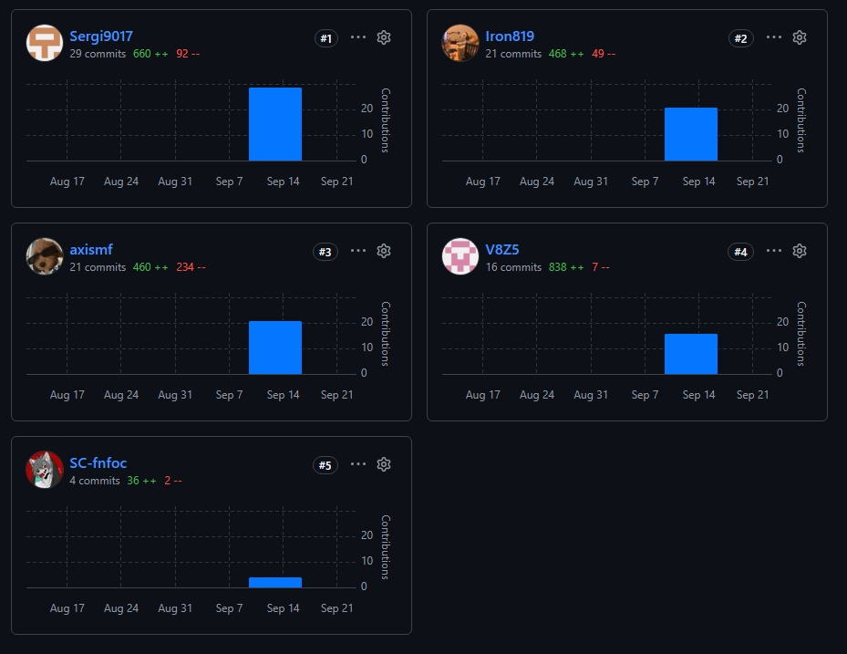



  

**Universidad Peruana de Ciencias Aplicadas**

Carrera de Ingeniería de Software

**1ASI0729**

**Desarrollo de Aplicaciones Open Source**

NRC

**7737**

**Informe del Trabajo Final**

Docente

**Robles Fernández, Ivan**

Equipo: **SportPlus**

Proyecto: **PulsePower**

**Integrantes**

<table style="width: auto; border-collapse: collapse; text-align: center;">
  <thead>
    <tr>
      <th style="padding: 8px; border: 1px solid #666; text-align: center;">Código</th>
      <th style="padding: 8px; border: 1px solid #666; text-align: center;">Apellidos y Nombres</th>
    </tr>
  </thead>
  <tbody>
    <tr>
      <td style="padding: 8px; border: 1px solid #666; text-align: center;">U202211295</td>
      <td style="padding: 8px; border: 1px solid #666; text-align: center;">Evangelista Ygnacio, Sergio Joaquin</td>
    </tr>
    <tr>
      <td style="padding: 8px; border: 1px solid #666; text-align: center;">U202111461</td>
      <td style="padding: 8px; border: 1px solid #666; text-align: center;">Carbajal Santivañez, Sebastian Aaron</td>
    </tr>
    <tr>
      <td style="padding: 8px; border: 1px solid #666; text-align: center;">U202515871</td>
      <td style="padding: 8px; border: 1px solid #666; text-align: center;">Martin Farro, Alexis Sebastian</td>
    </tr>
    <tr>
      <td style="padding: 8px; border: 1px solid #666; text-align: center;">U202322849</td>
      <td style="padding: 8px; border: 1px solid #666; text-align: center;">Viza Quispe, Marlon Packard</td>
    </tr>
    <tr>
      <td style="padding: 8px; border: 1px solid #666; text-align: center;">U202411378</td>
      <td style="padding: 8px; border: 1px solid #666; text-align: center;">Osorio Ramirez, Eduardo Jesus</td>
    </tr>
  </tbody>
</table>

**Período 2026-02**

**Setiembre 2026**

---

# Registro de versiones del informe
| Entregable | Versión | Fecha      | Autor | Descripción de modificación |
|------------|---------|------------|-------|--------------------------------------------------------------------------------------------------------------------------------------------------------------------------------------------------------------------------------------------------------------------------------------------------------------------------------------------------------------------------------------------------------------------------------|
| AV1 | 1.0.0 | 18/09/2026 | SportPlus    | Carátula. Registro de Versiones del Informe. Project Report Collaboration Insights. Contenido. Student Outcome. Capítulo I: Introducción. Capítulo II: Requirements Elicitation & Analysis. Capítulo III: Requirements Specification. Capítulo IV: Product Design. Capítulo V: Product Implementation, Validation & Deployment. **5.1. Software Configuration Management:** 5.1.1. Software Development Environment Configuration, 5.1.2. Source Code Management, 5.1.3. Source Code Style Guide & Conventions, 5.1.4. Software Deployment Configuration. **5.2. Landing Page, Services & Applications Implementation:** Sprint 1 (Planning, Aspect Leaders and Collaborators, Sprint Backlog, Development Evidence, Execution Evidence, Services Documentation, Software Deployment, Team Collaboration Insights). Conclusiones. Bibliografía. Anexos. |

# Project Report Collaboration Insights

**Repositorio de la documentación del proyecto:** [https://github.com/upc-pre-202620-1asi0729-7737-SportPlus/pulsepower-report](https://github.com/upc-pre-202620-1asi0729-7737-SportPlus/pulsepower-report)

A continuación, se detallan las actividades realizadas en cada entrega, la participación de los miembros del equipo, y las evidencias correspondientes.

**AV1**

## AV1 – Sprint Review (Semana 4)

Durante la elaboración de la entrega **AV1**, el equipo se organizó distribuyendo los capítulos y secciones del informe de acuerdo con las responsabilidades de cada integrante. Se realizaron sesiones de coordinación y revisión conjunta para consolidar los avances del proyecto y preparar la presentación final. Cada integrante participó tanto en el desarrollo de la documentación como en la presentación oral de las partes asignadas.

| **Integrantes** | **Actividades realizadas en el informe y presentación**                                                                                                                                                                                                                                                                                                                                                                                                                                              |
| --------------------------------------------------- |------------------------------------------------------------------------------------------------------------------------------------------------------------------------------------------------------------------------------------------------------------------------------------------------------------------------------------------------------------------------------------------------------------------------------------------------------------------------------------------------------|
| **Evangelista Ygnacio, Sergio Joaquin** | Redactó el Capítulo I: Startup Profile, Solution Profile y Segmentos Objetivo, incluyendo la descripción de la startup, los perfiles de los integrantes y el proceso Lean UX completo con Problem Statements, Assumptions, Hypothesis Statements y Lean UX Canvas. Asimismo, corrigió las User Stories y elaboró los Impact Maps.                                                                                                                                                                    |
| **Viza Quispe, Marlon Packard** | Desarrolló el Capítulo IV: Product Design de PulsePower, incluyendo Style Guidelines, Information Architecture, Landing Page UI Design y Web Applications UX/UI Design, con sus respectivos wireframes, wireflow diagrams y mock-ups. Además, elaboró los diagramas de arquitectura de software (Context, Container y Components), el diseño orientado a objetos mediante Class Diagrams y el diseño de base de datos mediante Database Diagrams.                                                    |
| **Osorio Ramirez, Eduardo Jesus** | Desarrolló el Capítulo II: Requirements Elicitation & Analysis: diseñó y registró las entrevistas de needfinding, elaboró los User Personas, User Task Matrix, **User Journey Mapping, Empathy Maps y Big Picture EventStorming, y redactó el Ubiquitous Language. Asimismo, participó en el desarrollo del Landing Page.                                                                                                                                                                            |
| **Martin Farro, Alexis Sebastian** | Desarrolló el Capítulo V: Product Implementation, Validation & Deployment: definió los Aspect Leaders and Collaborators, elaboró el Sprint Planning y el Sprint Backlog, y redactó los lineamientos de Software Configuration Management, Source Code Management y Source Code Style Guide & Conventions. Además, documentó el Software Deployment Configuration junto con las evidencias de implementación de la primera iteración, y participó en el desarrollo del Landing Page. |
| **Carbajal Santivañez, Sebastian Aaron** | Desarrolló parte del Capítulo III: Requirements Specification y parte del Capítulo IV: Product Design.                                                                                                                                                                                                                                                                                                                                                                                               |

# Tabla de contenidos

**Registro de versiones del informe**

**Project Report Collaboration Insights**

**Tabla de contenidos**

**Student Outcome**

Capítulo I: Introducción

1.1. Startup Profile  
1.1.1. Descripción del startup  
1.1.2. Perfiles de integrantes del equipo  
1.2. Solution Profile  
1.2.1. Antecedentes y problemática  
1.2.2. Lean UX Process  
1.2.2.1. Lean UX Problem Statements  
1.2.2.2. Lean UX Assumptions  
1.2.2.3. Lean UX Hypothesis Statements  
1.2.2.4. Lean UX Canvas  
1.3. Segmentos objetivo

Capítulo II: Requirements Elicitation & Analysis  
2.1. Competidores  
2.1.1. Análisis competitivo  
2.1.2. Estrategias y tácticas frente a competidores  
2.2. Entrevistas  
2.2.1. Diseño de entrevistas  
2.2.2. Registro de entrevistas  
2.2.3. Análisis de entrevistas  
2.3. Needfinding  
2.3.1. User Personas  
2.3.2. User Task Matrix  
2.3.3. User Journey Mapping  
2.3.4. Empathy Mapping  
2.4. Big Picture EventStorming  
2.5. Ubiquitous Language

Capítulo III: Requirements Specification  
3.1. User Stories  
3.2. Impact Mapping  
3.3. Product Backlog

Capítulo IV: Product Design
4.1. Style Guidelines  
4.1.1. General Style Guidelines  
4.1.2. Web Style Guidelines  
4.2. Information Architecture  
4.2.1. Organization Systems  
4.2.2. Labeling Systems  
4.2.3. SEO Tags and Meta Tags  
4.2.4. Searching Systems  
4.2.5. Navigation Systems  
4.3. Landing Page UI Design  
4.3.1. Landing Page Wireframe  
4.3.2. Landing Page Mock-up  
4.4. Web Applications UX/UI Design  
4.4.1. Web Applications Wireframes  
4.4.2. Web Applications Wireflow Diagrams  
4.4.3. Web Applications Mock-ups  
4.4.4. Web Applications User Flow Diagrams  
4.5. Web Applications Prototyping  
4.6. Domain-Driven Software Architecture  
4.6.1. Design-Level EventStorming  
4.6.2. Software Architecture Context Diagram  
4.6.3. Software Architecture Container Diagrams  
4.6.4. Software Architecture Components Diagrams  
4.7. Software Object-Oriented Design  
4.7.1. Class Diagrams  
4.8. Database Design  
4.8.1. Database Diagrams

Capítulo V: Product Implementation, Validation & Deployment  
5.1. Software Configuration Management  
5.1.1. Software Development Environment Configuration  
5.1.2. Source Code Management  
5.1.3. Source Code Style Guide & Conventions  
5.1.4. Software Deployment Configuration  
5.2. Landing Page, Services & Applications Implementation  
5.2.1. Sprint 1  
5.2.1.1. Sprint Planning 1  
5.2.1.2. Aspect Leaders and Collaborators  
5.2.1.3. Sprint Backlog 1  
5.2.1.4. Development Evidence for Sprint Review  
5.2.1.5. Execution Evidence for Sprint Review  
5.2.1.6. Services Documentation Evidence for Sprint Review  
5.2.1.7. Software Deployment Evidence for Sprint Review  
5.2.1.8. Team Collaboration Insights during Sprint

Conclusiones
Bibliografía  
Anexos

# Student Outcome
| Criterio específico | Acciones realizadas | Conclusiones |
| --- | --- | --- |
| Comunica oralmente con efectividad a diferentes rangos de audiencia. | **AV1:**    **Evangelista Ygnacio, Sergio Joaquin**: presenté los contenidos del Capítulo I (Startup Profile, Solution Profile y Segmentos Objetivo), explicando la descripción de la startup FruitLogix, los perfiles de los integrantes y el proceso Lean UX con sus Problem Statements, Assumptions, Hypothesis Statements y Lean UX Canvas, además de las User Stories corregidas y los Impact Maps.    **Viza Quispe, Marlon Packard**: explicó los contenidos del Capítulo IV: Product Design de PulsePower, incluyendo Style Guidelines, Information Architecture, wireframes, wireflow diagrams y mock-ups, así como los diagramas de arquitectura de software, Class Diagrams y Database Diagrams.    **Osorio Ramirez, Eduardo Jesus**: comunicó los contenidos del Capítulo II: Requirements Elicitation & Analysis, incluyendo las entrevistas de needfinding, User Personas, User Task Matrix, User Journey Mapping, Empathy Maps, Big Picture EventStorming y Ubiquitous Language.    **Martin Farro, Alexis Sebastian**: presentó los contenidos del Capítulo V: Product Implementation, Validation & Deployment, incluyendo Sprint Planning, Sprint Backlog, lineamientos de gestión de configuración y código, y el Software Deployment Configuration.    **Carbajal Santivañez, Sebastian Aaron**: explicó las partes desarrolladas de los Capítulos III y IV. | **AV1:** Considero que como equipo logramos comunicar oralmente de manera efectiva los avances del proyecto, distribuyendo la presentación de acuerdo con las responsabilidades de cada integrante. Esto nos permitió explicar las diferentes partes del producto de forma organizada, clara y comprensible para la audiencia. |
| Comunica por escrito con efectividad a diferentes rangos de audiencia. | **AV1:**    **Evangelista Ygnacio, Sergio Joaquin**: redacté el Capítulo I (Startup Profile, Solution Profile y Segmentos Objetivo), incluyendo la descripción de FruitLogix, los perfiles de los integrantes y el proceso Lean UX completo. Asimismo, corregí las User Stories y elaboré los Impact Maps.    **Viza Quispe, Marlon Packard**: desarrolló el Capítulo IV: Product Design de PulsePower, con Style Guidelines, Information Architecture, Landing Page UI Design y Web Applications UX/UI Design, junto con los diagramas de arquitectura de software (Context, Container y Components), Class Diagrams y Database Diagrams.    **Osorio Ramirez, Eduardo Jesus**: desarrolló el Capítulo II: Requirements Elicitation & Analysis, y redactó el Ubiquitous Language. También participó en el desarrollo del Landing Page.    **Martin Farro, Alexis Sebastian**: desarrolló el Capítulo V: Product Implementation, Validation & Deployment, redactando los lineamientos de Software Configuration Management, Source Code Management y Source Code Style Guide & Conventions, y documentando el Software Deployment Configuration junto con las evidencias de implementación de la primera iteración. También participó en el desarrollo del Landing Page.    **Carbajal Santivañez, Sebastian Aaron**: desarrolló parte del Capítulo III y del Capítulo IV. | **AV1:** Considero que como equipo logramos comunicar por escrito de manera efectiva la información del proyecto, distribuyendo la elaboración de los capítulos según las responsabilidades asignadas. La organización y documentación de cada sección permitió presentar los avances del AV1 de forma clara, ordenada y comprensible para los lectores. |
