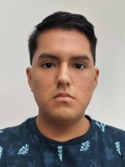
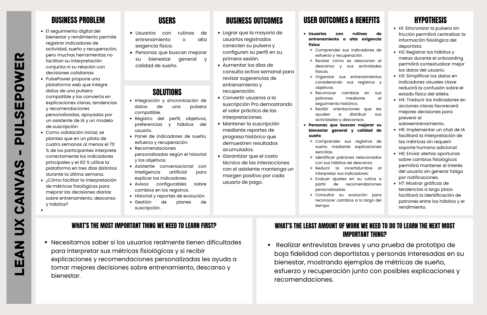

# Capítulo I: Introducción

## 1.1. Startup Profile
### 1.1.1 Descripcion de la Startup
SportPlus es una startup tecnológica enfocada en el desarrollo de soluciones digitales para la comprensión y el acompañamiento del bienestar físico de las personas. Construimos sistemas que interpretan las señales del cuerpo humano y las convierten en información útil para tomar mejores decisiones sobre el entrenamiento, el descanso y la salud en general. En SportPlus buscamos transformar la manera en que los deportistas, y quienes los entrenan, se relacionan con su estado físico: para quienes hoy lo interpretan de forma intuitiva y poco estructurada, les damos claridad; para quienes ya buscan maximizar su rendimiento, les damos precisión. Integramos progresivamente tecnologías de análisis de datos para construir soluciones capaces de adaptarse a las necesidades del bienestar personal del futuro, sin importar en qué punto de ese camino se encuentre cada deportista.

#### Visión
Convertirnos en el referente de inteligencia fisiológica personal en Latinoamérica, conectando a deportistas alrededor de una misma fuente objetiva de información sobre descanso, recuperación y rendimiento.
#### Misión
Brindar soluciones tecnológicas accesibles, sin fricción de hardware, que traduzcan el estado fisiológico de los deportistas en decisiones concretas: para quienes buscan entender mejor su cuerpo, reducimos la incertidumbre; para quienes buscan maximizar su rendimiento, entregamos precisión; y para quienes entrenan a otros, damos visibilidad objetiva de la evolución de sus atletas. Todo esto con información actualizada, procesos simples y una conexión directa con especialistas de salud cuando el dato lo requiere.

#### Propuesta de valor
_“No puedes rendir más sin recuperarte mejor. Conócete primero."_

SportPlus existe para cerrar la brecha entre lo que el cuerpo comunica y lo que las personas realmente entienden de él. Creemos que el rendimiento, el bienestar y el entrenamiento no deberían decidirse por intuición, sino por información clara y accesible. Por eso construimos un puente entre los datos fisiológicos que ya generan los dispositivos que las personas usan, y las decisiones que toman todos los días: deportistas que buscan mejorar, personas que buscan entender su propio bienestar. Nuestra apuesta no es vender un dispositivo más, sino ser la capa de inteligencia que traduce el cuerpo en decisiones.

### 1.1.2 Perfiles de integrantes del equipo

| Foto                                                      | Descripción                                                                                                                                                                                                                                                                                                                                                                                                                                                                                                                                      |
|-----------------------------------------------------------|--------------------------------------------------------------------------------------------------------------------------------------------------------------------------------------------------------------------------------------------------------------------------------------------------------------------------------------------------------------------------------------------------------------------------------------------------------------------------------------------------------------------------------------------------|
|           | **Evangelista Ygnacio, Sergio Joaquin**  Estudiante de Ingeniería de Software, organizado, responsable y orientado a resultados. Apasionado por el aprendizaje continuo y la actualización constante en nuevas tecnologías, metodologías y buenas prácticas. Me adapto con facilidad a diferentes entornos y busco aportar soluciones eficientes y proactivas.                                                                                                                                                                             |
|         | **Martin Farro, Alexis Sebastian**  Estudiante de Ingeniería de Software. Disciplinado y constante, cualidades desarrolladas a través de la natación que aplico para mantener el enfoque y superar obstáculos. Enfocado en resolver problemas de manera metódica y con atención al detalle.                                                                                                                                                                                                                                                |
|      | **Osorio Ramírez, Eduardo Jesús**  Estudiante de Ingeniería de Software. Busca desarrollar nuevas habilidades y ampliar conocimiento en el área de inteligencia artificial, con conocimientos de C++, HTML, CSS, y conocimiento sobre código limpio.                                                                                                                                                                                                                                                                                       |
|  | **Carbajal Santivañez, Sebastian Aaron**  Estudiante de Ingeniería de Software en la Universidad Peruana de Ciencias Aplicadas, actualmente cursando el 8vo ciclo de la carrera. Me apasiona el análisis de datos y de Databases, asimismo, el diseñar diferentes tipos de Interfaces para el usuario y brindar UX’s eficiente, asimismo me considero una persona analitica y creativa en el ambito innovativo. Cuento con conocimientos en Lenguajes como Python, uso del framework React, Node.js MySQL, SQL Management, Swift, C# y C++. |
|        | **Viza Quispe, Marlon Packard**  Estudiante responsable y proactivo con una sólida base técnica en C++. Destaco por mi capacidad para aportar soluciones creativas y por mi compromiso con el aprendizaje continuo en entornos profesionales.                                                                                                                                                                                                                                                                                             |

## 1.2 Solution Profile
### 1.2.1 Antecedentes y problemática
**1. ¿Qué ocurre o qué problema se presenta? (What?)**

Las exigencias físicas y laborales de las personas son cada vez mayores, y por ende, quienes mantienen una actividad física constante presentan dificultades para equilibrar adecuadamente su esfuerzo con su recuperación. Muchos procesos todavía se basan en la percepción subjetiva, la experiencia personal o la observación directa de síntomas de cansancio, lo que puede generar errores de calibración, decisiones tardías y dificultades para anticipar el desgaste físico. Como consecuencia, las personas entrenan o descansan en momentos inadecuados para su cuerpo, y quienes las acompañan tienen menor certeza sobre su verdadero estado fisiológico.

**2. ¿Cuándo se presenta el problema? (When?)**

El problema se vuelve evidente durante los periodos de mayor exigencia física, como las semanas previas a una competencia, las etapas de entrenamiento intenso o los momentos de mayor carga laboral y académica combinada con actividad física. También cuando la persona atraviesa cambios bruscos en su rutina (el inicio de un nuevo plan de entrenamiento, la recuperación de una lesión, alteraciones en su descanso) y no cuenta con una manera confiable de conocer su verdadera capacidad de respuesta en ese momento.

**3. ¿Dónde sucede? (Where?)**

El problema ocurre principalmente en entornos donde las personas concentran una carga física y mental considerable, como gimnasios, equipos deportivos, empresas con jornadas laborales demandantes y hogares de quienes entrenan de forma autónoma. La dificultad es mayor en aquellas personas que todavía dependen únicamente de la percepción propia para conocer su estado de recuperación.

**4. ¿Quiénes están involucrados o afectados? (Who?)**

El problema impacta directamente a deportistas de alto rendimiento y amateur, quienes requieren maximizar su nivel competitivo sin arriesgarse a sufrir lesiones y/o aquellos deportistas que buscan cuidar su salud a un nivel, quienes deben balancear el ejercicio con responsabilidades laborales y académicas sin el tiempo o la guía experta para interpretar sus señales corporales.

**5. ¿Por qué ocurre? (Why?)**

El problema ocurre porque tanto las personas que buscan su bienestar como los deportistas carecen del tiempo, el conocimiento y el acompañamiento experto para traducir sus señales fisiológicas en acciones concretas, dependiendo todavía de la percepción subjetiva, la intuición o la aparición de síntomas tardíos. Esta brecha se origina porque las herramientas tecnológicas actuales exigen un nivel de interpretación técnica que el usuario enfocado en bienestar no domina ni le interesa profundizar, impidiéndole convertir datos complejos en hábitos diarios sencillos.

A su vez, en el ámbito deportivo, la causa principal es la falta de un procesamiento de datos claro, confiable y contextualizado. La ausencia de una lectura integrada sobre el esfuerzo acumulado, la calidad del descanso y la recuperación real impide a los deportistas evaluar con precisión su capacidad de respuesta física antes de exponerse a una nueva carga de entrenamiento, obligándolos a gestionar su rendimiento sin una guía objetiva.

**6. ¿Cómo se manifiesta el problema? (How?)**

El problema se manifiesta en los deportistas mediante decisiones de entrenamiento guiadas por la intuición más que por evidencia, la dificultad para detectar a tiempo señales de sobreentrenamiento y el desconocimiento sobre la calidad real de su descanso. En cambio, para las personas enfocadas en su bienestar, se refleja en la necesidad de depender de sensaciones poco precisas, la incertidumbre de no contar con información objetiva sobre su cuerpo y, sobre todo, en la frustración, el estancamiento o el riesgo de lesiones al no saber cómo traducir sus señales fisiológicas en hábitos y cargas de esfuerzo adecuadas.

**7. ¿Cuánto cuesta o cuál es la magnitud? (How Much?):**

La magnitud de esta problemática se cuantifica en el alto índice de lesiones por sobrecarga, donde una gran proporción de deportistas amateur y profesionales enfrentan períodos de inactividad anuales y altos costos de rehabilitación física; un factor que se agrava en contextos como el peruano debido al limitado acceso a un seguimiento fisiológico continuo. Por otro lado, en el segmento de bienestar, el impacto se mide en el desperdicio económico en dispositivos inteligentes (wearables) subutilizados, las altas tasas de abandono en la adopción de hábitos saludables durante los primeros meses y el aumento sostenido de la fatiga crónica, lo que reduce drásticamente la energía, la productividad y la calidad de vida de las personas.

### 1.2.2 Lean UX Process

Se aplicará Lean UX para orientar la creación del producto a partir de las necesidades de sus usuarios y la validación de los supuestos del equipo. Este proceso permitirá investigar cómo las personas interpretan sus registros de sueño, esfuerzo y recuperación, y qué dificultades encuentran al utilizarlos para organizar sus rutinas.

#### 1.2.2.1. Lean UX Problem Statements

El seguimiento digital del bienestar y del rendimiento físico ofrece dispositivos y aplicaciones que permiten registrar y consultar indicadores de actividad, sueño y recuperación. Estas herramientas atienden a personas interesadas en mejorar su entrenamiento y a quienes buscan comprender su descanso mediante cifras, gráficos y puntuaciones sobre sus hábitos.

La brecha que buscamos investigar es la dificultad para interpretar estos indicadores de manera conjunta y relacionarlos con decisiones cotidianas. Se parte del supuesto de que algunas personas no encuentran suficiente orientación contextualizada en las herramientas que utilizan, lo que puede generar incertidumbre al distribuir su esfuerzo, planificar sus entrenamientos o revisar sus hábitos de descanso.

Para abordar esta necesidad, se plantea desarrollar una plataforma web que integre registros de una pulsera compatible y los presente mediante explicaciones comprensibles, tendencias y recomendaciones personalizadas. La estrategia contempla un asistente conversacional con inteligencia artificial y un modelo de suscripción cuyo valor se apoye en el seguimiento histórico y el acompañamiento adaptado a los objetivos del usuario.

Como criterio inicial de éxito, se propone que, durante un futuro piloto de cuatro semanas, al menos el 70 % de los participantes interprete correctamente los indicadores principales en una prueba de comprensión y al menos el 60 % consulte la plataforma en tres días distintos durante la última semana. Estos umbrales constituyen metas de validación propuestas por el equipo y deberán revisarse según los resultados de las pruebas.

¿Cómo podríamos facilitar que tanto deportistas como personas enfocadas en su bienestar interpreten sus métricas fisiológicas para tomar decisiones diarias sobre su entrenamiento, descanso y hábitos?

#### 1.2.2.2. Lean UX Assumptions

**Business Assumptions**

- Suponemos que los deportistas prefieren adaptar su carga de entrenamiento diaria según métricas de recuperación objetivas antes que seguir a ciegas su rutina programada o su nivel de motivación.
- Creemos que quienes quieren mejorar su bienestar buscan sugerencias en lenguaje sencillo sobre cómo mejorar su descanso y energía diaria, evitando la interpretación de tablas, puntuaciones o gráficos complejos.
- Suponemos que ambos grupos sienten que sus aplicaciones actuales les entregan datos aislados y que valoran una herramienta que integre esfuerzo y descanso en explicaciones accionables.
- Creemos que los usuarios tienen la disposición de consultar la plataforma de forma recurrente para planificar su día, en lugar de usarla solo como una consulta pasiva al final de la semana.
- Creemos que los usuarios estarán dispuestos a pagar una suscripción si reciben orientación personalizada y perciben utilidad en el seguimiento.
- Suponemos que integrar una pulsera compatible permitirá obtener los datos necesarios para desarrollar las funcionalidades propuestas.
- Creemos que el valor de las recomendaciones mantendrá el uso recurrente de la plataforma más allá del periodo de novedad inicial (evitando la tasa de abandono típica en apps de salud).

**Business Outcome Assumptions**

- Lograr que la mayoría de usuarios registrados conecten su pulsera y configuren su perfil en su primera sesión.
- Aumentar los días de consulta activa semanal para revisar sugerencias de entrenamiento y recuperación.
- Convertir usuarios a la suscripción Pro demostrando el valor práctico de las interpretaciones.
- Mantener la suscripción mediante reportes de progreso histórico que demuestren resultados acumulados.
- Garantizar que el costo técnico de las interacciones con el asistente mantenga un margen positivo por cada usuario de pago.

**Users**

- Usuarios con rutinas de entrenamiento o alta exigencia física (Deportistas).
- Personas que buscan mejorar su bienestar general y su calidad de sueño (Wellness Seeker).

**Users outcomes and Benefit Assumptions**

_Usuarios con rutinas de entrenamiento o alta exigencia física (Deportistas)_

- Comprender sus indicadores de esfuerzo y recuperación.
- Revisar cómo se relacionan el descanso y sus actividades físicas.
- Organizar sus entrenamientos considerando sus registros y objetivos.
- Reconocer cambios en sus patrones mediante el seguimiento histórico.
- Recibir orientaciones que les ayuden a distribuir sus actividades y descansos.

_Personas que buscan mejorar su bienestar general y su calidad de sueño (Wellness Seeker)_

- Comprender sus registros de sueño mediante explicaciones sencillas.
- Identificar patrones relacionados con sus hábitos de descanso.
- Reducir la incertidumbre al interpretar sus indicadores.
- Evaluar ajustes en su rutina a partir de recomendaciones personalizadas.
- Consultar su evolución para reconocer cambios a lo largo del tiempo.

**Features Assumptions**

- Integración y sincronización de datos de una pulsera compatible.
- Registro del perfil, objetivos, preferencias y hábitos del usuario.
- Panel de indicadores de sueño, esfuerzo y recuperación.
- Recomendaciones personalizadas según el historial y los objetivos.
- Avisos configurables sobre cambios en los registros.
- Historial y reportes de evolución.
- Gestión de planes de suscripción.

#### 1.2.2.3. Lean UX Hypothesis Statements

**Hipótesis 1:**

Creemos que desarrollar una sincronización sin fricción de la pulsera logrará que los deportistas centralicen su información fisiológica sin esfuerzo manual. Lo sabremos cuando más del 85% de los usuarios mantengan sus dispositivos sincronizados diariamente durante el primer mes.

**Hipótesis 2:**

Creemos que capturar los hábitos y metas del usuario en el onboarding logrará que el sistema contextualice los datos con mayor precisión. Lo sabremos cuando veamos una tasa de finalización del perfil superior al 90% en la primera sesión de uso.

**Hipótesis 3:**

Creemos que simplificar la data cruda en tres indicadores visuales clave logrará reducir la confusión e incertidumbre del atleta sobre su estado físico. Lo sabremos cuando los usuarios activos diarios revisen este panel al menos una vez cada mañana.

**Hipótesis 4:**

Creemos que traducir los indicadores en acciones claras (ej. "hoy prioriza descanso") logrará que los atletas tomen mejores decisiones para evitar sobreentrenamiento. Lo sabremos cuando los usuarios reporten una alta utilidad de las recomendaciones mediante una calificación positiva (feedback in-app).

**Hipótesis 5:**

Creemos que enviar alertas oportunas sobre cambios fisiológicos logrará mantener el interés del usuario sin generar fatiga por notificaciones. Lo sabremos cuando la tasa de apertura (open rate) de los avisos supere el 40% y las desactivaciones por spam sean mínimas.

**Hipótesis 6:**

Creemos que mostrar gráficas de tendencias a largo plazo logrará que el usuario identifique patrones entre sus hábitos diarios y su rendimiento.Lo sabremos cuando los usuarios interactúen con la vista semanal/mensual de reportes al menos dos veces al mes de forma recurrente.

**Hipótesis 7:**

Creemos que estructurar el acceso mediante suscripciones logrará sostener financieramente la entrega de hardware sin costo inicial.Lo sabremos cuando alcancemos una tasa de conversión del 60% hacia planes de pago sostenidos tras los períodos de prueba.

#### 1.2.2.4. Lean UX Canvas

Link del canva: [https://canva.link/050da8fh7vfddyg](https://canva.link/050da8fh7vfddyg)

_Figura 1 (Lean UX Canvas)_

### 1.3. Segmentos objetivo

**Primer Segmento Objetivo - Usuarios con rutinas de entrenamiento o alta exigencia física (Deportistas)**

- Demográfico: Hombres y mujeres entre los 18 y 60 años, deportistas amateurs, semiprofesionales o personas con rutinas de entrenamiento constantes.
- Psicográfico: Orientados a la mejora de su rendimiento y a la prevención de lesiones. Valoran la disciplina y el control sobre su propio cuerpo. Buscan sustentar sus decisiones de entrenamiento en información objetiva más que en la intuición.
- Conductual: Poseen un manejo intermedio a avanzado de conceptos vinculados al entrenamiento físico y al seguimiento del rendimiento personal. Recurren al servicio de manera constante y diaria, especialmente antes y después de cada sesión de entrenamiento. Están dispuestos a adoptar nuevas herramientas si estas ofrecen una ventaja clara para su rendimiento.
- Geográfico: Residentes en Perú, principalmente en zonas urbanas con acceso a instalaciones deportivas y conectividad plena a internet móvil.

**Segundo Segmento Objetivo - Personas que buscan mejorar su bienestar general y su calidad de sueño (Wellness Seeker)**

- Demográfico: Hombres y mujeres entre los 25 y 55 años, profesionales con jornadas laborales exigentes, estudiantes de posgrado y/o personas con niveles elevados de estrés cotidiano.
- Psicográfico: Valoran el equilibrio entre su vida diaria y su bienestar personal. Buscan reducir la incertidumbre sobre su propio cuerpo y prevenir el desgaste derivado del estrés acumulado. Están orientados a mejorar su calidad de vida de forma sostenible, sin necesariamente seguir una rutina de entrenamiento intensa.
- Conductual: Poseen un manejo elemental de herramientas digitales de salud y bienestar. Acuden al servicio de forma regular, principalmente para revisar su recuperación nocturna y en momentos de descanso a lo largo del día. Están dispuestos a adoptar nuevas herramientas si estas ofrecen un beneficio inmediato y claro para su bienestar.
- Geográfico: Residentes en Perú, principalmente en zonas urbanas de alta densidad poblacional, con conectividad plena a internet móvil.
