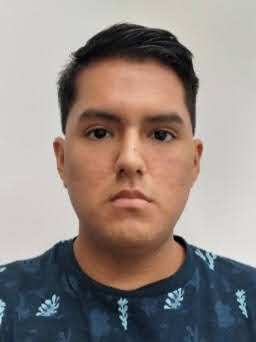
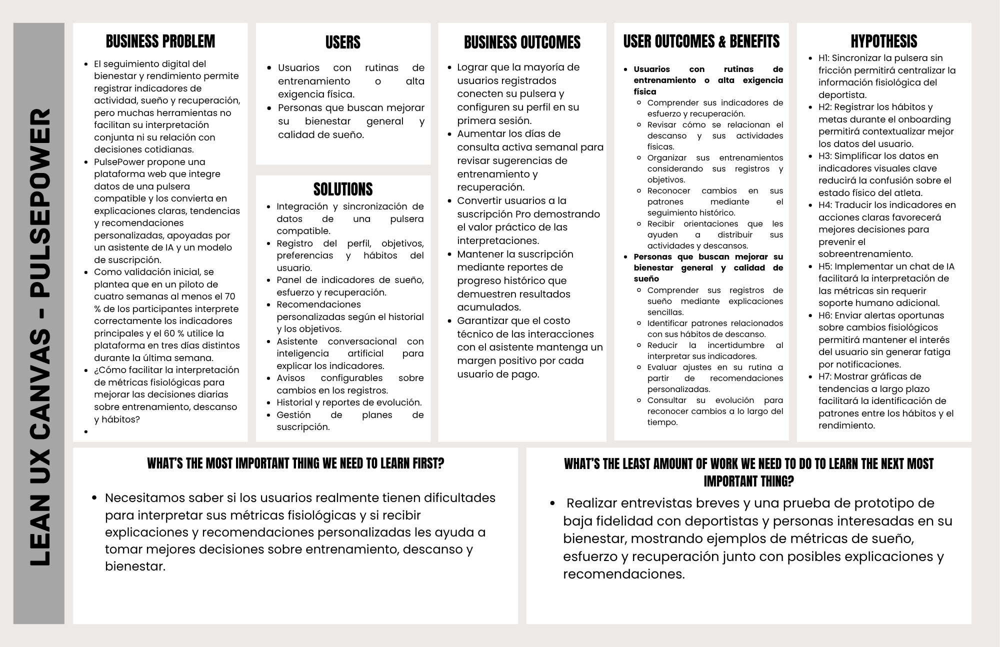

# Capítulo I: Introducción

## 1.1. Startup Profile
### 1.1.1. Descripción de la Startup
SportPlus es una startup tecnológica enfocada en el desarrollo de soluciones digitales para la comprensión y el acompañamiento del bienestar físico de las personas. Construimos sistemas que interpretan las señales del cuerpo humano y las convierten en información útil para tomar mejores decisiones sobre el entrenamiento, el descanso y la salud en general. En SportPlus buscamos transformar la manera en que las personas se relacionan con su estado físico: a quienes buscan mejorar su bienestar y su descanso, y hoy lo interpretan de forma intuitiva y poco estructurada, les damos claridad; a los deportistas que buscan maximizar su rendimiento, les damos precisión. Integramos progresivamente tecnologías de análisis de datos para construir soluciones capaces de adaptarse a las necesidades de bienestar de cada persona, sin importar en qué punto de ese camino se encuentre.

#### Visión
Convertirnos en el referente de inteligencia fisiológica personal en Latinoamérica, conectando a deportistas y a personas enfocadas en su bienestar con una misma fuente objetiva de información sobre descanso, recuperación y rendimiento.

#### Misión
Brindar soluciones tecnológicas accesibles, que aprovechen la pulsera que el usuario ya utiliza, y que traduzcan su estado fisiológico en decisiones concretas: para quienes buscan entender mejor su cuerpo y su descanso, reducimos la incertidumbre; para quienes buscan maximizar su rendimiento, entregamos precisión. Todo esto con información actualizada, explicaciones sencillas y recomendaciones adaptadas a los objetivos de cada persona.

#### Propuesta de valor
_“No puedes rendir más sin recuperarte mejor. Conócete primero.”_

SportPlus existe para cerrar la brecha entre lo que el cuerpo comunica y lo que las personas realmente entienden de él. Creemos que el rendimiento, el bienestar y el entrenamiento no deberían decidirse por intuición, sino por información clara y accesible. Por eso construimos un puente entre los datos fisiológicos que ya generan los dispositivos que las personas usan y las decisiones que toman todos los días: deportistas que buscan mejorar y personas que buscan entender su propio bienestar. Nuestra apuesta no es vender un dispositivo más, sino ser la capa de inteligencia que traduce el cuerpo en decisiones.

### 1.1.2. Perfiles de integrantes del equipo

| Foto                                                      | Descripción                                                                                                                                                                                                                                                                                                                                                                                                                                                                                                                                      |
|-----------------------------------------------------------|--------------------------------------------------------------------------------------------------------------------------------------------------------------------------------------------------------------------------------------------------------------------------------------------------------------------------------------------------------------------------------------------------------------------------------------------------------------------------------------------------------------------------------------------------|
|           | **Evangelista Ygnacio, Sergio Joaquin**  Estudiante de Ingeniería de Software, organizado, responsable y orientado a resultados. Apasionado por el aprendizaje continuo y la actualización constante en nuevas tecnologías, metodologías y buenas prácticas. Me adapto con facilidad a diferentes entornos y busco aportar soluciones eficientes y proactivas.                                                                                                                                                                             |
|         | **Martin Farro, Alexis Sebastian**  Estudiante de Ingeniería de Software. Disciplinado y constante, cualidades desarrolladas a través de la natación que aplico para mantener el enfoque y superar obstáculos. Enfocado en resolver problemas de manera metódica y con atención al detalle.                                                                                                                                                                                                                                                |
|      | **Osorio Ramírez, Eduardo Jesús**  Estudiante de Ingeniería de Software. Busca desarrollar nuevas habilidades y ampliar conocimiento en el área de inteligencia artificial, con conocimientos de C++, HTML, CSS, y conocimiento sobre código limpio.                                                                                                                                                                                                                                                                                       |
|  | **Carbajal Santivañez, Sebastian Aaron**  Estudiante de Ingeniería de Software en la Universidad Peruana de Ciencias Aplicadas, actualmente cursando el 8vo ciclo de la carrera. Me apasionan el análisis de datos, las bases de datos y el diseño de interfaces con una experiencia de usuario eficiente. Me considero una persona analítica y creativa. Cuento con conocimientos de Python, React, Node.js, MySQL, SQL Management, Swift, C# y C++. |
|        | **Viza Quispe, Marlon Packard**  Estudiante responsable y proactivo con una sólida base técnica en C++. Destaco por mi capacidad para aportar soluciones creativas y por mi compromiso con el aprendizaje continuo en entornos profesionales.                                                                                                                                                                                                                                                                                             |

## 1.2. Solution Profile
### 1.2.1. Antecedentes y problemática
**1. ¿Qué ocurre o qué problema se presenta? (What?)**

Las exigencias físicas y laborales de las personas son cada vez mayores y, por ende, quienes mantienen una actividad física constante presentan dificultades para equilibrar adecuadamente su esfuerzo con su recuperación. Muchas decisiones todavía se basan en la percepción subjetiva, la experiencia personal o la observación directa de síntomas de cansancio, lo que puede generar errores de calibración, decisiones tardías y dificultades para anticipar el desgaste físico. Como consecuencia, las personas entrenan o descansan en momentos inadecuados para su cuerpo, y quienes las acompañan tienen menor certeza sobre su verdadero estado fisiológico.

**2. ¿Cuándo se presenta el problema? (When?)**

El problema se vuelve evidente durante los periodos de mayor exigencia física, como las semanas previas a una competencia, las etapas de entrenamiento intenso o los momentos de mayor carga laboral y académica combinada con actividad física. También aparece cuando la persona atraviesa cambios bruscos en su rutina (el inicio de un nuevo plan de entrenamiento, la recuperación de una lesión o alteraciones en su descanso) y no cuenta con una manera confiable de conocer su verdadera capacidad de respuesta en ese momento.

**3. ¿Dónde sucede? (Where?)**

El problema ocurre principalmente en entornos donde las personas concentran una carga física y mental considerable, como gimnasios, equipos deportivos, empresas con jornadas laborales demandantes y hogares de quienes entrenan de forma autónoma. La dificultad es mayor en aquellas personas que todavía dependen únicamente de la percepción propia para conocer su estado de recuperación.

**4. ¿Quiénes están involucrados o afectados? (Who?)**

El problema impacta directamente a dos grupos. Por un lado, a deportistas amateurs y de alto rendimiento, quienes necesitan maximizar su nivel competitivo sin arriesgarse a sufrir lesiones. Por otro, a personas que buscan cuidar su bienestar y su descanso, quienes deben equilibrar la actividad física con responsabilidades laborales y académicas sin el tiempo ni la guía experta para interpretar sus señales corporales.

**5. ¿Por qué ocurre? (Why?)**

El problema ocurre porque tanto las personas que buscan su bienestar como los deportistas carecen del tiempo, el conocimiento y el acompañamiento experto para traducir sus señales fisiológicas en acciones concretas, y dependen todavía de la percepción subjetiva, la intuición o la aparición de síntomas tardíos. Esta brecha se origina porque las herramientas tecnológicas actuales exigen un nivel de interpretación técnica que el usuario enfocado en bienestar no domina ni le interesa profundizar, lo que le impide convertir datos complejos en hábitos diarios sencillos.

A su vez, en el ámbito deportivo, la causa principal es la falta de un procesamiento de datos claro, confiable y contextualizado. La ausencia de una lectura integrada sobre el esfuerzo acumulado, la calidad del descanso y la recuperación real impide a los deportistas evaluar con precisión su capacidad de respuesta física antes de exponerse a una nueva carga de entrenamiento, lo que los obliga a gestionar su rendimiento sin una guía objetiva.

**6. ¿Cómo se manifiesta el problema? (How?)**

En los deportistas, el problema se manifiesta mediante decisiones de entrenamiento guiadas por la intuición más que por evidencia, la dificultad para detectar a tiempo señales de sobreentrenamiento y el desconocimiento sobre la calidad real de su descanso. En las personas enfocadas en su bienestar, se refleja en la dependencia de sensaciones poco precisas, la incertidumbre de no contar con información objetiva sobre su cuerpo y, sobre todo, la frustración y el estancamiento al no saber cómo traducir sus señales fisiológicas en hábitos y cargas de esfuerzo adecuadas.

**7. ¿Cuánto cuesta o cuál es la magnitud? (How Much?)**

La adopción de dispositivos que registran datos fisiológicos crece en el Perú: en 2024 se importaron 989 350 smartwatches, por un valor superior a US$ 21 millones, con un crecimiento de 12,06 % respecto del año anterior (Idexcam – Cámara de Comercio de Lima, 2025). Sin embargo, contar con más datos no garantiza mejores decisiones. Alrededor del 30 % de los peruanos adultos duerme menos de seis horas (Infobae, 2024), y solo el 40 % de los peruanos califica su nivel de estrés como bueno, frente al 66 % del promedio global (WIN International y Voices!, 2024). En el segmento deportivo, el costo se expresa en lesiones por sobrecarga, periodos de inactividad y gastos de rehabilitación que podrían reducirse con un seguimiento fisiológico continuo. En el segmento de bienestar, se expresa en dispositivos subutilizados, abandono de hábitos saludables y fatiga sostenida, que reducen la energía, la productividad y la calidad de vida.

**Puntos a resolver, objetivos y restricciones**

La solución debe resolver los siguientes puntos:

- Traducir los registros de sueño, esfuerzo y recuperación en indicadores y explicaciones que el usuario pueda interpretar sin conocimientos técnicos.
- Integrar en una sola vista la información que hoy se encuentra dispersa entre dispositivos y aplicaciones.
- Convertir los indicadores en recomendaciones accionables sobre la intensidad del entrenamiento, el descanso y los hábitos de sueño.
- Advertir a tiempo los riesgos de sobreentrenamiento y de descanso insuficiente sostenido.
  Objetivos del proyecto:

- Desarrollar una Landing Page que presente la propuesta de valor a ambos segmentos objetivo.
- Desarrollar una aplicación web que integre los datos de una pulsera compatible y presente indicadores, recomendaciones personalizadas, alertas y reportes de progreso.
- Validar con usuarios de ambos segmentos que los indicadores se interpretan correctamente y que las recomendaciones se perciben como útiles.
  Restricciones que delimitan el alcance:

- PulsePower no fabrica ni distribuye hardware. Los datos provienen de una pulsera compatible del usuario, integrada mediante el servicio externo AIoTI.
- PulsePower no realiza diagnósticos médicos. Sus recomendaciones son orientativas y no sustituyen la atención de un profesional de la salud.
- El producto se desarrolla como aplicación web (WebApp y Landing Page). No contempla una aplicación móvil nativa en este proyecto.
- El alcance geográfico inicial es el Perú, principalmente zonas urbanas con conectividad a internet.
### 1.2.2. Lean UX Process

Se aplicará Lean UX para orientar la creación del producto a partir de las necesidades de sus usuarios y la validación de los supuestos del equipo. Este proceso permitirá investigar cómo las personas interpretan sus registros de sueño, esfuerzo y recuperación, y qué dificultades encuentran al utilizarlos para organizar sus rutinas.

#### 1.2.2.1. Lean UX Problem Statements

El seguimiento digital del bienestar y del rendimiento físico se ha enfocado principalmente en dispositivos y aplicaciones que permiten registrar y consultar indicadores de actividad, sueño y recuperación. Estas herramientas atienden a personas interesadas en mejorar su entrenamiento y a quienes buscan comprender su descanso mediante cifras, gráficos y puntuaciones sobre sus hábitos.

Lo que los productos existentes no logran resolver es la dificultad para interpretar estos indicadores de manera conjunta y relacionarlos con decisiones cotidianas. Se parte del supuesto de que algunas personas no encuentran suficiente orientación contextualizada en las herramientas que utilizan, lo que puede generar incertidumbre al distribuir su esfuerzo, planificar sus entrenamientos o revisar sus hábitos de descanso.

Para abordar esta brecha, se plantea desarrollar una plataforma web que integre los registros de una pulsera compatible y los presente mediante explicaciones comprensibles, tendencias y recomendaciones personalizadas. La estrategia contempla un asistente conversacional con inteligencia artificial y un modelo de suscripción cuyo valor se apoye en el seguimiento histórico y el acompañamiento adaptado a los objetivos del usuario.

Nuestro enfoque inicial serán los deportistas amateurs de zonas urbanas de Lima que ya utilizan una pulsera o un smartwatch y entrenan de forma constante, porque son quienes consultan sus datos con mayor frecuencia y quienes enfrentan de forma más directa el riesgo de sobreentrenamiento. Una vez validada la propuesta con este grupo, se extenderá a las personas enfocadas en mejorar su bienestar y su calidad de sueño.

Sabremos que tenemos éxito cuando, durante un piloto de cuatro semanas, al menos el 70 % de los participantes interprete correctamente los indicadores principales en una prueba de comprensión y al menos el 60 % consulte la plataforma en tres días distintos durante la última semana. Estos umbrales constituyen metas de validación propuestas por el equipo y deberán revisarse según los resultados de las pruebas.

¿Cómo podríamos facilitar que tanto deportistas como personas enfocadas en su bienestar interpreten sus métricas fisiológicas para tomar decisiones diarias sobre su entrenamiento, descanso y hábitos?

#### 1.2.2.2. Lean UX Assumptions

**Business Assumptions**

- Suponemos que los deportistas prefieren adaptar su carga de entrenamiento diaria según métricas de recuperación objetivas antes que seguir a ciegas su rutina programada o su nivel de motivación.
- Creemos que quienes quieren mejorar su bienestar buscan sugerencias en lenguaje sencillo sobre cómo mejorar su descanso y su energía diaria, y evitan interpretar tablas, puntuaciones o gráficos complejos.
- Suponemos que ambos grupos sienten que sus aplicaciones actuales les entregan datos aislados y que valoran una herramienta que integre esfuerzo y descanso en explicaciones accionables.
- Creemos que los usuarios están dispuestos a consultar la plataforma de forma recurrente para planificar su día, en lugar de usarla solo como una consulta pasiva al final de la semana.
- Creemos que los usuarios estarán dispuestos a pagar una suscripción si reciben orientación personalizada y perciben utilidad en el seguimiento.
- Suponemos que integrar una pulsera compatible permitirá obtener los datos necesarios para desarrollar las funcionalidades propuestas.
- Creemos que el valor de las recomendaciones mantendrá el uso recurrente de la plataforma más allá del periodo de novedad inicial, evitando la tasa de abandono típica de las aplicaciones de salud.
  **Business Outcome Assumptions**

- Lograr que la mayoría de los usuarios registrados conecte su pulsera y configure su perfil en su primera sesión.
- Aumentar los días de consulta activa semanal para revisar sugerencias de entrenamiento y recuperación.
- Convertir usuarios a la suscripción Pro demostrando el valor práctico de las interpretaciones.
- Mantener la suscripción mediante reportes de progreso histórico que demuestren resultados acumulados.
- Garantizar que el costo técnico de las interacciones con el asistente mantenga un margen positivo por cada usuario de pago.
  **User Assumptions**

- Usuarios con rutinas de entrenamiento o alta exigencia física (Deportistas).
- Personas que buscan mejorar su bienestar general y su calidad de sueño (Wellness Seekers).
  **User Outcome and Benefit Assumptions**

_Usuarios con rutinas de entrenamiento o alta exigencia física (Deportistas)_

- Comprender sus indicadores de esfuerzo y recuperación.
- Revisar cómo se relacionan el descanso y sus actividades físicas.
- Organizar sus entrenamientos considerando sus registros y objetivos.
- Reconocer cambios en sus patrones mediante el seguimiento histórico.
- Recibir orientaciones que les ayuden a distribuir sus actividades y descansos.
  _Personas que buscan mejorar su bienestar general y su calidad de sueño (Wellness Seekers)_

- Comprender sus registros de sueño mediante explicaciones sencillas.
- Identificar patrones relacionados con sus hábitos de descanso.
- Reducir la incertidumbre al interpretar sus indicadores.
- Evaluar ajustes en su rutina a partir de recomendaciones personalizadas.
- Consultar su evolución para reconocer cambios a lo largo del tiempo.
  **Feature Assumptions**

- Integración y sincronización de datos de una pulsera compatible.
- Registro del perfil, objetivos, preferencias y hábitos del usuario.
- Panel de indicadores de sueño, esfuerzo y recuperación.
- Recomendaciones personalizadas según el historial y los objetivos.
- Avisos configurables sobre cambios en los registros.
- Historial y reportes de evolución.
- Gestión de planes de suscripción.
#### 1.2.2.3. Lean UX Hypothesis Statements

Se elabora un hypothesis statement por cada Feature Assumption, con la estructura *Creemos que lograremos [business outcome] si [user personas] obtienen [beneficio] con [feature]*. Cada hipótesis incluye la señal medible que permitirá validarla.

**Hipótesis 1 – Integración y sincronización de la pulsera**

Creemos que lograremos que la mayoría de los usuarios registrados conecte su pulsera en su primera sesión si los deportistas y los Wellness Seekers obtienen su información fisiológica centralizada sin registro manual, con la integración y sincronización automática de una pulsera compatible. Lo sabremos cuando al menos el 70 % de los participantes del piloto mantenga su pulsera sincronizada al menos 5 de cada 7 días durante las cuatro semanas.

**Hipótesis 2 – Registro de perfil y objetivos**

Creemos que lograremos que la mayoría de los usuarios registrados configure su perfil en su primera sesión si los deportistas y los Wellness Seekers obtienen recomendaciones ajustadas a su contexto desde el primer uso, con el registro guiado de su perfil, objetivos, preferencias y hábitos. Lo sabremos cuando más del 90 % de los participantes complete su perfil en la primera sesión.

**Hipótesis 3 – Panel de indicadores**

Creemos que lograremos aumentar los días de consulta activa semanal si los deportistas obtienen una comprensión clara de su estado físico sin interpretar datos crudos, con un panel que resuma sus registros en tres indicadores de sueño, esfuerzo y recuperación. Lo sabremos cuando los participantes consulten el panel antes de las 11:00 al menos 4 de cada 7 días.

**Hipótesis 4 – Recomendaciones personalizadas**

Creemos que lograremos aumentar los días de consulta activa semanal si los deportistas y los Wellness Seekers obtienen orientación concreta para distribuir su entrenamiento y su descanso, con recomendaciones personalizadas según su historial y sus objetivos (por ejemplo, "hoy prioriza el descanso"). Lo sabremos cuando al menos el 60 % de las recomendaciones calificadas por los participantes sea marcada como útil.

**Hipótesis 5 – Avisos configurables**

Creemos que lograremos aumentar los días de consulta activa semanal si los deportistas y los Wellness Seekers obtienen advertencias oportunas sobre cambios en sus registros sin sentirse saturados, con avisos configurables. Lo sabremos cuando la tasa de apertura de los avisos supere el 40 % y menos del 10 % de los participantes desactive las alertas.

**Hipótesis 6 – Historial y reportes de evolución**

Creemos que lograremos mantener la suscripción mediante el progreso histórico si los deportistas y los Wellness Seekers obtienen la capacidad de reconocer patrones entre sus hábitos y su rendimiento, con un historial y reportes de evolución semanales y mensuales. Lo sabremos cuando los participantes consulten la vista semanal o mensual de reportes al menos dos veces al mes.

**Hipótesis 7 – Gestión de planes de suscripción**

Creemos que lograremos convertir usuarios a la suscripción Pro si los deportistas y los Wellness Seekers obtienen un acompañamiento más completo (asistente de IA, reportes avanzados y recomendaciones a medida) que perciben como útil durante la prueba, con la gestión de planes Basic y Pro. Lo sabremos cuando al menos el 25 % de los participantes que completen el periodo de prueba elija el plan Pro y lo mantenga activo durante el segundo mes.

**Justificación de umbrales y método de medición**

Los umbrales anteriores son metas iniciales de validación y no resultados comprobados. Todos se medirán en un piloto de cuatro semanas, con participantes reclutados en gimnasios, clubes y comunidades de bienestar de Lima, procurando una cantidad similar de participantes por segmento. Como la muestra será pequeña, cada resultado se reportará con el número absoluto de participantes y no solo como porcentaje. Si un umbral no se alcanza, la hipótesis se reformulará en lugar de ajustar la meta a posteriori.

| Hipótesis | Umbral | Por qué el umbral es razonable | Cómo se medirá |
|---|---|---|---|
| H1 – Sincronización | ≥ 70 % sincroniza al menos 5 de 7 días | Exigir sincronización todos los días castigaría olvidos normales, como cargar la pulsera o no usarla un día. El valor se alinea con el criterio de éxito del piloto (70 %). | Registro de sincronizaciones por usuario y día en la integración con AIoTI. |
| H2 – Perfil | > 90 % completa el perfil en la primera sesión | El asistente solo pide datos imprescindibles. Completarlo es el primer paso para obtener valor y lo hacen participantes que ya aceptaron entrar al piloto. | Registro de perfiles completados dentro de la misma sesión del registro. |
| H3 – Panel | Consulta matutina (antes de las 11:00) al menos 4 de 7 días | Los entrevistados revisan su estado al despertar y antes de entrenar. "Cada mañana" se precisó a 4 de 7 días para que sea medible. | Registro de vistas del panel con fecha y hora. |
| H4 – Recomendaciones | ≥ 60 % de recomendaciones calificadas como útiles | Una mayoría clara indica valor percibido. Se complementa con la prueba de comprensión (≥ 70 % interpreta correctamente los indicadores). | Calificación útil / no útil dentro de la plataforma y estado aceptada / descartada de cada recomendación. |
| H5 – Avisos | Apertura > 40 % y < 10 % desactiva las alertas | Los avisos se emiten solo ante cambios relevantes, con un máximo de uno por tipo y día, lo que limita la fatiga por notificaciones. | Registro de aperturas de avisos y de cambios en las preferencias de alertas. |
| H6 – Reportes | Al menos 2 consultas de la vista semanal o mensual al mes | Coincide con la frecuencia media de la tarea "Revisar su evolución" en la User Task Matrix. | Registro de vistas de reportes por usuario. |
| H7 – Suscripción | ≥ 25 % elige Pro y lo mantiene el segundo mes | Un valor más alto no tendría sustento para un producto nuevo y sin reconocimiento de marca (ver análisis competitivo, sección 2.1.1). Se validará con la disposición de pago observada en el piloto. | Registro de activaciones y cancelaciones de la suscripción Pro durante el piloto y el mes siguiente. |

#### 1.2.2.4. Lean UX Canvas

Link del Lean UX Canvas: [https://canva.link/050da8fh7vfddyg](https://canva.link/050da8fh7vfddyg)

_Figura 1 (Lean UX Canvas)_

### 1.3. Segmentos objetivo

**Primer Segmento Objetivo - Usuarios con rutinas de entrenamiento o alta exigencia física (Deportistas)**

- Demográfico: Hombres y mujeres entre los 18 y 60 años, deportistas amateurs, semiprofesionales o personas con rutinas de entrenamiento constantes.
- Psicográfico: Orientados a la mejora de su rendimiento y a la prevención de lesiones. Valoran la disciplina y el control sobre su propio cuerpo. Buscan sustentar sus decisiones de entrenamiento en información objetiva más que en la intuición.
- Conductual: Poseen un manejo intermedio a avanzado de conceptos vinculados al entrenamiento físico y al seguimiento del rendimiento personal. Recurren al servicio de manera constante y diaria, especialmente antes y después de cada sesión de entrenamiento. Están dispuestos a adoptar nuevas herramientas si estas ofrecen una ventaja clara para su rendimiento.
- Geográfico: Residentes en Perú, principalmente en zonas urbanas con acceso a instalaciones deportivas y conectividad plena a internet móvil.

**Segundo Segmento Objetivo - Personas que buscan mejorar su bienestar general y su calidad de sueño (Wellness Seeker)**

- Demográfico: Hombres y mujeres entre los 25 y 55 años, profesionales con jornadas laborales exigentes, estudiantes de posgrado y/o personas con niveles elevados de estrés cotidiano.
- Psicográfico: Valoran el equilibrio entre su vida diaria y su bienestar personal. Buscan reducir la incertidumbre sobre su propio cuerpo y prevenir el desgaste derivado del estrés acumulado. Están orientados a mejorar su calidad de vida de forma sostenible, sin necesariamente seguir una rutina de entrenamiento intensa.
- Conductual: Poseen un manejo elemental de herramientas digitales de salud y bienestar. Acuden al servicio de forma regular, principalmente para revisar su recuperación nocturna y en momentos de descanso a lo largo del día. Están dispuestos a adoptar nuevas herramientas si estas ofrecen un beneficio inmediato y claro para su bienestar.
- Geográfico: Residentes en Perú, principalmente en zonas urbanas de alta densidad poblacional, con conectividad plena a internet móvil.
