# Capítulo II: Requirements Elicitation & Analysis
## 2.1. Competidores
Para el análisis de competidores se priorizó la identificación de soluciones digitales con un modelo de negocio similar al de PulsePower: plataformas de inteligencia fisiológica que, mediante un dispositivo conectado, traducen de forma continua señales del cuerpo humano en información personalizada sobre recuperación, esfuerzo y descanso. Se consideraron competidores directos de alcance internacional, cuya propuesta de valor es comparable a la de PulsePower.

Los competidores identificados son:
- WHOOP (Estados Unidos) — pulsera sin pantalla que monitorea de forma continua la variabilidad de la frecuencia cardíaca, el sueño y el esfuerzo, bajo un modelo de suscripción que incluye el dispositivo.
- Oura Ring (Finlandia / Estados Unidos) — anillo inteligente que traduce datos de sueño, actividad y disposición en puntuaciones diarias, con un asesor de salud asistido por IA.
- Garmin Connect+ (Estados Unidos) — suscripción premium dentro del ecosistema Garmin que añade inteligencia artificial (Active Intelligence) a los datos de sueño, recuperación y entrenamiento de los relojes Garmin.

### 2.1.1. Análisis competitivo

**¿Por qué llevar a cabo este análisis?** Se lleva a cabo este análisis para comparar PulsePower con las principales soluciones de monitoreo fisiológico y bienestar disponibles en el mercado, con el propósito de identificar fortalezas, debilidades y oportunidades que permitan diferenciar a PulsePower y posicionarlo frente a sus competidores.

|  |  |  PulsePower | 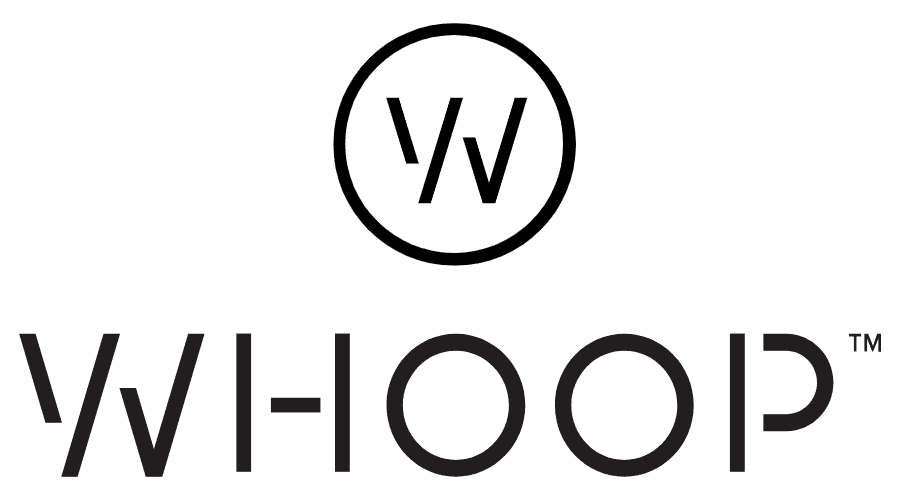 WHOOP |  Oura Ring | 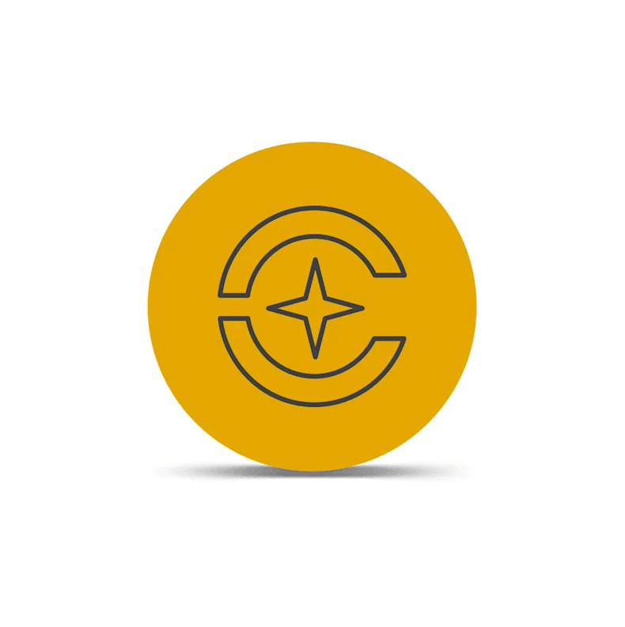 Garmin Connect+ |
|---|---|---|---|---|---|
| **Perfil** | **Overview** | Startup universitario que desarrolla una plataforma de inteligencia fisiológica impulsada por IA que, a través de una pulsera conectada, traduce de forma continua señales del cuerpo (VFC, sueño, esfuerzo y recuperación) en decisiones personalizadas de entrenamiento y descanso, sostenida mediante una suscripción de software. | Pulsera sin pantalla de monitoreo continuo 24/7 (VFC, sueño, esfuerzo, recuperación, frecuencia respiratoria, SpO2 y temperatura), con modelo 100% por membresía: el dispositivo se entrega incluido dentro de la suscripción, sin pago separado por hardware. | Anillo inteligente que entrega puntuaciones diarias de sueño, actividad y disposición (readiness), además de métricas de estrés, salud cardiovascular y salud de la mujer, bajo un modelo híbrido de compra del anillo más suscripción mensual o anual. | Capa premium (Active Intelligence) sobre el ecosistema Garmin Connect ya existente, que interpreta con IA los datos de sueño, recuperación y carga de entrenamiento de relojes Garmin, manteniendo gratuitas las métricas básicas de salud. |
| | **Ventaja competitiva** | Motor de IA conversacional que dialoga con el usuario para proyectar su recuperación futura y ajustar su rutina, en lugar de limitarse a mostrar el estado fisiológico actual. Autoconocimiento continuo del propio cuerpo, decisiones de entrenamiento respaldadas por datos objetivos y reducción del riesgo de sobreentrenamiento y lesiones. | Modelo "todo incluido" por suscripción sin costo de hardware separado; foco exclusivo en recuperación y prevención del sobreentrenamiento, validado por atletas de élite. Puntuación diaria de recuperación (0-100%), recomendaciones de cuándo entrenar o descansar, análisis detallado del sueño y coaching de fuerza. | Formato de anillo discreto y cómodo frente a pulseras/relojes; asesor de salud asistido por IA (Oura Advisor) con enfoque en longevidad. Puntuaciones diarias claras, información sobre edad cardiovascular y resiliencia al estrés, y comparativas de tendencias de salud a largo plazo. | No exige comprar un dispositivo nuevo si el usuario ya tiene un reloj Garmin; se apoya en un ecosistema deportivo maduro con GPS y funciones multideporte. Resúmenes diarios de descanso y recuperación, información específica tras cada sesión y recomendaciones de sueño con gamificación (medallas, desafíos). |
| **Perfil de Marketing** | **Mercado objetivo** | Deportistas amateurs, atletas semiprofesionales y personas con rutinas de entrenamiento exigente, junto con profesionales de alto estrés, entre 18 y 55 años, en Perú. | Atletas de élite y deportistas serios con alta exigencia física, alcance global (EE. UU. e internacional). | Personas orientadas al bienestar general, el sueño y la longevidad; alcance internacional y perfil más amplio que el estrictamente deportivo. | Usuarios ya integrados al ecosistema Garmin: corredores, ciclistas y deportistas de resistencia con dispositivo propio. |
| | **Estrategias de marketing** | Alianzas con gimnasios y equipos deportivos, marketing de contenido sobre fisiología del rendimiento y programa de referidos apoyado en la gamificación de la plataforma. | Patrocinio de atletas profesionales, prueba gratuita del primer mes y una comunidad activa de usuarios que comparte experiencias. | Posicionamiento como accesorio premium orientado al bienestar y la longevidad, con primer mes de suscripción gratuito para nuevos miembros. | Prueba gratuita de 30 días para usuarios existentes del ecosistema, comunicando la IA como una capa adicional sobre datos ya conocidos. |
| **Perfil de Producto** | **Productos & Servicios** | Pulsera conectada más plataforma de software con motor de IA conversacional, gamificación del progreso y generación de reportes de recuperación. | Pulsera WHOOP + app, con coaching de IA (WHOOP Coach) y funciones de laboratorio para biomarcadores (Advanced Labs). | Anillo Oura (Gen 4/5) + app, con asesor de salud asistido por IA (Oura Advisor). | App Garmin Connect + suscripción Connect+ con Active Intelligence, contenido de Garmin Coach, LiveTrack avanzado y gamificación. |
| | **Precios & Costos** | Sin costo de hardware separado; el usuario paga únicamente la membresía mensual o anual, que incluye el dispositivo. | Anillo desde USD 349 a USD 499 (pago único) más suscripción desde USD 5.99 al mes o USD 69.99 al año. | Suscripción desde USD/EUR 8.99 al mes o 89.99 al año, adicional al costo del reloj Garmin, que se compra por separado. | No se especifica en el contenido proporcionado. |
| | **Canales de distribución (Web y/o Móvil)** | Aplicación móvil (Android/iOS) junto con venta directa del dispositivo (pulsera). | Aplicación móvil (Android/iOS) con venta directa en línea del dispositivo, incluido dentro de la suscripción. | Aplicación móvil (Android/iOS) con venta directa en línea del anillo. | Aplicación móvil (Android/iOS) vinculada a hardware Garmin adquirido por separado en tiendas físicas y en línea. |
| **Análisis SWOT** | **Fortalezas** | IA conversacional que proyecta la recuperación futura del usuario, no solo su estado actual; gamificación orientada a la fidelización; enfoque analítico continuo sobre esfuerzo, sueño y recuperación. | Modelo todo incluido sin pago de hardware separado; comunidad y respaldo de atletas de élite; precisión de grado médico en su versión MG. | Formato de anillo discreto y de alta adopción; marca líder y reconocida en anillos inteligentes; enfoque diferenciado en longevidad y salud de la mujer. | Ecosistema deportivo maduro con base de usuarios ya instalada; mantiene el monitoreo básico de salud de forma gratuita, reduciendo la fricción de adopción. |
| | **Debilidades** | Producto aún en fase de validación, sin usuarios reales; depende de un hardware propio nuevo en un mercado sin reconocimiento de marca. | Costo total de propiedad alto en el tiempo, al depender por completo de la suscripción; ausencia de pantalla, lo que no conviene a quienes prefieren ver sus datos en el propio dispositivo. | Suscripción obligatoria para acceder a las propias métricas avanzadas, lo que ha generado críticas; competidores sin cuota mensual (RingConn, Galaxy Ring) ganan terreno. | Exige poseer previamente un dispositivo Garmin, lo que añade una barrera de entrada de hardware; las funciones de IA se perciben por algunos usuarios como una capa superficial sobre métricas ya existentes. |
| | **Oportunidades** | Creciente interés por la salud fisiológica y el rendimiento en Perú; ausencia de un competidor local consolidado. | Expansión de funciones médicas (Advanced Labs) y del mercado wearable de recuperación. | Crecimiento acelerado del mercado de anillos inteligentes, proyectado en torno al 35% anual. | Base de usuarios existente dispuesta a pagar por capas adicionales de IA sobre su dispositivo actual. |
| | **Amenazas** | Adopción tecnológica limitada en algunos segmentos; ingreso de marcas internacionales consolidadas (WHOOP, Oura, Garmin) al mercado peruano. | Plataformas con motores de IA conversacional más personalizados, como PulsePower, que ofrecen mayor profundidad analítica. | Alternativas sin suscripción mensual que reducen el costo total para el usuario; plataformas con IA conversacional más profunda. | Plataformas nativas de inteligencia fisiológica que no dependen de comprar un reloj deportivo previo. |

### 2.1.2. Estrategias y tácticas frente a competidores

Con base en el análisis competitivo, PulsePower plantea las siguientes estrategias y tácticas preliminares, cuya viabilidad se evaluará durante la investigación y validación del producto.

#### Estrategias

- **Diferenciación mediante la comprensión de los indicadores:** PulsePower buscará destacar frente a competidores que ya incorporan funciones de inteligencia artificial mediante explicaciones claras y útiles de los indicadores fisiológicos, facilitando su comprensión y aplicación en la toma de decisiones.

- **Transparencia comercial:** Se establecerá una propuesta comercial clara que permita al usuario comprender el precio del software, los costos asociados a la pulsera, las funcionalidades incluidas y las condiciones de cancelación.

- **Experiencia web adaptable:** PulsePower ofrecerá una experiencia accesible desde computadoras, tabletas y teléfonos, buscando mantener una experiencia consistente entre la Landing Page y la aplicación web.

- **Reducción de dificultades de incorporación:** Se priorizará una incorporación sencilla mediante una configuración guiada del perfil y de la pulsera compatible, reduciendo las dificultades relacionadas con la conexión, los permisos y la consulta de los primeros registros.

- **Vinculación con los segmentos locales:** PulsePower buscará establecer vínculos con gimnasios, clubes y comunidades de bienestar en Perú para acercar la propuesta a sus segmentos objetivo y obtener retroalimentación sobre su utilidad.

- **Demostración del valor de la suscripción:** Se buscará demostrar el valor del servicio antes de la contratación, permitiendo que los usuarios conozcan sus principales funcionalidades y beneficios.

- **Construcción de confianza:** PulsePower comunicará de manera transparente la procedencia y actualización de los datos, los límites de las recomendaciones y las opciones de privacidad, evitando atribuir al producto capacidades que todavía no hayan sido demostradas.

#### Tácticas

- **Pruebas de comprensión:** Realizar pruebas con representantes de ambos segmentos para evaluar la comprensión de los indicadores y ajustar el lenguaje, los reportes y las recomendaciones.

- **Presentación detallada de precios:** Mostrar explícitamente los costos del software y de la pulsera, las funcionalidades incluidas y las condiciones de cancelación. La estructura comercial definitiva se establecerá después de evaluar los costos y la disposición de pago.

- **Pruebas multidispositivo:** Evaluar los principales flujos de consulta y seguimiento en diferentes dimensiones de pantalla, verificando la consistencia entre la Landing Page y la aplicación web.

- **Configuración guiada:** Diseñar pruebas de incorporación que permitan identificar obstáculos relacionados con la conexión de la pulsera, la comprensión de permisos y la consulta de los primeros registros.

- **Acuerdos piloto:** Buscar colaboraciones con gimnasios, clubes y comunidades de bienestar en Perú para obtener retroalimentación y evaluar la utilidad de PulsePower dentro de las rutinas de los participantes.

- **Prueba del servicio:** Evaluar una modalidad de prueba que permita conocer las funcionalidades antes de contratar el servicio. La conversión, el uso recurrente y los motivos de abandono se utilizarán para ajustar los planes y priorizar mejoras.

- **Comunicación basada en evidencia:** Explicar la procedencia y actualización de los datos, los límites de las recomendaciones y las opciones de privacidad. Los beneficios comunicados deberán respaldarse con resultados obtenidos durante la validación.

## 2.2. Entrevistas

### 2.2.1. Diseño de entrevistas

#### Segmento 1: Usuarios con rutinas de entrenamiento o alta exigencia física

Este segmento comprende deportistas amateurs, atletas semiprofesionales o profesionales y personas con rutinas de entrenamiento exigentes. La documentación señala como principales problemas la dificultad para interpretar la recuperación, controlar el esfuerzo y tomar decisiones de entrenamiento basadas en información objetiva.

1. ¿Cómo determina actualmente si su cuerpo está preparado para realizar una sesión de entrenamiento?
2. ¿Qué factores toma en cuenta para decidir cuánto entrenar o qué tan intenso será su entrenamiento?
3. ¿Qué dificultades encuentra al momento de saber si se está recuperando adecuadamente después de entrenar?
4. ¿Cómo realiza actualmente el seguimiento de su rendimiento, esfuerzo y recuperación?
5. ¿Qué tan fácil o difícil le resulta interpretar los datos que obtiene de su reloj, pulsera, aplicación u otro método de seguimiento?
6. ¿Ha tenido situaciones en las que haya entrenado a pesar de sentirse físicamente agotado o, por el contrario, haya descansado cuando podría haber entrenado? ¿Qué ocurrió?
7. ¿Cómo identifica actualmente señales de fatiga, sobreentrenamiento o falta de recuperación?
8. ¿Qué sucede con su entrenamiento cuando tiene cambios en su rutina, duerme mal, atraviesa una semana de mayor estrés o está recuperándose de una lesión?
9. ¿Qué información sobre su estado físico le gustaría conocer antes o después de entrenar y que actualmente le resulta difícil obtener?
10. Si pudiera mejorar una sola cosa de la manera en que actualmente controla su entrenamiento y recuperación, ¿qué cambiaría y por qué?

#### Segmento 2: Personas que buscan mejorar su bienestar general y su calidad de sueño

Este segmento contempla principalmente adultos de 25 a 55 años, profesionales con jornadas exigentes, estudiantes de posgrado y personas con niveles elevados de estrés cotidiano. Buscan comprender mejor su descanso, reducir la incertidumbre sobre su estado fisiológico y recibir recomendaciones adaptadas a su rutina.

1. ¿Cómo evalúa actualmente si ha descansado bien después de dormir?
2. ¿Qué dificultades encuentra para saber por qué algunos días se siente más descansado o con más energía que otros?
3. ¿Cómo realiza actualmente el seguimiento de su calidad de sueño o bienestar diario?
4. ¿Qué información suele revisar al despertarse para saber cómo ha sido su descanso?
5. ¿Qué tan fácil o difícil le resulta interpretar los datos de sueño o bienestar que obtiene de una aplicación, reloj, pulsera u otro dispositivo?
6. ¿Cómo afectan actualmente el estrés, el trabajo, los estudios u otros factores de su rutina a sus horas y calidad de sueño?
7. Cuando duerme mal o se siente cansado durante el día, ¿cómo decide qué hacer para recuperarse?
8. ¿Ha identificado alguna relación entre sus hábitos diarios y la forma en que duerme o se siente al día siguiente? ¿Cómo la identifica?
9. ¿Qué información sobre su descanso o estado físico le gustaría conocer diariamente y que actualmente no tiene o le resulta difícil interpretar?
10. Si pudiera mejorar una sola cosa de la manera en que actualmente controla su descanso y bienestar, ¿qué cambiaría y por qué?

### 2.2.2. Registro de entrevistas

**Primer Segmento Objetivo - Usuarios con rutinas de entrenamiento o alta exigencia física (Deportistas)**

**URL de todas las entrevistas del segmento:**

| Campo | Entrevista 1 | Entrevista 2                                                   | Entrevista 3 |
|---|---|----------------------------------------------------------------|---|
| **Campo** | 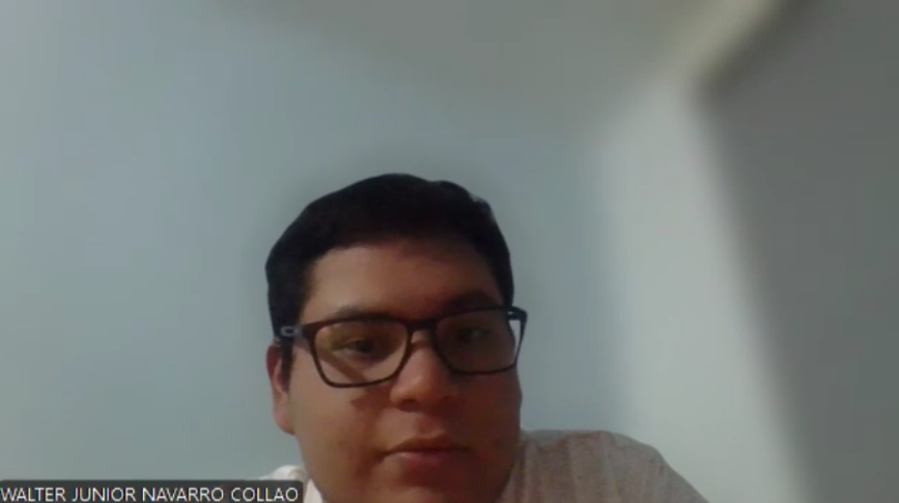  | 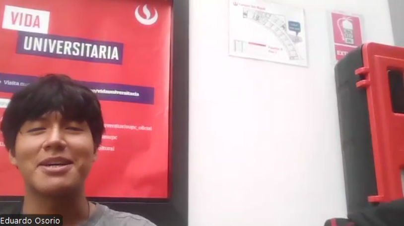  | 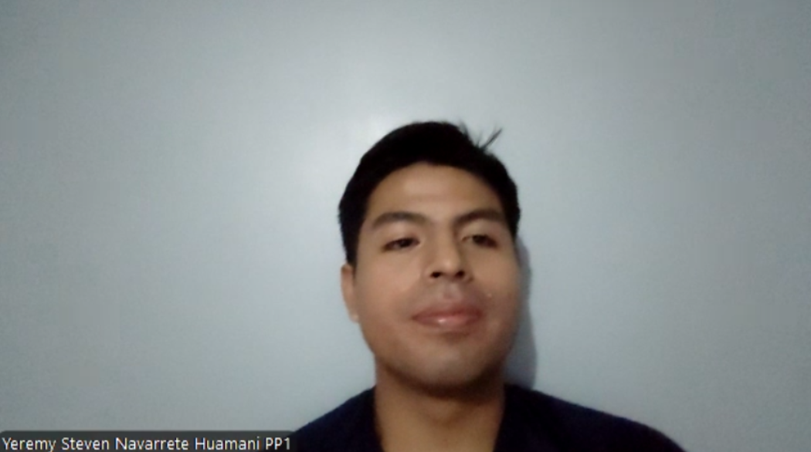  |
| **Nombre** | Walter Navarro | Jesús Arrollo                                                  | Yeremy Navarrete |
| **Edad** | 22 años | 28 años                                                        | 25 años |
| **Distrito** | Surco | San Martín de Porres                                           | Independencia |
| **Duración** |  |                                                                |  |

**Resumen – Walter Navarro**

La entrevista a Walter Navarro, de 22 años, deportista amateur que entrena aproximadamente cinco veces por semana, permitió conocer cómo determina actualmente si está preparado para realizar una sesión de entrenamiento. Utiliza un smartwatch para revisar algunos datos relacionados con su actividad física y toma sus decisiones principalmente según cómo se siente durante el día, su nivel de energía y el cansancio acumulado de sesiones anteriores. Sin embargo, reconoce que en ocasiones no puede determinar con precisión si se ha recuperado correctamente, llegando a sentirse bien al inicio y experimentar cansancio durante el entrenamiento. Además, considera que las aplicaciones actuales muestran demasiadas métricas y no siempre comprende qué significan o cómo utilizarlas. Cuando duerme mal, suele reducir la intensidad de manera intuitiva, sin contar con información objetiva que respalde esa decisión. Considera que una herramienta capaz de interpretar automáticamente sus datos y mostrarle su nivel de recuperación y el esfuerzo que debería realizar le ayudaría a tomar mejores decisiones sobre su entrenamiento.

**Resumen – Jesús Arrollo**

La entrevista a Jesús Arrollo, de 28 años, atleta semiprofesional que entrena diariamente y participa en competencias, permitió comprender cómo controla actualmente su rendimiento. Utiliza un reloj deportivo y registros de sus entrenamientos, tomando en cuenta la carga de trabajo, el cansancio y sus objetivos semanales para decidir la intensidad de cada sesión. Una de sus principales dificultades aparece después de entrenamientos intensos, ya que no siempre puede determinar con precisión si su cuerpo está completamente recuperado. Ha continuado entrenando incluso cuando se encontraba demasiado cansado, especialmente durante periodos previos a competencias. Aunque identifica el sobreentrenamiento mediante señales como disminución del rendimiento y fatiga prolongada, no siempre sabe cuánto debería reducir su carga cuando duerme mal o se encuentra fatigado. Considera que sería útil contar con una medida clara de recuperación acompañada de recomendaciones concretas que le permitan convertir los datos fisiológicos en decisiones para su entrenamiento.

**Resumen – Yeremy Navarrete**

La entrevista a Yeremy Navarrete, de 25 años, quien combina una jornada laboral exigente con una rutina regular de entrenamiento, permitió identificar las dificultades que presenta al gestionar su recuperación. Actualmente utiliza un reloj y una aplicación deportiva para realizar seguimiento de su actividad, aunque reconoce que normalmente solo revisa algunos datos y no aprovecha toda la información disponible. Para decidir cuánto entrenar se basa principalmente en su nivel de energía, cansancio y el tiempo disponible. Su principal dificultad consiste en determinar cómo influyen conjuntamente el trabajo, el sueño y el entrenamiento sobre su recuperación. En varias ocasiones ha realizado sus sesiones a pesar de sentirse cansado debido a que busca cumplir con su rutina. Cuando duerme mal, le resulta difícil decidir si debería disminuir la intensidad o descansar. Considera que una solución que integre sus datos de sueño, actividad y recuperación y que los convierta en una recomendación sencilla podría ayudarlo a organizar mejor su entrenamiento.

**Segundo Segmento Objetivo - Personas que buscan mejorar su bienestar general y su calidad de sueño (Wellness Seeker)**

**URL de todas las entrevistas del segmento:**

| Campo | Entrevista 1                                      | Entrevista 2                                      | Entrevista 3                                      |
|---|---------------------------------------------------|---------------------------------------------------|---------------------------------------------------|
| **Campo** | 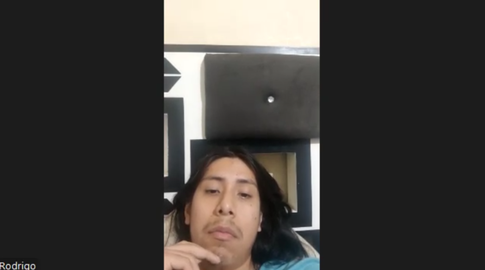  | 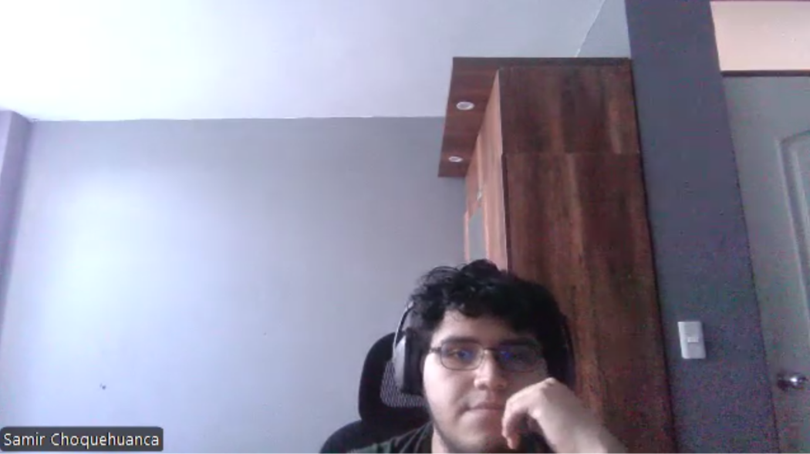  | 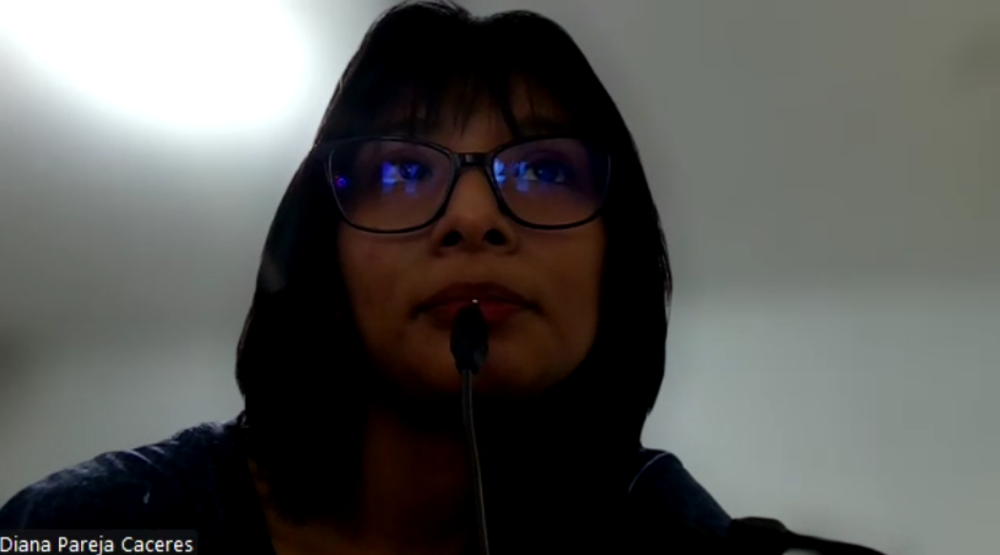  |
| **Nombre** | Rodrigo Colonio                                   | Alejandro Choquehuanca                            | Diana Pareja                                      |
| **Edad** | 22 años                                           | 27 años                                           | 24 años                                           |
| **Distrito** | San Miguel                                        | San Miguel                                        | San Miguel                                        |
| **Duración** |                                                   |                                                   |                                                   |

**Resumen – Rodrigo Colonio**

La entrevista a Rodrigo Colonio, de 22 años, quien presenta una jornada laboral extensa, permitió conocer cómo evalúa actualmente su descanso. Principalmente determina la calidad de su descanso según cómo se siente al despertar y utiliza ocasionalmente una aplicación para revisar su sueño, aunque normalmente solo presta atención a la cantidad de horas dormidas. Una de sus principales dificultades es identificar qué factores están provocando que duerma mal, ya que el estrés, los horarios de trabajo y la falta de sueño pueden presentarse al mismo tiempo. Cuando tiene periodos de mayor carga laboral, suele dormir menos y experimentar una peor recuperación. Aunque ha identificado que trabajar hasta tarde afecta su descanso, no cuenta con un seguimiento constante que le permita conocer con precisión esta relación. Considera que una herramienta que analice su información y le indique de manera sencilla qué factores están afectando su descanso y qué podría cambiar le sería de utilidad.

**Resumen – Alejandro Choquehuanca**

La entrevista a Alejandro Choquehuanca, de 27 años, quien combina sus estudios de posgrado con actividades laborales, permitió comprender las dificultades que presenta para mantener una rutina de descanso constante. Actualmente utiliza un smartwatch para revisar principalmente las horas y fases de sueño, aunque reconoce que algunas de las métricas que obtiene son difíciles de interpretar. Durante periodos de entregas o mayor carga académica, su nivel de estrés aumenta y suele dormir menos y con menor calidad. Cuando esto sucede, intenta compensar el descanso durante los fines de semana, pero sus decisiones se basan principalmente en su percepción personal. Considera que una herramienta que pueda explicarle sus datos de sueño y mostrarle si su descanso realmente fue suficiente podría ayudarlo a identificar cambios necesarios en su rutina.

**Resumen – Diana Pareja**

La entrevista a Diana Pareja, de 24 años, quien busca mejorar su bienestar y actualmente no realiza un seguimiento constante de su sueño, permitió identificar sus principales dificultades relacionadas con el descanso. Para determinar si ha descansado correctamente, se basa principalmente en su nivel de energía al despertar y en si presenta sueño durante el día. Su principal dificultad está relacionada con el estrés, ya que cuando atraviesa periodos de mayor presión laboral tiene problemas para dormir y suele despertarse cansado. Aunque reconoce que sus hábitos diarios influyen en la calidad de su sueño, no lleva un registro detallado que le permita identificar estas relaciones. En ocasiones ha utilizado aplicaciones de sueño, pero algunas métricas le han resultado confusas. Considera que una herramienta capaz de analizar continuamente sus datos fisiológicos y ofrecerle orientación personalizada sobre su descanso podría ayudarlo a comprender mejor su estado y realizar cambios en su rutina.

### 2.2.3. Análisis de entrevistas

### Segmento Objetivo 1: Usuarios con rutinas de entrenamiento o alta exigencia física

#### 1. Perfil y actividad física

- 100% realiza actividad física de manera frecuente y mantiene una rutina de entrenamiento constante.
- 33% participa en competencias y mantiene una rutina de entrenamiento diaria.
- 33% combina una rutina de entrenamiento exigente con una jornada laboral extensa.
- 100% considera su estado físico y nivel de energía para decidir cómo afrontar sus sesiones.

#### 2. Métodos actuales de seguimiento

- 100% utiliza algún dispositivo o aplicación para registrar información relacionada con su actividad física.
- 67% utiliza un smartwatch o reloj deportivo para consultar métricas de entrenamiento.
- 33% utiliza además registros de sus entrenamientos para controlar su rendimiento.
- 67% reconoce que no aprovecha o no comprende completamente toda la información proporcionada por sus dispositivos.

#### 3. Problemas comunes

- 100% tiene dificultades para determinar con certeza si está completamente recuperado antes de entrenar.
- 100% toma decisiones de entrenamiento considerando principalmente cómo se siente físicamente.
- 67% ha realizado entrenamientos estando demasiado cansado.
- 100% tiene dificultades para determinar qué intensidad debería utilizar cuando presenta fatiga o ha dormido mal.
- 67% identifica señales de sobreentrenamiento después de experimentar fatiga durante varios días o disminución del rendimiento.

#### 4. Interpretación de información fisiológica

- 67% considera que las métricas proporcionadas por sus dispositivos pueden ser difíciles de interpretar.
- 33% considera que algunas métricas requieren conocimientos adicionales para comprenderlas correctamente.
- 100% manifiesta la necesidad de convertir los datos obtenidos en información más clara para tomar decisiones sobre su entrenamiento.
- 67% considera útil recibir una interpretación directa de sus datos en lugar de revisar únicamente valores o métricas.

#### 5. Recuperación y descanso

- 100% considera importante conocer su nivel de recuperación antes de realizar una sesión de entrenamiento.
- 67% tiene dificultades para determinar cómo afecta la falta de sueño a su capacidad para entrenar.
- 33% señala que el estrés laboral también influye en su recuperación.
- 100% utiliza principalmente su percepción personal para decidir si debe reducir la intensidad o descansar.

#### 6. Información deseada

- 100% desea conocer de manera más clara su nivel de recuperación antes de entrenar.
- 67% quiere conocer cuánto esfuerzo puede realizar de acuerdo con su estado actual.
- 33% desea conocer cómo influyen conjuntamente el sueño, trabajo y entrenamiento sobre su recuperación.
- 100% considera útil recibir recomendaciones concretas en lugar de únicamente visualizar métricas.

#### 7. Personalización y toma de decisiones

- 100% considera que sus decisiones actuales dependen en gran medida de su percepción personal.
- 100% muestra interés en contar con recomendaciones adaptadas a su estado físico.
- 67% considera que una herramienta que interprete automáticamente sus datos podría ayudarlo a tomar mejores decisiones.
- 100% busca mejorar la relación entre esfuerzo, recuperación y descanso.

#### 8. Necesidades para la adopción

- 100% considera importante que la información sea clara y fácil de interpretar.
- 100% valoraría una solución que reduzca la necesidad de analizar manualmente múltiples métricas.
- 100% considera útil recibir orientación sobre cuándo entrenar, reducir la intensidad o descansar.

### Segmento Objetivo 2: Personas que buscan mejorar su bienestar general y calidad de sueño

#### 1. Perfil y contexto

- 100% tiene responsabilidades laborales o académicas que pueden afectar su descanso.
- 67% señala que el estrés influye directamente en su calidad de sueño.
- 33% presenta horarios variables debido a la combinación de trabajo y estudios.
- 33% mantiene una jornada laboral extensa como uno de los principales factores que afectan su descanso.

#### 2. Métodos actuales de seguimiento

- 67% utiliza algún dispositivo o aplicación para realizar seguimiento de su sueño.
- 33% realiza un seguimiento ocasional mediante una aplicación.
- 33% utiliza un smartwatch para consultar horas y fases del sueño.
- 33% no realiza un seguimiento constante de su sueño.
- 100% utiliza principalmente su percepción personal para determinar si ha descansado adecuadamente.

#### 3. Problemas comunes

- 100% tiene dificultades para determinar con precisión por qué algunos días descansa peor que otros.
- 100% relaciona su calidad de sueño con factores como estrés, trabajo, estudios u horarios.
- 67% reconoce que los datos proporcionados por las aplicaciones o dispositivos no siempre son fáciles de interpretar.
- 100% considera que actualmente no cuenta con suficiente información para comprender completamente su estado de descanso.

#### 4. Influencia del estrés y la rutina

- 100% identifica factores externos de su rutina que afectan su descanso.
- 67% señala específicamente al estrés como un factor que empeora su sueño.
- 33% señala los horarios variables como una dificultad para mantener una rutina de descanso.
- 33% indica que trabajar hasta tarde afecta negativamente la calidad de su sueño.

#### 5. Seguimiento de la calidad del sueño

- 100% utiliza principalmente la cantidad de energía al despertar como indicador de un buen o mal descanso.
- 67% revisa algún tipo de métrica relacionada con las horas o fases del sueño.
- 33% solo revisa principalmente la cantidad de horas dormidas.
- 100% considera que conocer únicamente las horas de sueño no es suficiente para comprender completamente su descanso.

#### 6. Interpretación de datos

- 67% considera que algunas métricas de sueño son difíciles de interpretar.
- 100% considera que obtener los datos no necesariamente significa saber qué hacer con ellos.
- 67% quisiera recibir una explicación de los datos obtenidos.
- 100% muestra interés en recibir recomendaciones que permitan convertir la información recopilada en acciones concretas.

#### 7. Información deseada

- 100% desea conocer si su descanso fue realmente suficiente.
- 67% quiere identificar qué factores están afectando su calidad de sueño.
- 33% quiere comprender mejor la relación entre sus hábitos diarios y su descanso.
- 100% considera útil recibir orientación sobre qué cambios podría realizar en su rutina.

#### 8. Personalización y bienestar

- 100% considera que sus necesidades de descanso dependen de su situación y rutina personal.
- 100% muestra interés en recibir recomendaciones adaptadas a su propio estado.
- 100% busca reducir la incertidumbre respecto a su descanso y bienestar diario.
- 67% considera que una herramienta capaz de analizar continuamente sus datos podría ayudarlo a comprender mejor su estado fisiológico.

## 2.3. Needfinding

### 2.3.1. User Personas

### **Primer Segmento Objetivo - Usuarios con rutinas de entrenamiento o alta exigencia física (Deportistas)**

### Entrevista 1

**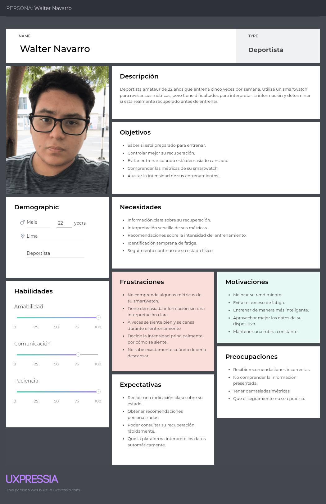 **

### Walter Navarro

Walter Navarro es un deportista amateur de 22 años de Lima que entrena cinco veces por semana y utiliza un smartwatch para revisar sus métricas. Busca saber si está preparado para entrenar, controlar mejor su recuperación, evitar el exceso de fatiga y ajustar la intensidad de sus sesiones. Necesita información clara sobre su recuperación, una interpretación sencilla de sus métricas, recomendaciones sobre la intensidad e identificación temprana de fatiga. Se frustra porque recibe demasiada información, algunas métricas son difíciles de comprender y no sabe exactamente cuándo debería descansar. Espera recibir indicaciones claras y recomendaciones personalizadas que le permitan entrenar de manera más inteligente.

### Entrevista 2

**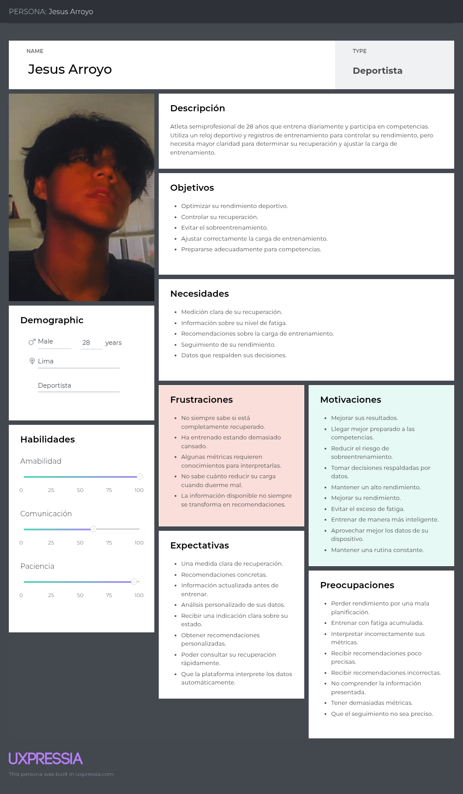 **

### Jesús Arroyo

Jesús Arroyo es un atleta semiprofesional de 28 años de Lima que entrena diariamente y participa en competencias. Utiliza un reloj deportivo y registros de entrenamiento para controlar su rendimiento, pero necesita mayor claridad para determinar su recuperación y ajustar su carga de entrenamiento. Sus objetivos son optimizar su rendimiento, evitar el sobreentrenamiento y prepararse adecuadamente para las competencias. Se frustra porque no siempre sabe si está completamente recuperado, ha entrenado estando cansado y algunas métricas requieren conocimientos para interpretarlas. Espera obtener una medida clara de recuperación, análisis personalizado y recomendaciones concretas que respalden sus decisiones.

### Entrevista 3

**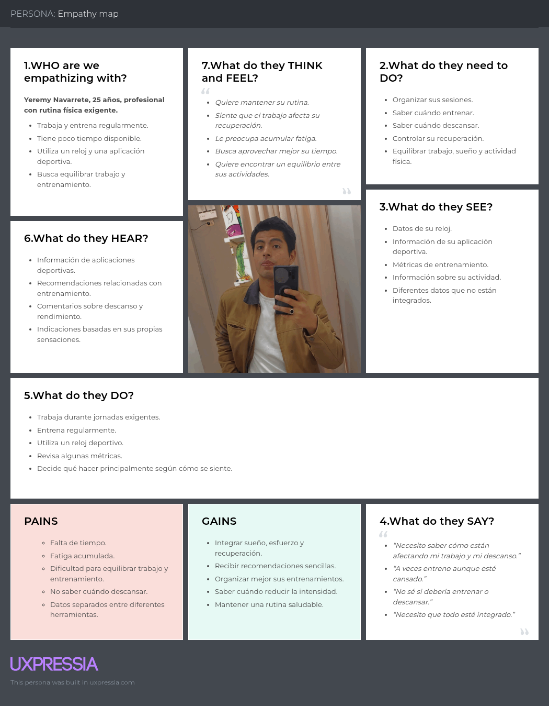 **

### Yeremy Navarrete

Yeremy Navarrete es un deportista de 25 años de Lima que combina una jornada laboral exigente con una rutina regular de entrenamiento y utiliza un reloj y una aplicación deportiva. Busca mantener su condición física, equilibrar el trabajo con la actividad física, controlar su recuperación y organizar mejor sus sesiones. Necesita integrar información sobre sueño, esfuerzo y recuperación, además de identificar la fatiga y recibir orientación sobre cuándo reducir la intensidad. Su principal frustración es no saber si debería entrenar o descansar, especialmente cuando el trabajo y el sueño afectan su recuperación. Espera tener sus datos integrados y recibir recomendaciones sencillas para tomar mejores decisiones sobre su entrenamiento.

### **Segundo Segmento Objetivo - Personas que buscan mejorar su bienestar general y su calidad de sueño (Wellness Seeker)**

### Entrevista 1

**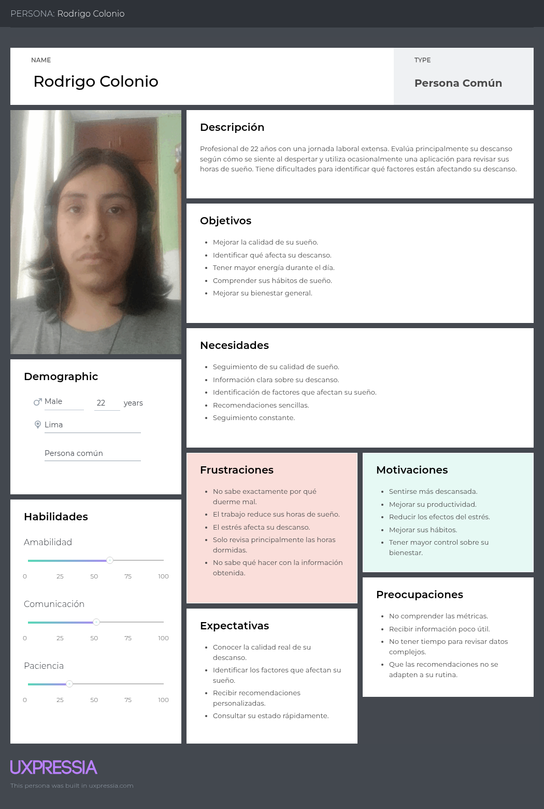 **

### Rodrigo Colonio

Rodrigo Colonio es un profesional de 22 años de Lima con una jornada laboral extensa que evalúa su descanso principalmente según cómo se siente al despertar. Busca mejorar la calidad de su sueño, identificar qué factores afectan su descanso, tener mayor energía y mejorar su bienestar general. Necesita realizar un seguimiento constante y recibir información clara y recomendaciones sencillas. Se frustra porque no siempre sabe por qué duerme mal, el trabajo y el estrés afectan su descanso y no sabe cómo utilizar la información obtenida. Espera conocer la calidad real de su descanso y recibir recomendaciones personalizadas que se adapten a su rutina.

### Entrevista 2

**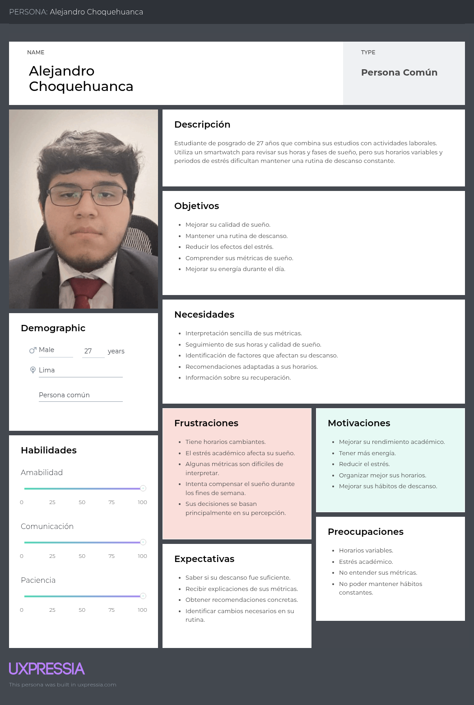 **

### Alejandro Choquehuanca

Alejandro Choquehuanca es un estudiante de posgrado de 27 años de Lima que combina sus estudios con actividades laborales y utiliza un smartwatch para revisar sus horas y fases de sueño. Busca mejorar su calidad de sueño, reducir el estrés, mantener una rutina de descanso y tener más energía durante el día. Necesita interpretar fácilmente sus métricas, identificar los factores que afectan su descanso y recibir recomendaciones adaptadas a sus horarios. Sus principales frustraciones son los horarios cambiantes, el estrés académico y la dificultad para comprender algunas métricas. Espera saber si su descanso fue suficiente y recibir explicaciones y recomendaciones concretas.

### Entrevista 3

**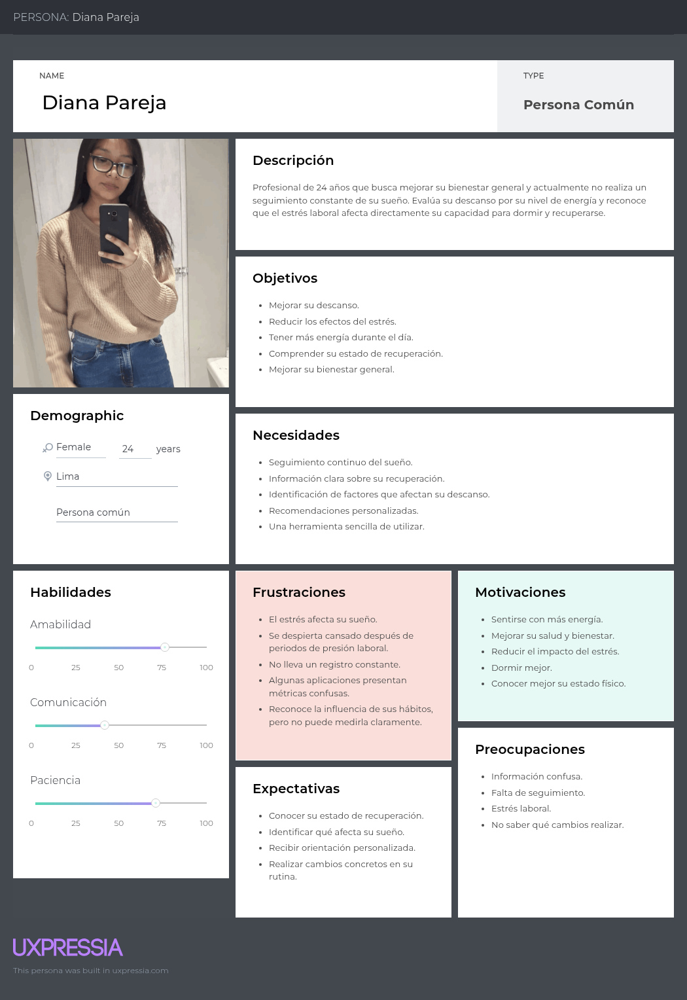 **

### Diana Pareja

Diana Pareja es una profesional de 24 años de Lima que busca mejorar su bienestar general y actualmente no realiza un seguimiento constante de su sueño. Su principal objetivo es mejorar su descanso, reducir los efectos del estrés, tener más energía y comprender mejor su estado de recuperación. Necesita información clara sobre su sueño y recomendaciones personalizadas, pero se frustra porque el estrés laboral afecta su descanso y algunas métricas son difíciles de interpretar. Espera recibir orientación sencilla que le permita identificar qué factores afectan su sueño y realizar cambios concretos en su rutina.

### 2.3.2. User Task Matrix

### **Segmento objetivo 1: Usuarios con rutinas de entrenamiento o alta exigencia física**

| **User Task** | **Frecuencia** | **Importancia** |
|---|---|---|
| Revisar su nivel de recuperación. | Alta | Alta |
| Consultar sus métricas de entrenamiento. | Alta | Alta |
| Decidir la intensidad del entrenamiento. | Alta | Alta |
| Identificar fatiga o falta de recuperación. | Media | Alta |
| Ajustar el entrenamiento según su estado. | Media | Alta |
| Revisar su evolución. | Media | Media |

### **Segmento objetivo 2: Personas que buscan mejorar su bienestar general y calidad de sueño**

| **User Task** | **Frecuencia** | **Importancia** |
|---|---|---|
| Revisar la calidad de su sueño. | Alta | Alta |
| Consultar sus métricas de descanso. | Alta | Alta |
| Identificar factores que afectan su sueño. | Media | Alta |
| Evaluar su nivel de recuperación. | Alta | Alta |
| Ajustar sus hábitos de descanso. | Media | Alta |
| Revisar su evolución. | Media | Media |

### 2.3.3. User Journey Mapping

### **Primer Segmento Objetivo - Usuarios con rutinas de entrenamiento o alta exigencia física (Deportistas)**

**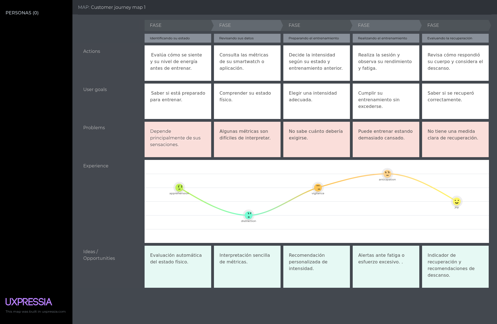 **
El User Journey Map del usuario resume su experiencia en cinco etapas relacionadas con la gestión de su descanso. En Revisando su descanso, observa cómo se siente al despertar y cuánto durmió, buscando saber si realmente descansó bien, aunque depende principalmente de sus propias sensaciones. En Analizando sus datos, consulta las métricas disponibles para comprender la calidad de su sueño, pero encuentra dificultades para interpretar algunos indicadores. Durante Identificando factores, intenta relacionar su descanso con el estrés, trabajo y hábitos, pero no logra determinar con claridad qué factores afectan su sueño. En Ajustando sus hábitos, cambia horarios y rutinas para mejorar su descanso, aunque existe incertidumbre sobre qué cambios tendrán mayor impacto. Finalmente, en Evaluando su bienestar, analiza su energía y descanso durante el día con el objetivo de mejorar su bienestar, pero no cuenta con un seguimiento constante de su recuperación; abriendo así oportunidades para brindar un resumen de su descanso, explicaciones sencillas de las métricas, identificación de factores, recomendaciones personalizadas y seguimiento de su evolución y bienestar.

### **Segundo Segmento Objetivo - Personas que buscan mejorar su bienestar general y su calidad de sueño (Wellness Seeker)**

**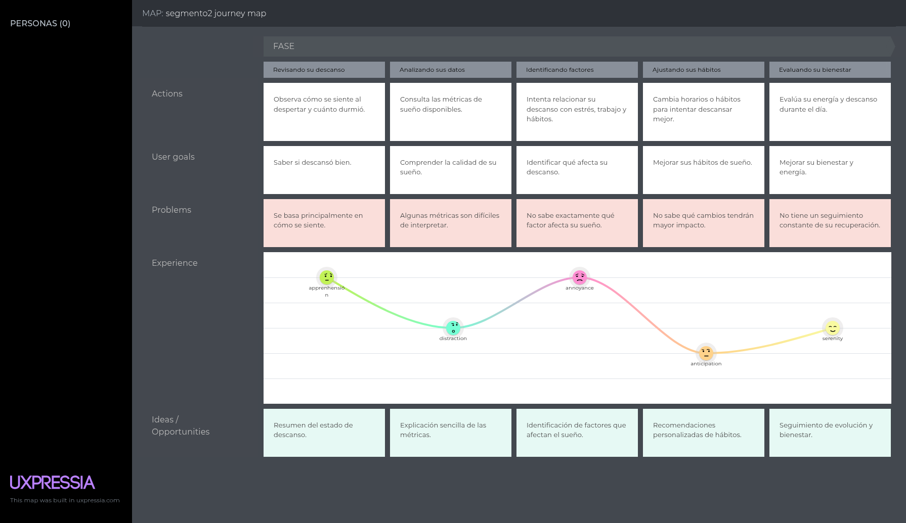 **
El User Journey Map del usuario resume su experiencia en cinco etapas relacionadas con el descanso y bienestar. En Revisando su descanso, observa cómo se siente al despertar y cuánto durmió, pero enfrenta la dificultad de basarse principalmente en sus propias sensaciones. En Analizando sus datos, consulta sus métricas de sueño para comprender su calidad de descanso, aunque algunas métricas pueden ser difíciles de interpretar. Durante Identificando factores, intenta relacionar su descanso con el estrés, trabajo y hábitos, pero existe incertidumbre sobre qué factores afectan realmente su sueño. En Ajustando sus hábitos, modifica horarios y rutinas buscando descansar mejor, pero no sabe qué cambios tendrán mayor impacto. Finalmente, en Evaluando su bienestar, analiza su energía y descanso durante el día, buscando mejorar su bienestar, aunque carece de un seguimiento constante de su recuperación; abriendo así la oportunidad de ofrecer un resumen claro del descanso, explicaciones sencillas de las métricas, identificación de factores, recomendaciones personalizadas y seguimiento de su evolución y bienestar.

### 2.3.4. Empathy Mapping

### **Primer Segmento Objetivo - Usuarios con rutinas de entrenamiento o alta exigencia física (Deportistas)**

### Entrevista 1

**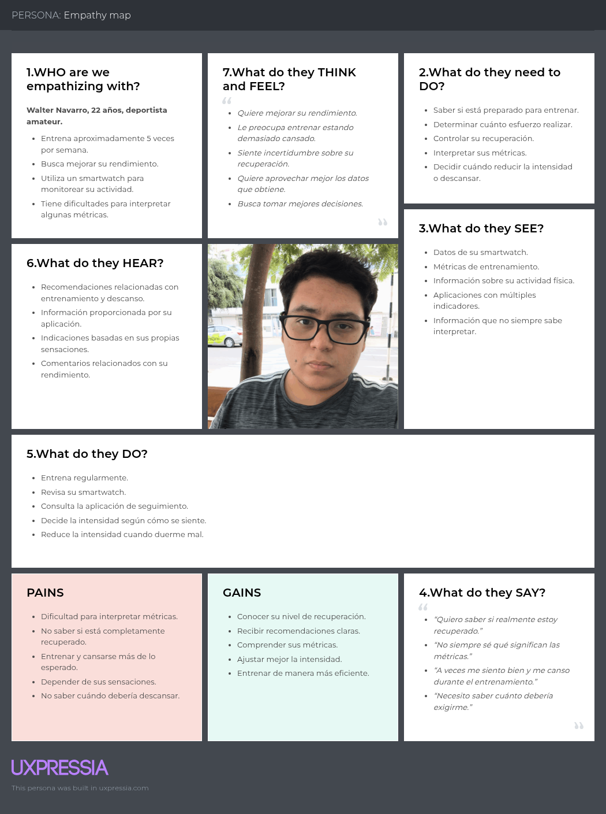 **

### Walter Navarro

Walter Navarro es un deportista amateur de 22 años que entrena aproximadamente cinco veces por semana y utiliza un smartwatch para monitorear su actividad. Busca mejorar su rendimiento y saber si está preparado para entrenar, pero tiene dificultades para interpretar sus métricas y determinar cuándo debería descansar. Necesita información clara sobre su recuperación, esfuerzo y fatiga, además de recomendaciones sobre la intensidad de sus entrenamientos. Sus principales frustraciones son la dificultad para interpretar los datos y depender de sus propias sensaciones. Espera recibir recomendaciones claras y personalizadas que le permitan entrenar de manera más eficiente.

### Entrevista 2

**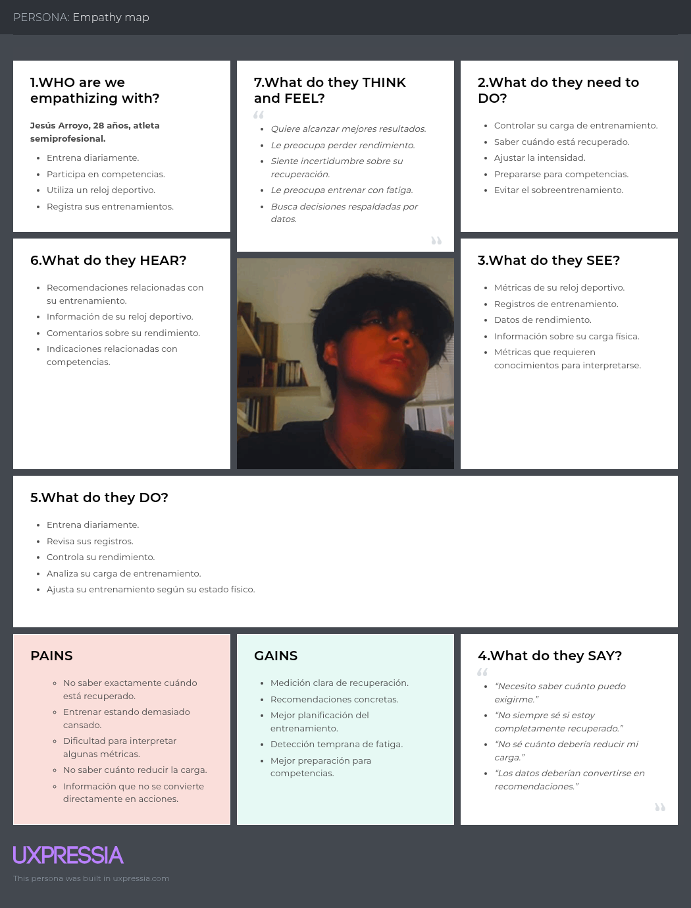 **

### Jesús Arroyo

Jesús Arroyo es un atleta semiprofesional de 28 años que entrena diariamente y participa en competencias. Utiliza un reloj deportivo y registra sus entrenamientos para controlar su rendimiento, pero no siempre sabe cuándo está completamente recuperado ni cuánto puede exigirse. Necesita controlar su carga de entrenamiento, ajustar la intensidad, detectar la fatiga y evitar el sobreentrenamiento. Le preocupa entrenar estando demasiado cansado y que sus métricas no se conviertan en acciones concretas. Busca obtener una medición clara de su recuperación y recomendaciones que le ayuden a tomar decisiones respaldadas por sus datos.

### Entrevista 3

** **

### Yeremy Navarrete

Yeremy Navarrete es un profesional de 25 años con una rutina de actividad física exigente que combina trabajo y entrenamiento regular. Utiliza un reloj y una aplicación deportiva, pero tiene poco tiempo disponible y dificultad para integrar la información sobre sueño, esfuerzo y recuperación. Necesita organizar sus sesiones, saber cuándo entrenar o descansar y mantener un equilibrio entre trabajo y actividad física. Sus principales frustraciones son la fatiga acumulada, la falta de tiempo y los datos separados entre diferentes herramientas. Espera integrar toda su información y recibir recomendaciones sencillas que le permitan controlar mejor su recuperación y mantener una rutina saludable.

### **Segundo Segmento Objetivo - Personas que buscan mejorar su bienestar general y su calidad de sueño (Wellness Seeker)**

### Entrevista 1

**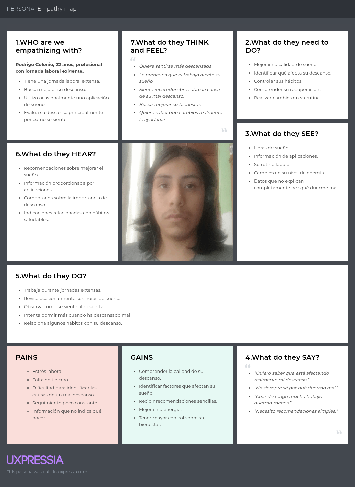 **

### Rodrigo Colonio

Rodrigo Colonio es un profesional de 22 años con una jornada laboral extensa que busca mejorar su descanso y bienestar. Utiliza ocasionalmente una aplicación para revisar sus horas de sueño y evalúa principalmente su descanso según cómo se siente al despertar. Necesita comprender la calidad de su sueño, identificar los factores que lo afectan y recibir recomendaciones sencillas. Sus principales frustraciones son el estrés laboral, la falta de tiempo y no saber exactamente por qué duerme mal. Espera obtener información clara sobre su descanso y recomendaciones personalizadas que le permitan mejorar sus hábitos y tener mayor control sobre su bienestar.

### Entrevista 2

**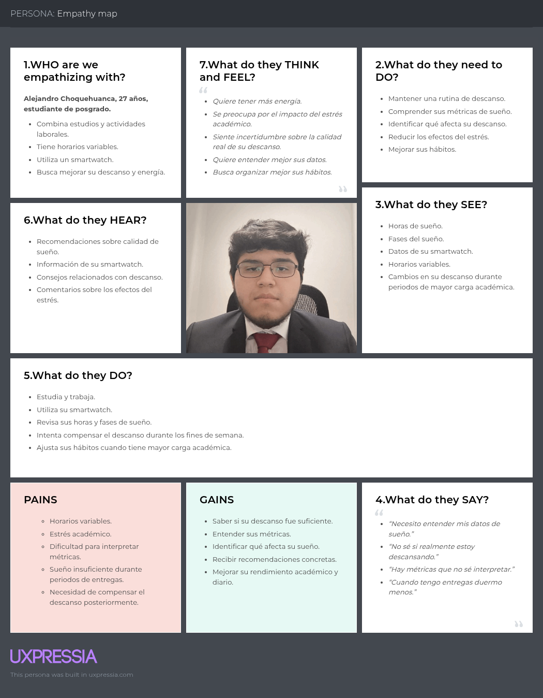 **

### Alejandro Choquehuanca

Alejandro Choquehuanca es un estudiante de posgrado de 27 años que combina sus estudios con actividades laborales y utiliza un smartwatch para revisar sus horas y fases de sueño. Tiene horarios variables y períodos de mayor carga académica que afectan su descanso. Necesita mantener una rutina de descanso, comprender sus métricas, identificar qué factores afectan su sueño y reducir los efectos del estrés. Sus principales frustraciones son los horarios cambiantes, el estrés académico y la dificultad para interpretar algunas métricas. Espera saber si realmente está descansando lo suficiente, entender mejor sus datos y recibir recomendaciones concretas para mejorar sus hábitos y rendimiento diario.

### Entrevista 3

**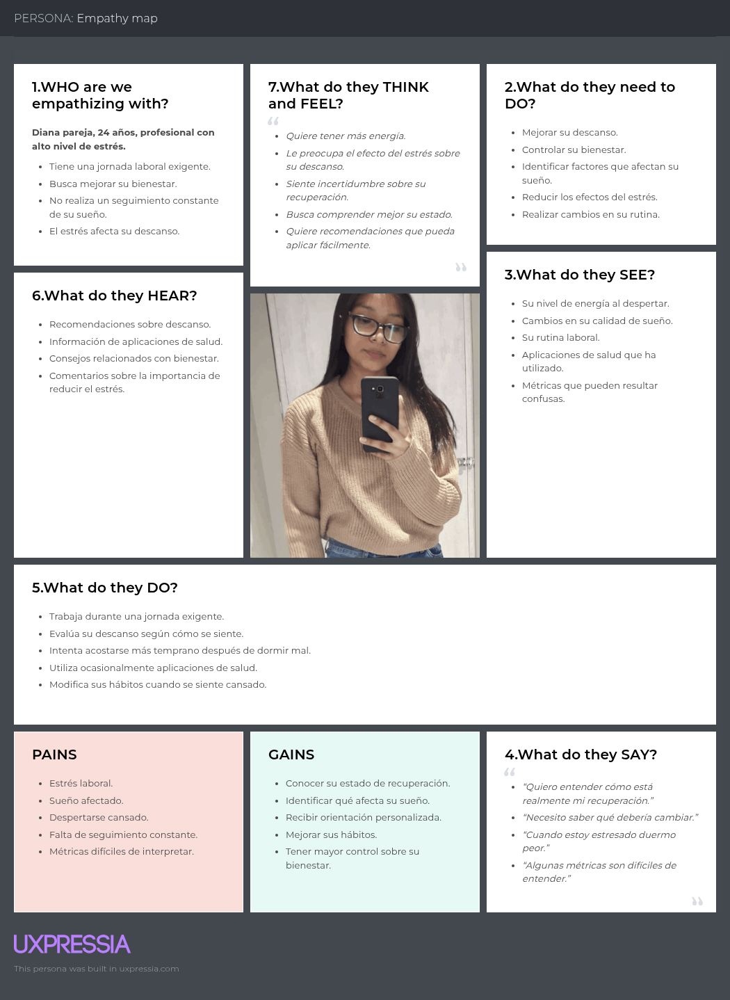 **

### Diana Pareja

Diana Pareja es una profesional de 24 años con una jornada laboral exigente que busca mejorar su bienestar y descanso. Actualmente no realiza un seguimiento constante de su sueño y evalúa principalmente su descanso según cómo se siente. Necesita controlar su bienestar, identificar los factores que afectan su sueño, reducir los efectos del estrés y realizar cambios en su rutina. Sus principales frustraciones son el estrés laboral, despertarse cansada, la falta de seguimiento y la dificultad para interpretar algunas métricas. Espera comprender mejor su recuperación, identificar qué afecta su sueño y recibir orientación personalizada para mejorar sus hábitos y bienestar.

## 2.4. Big Picture EventStorming

**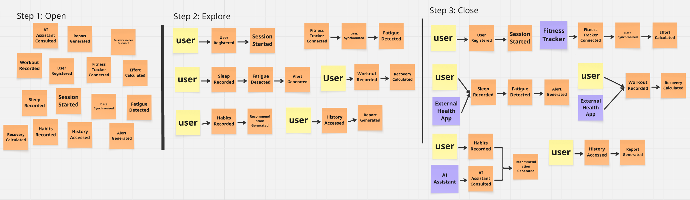 **

## 2.5. Ubiquitous Language

- **Athlete (Deportista):** Usuario que mantiene una rutina de entrenamiento y utiliza información sobre esfuerzo, recuperación y descanso para organizar sus actividades físicas.
- **Wellness Seeker (Persona enfocada en bienestar):** Usuario que busca mejorar su bienestar general y calidad de sueño mediante la comprensión de sus registros y hábitos de descanso.
- **Physiological Data (Datos fisiológicos):** Información obtenida a partir de la pulsera compatible sobre el sueño, esfuerzo y recuperación del usuario.
- **Recovery Level (Nivel de recuperación):** Indicador que representa el estado de recuperación física del usuario y sirve para decidir si debe entrenar, reducir la intensidad o descansar.
- **Sleep Quality (Calidad del sueño):** Medida utilizada para evaluar qué tan adecuado ha sido el descanso del usuario.
- **Sleep Metrics (Métricas de sueño):** Datos registrados durante el periodo de descanso, como duración y fases del sueño.
- **Training Load (Carga de entrenamiento):** Nivel de esfuerzo acumulado generado por las actividades físicas realizadas por el usuario.
- **Effort (Esfuerzo):** Indicador que representa la exigencia física asociada a las actividades o sesiones de entrenamiento.
- **Recovery (Recuperación):** Proceso mediante el cual el organismo se recupera después de realizar actividad física, considerando factores como el esfuerzo y el descanso.
- **Compatible Wearable (Pulsera compatible):** Dispositivo conectado utilizado para registrar y sincronizar los datos fisiológicos del usuario con PulsePower.
- **Personalized Recommendation (Recomendación personalizada):** Orientación generada a partir de los datos, historial y objetivos del usuario para ayudarlo a tomar decisiones sobre entrenamiento, descanso o hábitos.
- **AI Conversational Assistant (Asistente conversacional con IA):** Funcionalidad que permite al usuario consultar sus indicadores mediante lenguaje cotidiano y recibir explicaciones sobre sus datos fisiológicos.