# Capítulo II: Requirements Elicitation & Analysis
## 2.1. Competidores
Para el análisis de competidores se priorizó la identificación de soluciones digitales con un modelo de negocio similar al de PulsePower: plataformas de inteligencia fisiológica que, a partir de un dispositivo conectado, traducen de forma continua señales del cuerpo humano en información personalizada sobre recuperación, esfuerzo y descanso. Se consideraron competidores directos de alcance internacional, cuya propuesta de valor es comparable a la de PulsePower.

Los competidores identificados son:
- WHOOP (Estados Unidos): pulsera sin pantalla que monitorea de forma continua la variabilidad de la frecuencia cardíaca, el sueño y el esfuerzo, bajo un modelo de membresía que incluye el dispositivo.
- Oura Ring (Finlandia / Estados Unidos): anillo inteligente que traduce datos de sueño, actividad y disposición en puntuaciones diarias, con un asesor de salud asistido por IA.
- Garmin Connect+ (Estados Unidos): suscripción premium dentro del ecosistema Garmin que añade inteligencia artificial (Active Intelligence) a los datos de sueño, recuperación y entrenamiento de los relojes Garmin.

### 2.1.1. Análisis competitivo

**¿Por qué llevar a cabo este análisis?** Para comparar PulsePower con las principales soluciones de monitoreo fisiológico y bienestar disponibles en el mercado, e identificar fortalezas, debilidades y oportunidades que permitan diferenciar a PulsePower y posicionarlo frente a sus competidores. En la columna de PulsePower, las ventajas y fortalezas descritas corresponden a la propuesta de valor del producto y deberán confirmarse durante la validación con usuarios.

|  |  | 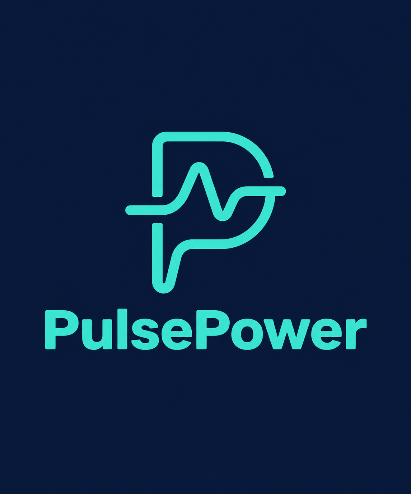 PulsePower | 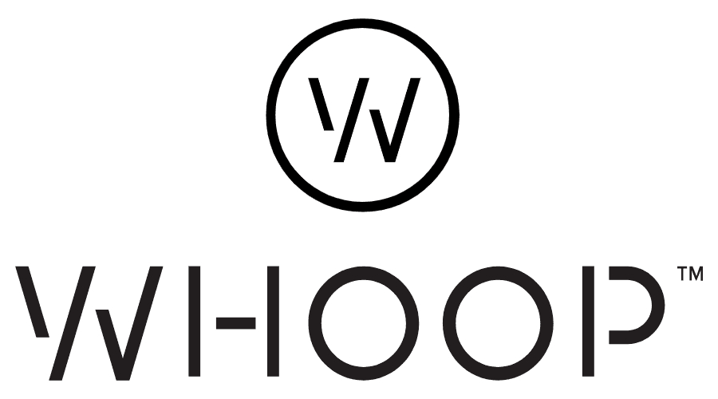 WHOOP |  Oura Ring | 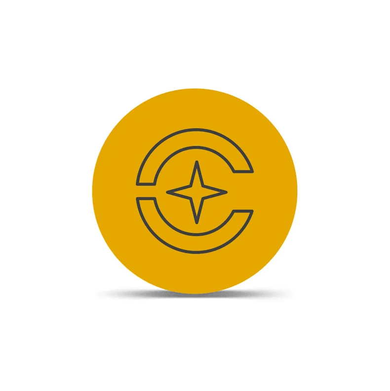 Garmin Connect+ |
|---|---|---|---|---|---|
| **Perfil** | **Overview** | Startup universitaria que desarrolla una plataforma web de inteligencia fisiológica con IA. Integra los datos de la pulsera compatible que el usuario ya utiliza y traduce sus señales (VFC, sueño, esfuerzo y recuperación) en recomendaciones personalizadas de entrenamiento y descanso, sostenida mediante una suscripción de software. | Pulsera sin pantalla de monitoreo continuo 24/7 (VFC, sueño, esfuerzo, recuperación, frecuencia respiratoria, SpO2 y temperatura), con modelo 100 % por membresía: el dispositivo se entrega incluido dentro de la suscripción, sin pago separado por hardware. | Anillo inteligente que entrega puntuaciones diarias de sueño, actividad y disposición (readiness), además de métricas de estrés, salud cardiovascular y salud de la mujer, bajo un modelo híbrido de compra del anillo más suscripción mensual o anual. | Capa premium (Active Intelligence) sobre el ecosistema Garmin Connect ya existente, que interpreta con IA los datos de sueño, recuperación y carga de entrenamiento de los relojes Garmin, manteniendo gratuitas las métricas básicas de salud. |
| | **Ventaja competitiva ¿Qué valor ofrece a los clientes?** | Propuesta de valor por validar: explicaciones claras de los indicadores y un asistente conversacional con IA que ayuda al usuario a proyectar su recuperación y ajustar su rutina, en lugar de limitarse a mostrar su estado actual. No exige comprar un dispositivo nuevo. Valor para el cliente: autoconocimiento continuo, decisiones de entrenamiento y descanso respaldadas por datos objetivos y menor riesgo de sobreentrenamiento. | Modelo "todo incluido" por membresía sin costo de hardware separado; foco exclusivo en recuperación y prevención del sobreentrenamiento, respaldado por atletas de élite. Puntuación diaria de recuperación (0-100 %), recomendaciones de cuándo entrenar o descansar, análisis detallado del sueño y coaching de fuerza. | Formato de anillo discreto y cómodo frente a pulseras y relojes; asesor de salud asistido por IA (Oura Advisor) con enfoque en longevidad. Puntuaciones diarias claras, información sobre edad cardiovascular y resiliencia al estrés, y comparativas de tendencias de salud a largo plazo. | No exige comprar un dispositivo nuevo si el usuario ya tiene un reloj Garmin; se apoya en un ecosistema deportivo maduro con GPS y funciones multideporte. Resúmenes diarios de descanso y recuperación, información específica tras cada sesión y recomendaciones de sueño con gamificación (medallas y desafíos). |
| **Perfil de Marketing** | **Mercado objetivo** | Deportistas amateurs y semiprofesionales con rutinas de entrenamiento exigentes (18 a 60 años) y personas que buscan mejorar su bienestar y su calidad de sueño (20 a 55 años), en zonas urbanas del Perú. | Atletas de élite y deportistas con alta exigencia física, con alcance global (EE. UU. e internacional). | Personas orientadas al bienestar general, el sueño y la longevidad; alcance internacional y perfil más amplio que el estrictamente deportivo. | Usuarios ya integrados al ecosistema Garmin: corredores, ciclistas y deportistas de resistencia con dispositivo propio. |
| | **Estrategias de marketing** | Alianzas con gimnasios, clubes y comunidades de bienestar, marketing de contenido sobre fisiología del rendimiento y del descanso, y programa de referidos apoyado en la gamificación de la plataforma. | Patrocinio de atletas profesionales, prueba gratuita del primer mes y una comunidad activa de usuarios que comparte experiencias. | Posicionamiento como accesorio premium orientado al bienestar y la longevidad, con primer mes de suscripción gratuito para nuevos miembros. | Prueba gratuita para usuarios existentes del ecosistema, comunicando la IA como una capa adicional sobre datos ya conocidos. |
| **Perfil de Producto** | **Productos & Servicios** | Landing Page y aplicación web integradas con la pulsera compatible del usuario (mediante AIoTI), con indicadores de sueño, esfuerzo y recuperación, recomendaciones personalizadas, alertas, asistente conversacional con IA, reportes de progreso y gamificación. | Pulsera WHOOP + app, con coaching de IA (WHOOP Coach) y funciones de laboratorio para biomarcadores (Advanced Labs). | Anillo Oura + app, con asesor de salud asistido por IA (Oura Advisor). | App Garmin Connect + suscripción Connect+ con Active Intelligence, contenido de Garmin Coach, LiveTrack avanzado y gamificación. |
| | **Precios & Costos** | Sin venta de hardware. Propuesta inicial de planes: Basic (USD 19 al mes) y Pro (USD 49 al mes), con opción de facturación anual. Los precios definitivos se ajustarán según la disposición de pago observada en la validación. | Membresía anual que incluye el dispositivo: One (USD 199), Peak (USD 239) y Life (USD 359). | Anillo desde USD 349 hasta USD 499 (pago único) más suscripción de USD 5.99 al mes o USD 69.99 al año. | Suscripción Connect+ de USD 6.99 al mes o USD 69.99 al año, adicional al costo del reloj Garmin, que se compra por separado. |
| | **Canales de distribución (Web y/o Móvil)** | Web: Landing Page y aplicación web responsive, accesibles desde computadoras, tabletas y teléfonos. | Aplicación móvil (Android/iOS) con venta directa en línea del dispositivo, incluido dentro de la membresía. | Aplicación móvil (Android/iOS) con venta directa en línea del anillo y en tiendas minoristas. | Aplicación móvil (Android/iOS) y web vinculada a hardware Garmin adquirido por separado en tiendas físicas y en línea. |
| **Análisis SWOT** | **Fortalezas** | No exige comprar un dispositivo nuevo; enfoque en explicar los indicadores en lenguaje sencillo; atención a dos segmentos (rendimiento y bienestar) con una misma plataforma; gamificación orientada a la fidelización. | Modelo todo incluido sin pago de hardware separado; comunidad y respaldo de atletas de élite; funciones con autorización médica (ECG) en su versión WHOOP MG. | Formato de anillo discreto y de alta adopción; marca líder en anillos inteligentes; enfoque diferenciado en longevidad y salud de la mujer. | Ecosistema deportivo maduro con base de usuarios ya instalada; mantiene el monitoreo básico de salud de forma gratuita, lo que reduce la fricción de adopción. |
| | **Debilidades** | Producto en fase de validación, sin usuarios reales ni reconocimiento de marca; depende de la integración con pulseras de terceros mediante AIoTI; el valor del asistente de IA aún no ha sido demostrado. | Costo total de propiedad alto en el tiempo, al depender por completo de la membresía; ausencia de pantalla, que no conviene a quienes prefieren ver sus datos en el propio dispositivo. | Suscripción obligatoria para acceder a las métricas avanzadas, lo que ha generado críticas; competidores sin cuota mensual (RingConn, Galaxy Ring) ganan terreno. | Exige poseer previamente un dispositivo Garmin, lo que añade una barrera de entrada de hardware; algunos usuarios perciben las funciones de IA como una capa superficial sobre métricas ya existentes. |
| | **Oportunidades** | Crecimiento del uso de wearables en el Perú (989 350 smartwatches importados en 2024, 12,06 % más que en 2023); ausencia de un competidor local consolidado. | Expansión de funciones médicas (Advanced Labs) y del mercado wearable de recuperación. | Crecimiento acelerado del mercado de anillos inteligentes. | Base de usuarios existente dispuesta a pagar por capas adicionales de IA sobre su dispositivo actual. |
| | **Amenazas** | Ingreso de marcas internacionales consolidadas (WHOOP, Oura, Garmin) al mercado peruano; asistentes de IA incorporados por los propios fabricantes; adopción tecnológica limitada en algunos segmentos. | Plataformas que interpretan los datos de dispositivos que el usuario ya posee, sin exigir una membresía con hardware propio. | Alternativas sin suscripción mensual que reducen el costo total para el usuario. | Plataformas de inteligencia fisiológica compatibles con distintas marcas, que no dependen de comprar un reloj deportivo específico. |

### 2.1.2. Estrategias y tácticas frente a competidores

Con base en el análisis competitivo, PulsePower plantea las siguientes estrategias y tácticas preliminares, cuya viabilidad se evaluará durante la investigación y validación del producto.

#### Estrategias

- **Diferenciación mediante la comprensión de los indicadores:** PulsePower buscará destacar frente a competidores que ya incorporan funciones de inteligencia artificial mediante explicaciones claras y útiles de los indicadores fisiológicos, que faciliten su comprensión y su aplicación en la toma de decisiones.

- **Transparencia comercial:** Se establecerá una propuesta comercial clara que permita al usuario comprender el precio de cada plan, los requisitos de compatibilidad de la pulsera, las funcionalidades incluidas y las condiciones de cancelación.

- **Experiencia web adaptable:** PulsePower ofrecerá una experiencia accesible desde computadoras, tabletas y teléfonos, buscando mantener una experiencia consistente entre la Landing Page y la aplicación web.

- **Reducción de dificultades de incorporación:** Se priorizará una incorporación sencilla mediante una configuración guiada del perfil y de la pulsera compatible, reduciendo las dificultades relacionadas con la conexión, los permisos y la consulta de los primeros registros.

- **Vinculación con los segmentos locales:** PulsePower buscará establecer vínculos con gimnasios, clubes y comunidades de bienestar en el Perú para acercar la propuesta a sus segmentos objetivo y obtener retroalimentación sobre su utilidad.

- **Demostración del valor de la suscripción:** Se buscará demostrar el valor del servicio antes de la contratación, permitiendo que los usuarios conozcan sus principales funcionalidades y beneficios.

- **Construcción de confianza:** PulsePower comunicará de manera transparente la procedencia y actualización de los datos, los límites de las recomendaciones y las opciones de privacidad, evitando atribuir al producto capacidades que todavía no hayan sido demostradas.

#### Tácticas

- **Pruebas de comprensión:** Realizar pruebas con representantes de ambos segmentos para evaluar la comprensión de los indicadores y ajustar el lenguaje, los reportes y las recomendaciones.

- **Presentación detallada de precios:** Mostrar explícitamente el precio de cada plan, las funcionalidades incluidas, los requisitos de compatibilidad de la pulsera y las condiciones de cancelación. La estructura comercial definitiva se establecerá después de evaluar los costos y la disposición de pago.

- **Pruebas multidispositivo:** Evaluar los principales flujos de consulta y seguimiento en diferentes dimensiones de pantalla, verificando la consistencia entre la Landing Page y la aplicación web.

- **Configuración guiada:** Diseñar pruebas de incorporación que permitan identificar obstáculos relacionados con la conexión de la pulsera, la comprensión de permisos y la consulta de los primeros registros.

- **Acuerdos piloto:** Buscar colaboraciones con gimnasios, clubes y comunidades de bienestar en el Perú para obtener retroalimentación y evaluar la utilidad de PulsePower dentro de las rutinas de los participantes.

- **Prueba del servicio:** Evaluar una modalidad de prueba que permita conocer las funcionalidades antes de contratar el servicio. La conversión, el uso recurrente y los motivos de abandono se utilizarán para ajustar los planes y priorizar mejoras.

- **Comunicación basada en evidencia:** Explicar la procedencia y actualización de los datos, los límites de las recomendaciones y las opciones de privacidad. Los beneficios comunicados deberán respaldarse con resultados obtenidos durante la validación.

## 2.2. Entrevistas

### 2.2.1. Diseño de entrevistas

#### Segmento 1: Usuarios con rutinas de entrenamiento o alta exigencia física

Este segmento comprende deportistas amateurs, atletas semiprofesionales o profesionales y personas con rutinas de entrenamiento exigentes. Las preguntas buscan entender cómo interpretan su recuperación, cómo controlan su esfuerzo y cómo toman sus decisiones de entrenamiento.

1. ¿Cómo determina actualmente si su cuerpo está preparado para realizar una sesión de entrenamiento?
2. ¿Qué factores toma en cuenta para decidir cuánto entrenar o qué tan intenso será su entrenamiento?
3. ¿Qué dificultades encuentra al momento de saber si se está recuperando adecuadamente después de entrenar?
4. ¿Cómo realiza actualmente el seguimiento de su rendimiento, esfuerzo y recuperación?
5. ¿Qué tan fácil o difícil le resulta interpretar los datos que obtiene de su reloj, pulsera, aplicación u otro método de seguimiento?
6. ¿Ha tenido situaciones en las que haya entrenado a pesar de sentirse físicamente agotado o, por el contrario, haya descansado cuando podría haber entrenado? ¿Qué ocurrió?
7. ¿Cómo identifica actualmente señales de fatiga, sobreentrenamiento o falta de recuperación?
8. ¿Qué sucede con su entrenamiento cuando tiene cambios en su rutina, duerme mal, atraviesa una semana de mayor estrés o está recuperándose de una lesión?
9. ¿Qué información sobre su estado físico le gustaría conocer antes o después de entrenar y que actualmente le resulta difícil obtener?
10. Si pudiera mejorar una sola cosa de la manera en que actualmente controla su entrenamiento y recuperación, ¿qué cambiaría y por qué?

#### Segmento 2: Personas que buscan mejorar su bienestar general y su calidad de sueño

Este segmento contempla principalmente adultos de 20 a 55 años, profesionales con jornadas exigentes, estudiantes de posgrado y personas con niveles elevados de estrés cotidiano. Buscan comprender mejor su descanso, reducir la incertidumbre sobre su estado fisiológico y recibir recomendaciones adaptadas a su rutina.

1. ¿Cómo evalúa actualmente si ha descansado bien después de dormir?
2. ¿Qué dificultades encuentra para saber por qué algunos días se siente más descansado o con más energía que otros?
3. ¿Cómo realiza actualmente el seguimiento de su calidad de sueño o bienestar diario?
4. ¿Qué información suele revisar al despertarse para saber cómo ha sido su descanso?
5. ¿Qué tan fácil o difícil le resulta interpretar los datos de sueño o bienestar que obtiene de una aplicación, reloj, pulsera u otro dispositivo?
6. ¿Cómo afectan actualmente el estrés, el trabajo, los estudios u otros factores de su rutina a sus horas y calidad de sueño?
7. Cuando duerme mal o se siente cansado durante el día, ¿cómo decide qué hacer para recuperarse?
8. ¿Ha identificado alguna relación entre sus hábitos diarios y la forma en que duerme o se siente al día siguiente? ¿Cómo la identifica?
9. ¿Qué información sobre su descanso o estado físico le gustaría conocer diariamente y que actualmente no tiene o le resulta difícil interpretar?
10. Si pudiera mejorar una sola cosa de la manera en que actualmente controla su descanso y bienestar, ¿qué cambiaría y por qué?

### 2.2.2. Registro de entrevistas

**Primer Segmento Objetivo - Usuarios con rutinas de entrenamiento o alta exigencia física (Deportistas)**

**URL de todas las entrevistas del segmento: https://1drv.ms/v/c/9e13d0eade016b07/IQCbZZ3ah28dSa6sKOCB7VidAcC9w3DJRo7ZycW8ehO_J5c?e=7WCfRw&nav=eyJyZWZlcnJhbEluZm8iOnsicmVmZXJyYWxBcHAiOiJTdHJlYW1XZWJBcHAiLCJyZWZlcnJhbFZpZXciOiJTaGFyZURpYWxvZy1MaW5rIiwicmVmZXJyYWxBcHBQbGF0Zm9ybSI6IldlYiIsInJlZmVycmFsTW9kZSI6InZpZXcifX0%3D**

| Campo | Entrevista 1 | Entrevista 2 | Entrevista 3 |
|---|---|---|---|
| **Captura** | 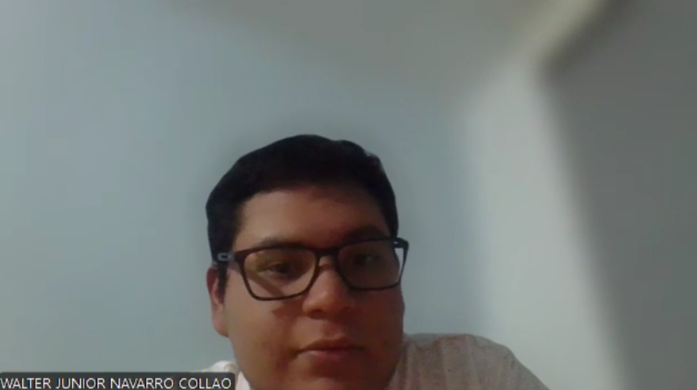  | 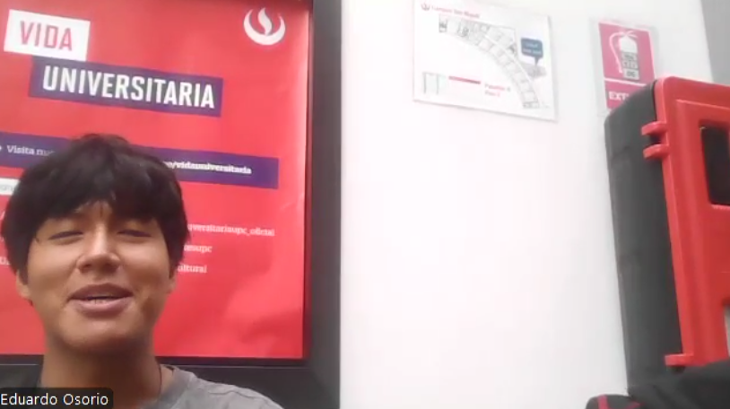  | 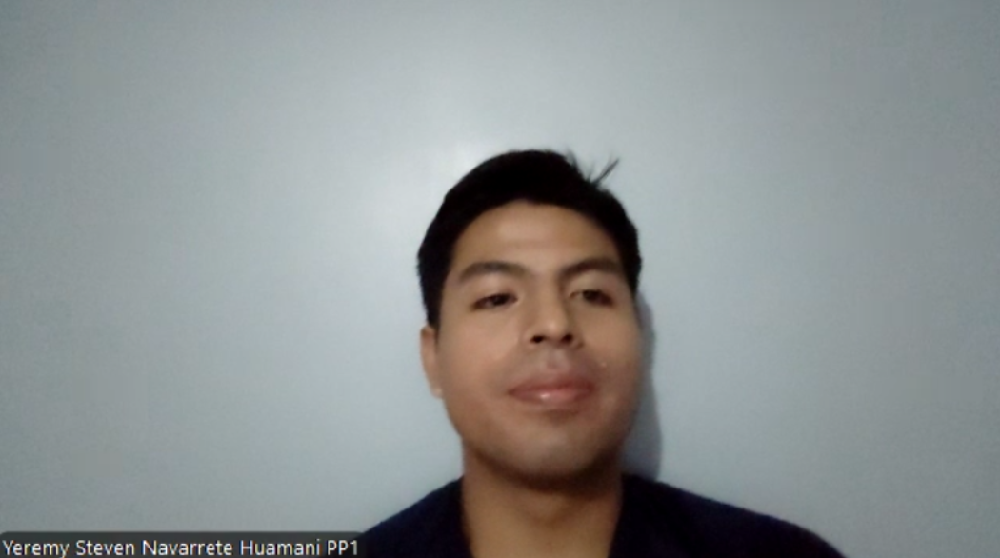  |
| **Nombre** | Walter Navarro | Jesús Arroyo | Yeremy Navarrete |
| **Edad** | 22 años | 28 años | 25 años |
| **Distrito** | Surco | San Martín de Porres | Independencia |
| **Duración** | 00:00 - 02:05 (02:05 minutos) | 02:05 - 03:25 (01:20 minutos) | 03:25 - 05:20 (01:55 minutos) |

**Resumen – Walter Navarro**

La entrevista a Walter Navarro, de 22 años, deportista amateur que entrena aproximadamente cinco veces por semana, permitió conocer cómo determina actualmente si está preparado para realizar una sesión de entrenamiento. Utiliza un smartwatch para revisar algunos datos relacionados con su actividad física y toma sus decisiones principalmente según cómo se siente durante el día, su nivel de energía y el cansancio acumulado de sesiones anteriores. Sin embargo, reconoce que en ocasiones no puede determinar con precisión si se ha recuperado correctamente, llegando a sentirse bien al inicio y experimentar cansancio durante el entrenamiento. Además, considera que las aplicaciones actuales muestran demasiadas métricas y no siempre comprende qué significan o cómo utilizarlas. Cuando duerme mal, suele reducir la intensidad de manera intuitiva, sin contar con información objetiva que respalde esa decisión. Considera que una herramienta capaz de interpretar automáticamente sus datos y mostrarle su nivel de recuperación y el esfuerzo que debería realizar le ayudaría a tomar mejores decisiones sobre su entrenamiento.

**Resumen – Jesús Arroyo**

La entrevista a Jesús Arroyo, de 28 años, atleta semiprofesional que entrena diariamente y participa en competencias, permitió comprender cómo controla actualmente su rendimiento. Utiliza un reloj deportivo y registros de sus entrenamientos, tomando en cuenta la carga de trabajo, el cansancio y sus objetivos semanales para decidir la intensidad de cada sesión. Una de sus principales dificultades aparece después de entrenamientos intensos, ya que no siempre puede determinar con precisión si su cuerpo está completamente recuperado. Ha continuado entrenando incluso cuando se encontraba demasiado cansado, especialmente durante periodos previos a competencias. Aunque identifica el sobreentrenamiento mediante señales como la disminución del rendimiento y la fatiga prolongada, no siempre sabe cuánto debería reducir su carga cuando duerme mal o se encuentra fatigado. Considera que sería útil contar con una medida clara de recuperación acompañada de recomendaciones concretas que le permitan convertir los datos fisiológicos en decisiones para su entrenamiento.

**Resumen – Yeremy Navarrete**

La entrevista a Yeremy Navarrete, de 25 años, quien combina una jornada laboral exigente con una rutina regular de entrenamiento, permitió identificar las dificultades que presenta al gestionar su recuperación. Actualmente utiliza un reloj y una aplicación deportiva para realizar el seguimiento de su actividad, aunque reconoce que normalmente solo revisa algunos datos y no aprovecha toda la información disponible. Para decidir cuánto entrenar se basa principalmente en su nivel de energía, su cansancio y el tiempo disponible. Su principal dificultad consiste en determinar cómo influyen conjuntamente el trabajo, el sueño y el entrenamiento sobre su recuperación. En varias ocasiones ha realizado sus sesiones a pesar de sentirse cansado, debido a que busca cumplir con su rutina. Cuando duerme mal, le resulta difícil decidir si debería disminuir la intensidad o descansar. Considera que una solución que integre sus datos de sueño, actividad y recuperación, y que los convierta en una recomendación sencilla, podría ayudarlo a organizar mejor su entrenamiento.

**Segundo Segmento Objetivo - Personas que buscan mejorar su bienestar general y su calidad de sueño (Wellness Seeker)**

**URL de todas las entrevistas del segmento: https://1drv.ms/v/c/9e13d0eade016b07/IQCbZZ3ah28dSa6sKOCB7VidAcC9w3DJRo7ZycW8ehO_J5c?e=7WCfRw&nav=eyJyZWZlcnJhbEluZm8iOnsicmVmZXJyYWxBcHAiOiJTdHJlYW1XZWJBcHAiLCJyZWZlcnJhbFZpZXciOiJTaGFyZURpYWxvZy1MaW5rIiwicmVmZXJyYWxBcHBQbGF0Zm9ybSI6IldlYiIsInJlZmVycmFsTW9kZSI6InZpZXcifX0%3D**

| Campo | Entrevista 1 | Entrevista 2 | Entrevista 3 |
|---|---|---|---|
| **Captura** |   | 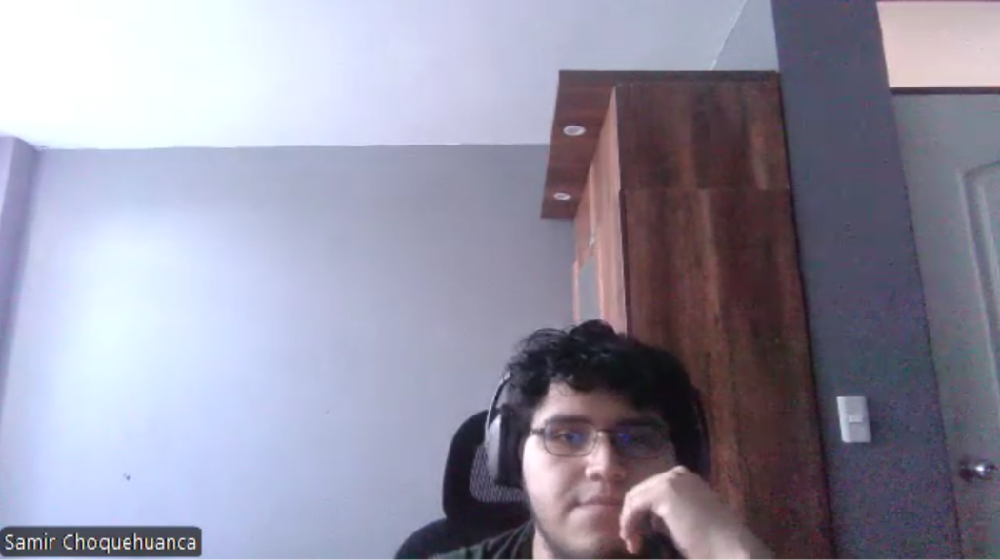  | 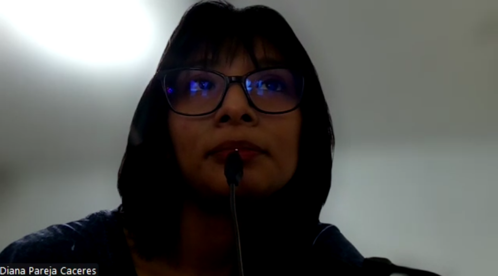  |
| **Nombre** | Rodrigo Colonio | Alejandro Choquehuanca | Diana Pareja |
| **Edad** | 22 años | 27 años | 24 años |
| **Distrito** | San Miguel | San Miguel | San Miguel |
| **Duración** | 05:20 - 08:15 (02:55 minutos) | 08:15 - 10:25 (02:10 minutos) | 10:25 - 12:20 (01:55 minutos) |

**Resumen – Rodrigo Colonio**

La entrevista a Rodrigo Colonio, de 22 años, quien tiene una jornada laboral extensa, permitió conocer cómo evalúa actualmente su descanso. Principalmente determina la calidad de su descanso según cómo se siente al despertar y utiliza ocasionalmente una aplicación para revisar su sueño, aunque normalmente solo presta atención a la cantidad de horas dormidas. Una de sus principales dificultades es identificar qué factores provocan que duerma mal, ya que el estrés, los horarios de trabajo y la falta de sueño pueden presentarse al mismo tiempo. Cuando tiene periodos de mayor carga laboral, suele dormir menos y recuperarse peor. Aunque ha identificado que trabajar hasta tarde afecta su descanso, no cuenta con un seguimiento constante que le permita conocer con precisión esta relación. Considera que una herramienta que analice su información y le indique de manera sencilla qué factores están afectando su descanso y qué podría cambiar le sería de utilidad.

**Resumen – Alejandro Choquehuanca**

La entrevista a Alejandro Choquehuanca, de 27 años, quien combina sus estudios de posgrado con actividades laborales, permitió comprender las dificultades que presenta para mantener una rutina de descanso constante. Actualmente utiliza un smartwatch para revisar principalmente las horas y fases de sueño, aunque reconoce que algunas de las métricas que obtiene son difíciles de interpretar. Durante periodos de entregas o mayor carga académica, su nivel de estrés aumenta y suele dormir menos y con menor calidad. Cuando esto sucede, intenta compensar el descanso durante los fines de semana, pero sus decisiones se basan principalmente en su percepción personal. Considera que una herramienta que pueda explicarle sus datos de sueño y mostrarle si su descanso realmente fue suficiente podría ayudarlo a identificar cambios necesarios en su rutina.

**Resumen – Diana Pareja**

La entrevista a Diana Pareja, de 24 años, quien busca mejorar su bienestar y actualmente no realiza un seguimiento constante de su sueño, permitió identificar sus principales dificultades relacionadas con el descanso. Para determinar si ha descansado correctamente, se basa principalmente en su nivel de energía al despertar y en si presenta sueño durante el día. Su principal dificultad está relacionada con el estrés, ya que cuando atraviesa periodos de mayor presión laboral tiene problemas para dormir y suele despertarse cansada. Aunque reconoce que sus hábitos diarios influyen en la calidad de su sueño, no lleva un registro detallado que le permita identificar estas relaciones. En ocasiones ha utilizado aplicaciones de sueño, pero algunas métricas le han resultado confusas. Considera que una herramienta capaz de analizar continuamente sus datos fisiológicos y ofrecerle orientación personalizada sobre su descanso podría ayudarla a comprender mejor su estado y realizar cambios en su rutina.

### 2.2.3. Análisis de entrevistas

Se entrevistó a tres personas por segmento objetivo. Por ello, los porcentajes presentados (33 %, 67 % y 100 %) describen únicamente a los participantes de esta muestra exploratoria y no son representativos del mercado. Su propósito es identificar patrones y necesidades que orienten el diseño; la magnitud de cada necesidad deberá contrastarse en las pruebas de validación descritas en la sección 1.2.2.3.

### Segmento Objetivo 1: Usuarios con rutinas de entrenamiento o alta exigencia física

#### 1. Perfil y actividad física

- 100 % realiza actividad física de manera frecuente y mantiene una rutina de entrenamiento constante.
- 33 % participa en competencias y mantiene una rutina de entrenamiento diaria.
- 33 % combina una rutina de entrenamiento exigente con una jornada laboral extensa.
- 100 % considera su estado físico y nivel de energía para decidir cómo afrontar sus sesiones.

#### 2. Métodos actuales de seguimiento

- 100 % utiliza un smartwatch o reloj deportivo para consultar métricas de entrenamiento.
- 33 % utiliza además registros de sus entrenamientos para controlar su rendimiento.
- 33 % complementa su reloj con una aplicación deportiva.
- 67 % reconoce que no aprovecha o no comprende completamente toda la información proporcionada por sus dispositivos.

#### 3. Problemas comunes

- 100 % tiene dificultades para determinar con certeza si está completamente recuperado antes de entrenar.
- 100 % toma decisiones de entrenamiento considerando principalmente cómo se siente físicamente.
- 67 % ha realizado entrenamientos estando demasiado cansado.
- 100 % tiene dificultades para determinar qué intensidad debería utilizar cuando presenta fatiga o ha dormido mal.
- 33 % identifica señales de sobreentrenamiento recién después de experimentar fatiga prolongada o disminución del rendimiento.

#### 4. Interpretación de información fisiológica

- 67 % considera que las métricas proporcionadas por sus dispositivos pueden ser difíciles de interpretar.
- 33 % considera que algunas métricas requieren conocimientos adicionales para comprenderlas correctamente.
- 100 % manifiesta la necesidad de convertir los datos obtenidos en información más clara para tomar decisiones sobre su entrenamiento.
- 67 % considera útil recibir una interpretación directa de sus datos en lugar de revisar únicamente valores o métricas.

#### 5. Recuperación y descanso

- 100 % considera importante conocer su nivel de recuperación antes de realizar una sesión de entrenamiento.
- 67 % tiene dificultades para determinar cómo afecta la falta de sueño a su capacidad para entrenar.
- 33 % señala que el estrés laboral también influye en su recuperación.
- 100 % utiliza principalmente su percepción personal para decidir si debe reducir la intensidad o descansar.

#### 6. Información deseada

- 100 % desea conocer de manera más clara su nivel de recuperación antes de entrenar.
- 67 % quiere conocer cuánto esfuerzo puede realizar de acuerdo con su estado actual.
- 33 % desea conocer cómo influyen conjuntamente el sueño, el trabajo y el entrenamiento sobre su recuperación.
- 100 % considera útil recibir recomendaciones concretas en lugar de únicamente visualizar métricas.

#### 7. Personalización y toma de decisiones

- 100 % considera que sus decisiones actuales dependen en gran medida de su percepción personal.
- 100 % muestra interés en contar con recomendaciones adaptadas a su estado físico.
- 67 % considera que una herramienta que interprete automáticamente sus datos podría ayudarlo a tomar mejores decisiones.
- 100 % busca mejorar la relación entre esfuerzo, recuperación y descanso.

#### 8. Necesidades para la adopción

- 100 % considera importante que la información sea clara y fácil de interpretar.
- 100 % valoraría una solución que reduzca la necesidad de analizar manualmente múltiples métricas.
- 100 % considera útil recibir orientación sobre cuándo entrenar, reducir la intensidad o descansar.

### Segmento Objetivo 2: Personas que buscan mejorar su bienestar general y calidad de sueño

#### 1. Perfil y contexto

- 100 % tiene responsabilidades laborales o académicas que pueden afectar su descanso.
- 67 % señala que el estrés influye directamente en su calidad de sueño.
- 33 % presenta horarios variables debido a la combinación de trabajo y estudios.
- 33 % señala su jornada laboral extensa como uno de los principales factores que afectan su descanso.

#### 2. Métodos actuales de seguimiento

- 67 % ha utilizado alguna aplicación o dispositivo para revisar su sueño.
- 33 % realiza un seguimiento ocasional mediante una aplicación.
- 33 % utiliza un smartwatch para consultar horas y fases del sueño.
- 33 % no realiza un seguimiento constante de su sueño.
- 100 % utiliza principalmente su percepción personal para determinar si ha descansado adecuadamente.

#### 3. Problemas comunes

- 100 % tiene dificultades para determinar con precisión por qué algunos días descansa peor que otros.
- 100 % relaciona su calidad de sueño con factores como el estrés, el trabajo, los estudios o los horarios.
- 67 % reconoce que los datos proporcionados por las aplicaciones o dispositivos no siempre son fáciles de interpretar.
- 100 % considera que actualmente no cuenta con suficiente información para comprender completamente su estado de descanso.

#### 4. Influencia del estrés y la rutina

- 100 % identifica factores externos de su rutina que afectan su descanso.
- 67 % señala específicamente al estrés como un factor que empeora su sueño.
- 33 % señala los horarios variables como una dificultad para mantener una rutina de descanso.
- 33 % indica que trabajar hasta tarde afecta negativamente la calidad de su sueño.

#### 5. Seguimiento de la calidad del sueño

- 100 % utiliza principalmente su nivel de energía al despertar como indicador de un buen o mal descanso.
- 67 % revisa algún tipo de métrica relacionada con las horas o fases del sueño.
- 33 % solo revisa la cantidad de horas dormidas.
- 100 % considera que conocer únicamente las horas de sueño no es suficiente para comprender completamente su descanso.

#### 6. Interpretación de datos

- 67 % considera que algunas métricas de sueño son difíciles de interpretar.
- 100 % considera que obtener los datos no necesariamente significa saber qué hacer con ellos.
- 67 % quisiera recibir una explicación de los datos obtenidos.
- 100 % muestra interés en recibir recomendaciones que permitan convertir la información recopilada en acciones concretas.

#### 7. Información deseada

- 100 % desea conocer si su descanso fue realmente suficiente.
- 67 % quiere identificar qué factores están afectando su calidad de sueño.
- 33 % quiere comprender mejor la relación entre sus hábitos diarios y su descanso.
- 100 % considera útil recibir orientación sobre qué cambios podría realizar en su rutina.

#### 8. Personalización y bienestar

- 100 % considera que sus necesidades de descanso dependen de su situación y rutina personal.
- 100 % muestra interés en recibir recomendaciones adaptadas a su propio estado.
- 100 % busca reducir la incertidumbre respecto a su descanso y bienestar diario.
- 67 % considera que una herramienta capaz de analizar continuamente sus datos podría ayudarlo a comprender mejor su estado fisiológico.

### Trazabilidad de los hallazgos

La siguiente matriz traza cada hallazgo desde la entrevista que lo originó hasta la necesidad identificada, la User Persona que la representa y las User Stories que la atienden (sección 3.1).

| Hallazgo (entrevistas) | Evidencia | Necesidad | User Persona | User Stories |
|---|---|---|---|---|
| No saben con certeza si están recuperados antes de entrenar | Deportistas: 3/3 (Walter Navarro, Jesús Arroyo, Yeremy Navarrete) | Conocer su nivel de recuperación antes de entrenar | Walter Navarro, Jesús Arroyo, Yeremy Navarrete | US01, US06, US25 |
| No saben qué intensidad usar cuando duermen mal o están fatigados | Deportistas: 3/3 (Walter Navarro, Jesús Arroyo, Yeremy Navarrete) | Recibir una orientación concreta de intensidad | Walter Navarro, Jesús Arroyo, Yeremy Navarrete | US04, US30 |
| Entrenaron estando demasiado cansados; detectan el sobreentrenamiento tarde | Deportistas: 2/3 (Jesús Arroyo, Yeremy Navarrete) | Ser alertados a tiempo ante riesgo de sobreentrenamiento | Jesús Arroyo, Yeremy Navarrete | US07, US27 |
| No logran relacionar sueño, trabajo y entrenamiento | Deportistas: 1/3 (Yeremy Navarrete); Wellness Seekers: 3/3 (Rodrigo Colonio, Alejandro Choquehuanca, Diana Pareja) | Ver sus datos integrados en una sola vista | Yeremy Navarrete, Rodrigo Colonio, Alejandro Choquehuanca, Diana Pareja | US03, US22, US23 |
| Las métricas de sus dispositivos son difíciles de interpretar | Deportistas: 2/3 (Walter Navarro, Jesús Arroyo); Wellness Seekers: 2/3 (Alejandro Choquehuanca, Diana Pareja) | Explicaciones en lenguaje sencillo | Walter Navarro, Jesús Arroyo, Alejandro Choquehuanca, Diana Pareja | US02, US03, US06 |
| Evalúan su descanso solo por cómo se sienten al despertar | Wellness Seekers: 3/3 (Rodrigo Colonio, Alejandro Choquehuanca, Diana Pareja) | Saber si su descanso fue realmente suficiente | Rodrigo Colonio, Alejandro Choquehuanca, Diana Pareja | US02, US26 |
| El estrés empeora su sueño, pero no pueden comprobar la relación | Wellness Seekers: 2/3 (Alejandro Choquehuanca, Diana Pareja) | Identificar qué factores afectan su sueño y reducir el estrés | Alejandro Choquehuanca, Diana Pareja | US31, US32 |
| Obtener datos no significa saber qué hacer con ellos | Wellness Seekers: 3/3 (Rodrigo Colonio, Alejandro Choquehuanca, Diana Pareja) | Recibir recomendaciones de cambios en su rutina | Rodrigo Colonio, Alejandro Choquehuanca, Diana Pareja | US05, US08, US33 |
| Los horarios variables dificultan mantener una rutina de descanso | Wellness Seekers: 1/3 (Alejandro Choquehuanca) | Recordatorios adaptados a su horario | Alejandro Choquehuanca | US41, US33 |

## 2.3. Needfinding

En esta sección se presentan los artefactos resultantes del análisis de las entrevistas. Las User Personas sintetizan a cada entrevistado; el User Task Matrix compara las tareas que realizan hoy, sin PulsePower; los User Journey Maps describen su experiencia actual (As-Is); y los Empathy Maps profundizan en lo que piensan, sienten y necesitan. Todos los artefactos se elaboraron en UXPressia a partir de los resúmenes de la sección 2.2.2 y del análisis de la sección 2.2.3.

### 2.3.1. User Personas

Las fichas de User Persona se construyeron a partir de las entrevistas registradas. Cada ficha recoge las características demográficas del entrevistado (edad, ocupación y ciudad), los dispositivos que utiliza, sus objetivos, sus necesidades, sus frustraciones y lo que espera de una solución. También consideran el análisis competitivo: las frustraciones con métricas difíciles de interpretar y con datos dispersos coinciden con las debilidades identificadas en WHOOP, Oura y Garmin.

### **Primer Segmento Objetivo - Usuarios con rutinas de entrenamiento o alta exigencia física (Deportistas)**

#### Walter Navarro

**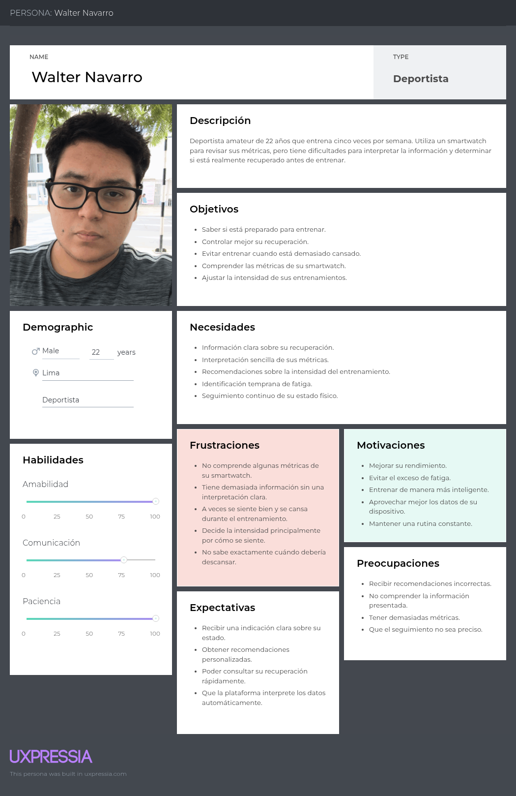 **

Walter Navarro es un deportista amateur de 22 años de Lima que entrena cinco veces por semana y utiliza un smartwatch para revisar sus métricas. Busca saber si está preparado para entrenar, controlar mejor su recuperación, evitar el exceso de fatiga y ajustar la intensidad de sus sesiones. Necesita información clara sobre su recuperación, una interpretación sencilla de sus métricas, recomendaciones sobre la intensidad e identificación temprana de la fatiga. Se frustra porque recibe demasiada información, algunas métricas son difíciles de comprender y no sabe exactamente cuándo debería descansar. Espera recibir indicaciones claras y recomendaciones personalizadas que le permitan entrenar de manera más inteligente.

#### Jesús Arroyo

**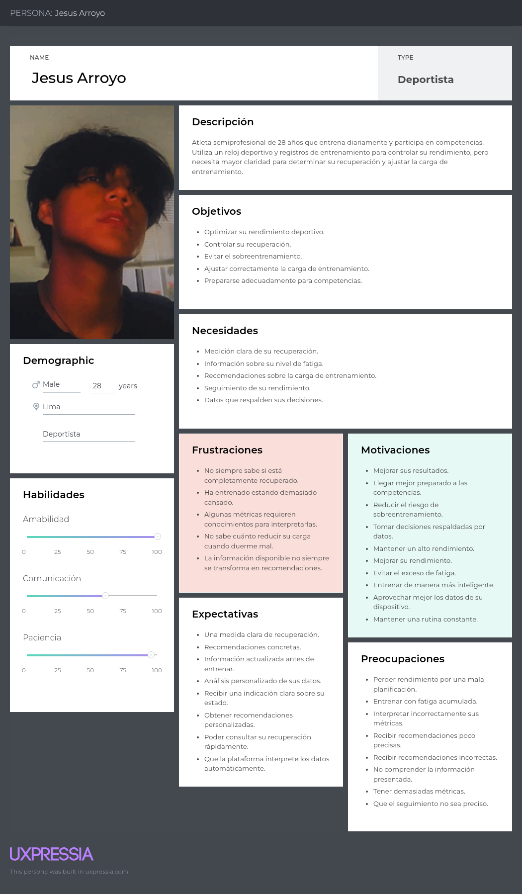 **

Jesús Arroyo es un atleta semiprofesional de 28 años de Lima que entrena diariamente y participa en competencias. Utiliza un reloj deportivo y registros de entrenamiento para controlar su rendimiento, pero necesita mayor claridad para determinar su recuperación y ajustar su carga de entrenamiento. Sus objetivos son optimizar su rendimiento, evitar el sobreentrenamiento y prepararse adecuadamente para las competencias. Se frustra porque no siempre sabe si está completamente recuperado, ha entrenado estando cansado y algunas métricas requieren conocimientos para interpretarlas. Espera obtener una medida clara de recuperación, un análisis personalizado y recomendaciones concretas que respalden sus decisiones.

#### Yeremy Navarrete

** **

Yeremy Navarrete es un deportista de 25 años de Lima que combina una jornada laboral exigente con una rutina regular de entrenamiento y utiliza un reloj y una aplicación deportiva. Busca mantener su condición física, equilibrar el trabajo con la actividad física, controlar su recuperación y organizar mejor sus sesiones. Necesita integrar información sobre sueño, esfuerzo y recuperación, además de identificar la fatiga y recibir orientación sobre cuándo reducir la intensidad. Su principal frustración es no saber si debería entrenar o descansar, especialmente cuando el trabajo y el sueño afectan su recuperación. Espera tener sus datos integrados y recibir recomendaciones sencillas para tomar mejores decisiones sobre su entrenamiento.

### **Segundo Segmento Objetivo - Personas que buscan mejorar su bienestar general y su calidad de sueño (Wellness Seeker)**

#### Rodrigo Colonio

**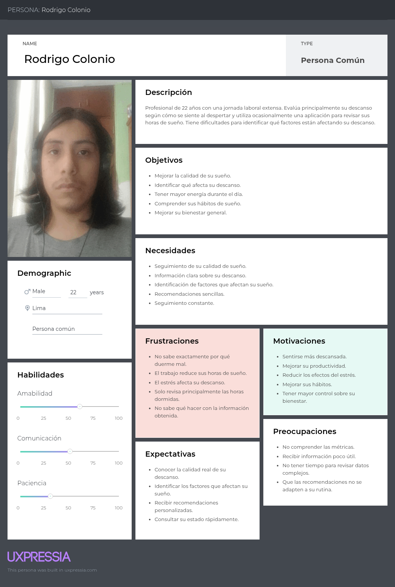 **

Rodrigo Colonio es un profesional de 22 años de Lima con una jornada laboral extensa que evalúa su descanso principalmente según cómo se siente al despertar. Busca mejorar la calidad de su sueño, identificar qué factores afectan su descanso, tener mayor energía y mejorar su bienestar general. Necesita realizar un seguimiento constante y recibir información clara y recomendaciones sencillas. Se frustra porque no siempre sabe por qué duerme mal, el trabajo y el estrés afectan su descanso y no sabe cómo utilizar la información obtenida. Espera conocer la calidad real de su descanso y recibir recomendaciones personalizadas que se adapten a su rutina.

#### Alejandro Choquehuanca

**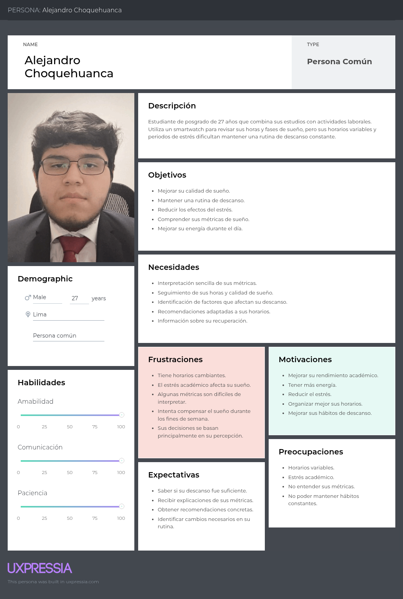 **

Alejandro Choquehuanca es un estudiante de posgrado de 27 años de Lima que combina sus estudios con actividades laborales y utiliza un smartwatch para revisar sus horas y fases de sueño. Busca mejorar su calidad de sueño, reducir el estrés, mantener una rutina de descanso y tener más energía durante el día. Necesita interpretar fácilmente sus métricas, identificar los factores que afectan su descanso y recibir recomendaciones adaptadas a sus horarios. Sus principales frustraciones son los horarios cambiantes, el estrés académico y la dificultad para comprender algunas métricas. Espera saber si su descanso fue suficiente y recibir explicaciones y recomendaciones concretas.

#### Diana Pareja

**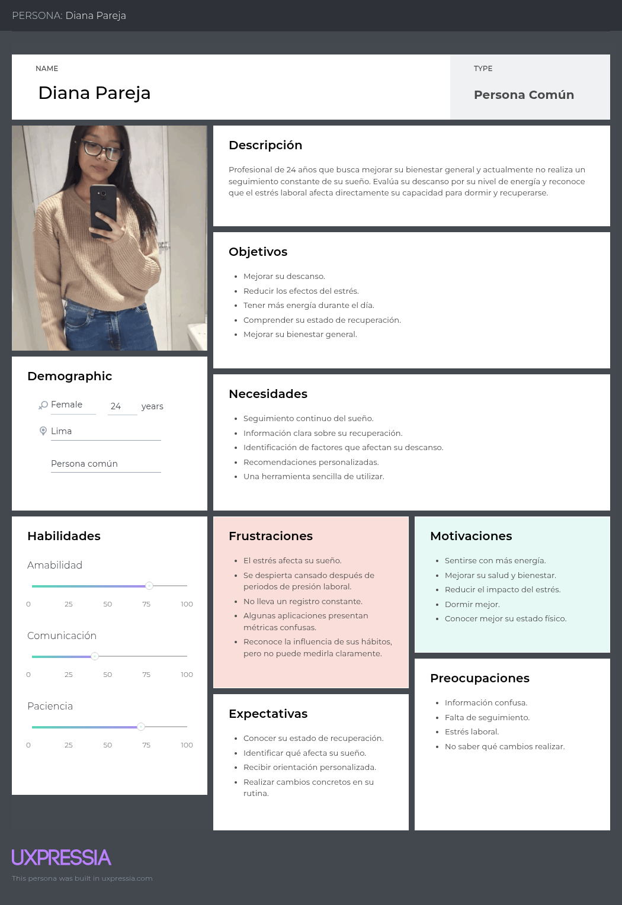 **

Diana Pareja es una profesional de 24 años de Lima que busca mejorar su bienestar general y actualmente no realiza un seguimiento constante de su sueño. Su principal objetivo es mejorar su descanso, reducir los efectos del estrés, tener más energía y comprender mejor su estado de recuperación. Necesita información clara sobre su sueño y recomendaciones personalizadas, pero se frustra porque el estrés laboral afecta su descanso y algunas métricas son difíciles de interpretar. Espera recibir orientación sencilla que le permita identificar qué factores afectan su sueño y realizar cambios concretos en su rutina.

### 2.3.2. User Task Matrix

El User Task Matrix concentra las tareas que realizan las User Personas de cada segmento para cumplir sus objetivos, independientemente de la existencia de PulsePower. Se consideran dos segmentos: Deportistas (Walter Navarro, Jesús Arroyo y Yeremy Navarrete) y Wellness Seekers (Rodrigo Colonio, Alejandro Choquehuanca y Diana Pareja). La frecuencia y la importancia de cada tarea se asignaron a partir de lo declarado por cada entrevistado.

### **Segmento objetivo 1: Usuarios con rutinas de entrenamiento o alta exigencia física**

| User Task | Walter Navarro Frecuencia | Walter Navarro Importancia | Jesús Arroyo Frecuencia | Jesús Arroyo Importancia | Yeremy Navarrete Frecuencia | Yeremy Navarrete Importancia |
|---|---|---|---|---|---|---|
| Evaluar si está recuperado antes de entrenar. | Alta | Alta | Alta | Alta | Alta | Alta |
| Consultar las métricas de su reloj o aplicación. | Alta | Media | Alta | Alta | Media | Media |
| Decidir la intensidad del entrenamiento. | Alta | Alta | Alta | Alta | Alta | Alta |
| Identificar señales de fatiga o sobreentrenamiento. | Media | Alta | Alta | Alta | Media | Alta |
| Ajustar el entrenamiento cuando duerme mal o está cansado. | Media | Alta | Media | Alta | Alta | Alta |
| Registrar sus sesiones de entrenamiento. | Baja | Media | Alta | Alta | Media | Media |
| Revisar su evolución. | Media | Media | Alta | Alta | Baja | Media |

Las tareas con mayor frecuencia e importancia para los tres Deportistas son evaluar si están recuperados antes de entrenar y decidir la intensidad de la sesión: ambas se realizan antes de cada entrenamiento y hoy se resuelven con su percepción personal. La principal diferencia está en el seguimiento: Jesús Arroyo, por competir, registra sus sesiones y revisa su evolución con alta frecuencia, mientras que Walter Navarro y Yeremy Navarrete lo hacen de forma más esporádica. Yeremy Navarrete ajusta su entrenamiento con mayor frecuencia porque su jornada laboral afecta su sueño y su recuperación.

### **Segmento objetivo 2: Personas que buscan mejorar su bienestar general y calidad de sueño**

| User Task | Rodrigo Colonio Frecuencia | Rodrigo Colonio Importancia | Alejandro Choquehuanca Frecuencia | Alejandro Choquehuanca Importancia | Diana Pareja Frecuencia | Diana Pareja Importancia |
|---|---|---|---|---|---|---|
| Evaluar cómo descansó al despertar. | Alta | Alta | Alta | Alta | Alta | Alta |
| Consultar sus horas o fases de sueño. | Media | Media | Alta | Alta | Baja | Media |
| Identificar factores que afectan su sueño. | Media | Alta | Media | Alta | Media | Alta |
| Manejar el estrés del trabajo o los estudios. | Alta | Alta | Alta | Alta | Alta | Alta |
| Ajustar sus horarios y hábitos de descanso. | Media | Alta | Alta | Alta | Media | Alta |
| Revisar su evolución. | Baja | Media | Media | Media | Baja | Media |

Las tareas con mayor frecuencia e importancia para los tres Wellness Seekers son evaluar cómo descansaron al despertar y manejar el estrés de su rutina. Coinciden en que identificar los factores que afectan su sueño es muy importante, aunque hoy lo hacen de forma ocasional y sin datos. La principal diferencia es el uso de métricas: Alejandro Choquehuanca consulta sus horas y fases de sueño con frecuencia, Rodrigo Colonio solo revisa ocasionalmente las horas dormidas y Diana Pareja casi no realiza seguimiento.

Entre ambos segmentos, la coincidencia principal es que las decisiones diarias (entrenar o descansar, ajustar hábitos) se toman por percepción, mientras que revisar la evolución tiene menor frecuencia para casi todas las User Personas.

### 2.3.3. User Journey Mapping

Los User Journey Maps representan la experiencia actual (As-Is) de cada segmento, sin la existencia de PulsePower. El journey de los Deportistas abarca desde que evalúan su estado antes de entrenar hasta que valoran su recuperación después de la sesión. El journey de los Wellness Seekers abarca desde que revisan cómo descansaron al despertar hasta que evalúan su bienestar durante el día. Cada mapa se construyó a partir de las User Personas del segmento correspondiente.

### **Primer Segmento Objetivo - Usuarios con rutinas de entrenamiento o alta exigencia física (Deportistas)**

**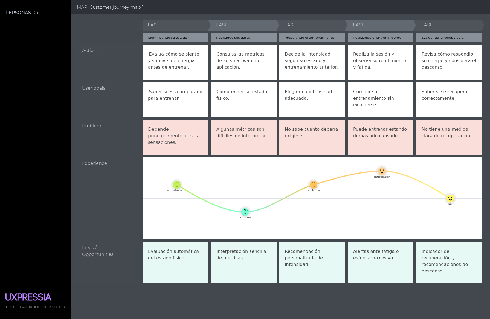 **

El User Journey Map del Deportista resume su experiencia en cinco etapas relacionadas con la decisión de entrenar. En Identificando su estado, evalúa cómo se siente y su nivel de energía antes de entrenar, con el objetivo de saber si está preparado, pero depende principalmente de sus sensaciones. En Revisando sus datos, consulta las métricas de su smartwatch o aplicación para comprender su estado físico, aunque algunas métricas le resultan difíciles de interpretar. En Preparando el entrenamiento, decide la intensidad según su estado y su sesión anterior, sin saber con certeza cuánto debería exigirse. En Realizando el entrenamiento, observa su rendimiento y su fatiga buscando cumplir la sesión sin excederse, aunque puede terminar entrenando demasiado cansado. Finalmente, en Evaluando la recuperación, revisa cómo respondió su cuerpo y considera el descanso, pero no cuenta con una medida clara de recuperación. Estas etapas abren oportunidades para ofrecer una evaluación automática del estado físico, una interpretación sencilla de las métricas, recomendaciones personalizadas de intensidad, alertas ante fatiga o esfuerzo excesivo y un indicador de recuperación con recomendaciones de descanso.

### **Segundo Segmento Objetivo - Personas que buscan mejorar su bienestar general y su calidad de sueño (Wellness Seeker)**

**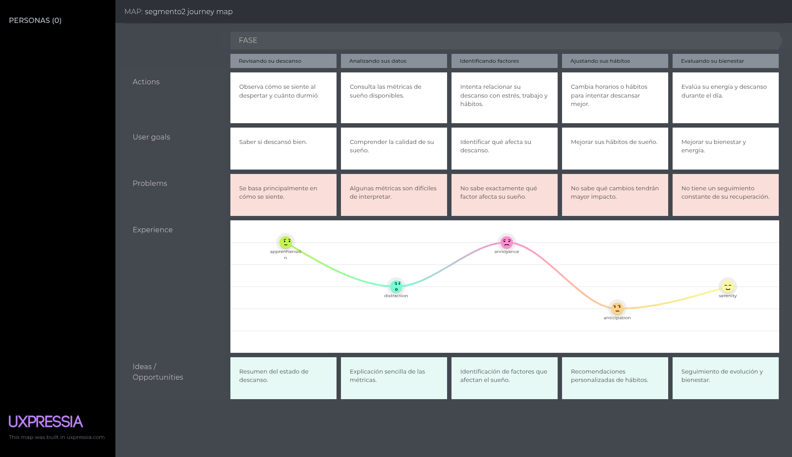 **

El User Journey Map del Wellness Seeker resume su experiencia en cinco etapas relacionadas con el descanso y el bienestar. En Revisando su descanso, observa cómo se siente al despertar y cuánto durmió, pero se basa principalmente en sus propias sensaciones. En Analizando sus datos, consulta sus métricas de sueño para comprender la calidad de su descanso, aunque algunas métricas pueden ser difíciles de interpretar. En Identificando factores, intenta relacionar su descanso con el estrés, el trabajo y sus hábitos, pero existe incertidumbre sobre qué factores afectan realmente su sueño. En Ajustando sus hábitos, modifica horarios y rutinas buscando descansar mejor, pero no sabe qué cambios tendrán mayor impacto. Finalmente, en Evaluando su bienestar, analiza su energía y su descanso durante el día buscando mejorar su bienestar, aunque carece de un seguimiento constante de su recuperación. Estas etapas abren la oportunidad de ofrecer un resumen claro del descanso, explicaciones sencillas de las métricas, identificación de factores, recomendaciones personalizadas y seguimiento de su evolución y bienestar.

### 2.3.4. Empathy Mapping

Para elaborar los Empathy Maps, el equipo colocó a cada User Persona al centro del mapa en UXPressia y registró las observaciones obtenidas de las entrevistas para responder: ¿con quién estamos empatizando?, ¿qué necesita hacer?, ¿qué dice, ve, hace y escucha?, y ¿qué piensa y siente? Luego se identificaron sus Pains (lo que le preocupa) y sus Gains (lo que podría ayudarle a resolver sus problemas y convencerlo de que PulsePower es una alternativa adecuada).

### **Primer Segmento Objetivo - Usuarios con rutinas de entrenamiento o alta exigencia física (Deportistas)**

#### Walter Navarro

**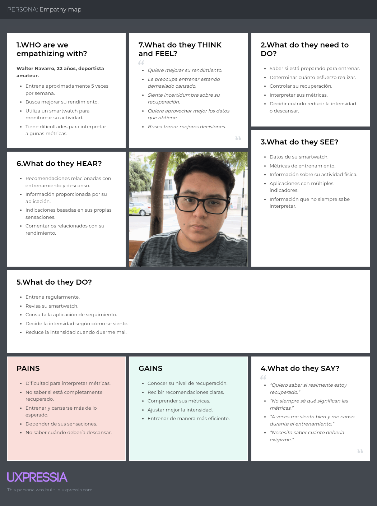 **

Walter Navarro es un deportista amateur de 22 años que entrena aproximadamente cinco veces por semana y utiliza un smartwatch para monitorear su actividad. Busca mejorar su rendimiento y saber si está preparado para entrenar, pero tiene dificultades para interpretar sus métricas y determinar cuándo debería descansar. Necesita información clara sobre su recuperación, esfuerzo y fatiga, además de recomendaciones sobre la intensidad de sus entrenamientos. Sus principales frustraciones son la dificultad para interpretar los datos y depender de sus propias sensaciones. Espera recibir recomendaciones claras y personalizadas que le permitan entrenar de manera más eficiente.

#### Jesús Arroyo

**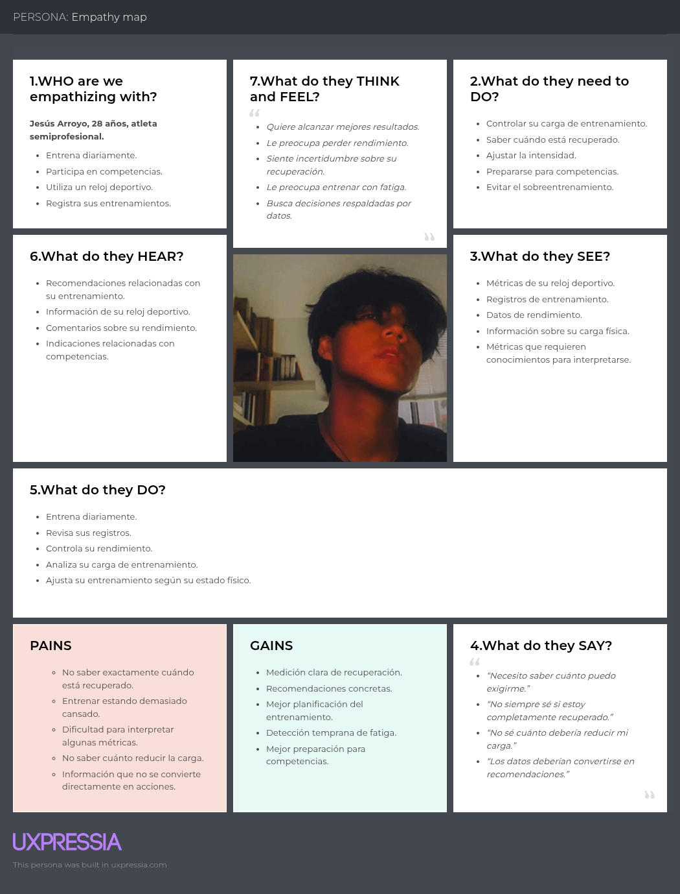 **

Jesús Arroyo es un atleta semiprofesional de 28 años que entrena diariamente y participa en competencias. Utiliza un reloj deportivo y registra sus entrenamientos para controlar su rendimiento, pero no siempre sabe cuándo está completamente recuperado ni cuánto puede exigirse. Necesita controlar su carga de entrenamiento, ajustar la intensidad, detectar la fatiga y evitar el sobreentrenamiento. Le preocupa entrenar estando demasiado cansado y que sus métricas no se conviertan en acciones concretas. Busca obtener una medición clara de su recuperación y recomendaciones que le ayuden a tomar decisiones respaldadas por sus datos.

#### Yeremy Navarrete

**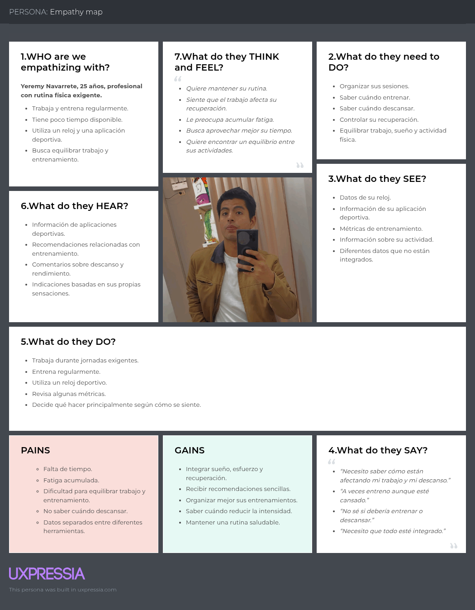 **

Yeremy Navarrete es un profesional de 25 años con una rutina de actividad física exigente que combina trabajo y entrenamiento regular. Utiliza un reloj y una aplicación deportiva, pero tiene poco tiempo disponible y dificultad para integrar la información sobre sueño, esfuerzo y recuperación. Necesita organizar sus sesiones, saber cuándo entrenar o descansar y mantener un equilibrio entre trabajo y actividad física. Sus principales frustraciones son la fatiga acumulada, la falta de tiempo y los datos separados entre diferentes herramientas. Espera integrar toda su información y recibir recomendaciones sencillas que le permitan controlar mejor su recuperación y mantener una rutina saludable.

### **Segundo Segmento Objetivo - Personas que buscan mejorar su bienestar general y su calidad de sueño (Wellness Seeker)**

#### Rodrigo Colonio

**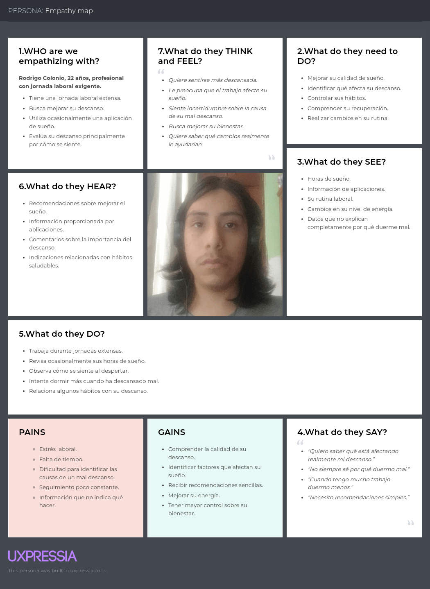 **

Rodrigo Colonio es un profesional de 22 años con una jornada laboral extensa que busca mejorar su descanso y bienestar. Utiliza ocasionalmente una aplicación para revisar sus horas de sueño y evalúa principalmente su descanso según cómo se siente al despertar. Necesita comprender la calidad de su sueño, identificar los factores que lo afectan y recibir recomendaciones sencillas. Sus principales frustraciones son el estrés laboral, la falta de tiempo y no saber exactamente por qué duerme mal. Espera obtener información clara sobre su descanso y recomendaciones personalizadas que le permitan mejorar sus hábitos y tener mayor control sobre su bienestar.

#### Alejandro Choquehuanca

**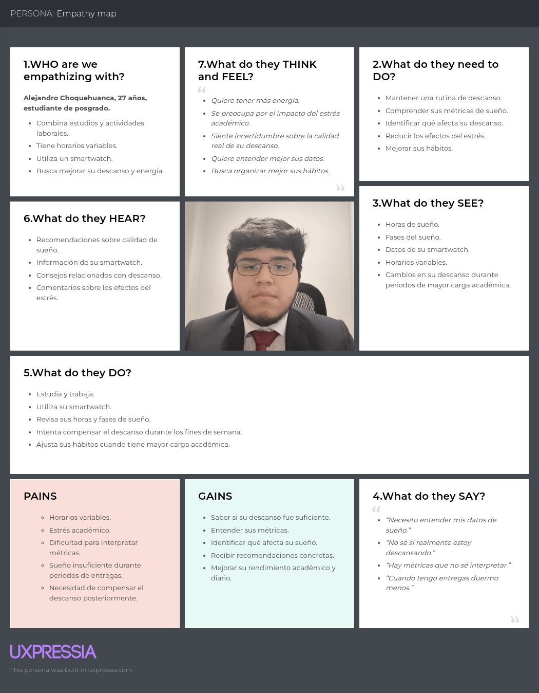 **

Alejandro Choquehuanca es un estudiante de posgrado de 27 años que combina sus estudios con actividades laborales y utiliza un smartwatch para revisar sus horas y fases de sueño. Tiene horarios variables y periodos de mayor carga académica que afectan su descanso. Necesita mantener una rutina de descanso, comprender sus métricas, identificar qué factores afectan su sueño y reducir los efectos del estrés. Sus principales frustraciones son los horarios cambiantes, el estrés académico y la dificultad para interpretar algunas métricas. Espera saber si realmente está descansando lo suficiente, entender mejor sus datos y recibir recomendaciones concretas para mejorar sus hábitos y su rendimiento diario.

#### Diana Pareja

**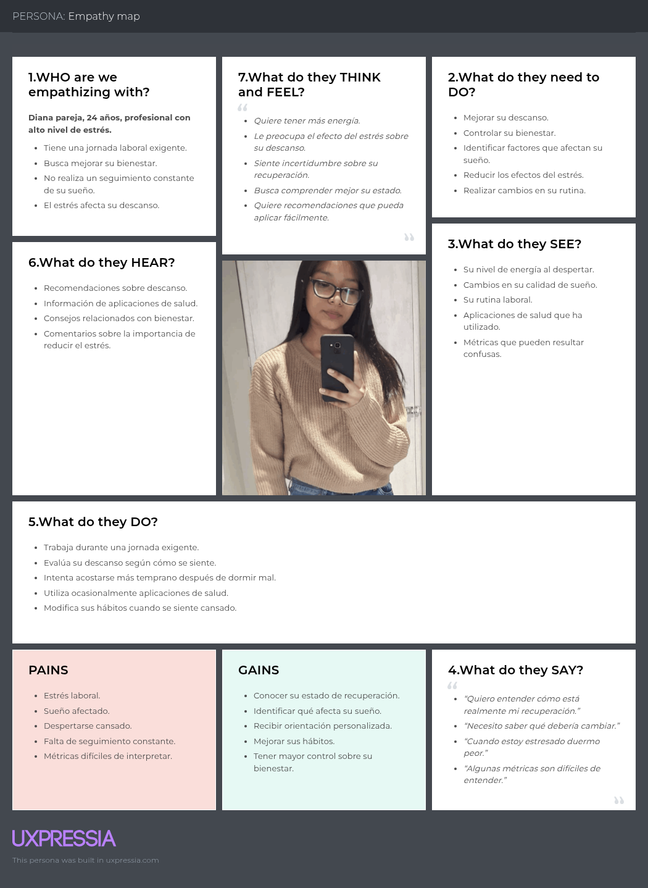 **

Diana Pareja es una profesional de 24 años con una jornada laboral exigente que busca mejorar su bienestar y su descanso. Actualmente no realiza un seguimiento constante de su sueño y evalúa principalmente su descanso según cómo se siente. Necesita controlar su bienestar, identificar los factores que afectan su sueño, reducir los efectos del estrés y realizar cambios en su rutina. Sus principales frustraciones son el estrés laboral, despertarse cansada, la falta de seguimiento y la dificultad para interpretar algunas métricas. Espera comprender mejor su recuperación, identificar qué afecta su sueño y recibir orientación personalizada para mejorar sus hábitos y su bienestar.

## 2.4. Big Picture EventStorming

El equipo realizó una sesión colaborativa de Big Picture EventStorming para entender el dominio de PulsePower a alto nivel, identificando los eventos significativos del negocio y sus relaciones. La sesión se desarrolló en cuatro etapas.

**Step 1 – Open:** cada integrante registró libremente, en notas naranjas, los eventos de dominio que considera relevantes, redactados en pasado: *User Registered*, *Session Started*, *Fitness Tracker Connected*, *Data Synchronized*, *Sleep Recorded*, *Workout Recorded*, *Habits Recorded*, *Effort Calculated*, *Recovery Calculated*, *Fatigue Detected*, *Alert Generated*, *Recommendation Generated*, *AI Assistant Consulted*, *History Accessed* y *Report Generated*.

**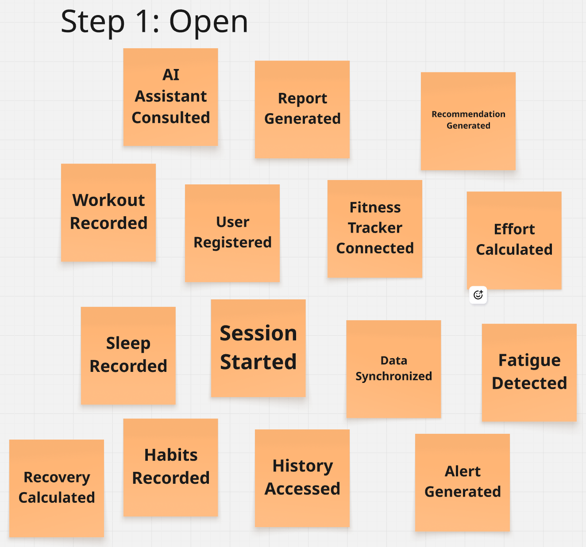 **

**Step 2 – Explore:** los eventos se ordenaron en líneas de tiempo a partir del actor que los desencadena (*user* o *visitor*, en notas amarillas) y se completaron los flujos con los eventos faltantes: *Training Plan Created*, *Activity Planned*, *Low Recovery Detected*, *Reschedule Suggested*, *Wellness Check-in Recorded*, *Stress Level Recorded*, *Breathing Session Completed*, *Sleep Routine Configured*, *Sleep Reminder Sent*, *Streak Updated*, *Achievement Unlocked*, *Progress Shared*, *Plan Subscribed*, *Payment Confirmed* y *Subscription Cancelled*.

**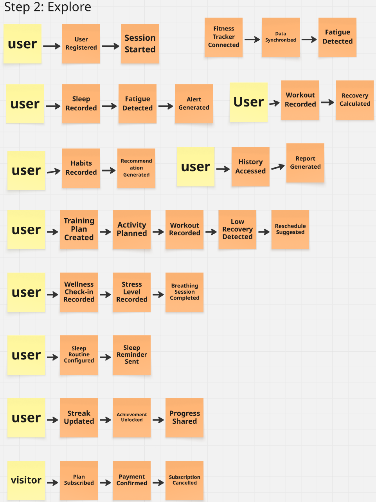 **

**Step 3 – Close:** se incorporaron los sistemas externos (notas moradas) que intervienen en los flujos: *Fitness Tracker* (la pulsera compatible), *External Health App* (aplicaciones de salud externas, como fuente adicional de sueño y entrenamiento), *AI Assistant* (el servicio de inteligencia artificial) y *Payment Gateway* (la pasarela de pago de la suscripción).

**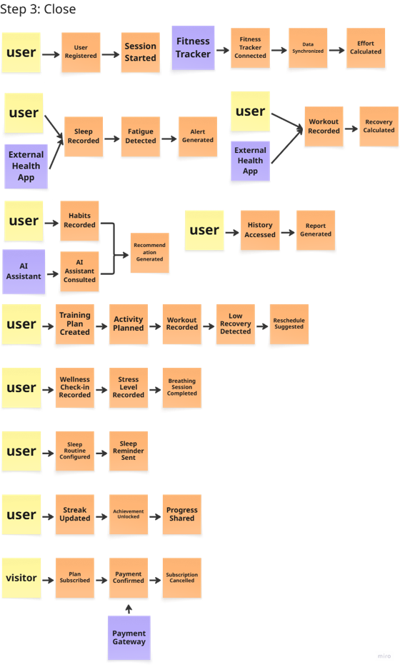 **

**Step 4 – Bounded Contexts:** los eventos se agruparon según la responsabilidad de negocio a la que pertenecen, lo que dio origen a los seis bounded contexts del dominio y a los módulos de soporte:

| Bounded Context | Eventos de dominio |
|---|---|
| Training Management | Training Plan Created, Activity Planned, Workout Recorded |
| Sleep Management | Sleep Recorded, Sleep Routine Configured, Sleep Reminder Sent |
| Wellness Management | Habits Recorded, Wellness Check-in Recorded, Stress Level Recorded, Breathing Session Completed |
| Physiological Analysis & Recommendations | Fitness Tracker Connected, Data Synchronized, Effort Calculated, Recovery Calculated, Fatigue Detected, Low Recovery Detected, Alert Generated, Recommendation Generated, Reschedule Suggested, AI Assistant Consulted |
| Reporting | History Accessed, Report Generated |
| Community | Streak Updated, Achievement Unlocked, Progress Shared |
| Support Modules | User Registered, Session Started, Plan Subscribed, Payment Confirmed, Subscription Cancelled |

**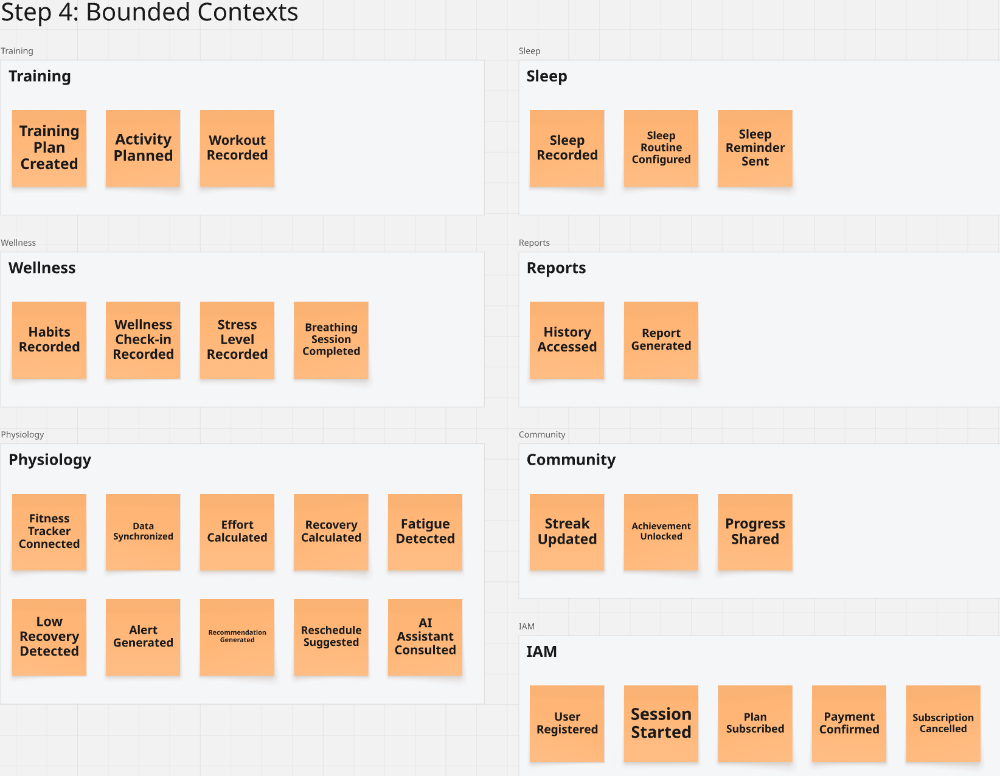 **

Como resultado, se identificaron los procesos clave del dominio y su agrupación en bounded contexts, que sirvieron de base para el Design-Level EventStorming (sección 4.6.1) y se mantienen en el C4 Model (secciones 4.6.2 a 4.6.4) y en los Class Diagrams (sección 4.7.1).

## 2.5. Ubiquitous Language

- **Athlete (Deportista):** Usuario que mantiene una rutina de entrenamiento y utiliza información sobre esfuerzo, recuperación y descanso para organizar sus actividades físicas.
- **Wellness Seeker (Persona enfocada en bienestar):** Usuario que busca mejorar su bienestar general y su calidad de sueño mediante la comprensión de sus registros y hábitos de descanso.
- **Physiological Data (Datos fisiológicos):** Información obtenida a partir de la pulsera compatible sobre el sueño, el esfuerzo y la recuperación del usuario.
- **Recovery Level (Nivel de recuperación):** Indicador que representa el estado de recuperación física del usuario y sirve para decidir si debe entrenar, reducir la intensidad o descansar.
- **Sleep Quality (Calidad del sueño):** Medida utilizada para evaluar qué tan adecuado ha sido el descanso del usuario.
- **Sleep Metrics (Métricas de sueño):** Datos registrados durante el periodo de descanso, como la duración y las fases del sueño.
- **Sleep Routine (Rutina de sueño):** Horarios objetivo de dormir y despertar que el usuario busca mantener.
- **Training Load (Carga de entrenamiento):** Nivel de esfuerzo acumulado generado por las actividades físicas realizadas por el usuario.
- **Effort (Esfuerzo):** Indicador que representa la exigencia física asociada a las actividades o sesiones de entrenamiento.
- **Recovery (Recuperación):** Proceso mediante el cual el organismo se recupera después de realizar actividad física, considerando factores como el esfuerzo y el descanso.
- **Overtraining (Sobreentrenamiento):** Estado en el que la carga de entrenamiento supera de forma sostenida la capacidad de recuperación del usuario.
- **Active Rest (Descanso activo):** Día planificado de baja exigencia física que forma parte del plan de entrenamiento y no se considera inactividad.
- **Perceived Stress (Estrés percibido):** Nivel de estrés que el propio usuario declara en su registro diario de bienestar.
- **Compatible Wearable (Pulsera compatible):** Dispositivo conectado utilizado para registrar y sincronizar los datos fisiológicos del usuario con PulsePower.
- **Alert (Alerta):** Aviso que informa al usuario sobre un riesgo detectado en sus registros, como el sobreentrenamiento o el descanso insuficiente sostenido.
- **Personalized Recommendation (Recomendación personalizada):** Orientación generada a partir de los datos, el historial y los objetivos del usuario para ayudarlo a tomar decisiones sobre su entrenamiento, su descanso o sus hábitos.
- **AI Conversational Assistant (Asistente conversacional con IA):** Funcionalidad que permite al usuario consultar sus indicadores mediante lenguaje cotidiano y recibir explicaciones sobre sus datos fisiológicos.
- **Visitor (Visitante):** Persona no registrada que consulta la Landing Page para conocer la propuesta de valor, los beneficios por segmento y los planes de PulsePower.
- **Subscription Plan (Plan de suscripción):** Modalidad comercial que define las funcionalidades disponibles para el usuario (Basic o Pro) y su periodo de facturación mensual o anual.
- **Wearable Connection (Conexión de la pulsera):** Vinculación entre el usuario y su pulsera compatible, que registra el proveedor, el estado de conexión y la última sincronización.
- **Data Synchronization (Sincronización de datos):** Proceso mediante el cual los registros de la pulsera compatible o de aplicaciones de salud externas se incorporan a PulsePower.
- **Record Source (Origen del registro):** Indica si un dato fue ingresado manualmente por el usuario o medido por la pulsera compatible, para no presentar información declarada como si fuera una medición.
- **Training Plan (Plan de entrenamiento):** Conjunto de actividades físicas programadas por el usuario para un periodo determinado.
- **Planned Activity (Actividad planificada):** Actividad prevista dentro de un plan de entrenamiento, con fecha, duración, intensidad y estado.
- **Training Session (Sesión de entrenamiento):** Actividad física efectivamente realizada por el usuario, haya sido planificada o no.
- **Sleep Record (Registro de sueño):** Periodo de descanso registrado con su hora de inicio y fin, su origen y su puntuación de sueño.
- **Wellness Check-in (Registro diario de bienestar):** Declaración diaria del usuario sobre su estado general, su estrés percibido y la presencia de molestias.
- **Wellness Habit (Hábito de bienestar):** Hábito que el usuario se propone mantener, con una frecuencia semanal objetivo.
- **Recovery Assessment (Evaluación de recuperación):** Cálculo del nivel de recuperación del usuario a partir de su información fisiológica, de entrenamiento, de sueño y de bienestar en un periodo determinado.
- **Progress Report (Reporte de progreso):** Documento que resume la evolución de los registros del usuario durante un periodo seleccionado.
- **Achievement (Logro):** Reconocimiento que el usuario obtiene al cumplir una regla definida, como mantener una racha o completar sus objetivos.
- **Streak (Racha):** Cantidad de días consecutivos en los que el usuario realiza una actividad determinada en PulsePower.
- **Shared Progress (Progreso compartido):** Avance que el usuario decide publicar para un grupo de entrenamiento o un contacto, con un nivel de visibilidad que él mismo controla.