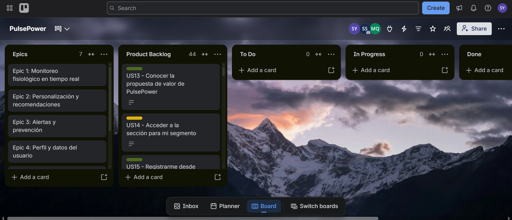

# Capítulo III: Requirements Specification

## 3.1. User Stories
| Epic / Story ID | Título | Descripción | Criterios de Aceptación | Relacionado con (Epic ID) |
|---|---|---|---|---|
| EP01 | Monitoreo fisiológico en tiempo real | Épica que agrupa las historias de visualización de variables fisiológicas del usuario. | - | - |
| EP02 | Personalización y recomendaciones | Épica que agrupa las historias de recomendaciones ajustadas al perfil del usuario. | - | - |
| EP03 | Alertas y prevención | Épica que agrupa las historias de alertas tempranas. | - | - |
| EP04 | Perfil y datos del usuario | Épica que agrupa las historias de registro y seguridad de perfil. | - | - |
| EP05 | Reportes y seguimiento | Épica que agrupa las historias de reportes de progreso. | - | - |
| EP06 | Fidelización | Épica que agrupa las historias de gamificación. | - | - |
| EP07 | Landing Page | Épica que agrupa las historias del Website estático informativo. | - | - |
| US01 | Ver recuperación en tiempo real | Como Deportista, deseo visualizar mi nivel de recuperación en tiempo real, para decidir con qué intensidad puede entrenar hoy. | Dado que el usuario cuenta con datos del sensor de las últimas 24 horas, cuando este solicita su estado de recuperación, entonces el sistema proporciona el nivel de recuperación calculado a partir de dichos datos. | EP01 |
| US02 | Ver resumen de sueño al despertar | Como Wellness Seeker, deseo visualizar un resumen de mi calidad de sueño al despertar, para saber si descansó lo suficiente. | Dado que el usuario registró un ciclo de sueño completo, cuando este consulta su resumen matutino, entonces el sistema muestra las métricas de calidad de sueño de esa noche. | EP01 |
| US03 | Ver variables fisiológicas centralizadas | Como Usuario Común, deseo visualizar mis variables fisiológicas (VFC, esfuerzo, sueño) centralizadas, para no interpretar métricas por separado. | Dado que el usuario tiene datos registrados de mínimo una variable, cuando este ingresa a su panel, entonces el sistema muestra todas las variables disponibles en una sola vista. | EP01 |
| US04 | Recibir recomendaciones de entrenamiento personalizadas | Como Deportista, deseo recibir recomendaciones de entrenamiento ajustadas a mi estado fisiológico, para evitar sobreentrenar. | Dado que el sistema cuenta con el historial y estado actual del usuario, cuando se genera una recomendación, entonces esta varía según dicho historial y estado, y no repite el contenido para dos estados distintos. | EP02 |
| US05 | Recibir sugerencias de rutina de sueño | Como Wellness Seeker, deseo recibir sugerencias sobre cambios en mi rutina de sueño, para mejorar mi descanso. | Dado que el usuario tiene un patrón de sueño registrado de mínimo cinco días, cuando el sistema detecta una tendencia de descanso insuficiente, entonces genera una sugerencia de ajuste de rutina asociada a esa tendencia. | EP02 |
| US06 | Consulta de proyección de recuperación con IA | Como Usuario Común, deseo consultar con el asistente de IA mi recuperación proyectada, para anticipar cómo planificar mi semana. | Dado que el usuario tiene un mínimo de siete días de datos registrados, cuando este realiza una consulta al asistente sobre su recuperación futura, entonces el sistema responde con una proyección basada en dicho historial. | EP02 |
| US07 | Recibir alerta de riesgo de sobreentrenamiento | Como Deportista, deseo recibir una alerta cuando mis señales indiquen riesgo de sobreentrenamiento, para reducir mi carga de esfuerzo a tiempo. | Dado que las variables del usuario superan el umbral de riesgo definido, cuando el sistema evalúa el estado del usuario, entonces genera una notificación de alerta antes de transcurrir treinta minutos desde la detección previa. | EP03 |
| US08 | Recibir alerta de descanso insuficiente sostenido | Como Wellness Seeker, deseo recibir una alerta cuando mi descanso sea insuficiente de forma sostenida, para actuar antes de que afecte mi rendimiento. | Dado que el usuario registra menos del umbral mínimo de sueño durante tres días consecutivos, cuando el sistema evalúa dicho patrón, entonces genera una alerta de descanso irregular. | EP03 |
| US09 | Registrar perfil de usuario - Deportista | Como Deportista, deseo registrar mi perfil (objetivos de entrenamiento, rutina, historial físico) para que la plataforma personalice mis recomendaciones desde el inicio. | Dado que el usuario deportista completó los campos solicitados en su perfil, cuando se confirma su registro, entonces el sistema guarda el perfil y lo asocia a futuras recomendaciones de entrenamiento. | EP04 |
| US10 | Proteger datos fisiológicos del usuario | Como Deportista o Wellness Seeker, deseo que mis datos fisiológicos estén protegidos desde el dispositivo hasta la nube, para confiar en la privacidad de mi información personal. | Dado que el dispositivo transmite datos fisiológicos del usuario, cuando estos datos viajan hacia el servidor, entonces se transmiten cifrados de extremo a extremo en todo el trayecto. | EP04 |
| US11 | Generar reporte periódico de progreso - Deportista | Como Deportista, deseo generar un reporte periódico de mi progreso y recuperación, para hacer un seguimiento exacto de mi evolución en el entrenamiento. | Dado que el deportista tiene datos de mínimo una semana, cuando solicita un reporte, entonces el sistema genera un documento con la evolución de sus variables de entrenamiento en ese periodo. | EP05 |
| US12 | Ver rachas y logros de uso | Como Deportista o Wellness Seeker, deseo ver mis rachas y logros de monitoreo continuo, para mantenerme motivado a usar la plataforma diariamente. | Dado que el usuario registra datos en días consecutivos, cuando ingresa a la sección de logros, entonces el sistema muestra la racha actual y los logros obtenidos. | EP06 |
| US13 | Conocer la propuesta de valor de PulsePower | Como visitante, deseo conocer la propuesta de valor de PulsePower en la página principal, para decidir si el producto se ajusta a mis necesidades. | Dado que el visitante ingresa al landing page, cuando la página termina de cargar, entonces se presenta la propuesta de valor junto con los dos segmentos objetivo atendidos. | EP07 |
| US14 | Acceder a la sección para mi segmento | Como visitante del segmento Deportista, deseo acceder a una sección dedicada a mi perfil de uso, para entender los beneficios específicos para mi caso. | Dado que el visitante selecciona el segmento de deportistas en el landing page, cuando la selección se confirma, entonces el sistema redirige al contenido correspondiente a dicho segmento. | EP07 |
| US15 | Registrarme desde el Landing Page | Como visitante, deseo iniciar mi registro desde un call-to-action del landing page, para comenzar a usar la WebApp sin pasos adicionales. | Dado que el visitante presiona el call-to-action de registro, cuando la acción se ejecuta, entonces el sistema redirige a la vista de registro correspondiente en la WebApp. | EP07 |
| US16 | Exponer endpoint de estado de recuperación | Como Developer, deseo exponer un endpoint que retorne el estado de recuperación calculado de un usuario, para que el front-end lo consuma. | Dado un GET request a /api/recovery/{userId} con un userId válido, cuando el servicio procesa la solicitud, entonces retorna un response 200 con el nivel de recuperación y la fecha de cálculo. | EP07 |
| US17 | Exponer endpoint de registro de perfil | Como Developer, deseo exponer un endpoint que reciba los datos de perfil de un nuevo usuario, para persistirlos en el sistema. | Dado un POST request a /api/profile con un body válido, cuando el servicio procesa la solicitud, entonces retorna un response 201 con el identificador del perfil creado; dado un body inválido, entonces retorna un response 400 con el detalle del error. | EP07 |
| US18 | Exponer endpoint de alertas activas | Como Developer, deseo exponer un endpoint que retorne las alertas activas de un usuario, para que el front-end las muestre. | Dado un GET request a /api/alerts/{userId}, cuando existen alertas activas para ese usuario, entonces retorna un response 200 con la lista de alertas; cuando no existen alertas activas, entonces retorna un response 200 con una lista vacía. | EP07 |
| US19 | Configurar objetivos de entrenamiento en el OnBoarding | Como Deportista, deseo completar un asistente de configuración inicial de mis objetivos de entrenamiento, para que la app calibre sus recomendaciones desde el primer uso. | Dado que el deportista inicia sesión por primera vez, cuando completa el asistente de configuración, entonces el sistema guarda sus objetivos y los usa para la primera recomendación generada. | EP04 |
| US20 | Configurar objetivos de bienestar en el OnBoarding | Como Wellness Seeker, deseo completar un asistente de configuración inicial de mis objetivos de descanso y bienestar, para que la app calibre sus recomendaciones desde el primer uso. | Dado que el Wellness Seeker inicia sesión por primera vez, cuando completa el asistente de configuración, entonces el sistema guarda sus objetivos y los usa para la primera recomendación generada. | EP04 |
| US21 | Vincular pulsera durante el OnBoarding | Como Deportista o Wellness Seeker, deseo vincular mi pulsera PulsePower vía Bluetooth durante el onboarding, para empezar a recibir datos sin pasos adicionales. | Dado que el usuario tiene la pulsera encendida y cerca del dispositivo móvil, cuando confirma el emparejamiento, entonces el sistema registra la pulsera como vinculada a su cuenta. | EP04 |
| US22 | Sincronizar entrenamientos con Apps de Salud Externas | Como Deportista, deseo sincronizar mis sesiones de entrenamiento registradas en apps externas, para no duplicar el registro manual de mis actividades. | Dado que el Deportista autoriza la conexión con su cuenta en otras plataformas, cuando se registra una nueva actividad en dicha sesión, entonces el sistema la importa automáticamente a su historial de PulsePower. | EP01 |
| US23 | Sincronizar datos de sueño con Apps de Salud Externas | Como Wellness Seeker, deseo sincronizar mis datos de sueño con Apple Health o Google Fit, para centralizar mi información de bienestar en un solo lugar. | Dado que el Wellness Seeker autoriza la conexión con su app de salud, cuando se registra un nuevo ciclo de sueño en dicha app, entonces el sistema lo refleja en su resumen de PulsePower. | EP01 |
| US24 | Recibir alerta de batería crítica | Como Deportista o Wellness Seeker, deseo recibir una alerta cuando la batería de mi pulsera esté por debajo del 15%, para no perder registro de datos por falta de carga. | Dado que la pulsera reporta un nivel de batería menor al 15%, cuando el sistema detecta ese valor, entonces envía una notificación de batería baja al usuario. | EP03 |
| US25 | Comparar recuperación semanal | Como Deportista, deseo comparar mi nivel de recuperación de esta semana con semanas anteriores, para evaluar si mi carga de entrenamiento es sostenible. | Dado que el Deportista tiene datos de al menos dos semanas, cuando solicita la comparación semanal, entonces el sistema presenta ambos periodos con su variación porcentual. | EP05 |
| US26 | Ver tendencia de sueño mensual | Como Wellness Seeker, deseo ver la tendencia de mi calidad de sueño de los últimos 30 días, para identificar patrones asociados a mi rutina. | Dado que el Wellness Seeker tiene al menos 30 días de datos de sueño, cuando solicita la vista de tendencia, entonces el sistema presenta la evolución diaria de ese periodo. | EP05 |
| US27 | Ver historial de alertas de sobreentrenamiento | Como Deportista, deseo ver un historial de mis alertas de sobreentrenamiento pasadas, para identificar qué tan seguido se repite ese riesgo. | Dado que el Deportista ha recibido al menos una alerta previa, cuando consulta su historial de alertas, entonces el sistema lista todas las alertas emitidas con su fecha. | EP03 |
| US28 | Registrar calendario semanal de entrenamientos | Como Deportista, deseo registrar mi calendario semanal de entrenamientos planificados, para que el sistema ajuste sus recomendaciones según lo ya agendado. | Dado que el Deportista registra al menos una sesión planificada, cuando el sistema genera una recomendación para ese día, entonces la ajusta considerando la sesión ya agendada. | EP02 |
| US29 | Marcar día como descanso activo | Como Deportista, deseo marcar un día como descanso activo, para que el sistema no lo cuente como inactividad dentro de mi progreso. | Dado que el Deportista marca un día como descanso activo, cuando el sistema calcula su progreso semanal, entonces excluye ese día del conteo de inactividad. | EP05 |
| US30 | Recibir sugerencia de reprogramación por condiciones no óptimas de recuperación | Como Deportista, deseo recibir una sugerencia de reprogramación cuando mi recuperación esté baja el día de un entrenamiento planificado, para evitar lesiones. | Dado que el Deportista tiene un entrenamiento planificado y su recuperación está por debajo del umbral seguro, cuando llega el día de ese entrenamiento, entonces el sistema sugiere reprogramarlo. | EP02 |
| US31 | Registrar niveles de estrés percibido | Como Wellness Seeker, deseo registrar mi nivel de estrés percibido diariamente, para que el sistema correlacione esto con mi calidad de sueño. | Dado que el Wellness Seeker registra su nivel de estrés del día, cuando el sistema procesa esa información junto a los datos de sueño de esa noche, entonces incluye dicha correlación en su resumen semanal. | EP01 |
| US32 | Acceder a sesión guiada de respiración/mindfulness | Como Wellness Seeker, deseo acceder a una sesión guiada de respiración antes de dormir, para reducir mi nivel de estrés antes de descansar. | Dado que el Wellness Seeker selecciona la sesión de respiración guiada, cuando la reproduce hasta el final, entonces el sistema la registra como actividad de bienestar completada ese día. | EP02 |
| US33 | Configurar horario de desintoxicación digital | Como Wellness Seeker, deseo configurar un horario recomendado de desconexión digital, para mejorar mi higiene de sueño. | Dado que el Wellness Seeker configura una hora de desconexión, cuando se aproxima esa hora, entonces el sistema envía un recordatorio de desconexión. | EP02 |
| US34 | Compartir logros semanales con grupos de entrenamiento | Como Deportista, deseo compartir mi logro semanal de recuperación con un grupo de entrenamiento, para mantenerme motivado con mis compañeros. | Dado que el Deportista completa un logro semanal, cuando elige compartirlo con su grupo, entonces el sistema publica el logro visible solo para los miembros de ese grupo. | EP06 |
| US35 | Compartir progreso de bienestar con un contacto | Como Wellness Seeker, deseo compartir mi progreso de bienestar de forma privada con un contacto de confianza, para tener apoyo en mi proceso. | Dado que el Wellness Seeker selecciona un contacto para compartir su progreso, cuando confirma el envío, entonces el sistema comparte la vista de progreso únicamente con ese contacto. | EP06 |
| US36 | Comparar plan Free y Exclusive | Como Deportista o Wellness Seeker, deseo ver los beneficios del plan premium comparado con el plan gratuito, para decidir si actualiza su suscripción. | Dado que el usuario accede a la sección de planes, cuando visualiza la comparación, entonces el sistema muestra las funcionalidades diferenciadas entre ambos planes. | EP07 |
| US37 | Cancelar suscripción Exclusive | Como Deportista o Wellness Seeker, deseo cancelar mi suscripción premium en cualquier momento desde mi cuenta, para no depender de soporte para hacerlo. | Dado que el usuario tiene una suscripción premium activa, cuando confirma la cancelación desde su cuenta, entonces el sistema la desactiva al finalizar el periodo ya pagado. | EP04 |
| US38 | Consultar centro de ayuda | Como Deportista o Wellness Seeker, deseo acceder a un centro de ayuda con preguntas frecuentes, para resolver dudas comunes sin esperar respuesta de soporte. | Dado que el usuario ingresa a la sección de ayuda, cuando busca un término relacionado a su duda, entonces el sistema presenta los artículos relacionados. | EP07 |
| US39 | Contactar a soporte técnico | Como Deportista o Wellness Seeker, deseo contactar a soporte técnico desde la app, para reportar un problema con mi pulsera o mis datos. | Dado que el usuario completa el formulario de contacto con una descripción del problema, cuando lo envía, entonces el sistema genera un ticket y confirma su número de seguimiento. | EP07 |
| US40 | Configurar horario de notificaciones de entrenamiento | Como Deportista, deseo configurar en qué horarios recibo notificaciones de entrenamiento, para no ser interrumpido en horas no deseadas. | Dado que el Deportista define un rango horario permitido para notificaciones, cuando el sistema genera una notificación fuera de ese rango, entonces la posterga hasta el siguiente horario permitido. | EP02 |
| US41 | Configurar recordatorio de rutina de sueño | Como Wellness Seeker, deseo configurar un recordatorio para iniciar mi rutina de sueño a una hora específica, para mantener consistencia. | Dado que el Wellness Seeker configura una hora de recordatorio, cuando llega esa hora, entonces el sistema envía la notificación de inicio de rutina de sueño. | EP02 |
| US42 | Exportar historial completo de rutinas en PDF | Como Deportista, deseo exportar mi historial de entrenamiento en formato PDF, para compartirlo con mi entrenador personal. | Dado que el Deportista tiene datos de mínimo una semana, cuando solicita la exportación, entonces el sistema genera un archivo PDF descargable con ese historial. | EP05 |
| US43 | Exportar historial de hábitos de sueño en PDF | Como Wellness Seeker, deseo exportar mi historial de sueño en formato PDF, para compartirlo con mi médico de cabecera. | Dado que el Wellness Seeker tiene datos de mínimo una semana, cuando solicita la exportación, entonces el sistema genera un archivo PDF descargable con ese historial. | EP05 |
| US44 | Eliminar cuenta y datos asociados | Como Deportista o Wellness Seeker, deseo eliminar mi cuenta y todos mis datos asociados, para ejercer mi derecho de privacidad si decide dejar de usar la plataforma. | Dado que el usuario solicita la terminación de su cuenta y confirma la acción, cuando el sistema procesa la solicitud, entonces elimina de forma permanente su perfil junto con datos asociados en un plazo no mayor a 30 días. | EP04 |

## 3.2. Impact Mapping

**Primer Segmento Objetivo - Usuarios con rutinas de entrenamiento o alta exigencia física (Deportistas)**

**Segundo Segmento Objetivo - Personas que buscan mejorar su bienestar general y su calidad de sueño (Wellness Seeker)**

## 3.3. Product Backlog

Link del Product Backlog en Trello: https://trello.com/invite/b/6aa715e59c152274c921e449/ATTI0d63ef4207a820d948329b1211456e537B320132/pulsepower

| # Orden | User Story Id | Título | Descripción | Story Points (1/2/3/5/8) |
|---|---|---|---|---|
| 1 | US13 | Conocer propuesta de valor de PulsePower | Como visitante, deseo conocer la propuesta de valor de PulsePower en la página principal, para decidir si el producto se ajusta a mis necesidades. | 2 |
| 2 | US14 | Acceder a sección para segmento | Como visitante del Deportista (Seg.1), deseo acceder a una sección dedicada a mi perfil de uso, para entender los beneficios específicos para mi caso. | 3 |
| 3 | US15 | Registro desde el Landing Page | Como visitante, deseo iniciar mi registro desde un call-to-action del landing page, para comenzar a usar la WebApp sin pasos adicionales. | 2 |
| 4 | US09 | Registro de perfil - Deportista | Como Deportista, deseo registrar mi perfil (training goals, rutina, historia físico) para que la plataforma personalice mis recomendaciones en el inicio. | 3 |
| 5 | US19 | Configuración de objetivos de entrenamiento en el onboarding | Como Deportista, deseo completar un asistente de configuración inicial de mis objetivos de entrenamiento, para que la app calibre sus recomendaciones desde el primer uso. | 3 |
| 6 | US20 | Configuración de objetivos de bienestar en el onboarding | Como Wellness Seeker, deseo completar un asistente de configuración inicial de mis objetivos de descanso, para que la app calibre sus recomendaciones desde el primer uso. | 3 |
| 7 | US21 | Vinculación de pulsera durante el onboarding | Como Deportista o Wellness Seeker, deseo vincular mi pulsera vía Bluetooth durante el onboarding, para empezar a recibir datos sin pasos adicionales. | 5 |
| 8 | US17 | Exposición endpoint en registro de perfil | Como Developer, deseo exponer un endpoint de registro de perfil, para persistir los datos del usuario. | 3 |
| 9 | US01 | Ver recuperación en tiempo real | Como Deportista, deseo visualizar mi nivel de recuperación en tiempo real, para decidir con qué intensidad entrenar. | 5 |
| 10 | US02 | Ver resumen de sueño al despertar | Como Wellness Seeker, deseo visualizar un resumen de mi calidad de sueño, para saber si descansé lo suficiente. | 3 |
| 11 | US03 | Ver variables fisiológicas centralizadas | Como Usuario Común, deseo visualizar mis variables fisiológicas centralizadas, para no interpretarlas por separado. | 5 |
| 12 | US16 | Exposición de endpoint en estado de recuperación | Como Developer, deseo exponer un endpoint de estado de recuperación, para que el frontend lo consuma. | 3 |
| 13 | US04 | Recibir recomendaciones de entrenamiento personalizadas | Como Deportista, deseo recibir recomendaciones ajustadas a mi estado fisiológico, para evitar sobreentrenarme. | 8 |
| 14 | US05 | Recibir sugerencias de rutina de sueño | Como Wellness Seeker, deseo recibir sugerencias de cambios en mi rutina de sueño, para mejorar mi descanso. | 5 |
| 15 | US07 | Recibir alerta de riesgo de sobreentrenamiento | Como Deportista, deseo recibir una alerta de riesgo de sobreentrenamiento, para reducir mi esfuerzo a tiempo. | 5 |
| 16 | US08 | Recibir alerta de descanso insuficiente sostenido | Como Wellness Seeker, deseo recibir una alerta de descanso insuficiente sostenido, para actuar antes de que afecte mi rendimiento. | 5 |
| 17 | US18 | Exposición de endpoint en alertas activas | Como Developer, deseo exponer un endpoint de alertas activas, para que el frontend las muestre. | 3 |
| 18 | US06 | Consulta de proyección de recuperación con IA | Como Usuario Común, deseo consultar con el asistente de IA mi recuperación proyectada, para planificar mi semana. | 8 |
| 19 | US28 | Registro de calendario semanal de entrenamientos | Como Deportista, deseo registrar mi calendario semanal de entrenamientos planificados, para ajustar recomendaciones según lo agendado. | 5 |
| 20 | US30 | Recibir sugerencia de reprogramación por baja recuperación | Como Deportista, deseo recibir una sugerencia de reprogramación cuando mi recuperación esté baja, para evitar lesiones. | 5 |
| 21 | US29 | Marcar día como descanso activo | Como Deportista, deseo marcar un día como descanso activo, para que no se cuente como inactividad. | 2 |
| 22 | US22 | Sincronización de entrenamientos con otras apps | Como Deportista, deseo sincronizar mis sesiones de entrenamiento externas, para no duplicar el registro manual. | 5 |
| 23 | US23 | Sincronización de sueño con apps de salud | Como Wellness Seeker, deseo sincronizar mis datos de sueño con Apple Health/Google Fit, para centralizar mi información. | 5 |
| 24 | US31 | Registro de niveles de estrés percibidos | Como Wellness Seeker, deseo registrar mi nivel de estrés percibido diariamente, para correlacionarlo con mi calidad de sueño. | 3 |
| 25 | US32 | Acceso a sesión guiada de respiración | Como Wellness Seeker, deseo acceder a una sesión guiada de respiración antes de dormir, para reducir mi estrés. | 3 |
| 26 | US33 | Configuración de horarios de desconexión digital | Como Wellness Seeker, deseo configurar un horario recomendado de desconexión digital, para mejorar mi higiene de sueño. | 2 |
| 27 | US11 | Generación de reportes periódicos de progreso deportivo | Como Deportista, deseo generar un reporte periódico de mi progreso de entrenamiento, para hacer seguimiento de mi evolución. | 5 |
| 28 | US25 | Comparación de recuperación semanal | Como Deportista, deseo comparar mi recuperación de esta semana con semanas anteriores, para evaluar mi carga de entrenamiento. | 3 |
| 29 | US26 | Ver tendencia de sueño a 30 días | Como Wellness Seeker, deseo ver la tendencia de mi calidad de sueño de 30 días, para identificar patrones. | 3 |
| 30 | US27 | Ver historial de alertas de sobreentrenamiento | Como Deportista, deseo ver mi historial de alertas de sobreentrenamiento, para identificar su frecuencia. | 3 |
| 31 | US12 | Ver rachas y logros de uso | Como Deportista o Wellness Seeker, deseo ver mis rachas y logros de uso, para mantenerme motivado. | 3 |
| 32 | US34 | Compartir logro semanal con grupo de entrenamiento | Como Deportista, deseo compartir mi logro semanal con mi grupo de entrenamiento, para mantenerme motivado. | 3 |
| 33 | US35 | Compartir progreso de bienestar con un contacto | Como Wellness Seeker, deseo compartir mi progreso de bienestar con un contacto de confianza, para tener apoyo. | 3 |
| 34 | US42 | Exportación del historial de entrenamiento en PDF | Como Deportista, deseo exportar mi historial de entrenamiento en PDF, para compartirlo con mi entrenador. | 2 |
| 35 | US43 | Exportación del historial de sueño en PDF | Como Wellness Seeker, deseo exportar mi historial de sueño en PDF, para compartirlo con mi médico. | 3 |
| 36 | US36 | Comparación de plan gratuito y Exclusive | Como Deportista o Wellness Seeker, deseo ver los beneficios del plan premium frente al gratuito, para decidir si actualizo mi suscripción. | 2 |
| 37 | US37 | Cancelación de suscripción Exclusive | Como Deportista o Wellness Seeker, deseo cancelar mi suscripción premium en cualquier momento, para no depender de soporte. | 3 |
| 38 | US40 | Configuración de horarios de notificaciones de entrenamiento | Como Deportista, deseo configurar mis horarios de notificaciones, para no ser interrumpido en horas no deseadas. | 2 |
| 39 | US41 | Configuración de recordatorios de rutina de sueño | Como Wellness Seeker, deseo configurar un recordatorio de inicio de rutina de sueño, para mantener consistencia. | 2 |
| 40 | US24 | Recibir alerta de batería baja | Como Deportista o Wellness Seeker, deseo recibir una alerta de batería baja de mi pulsera, para no perder registro de datos. | 3 |
| 41 | US38 | Consulta a centro de ayuda | Como Deportista o Wellness Seeker, deseo acceder a un centro de ayuda con preguntas frecuentes, para resolver dudas comunes. | 3 |
| 42 | US39 | Contacto a soporte técnico | Como Deportista o Wellness Seeker, deseo contactar a soporte técnico desde la app, para reportar un problema. | 2 |
| 43 | US10 | Protección de datos fisiológicos del usuario | Como Deportista o Wellness Seeker, deseo que mis datos estén protegidos de extremo a extremo, para confiar en la privacidad de mi información. | 3 |
| 44 | US44 | Terminación de cuenta y datos asociados | Como Deportista o Wellness Seeker, deseo eliminar mi cuenta y todos mis datos asociados, para ejercer mi derecho de privacidad. | 5 |