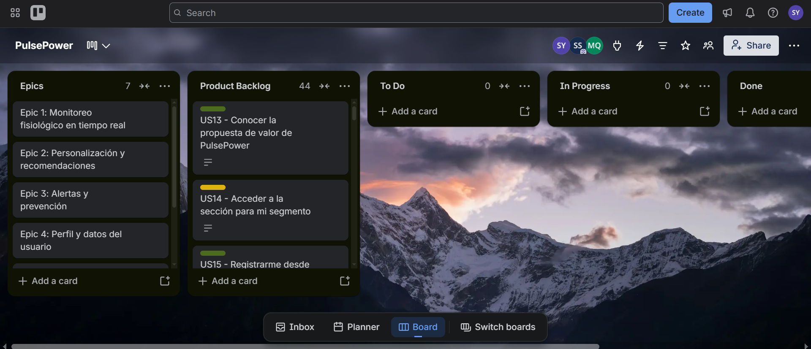

# Capítulo III: Requirements Specification

## 3.1. User Stories

En esta sección se especifican los requisitos de PulsePower mediante User Stories redactadas con la estructura *Como / deseo / para* y criterios de aceptación en formato Gherkin (*Dado / cuando / entonces*). Cada historia se vincula con una Epic funcional y con el Impact y Business Goal al que contribuye, de modo que la trazabilidad no termine en la funcionalidad. La línea completa es la siguiente: Business Goal → Persona/Actor → Impact → Deliverable → User Story → Product Backlog → Sprint → Task → Commit.

Las historias técnicas (redactadas desde el rol Developer) se presentan por separado como **Technical Stories / Enablers**. No aportan valor directo al usuario final, sino que habilitan historias de usuario específicas.

### 3.1.1. Actores y roles

| Rol | Definición | Uso en la especificación |
|---|---|---|
| **Deportista** | Usuario registrado con rutina de entrenamiento o alta exigencia física (Segmento 1; User Personas Walter Navarro, Jesús Arroyo y Yeremy Navarrete). | Historias de recuperación, esfuerzo, planificación y alertas de sobreentrenamiento. |
| **Wellness Seeker** | Usuario registrado que busca mejorar su bienestar general y calidad de sueño (Segmento 2; User Personas Rodrigo Colonio, Alejandro Choquehuanca y Diana Pareja). | Historias de sueño, estrés, hábitos y rutina de descanso. |
| **Deportista o Wellness Seeker** | Cualquier usuario registrado, sin importar su segmento. Reemplaza el término "Usuario Común" utilizado en versiones anteriores. | Funcionalidades compartidas: panel, perfil, suscripción, privacidad y soporte. |
| **Visitante** | Persona no registrada que ingresa a la Landing Page y puede pertenecer a cualquiera de los dos segmentos. | Historias de la Epic EP07 (Landing Page). |
| **Developer** | Integrante del equipo de desarrollo de PulsePower. | Solo en Technical Stories (TS). No se utiliza en User Stories. |

### 3.1.2. Business Goals e Impacts de referencia

Los Business Goals BG01 y BG02 provienen de los Impact Maps (sección 3.2). BG03, BG04 y BG05 provienen de los Business Outcome Assumptions del Lean UX Process (sección 1.2.2.2). Todas las metas son objetivos de validación propuestos por el equipo y no resultados comprobados.

| ID | Business Goal |
|---|---|
| **BG01** | Lograr que el 60 % de los deportistas registrados reduzca en 50 % su riesgo de sobreentrenamiento durante los primeros 3 meses de uso, ajustando la intensidad de sus entrenamientos con base en su recuperación fisiológica. |
| **BG02** | Lograr que el 60 % de los Wellness Seekers registrados mejore en 40 % la calidad percibida de su descanso durante los primeros 3 meses de uso. |
| **BG03** | Lograr que la mayoría de los usuarios registrados configure su perfil y vincule su pulsera en su primera sesión (Hipótesis 1 y 2). |
| **BG04** | Validar la propuesta de valor con visitantes de ambos segmentos y convertir visitas de la Landing Page en registros. |
| **BG05** | Sostener el uso recurrente y la suscripción Pro mediante seguimiento histórico que demuestre resultados acumulados (Hipótesis 6 y 7). |

| ID | Actor | Impact (cambio de comportamiento esperado) | Business Goal |
|---|---|---|---|
| **IM01** | Deportista | Deja de entrenar a ciegas y consulta su nivel de recuperación y sus variables fisiológicas antes de decidir la intensidad del entrenamiento. | BG01 |
| **IM02** | Deportista | Deja de descubrir el sobreentrenamiento cuando ya afectó su rendimiento y ajusta su carga a tiempo a partir de recomendaciones y alertas. | BG01 |
| **IM03** | Wellness Seeker | Deja de evaluar su descanso solo por cómo se siente al despertar y consulta un resumen claro de su sueño y su estrés. | BG02 |
| **IM04** | Wellness Seeker | Deja de mantener malos hábitos de sueño por falta de guía y ajusta su rutina de descanso con sugerencias y alertas oportunas. | BG02 |
| **IM05** | Deportista o Wellness Seeker | Completa su perfil y vincula su pulsera en la primera sesión porque confía en el tratamiento de sus datos. | BG03 |
| **IM06** | Visitante | Comprende la propuesta de valor, identifica el beneficio para su segmento y decide registrarse. | BG04 |
| **IM07** | Deportista o Wellness Seeker | Revisa su progreso histórico y continúa usando la plataforma más allá del periodo de novedad inicial. | BG05 |

### 3.1.3. Epics

| Epic ID | Título | Descripción |
|---|---|---|
| EP01 | Monitoreo fisiológico | Agrupa las historias de consulta e integración de variables fisiológicas (recuperación, sueño, esfuerzo y estrés). |
| EP02 | Personalización y recomendaciones | Agrupa las historias de recomendaciones y planificación ajustadas al perfil y al estado del usuario. |
| EP03 | Alertas y prevención | Agrupa las historias de alertas tempranas y configuración de notificaciones. |
| EP04 | Perfil, onboarding y datos del usuario | Agrupa las historias de registro, configuración inicial, vinculación de la pulsera y privacidad. |
| EP05 | Reportes y seguimiento | Agrupa las historias de tendencias, comparaciones y reportes de progreso. |
| EP06 | Fidelización y comunidad | Agrupa las historias de rachas, logros y avances compartidos. |
| EP07 | Landing Page | Agrupa las historias del sitio web estático informativo dirigido a visitantes. |
| EP08 | Suscripción y soporte | Agrupa las historias de gestión de la suscripción, centro de ayuda y soporte técnico. |

### 3.1.4. User Stories

| Story ID | Título | Descripción | Criterios de Aceptación | Epic | Impact / BG |
|---|---|---|---|---|---|
| US01 | Ver mi nivel de recuperación actual | Como Deportista, deseo visualizar mi nivel de recuperación actual, para decidir la intensidad de mi entrenamiento con información objetiva en lugar de mi percepción. | **E1 – Datos suficientes:** Dado que el Deportista tiene datos sincronizados de las últimas 24 horas, cuando consulta su recuperación, entonces el sistema muestra el nivel calculado, su interpretación (entrenar, reducir intensidad o descansar) y la hora de la última sincronización. **E2 – Datos insuficientes:** Dado que el Deportista no tiene datos de las últimas 24 horas, cuando consulta su recuperación, entonces el sistema indica que no hay datos suficientes para el cálculo y muestra la fecha del último registro disponible. **E3 – Pulsera desconectada:** Dado que la pulsera del Deportista figura como desconectada, cuando consulta su recuperación, entonces el sistema informa el estado de la conexión y ofrece la opción de volver a vincularla. | EP01 | IM01 / BG01 |
| US02 | Ver resumen de sueño al despertar | Como Wellness Seeker, deseo visualizar un resumen de mi calidad de sueño al despertar, para saber si realmente descansé lo suficiente sin depender solo de cómo me siento. | **E1 – Noche registrada:** Dado que el Wellness Seeker registró un ciclo de sueño completo, cuando consulta su resumen matutino, entonces el sistema muestra la duración, las fases, la calidad de esa noche y una explicación en lenguaje sencillo. **E2 – Registro incompleto:** Dado que el ciclo de sueño de esa noche está incompleto, cuando consulta su resumen, entonces el sistema muestra los datos parciales e indica expresamente que el resumen es parcial. **E3 – Sin registro:** Dado que no existe registro de sueño de la noche anterior, cuando consulta su resumen, entonces el sistema informa la ausencia de datos y ofrece registrar el sueño manualmente. | EP01 | IM03 / BG02 |
| US03 | Ver variables fisiológicas centralizadas | Como Deportista o Wellness Seeker, deseo visualizar mis variables fisiológicas (VFC, esfuerzo y sueño) en una sola vista, para interpretar mi estado de forma conjunta y no revisar métricas por separado. | **E1 – Variables disponibles:** Dado que el usuario tiene datos de al menos una variable, cuando ingresa a su panel, entonces el sistema muestra todas las variables disponibles en una sola vista, cada una con su unidad, periodo de referencia y última actualización. **E2 – Variable faltante:** Dado que una de las variables no tiene datos, cuando el usuario ingresa a su panel, entonces el sistema muestra esa variable como "sin datos" sin ocultar las demás. | EP01 | IM01, IM03 / BG01, BG02 |
| US04 | Recibir recomendaciones de entrenamiento personalizadas | Como Deportista, deseo recibir recomendaciones de entrenamiento ajustadas a mi estado fisiológico, para reducir mi carga a tiempo y evitar el sobreentrenamiento. | **E1 – Recomendación contextualizada:** Dado que el sistema cuenta con el historial y el estado actual del Deportista, cuando genera una recomendación, entonces esta indica la acción sugerida (entrenar, reducir intensidad o descansar) y los datos que la sustentan. **E2 – Estados distintos:** Dados dos estados de recuperación distintos del mismo Deportista, cuando se generan sus recomendaciones, entonces el contenido de ambas es diferente. **E3 – Historial insuficiente:** Dado que el Deportista tiene menos de 3 días de datos, cuando solicita una recomendación, entonces el sistema indica que la recomendación es preliminar y cuántos días de datos faltan. | EP02 | IM02 / BG01 |
| US05 | Recibir sugerencias de rutina de sueño | Como Wellness Seeker, deseo recibir sugerencias sobre cambios en mi rutina de sueño, para corregir hábitos de descanso que hoy no sé cómo mejorar. | **E1 – Tendencia detectada:** Dado que el Wellness Seeker tiene al menos cinco días de registros de sueño, cuando el sistema detecta una tendencia de descanso insuficiente, entonces genera una sugerencia de ajuste vinculada a esa tendencia. **E2 – Datos insuficientes:** Dado que el Wellness Seeker tiene menos de cinco días de registros, cuando consulta sus sugerencias, entonces el sistema informa cuántos días faltan para generarlas. | EP02 | IM04 / BG02 |
| US06 | Consultar proyección de recuperación con IA | Como Deportista o Wellness Seeker, deseo consultar al asistente de IA mi recuperación proyectada, para planificar mi semana de entrenamiento y descanso antes de acumular fatiga. | **E1 – Proyección disponible:** Dado que el usuario tiene al menos siete días de datos, cuando pregunta al asistente por su recuperación futura, entonces el sistema responde con una proyección basada en su historial, identificada expresamente como estimación. **E2 – Historial insuficiente:** Dado que el usuario tiene menos de siete días de datos, cuando realiza la consulta, entonces el asistente explica que aún no puede proyectar y cuántos días de datos faltan. **E3 – Servicio de IA no disponible:** Dado que el proveedor de IA no responde, cuando el usuario realiza la consulta, entonces el sistema muestra un mensaje de error y conserva la pregunta para reintentarla. | EP02 | IM01 / BG01 |
| US07 | Recibir alerta de riesgo de sobreentrenamiento | Como Deportista, deseo recibir una alerta cuando mis señales indiquen riesgo de sobreentrenamiento, para reducir mi carga antes de que afecte mi rendimiento. | **E1 – Umbral superado:** Dado que las variables del Deportista superan el umbral de riesgo definido, cuando el sistema procesa la sincronización que lo detecta, entonces genera una alerta dentro de los 30 minutos siguientes, con la variable que la originó. **E2 – Sin duplicados:** Dado que ya existe una alerta activa del mismo tipo en el día, cuando se vuelve a superar el umbral, entonces el sistema actualiza la alerta existente y no crea una nueva. | EP03 | IM02 / BG01 |
| US08 | Recibir alerta de descanso insuficiente sostenido | Como Wellness Seeker, deseo recibir una alerta cuando mi descanso sea insuficiente de forma sostenida, para ajustar mi rutina antes de que afecte mi energía diaria. | **E1 – Patrón sostenido:** Dado que el Wellness Seeker registra menos del mínimo de sueño definido durante tres días consecutivos, cuando el sistema evalúa ese patrón, entonces genera una alerta de descanso insuficiente. **E2 – Día sin registro:** Dado que uno de los tres días no tiene registro de sueño, cuando el sistema evalúa el patrón, entonces no genera la alerta e informa que faltan datos para evaluarlo. | EP03 | IM04 / BG02 |
| US09 | Registrar perfil de Deportista | Como Deportista, deseo registrar mi perfil (objetivos de entrenamiento, rutina e historial físico), para que las recomendaciones consideren mi contexto desde el inicio. | **E1 – Registro válido:** Dado que el Deportista completó los campos obligatorios de su perfil, cuando confirma el registro, entonces el sistema guarda el perfil y lo asocia a sus futuras recomendaciones. **E2 – Campos incompletos o inválidos:** Dado que el Deportista deja campos obligatorios vacíos o con formato inválido, cuando confirma el registro, entonces el sistema no guarda el perfil y señala cada campo que debe corregir. | EP04 | IM05 / BG03 |
| US10 | Proteger datos fisiológicos del usuario | Como Deportista o Wellness Seeker, deseo que mis datos fisiológicos se transmitan y almacenen de forma protegida, para confiar mi información personal a la plataforma. | **E1 – Transmisión cifrada:** Dado que la WebApp intercambia datos fisiológicos con la API, cuando se realiza la comunicación, entonces esta se efectúa exclusivamente mediante HTTPS/TLS. **E2 – Acceso no autorizado:** Dado que un usuario autenticado solicita datos fisiológicos de otro usuario, cuando la API procesa la solicitud, entonces la rechaza con un error de autorización y no devuelve datos. | EP04 | IM05 / BG03 |
| US11 | Generar reporte periódico de progreso | Como Deportista, deseo generar un reporte periódico de mi progreso y recuperación, para comprobar si mis ajustes de carga están funcionando y mantener mi seguimiento. | **E1 – Periodo con datos:** Dado que el Deportista tiene datos de al menos una semana, cuando solicita un reporte, entonces el sistema genera un documento con la evolución de sus variables de entrenamiento y recuperación en ese periodo. **E2 – Periodo sin datos suficientes:** Dado que el Deportista tiene menos de una semana de datos, cuando solicita un reporte, entonces el sistema indica que no es posible generarlo y desde qué fecha estará disponible. | EP05 | IM07 / BG05 |
| US12 | Ver rachas y logros de uso | Como Deportista o Wellness Seeker, deseo ver mis rachas y logros de monitoreo continuo, para mantener el hábito de consultar mi estado cada día. | **E1 – Racha activa:** Dado que el usuario registra datos en días consecutivos, cuando ingresa a la sección de logros, entonces el sistema muestra la racha actual y los logros obtenidos. **E2 – Racha interrumpida:** Dado que el usuario no registró datos el día anterior, cuando ingresa a la sección de logros, entonces el sistema reinicia la racha sin eliminar los logros obtenidos y muestra un mensaje que no genera culpa. | EP06 | IM07 / BG05 |
| US13 | Conocer la propuesta de valor de PulsePower | Como Visitante, deseo conocer la propuesta de valor de PulsePower en la página principal, para decidir si el producto responde a mi necesidad de entender mi cuerpo. | **E1 – Carga de la página:** Dado que el Visitante ingresa a la Landing Page, cuando la página termina de cargar, entonces se presentan la propuesta de valor, el funcionamiento en pasos y las funcionalidades principales. **E2 – Navegación:** Dado que el Visitante selecciona una opción del menú, cuando se ejecuta la acción, entonces la página se desplaza a la sección correspondiente. **E3 – Dispositivo móvil:** Dado que el Visitante accede desde un teléfono, cuando se carga la página, entonces el contenido se muestra en una sola columna, sin desplazamiento horizontal, y el menú se agrupa en un botón desplegable. | EP07 | IM06 / BG04 |
| US14 | Identificar los beneficios para mi segmento | Como Visitante, deseo identificar en la Landing Page los beneficios específicos para deportistas o para personas enfocadas en su bienestar, para reconocer si PulsePower resuelve mi problema particular. | **E1 – Selección de segmento:** Dado que el Visitante está en la sección de beneficios, cuando selecciona "Deportista" o "Bienestar", entonces se muestra el contenido correspondiente a ese segmento. **E2 – Cambio de segmento:** Dado que el Visitante está viendo el contenido de un segmento, cuando selecciona el otro, entonces el contenido se reemplaza sin recargar la página. | EP07 | IM06 / BG04 |
| US15 | Iniciar mi registro desde la Landing Page | Como Visitante, deseo iniciar mi registro desde un call-to-action de la Landing Page, para comenzar a usar PulsePower sin buscar cómo registrarme. | **E1 – Redirección:** Dado que el Visitante presiona el call-to-action de registro, cuando se ejecuta la acción, entonces el sistema lo redirige a la vista de registro de la WebApp. **E2 – Idioma conservado:** Dado que el Visitante seleccionó un idioma en la Landing Page, cuando es redirigido a la WebApp, entonces la vista de registro se muestra en ese mismo idioma. | EP07 | IM06 / BG04 |
| US19 | Configurar objetivos de entrenamiento en el onboarding | Como Deportista, deseo completar un asistente de configuración inicial de mis objetivos de entrenamiento, para recibir recomendaciones útiles desde el primer uso. | **E1 – Asistente completado:** Dado que el Deportista inicia sesión por primera vez, cuando completa el asistente, entonces el sistema guarda sus objetivos y los usa en la primera recomendación generada. **E2 – Asistente interrumpido:** Dado que el Deportista abandona el asistente antes de terminarlo, cuando vuelve a iniciar sesión, entonces el sistema retoma el asistente desde el último paso guardado. | EP04 | IM05 / BG03 |
| US20 | Configurar objetivos de bienestar en el onboarding | Como Wellness Seeker, deseo completar un asistente de configuración inicial de mis objetivos de descanso y bienestar, para recibir sugerencias útiles desde el primer uso. | **E1 – Asistente completado:** Dado que el Wellness Seeker inicia sesión por primera vez, cuando completa el asistente, entonces el sistema guarda sus objetivos y los usa en la primera sugerencia generada. **E2 – Asistente interrumpido:** Dado que el Wellness Seeker abandona el asistente antes de terminarlo, cuando vuelve a iniciar sesión, entonces el sistema retoma el asistente desde el último paso guardado. | EP04 | IM05 / BG03 |
| US21 | Vincular pulsera durante el onboarding | Como Deportista o Wellness Seeker, deseo vincular mi pulsera compatible durante el onboarding, para empezar a recibir mis datos sin configuraciones adicionales. | **E1 – Vinculación exitosa:** Dado que el usuario autoriza el acceso de PulsePower a su cuenta en AIoTI, cuando confirma la vinculación, entonces el sistema registra la pulsera como vinculada y muestra la hora de la primera sincronización. **E2 – Autorización denegada:** Dado que el usuario rechaza la autorización en AIoTI, cuando regresa a PulsePower, entonces el sistema informa que la pulsera no fue vinculada y permite reintentar u omitir el paso. **E3 – Error de sincronización:** Dado que AIoTI no responde durante la vinculación, cuando el sistema intenta la primera sincronización, entonces informa el error y conserva el estado "pendiente de sincronizar". | EP04 | IM05 / BG03 |
| US22 | Sincronizar entrenamientos con apps de salud externas | Como Deportista, deseo sincronizar las sesiones de entrenamiento registradas en apps externas, para que mi recuperación se calcule con toda mi carga real sin registrarla dos veces. | **E1 – Importación:** Dado que el Deportista autorizó la conexión con otra plataforma, cuando se registra en ella una nueva actividad, entonces el sistema la importa automáticamente a su historial de PulsePower. **E2 – Duplicado:** Dado que la actividad ya existe en el historial de PulsePower, cuando llega la importación, entonces el sistema no la duplica. **E3 – Permiso revocado:** Dado que el Deportista revocó el permiso en la plataforma externa, cuando el sistema intenta sincronizar, entonces marca la conexión como inactiva y lo notifica. | EP01 | IM01 / BG01 |
| US23 | Sincronizar datos de sueño con apps de salud externas | Como Wellness Seeker, deseo sincronizar mis datos de sueño con Apple Health o Google Fit, para consultar todo mi descanso en un solo resumen. | **E1 – Importación:** Dado que el Wellness Seeker autorizó la conexión con su app de salud, cuando se registra en ella un nuevo ciclo de sueño, entonces el sistema lo refleja en su resumen de PulsePower e indica su origen. **E2 – Conflicto de origen:** Dado que existe un registro de la pulsera para la misma noche, cuando llega el registro externo, entonces el sistema conserva ambos identificando su origen y no los suma. | EP01 | IM03 / BG02 |
| US24 | Recibir alerta de batería baja | Como Deportista o Wellness Seeker, deseo recibir una alerta cuando la batería de mi pulsera esté por debajo del 15 %, para no perder días de registro que afecten mis indicadores. | **E1 – Batería baja:** Dado que AIoTI reporta un nivel de batería menor al 15 %, cuando el sistema procesa la sincronización, entonces envía una notificación de batería baja. **E2 – Sin repetición:** Dado que ya se envió la notificación de batería baja, cuando llega otra sincronización con batería menor al 15 %, entonces no se reenvía hasta que la batería haya superado ese nivel. | EP03 | IM01, IM03 / BG01, BG02 |
| US25 | Comparar recuperación semanal | Como Deportista, deseo comparar mi recuperación de esta semana con semanas anteriores, para evaluar si mi carga de entrenamiento es sostenible. | **E1 – Comparación disponible:** Dado que el Deportista tiene datos de al menos dos semanas, cuando solicita la comparación, entonces el sistema presenta ambos periodos con su variación porcentual. **E2 – Una sola semana:** Dado que el Deportista tiene datos de menos de dos semanas, cuando solicita la comparación, entonces el sistema indica que se necesita una semana adicional. | EP05 | IM01 / BG01 |
| US26 | Ver tendencia de sueño mensual | Como Wellness Seeker, deseo ver la tendencia de mi calidad de sueño de los últimos 30 días, para identificar qué hábitos se asocian a mis peores noches. | **E1 – Periodo completo:** Dado que el Wellness Seeker tiene 30 días de datos de sueño, cuando solicita la tendencia, entonces el sistema presenta la evolución diaria del periodo. **E2 – Periodo incompleto:** Dado que el Wellness Seeker tiene menos de 30 días de datos, cuando solicita la tendencia, entonces el sistema muestra los días disponibles e indica que el periodo está incompleto. | EP05 | IM03 / BG02 |
| US27 | Ver historial de alertas de sobreentrenamiento | Como Deportista, deseo ver el historial de mis alertas de sobreentrenamiento, para identificar con qué frecuencia se repite el riesgo y ajustar mi planificación. | **E1 – Con alertas:** Dado que el Deportista recibió al menos una alerta, cuando consulta su historial, entonces el sistema lista las alertas emitidas con su fecha y la variable que las originó. **E2 – Sin alertas:** Dado que el Deportista no ha recibido alertas, cuando consulta su historial, entonces el sistema informa que no existen alertas registradas. | EP03 | IM02 / BG01 |
| US28 | Registrar calendario semanal de entrenamientos | Como Deportista, deseo registrar mi calendario semanal de entrenamientos planificados, para que las recomendaciones consideren lo que ya tengo agendado. | **E1 – Sesión planificada:** Dado que el Deportista registró al menos una sesión planificada, cuando el sistema genera la recomendación de ese día, entonces la ajusta considerando la sesión agendada. **E2 – Conflicto de horario:** Dado que el Deportista registra una sesión que se superpone con otra del mismo día, cuando la guarda, entonces el sistema advierte la superposición antes de confirmarla. | EP02 | IM02 / BG01 |
| US29 | Marcar día como descanso activo | Como Deportista, deseo marcar un día como descanso activo, para que mi progreso refleje que el descanso también forma parte de mi plan. | **E1 – Día marcado:** Dado que el Deportista marca un día como descanso activo, cuando el sistema calcula su progreso semanal, entonces excluye ese día del conteo de inactividad. | EP05 | IM07 / BG05 |
| US30 | Recibir sugerencia de reprogramación por baja recuperación | Como Deportista, deseo recibir una sugerencia de reprogramación cuando mi recuperación esté baja el día de un entrenamiento planificado, para no exponerme a una carga que aumente mi riesgo de lesión. | **E1 – Recuperación baja:** Dado que el Deportista tiene un entrenamiento planificado y su recuperación está por debajo del umbral seguro, cuando llega el día de ese entrenamiento, entonces el sistema sugiere reprogramarlo o reducir su intensidad. **E2 – Sin datos del día:** Dado que no hay datos de recuperación del día, cuando llega el día del entrenamiento, entonces el sistema no sugiere reprogramar e informa que no hay datos para evaluarlo. | EP02 | IM02 / BG01 |
| US31 | Registrar nivel de estrés percibido | Como Wellness Seeker, deseo registrar mi nivel de estrés percibido cada día, para descubrir cómo se relaciona con la calidad de mi sueño. | **E1 – Correlación:** Dado que el Wellness Seeker registra su estrés del día, cuando el sistema lo procesa junto con los datos de sueño de esa noche, entonces incluye la relación entre ambos en su resumen semanal. **E2 – Valor fuera de escala:** Dado que el Wellness Seeker ingresa un valor fuera de la escala definida, cuando intenta guardarlo, entonces el sistema no lo registra e indica el rango válido. | EP01 | IM03 / BG02 |
| US32 | Acceder a sesión guiada de respiración | Como Wellness Seeker, deseo acceder a una sesión guiada de respiración antes de dormir, para reducir mi nivel de estrés y mejorar mi descanso. | **E1 – Sesión completada:** Dado que el Wellness Seeker selecciona la sesión guiada, cuando la reproduce hasta el final, entonces el sistema la registra como actividad de bienestar completada ese día. **E2 – Sesión interrumpida:** Dado que el Wellness Seeker cierra la sesión antes de terminarla, cuando el sistema registra la actividad, entonces no la marca como completada. | EP02 | IM04 / BG02 |
| US33 | Configurar horario de desconexión digital | Como Wellness Seeker, deseo configurar un horario recomendado de desconexión digital, para mejorar mi higiene de sueño. | **E1 – Recordatorio:** Dado que el Wellness Seeker configuró una hora de desconexión, cuando se aproxima esa hora, entonces el sistema envía un recordatorio de desconexión. | EP02 | IM04 / BG02 |
| US34 | Compartir logros semanales con un grupo de entrenamiento | Como Deportista, deseo compartir mi logro semanal de recuperación con un grupo de entrenamiento, para sostener mi constancia con el apoyo de mis compañeros. | **E1 – Publicación privada:** Dado que el Deportista completa un logro semanal, cuando lo comparte con su grupo, entonces el sistema publica el logro visible solo para los miembros de ese grupo. **E2 – Retirar publicación:** Dado que el Deportista compartió un logro, cuando decide retirarlo, entonces el logro deja de ser visible para el grupo. | EP06 | IM07 / BG05 |
| US35 | Compartir progreso de bienestar con un contacto | Como Wellness Seeker, deseo compartir mi progreso de bienestar de forma privada con un contacto de confianza, para sostener mis cambios de hábitos con apoyo. | **E1 – Compartir:** Dado que el Wellness Seeker selecciona un contacto, cuando confirma el envío, entonces el sistema comparte la vista de progreso únicamente con ese contacto. **E2 – Revocar acceso:** Dado que el contacto tiene acceso al progreso, cuando el Wellness Seeker revoca el acceso, entonces el contacto deja de visualizarlo. | EP06 | IM07 / BG05 |
| US36 | Comparar los planes Basic y Pro | Como Visitante, deseo comparar los beneficios y precios de los planes Basic y Pro, para decidir con transparencia qué plan se ajusta a mí. | **E1 – Comparación:** Dado que el Visitante accede a la sección de planes, cuando la visualiza, entonces se muestran las funcionalidades y el precio de cada plan. **E2 – Periodo de facturación:** Dado que el Visitante está en la sección de planes, cuando alterna entre facturación mensual y anual, entonces los precios se actualizan sin recargar la página. | EP07 | IM06 / BG04 |
| US37 | Cancelar suscripción Pro | Como Deportista o Wellness Seeker, deseo cancelar mi suscripción Pro en cualquier momento desde mi cuenta, para mantener el control sobre lo que pago sin depender de soporte. | **E1 – Cancelación:** Dado que el usuario tiene una suscripción Pro activa, cuando confirma la cancelación, entonces el sistema la desactiva al finalizar el periodo pagado y muestra esa fecha. **E2 – Cancelación abandonada:** Dado que el usuario inicia la cancelación, cuando no la confirma, entonces la suscripción se mantiene sin cambios. | EP08 | IM07 / BG05 |
| US38 | Consultar centro de ayuda | Como Deportista o Wellness Seeker, deseo acceder a un centro de ayuda con preguntas frecuentes, para resolver dudas comunes sin interrumpir mi uso de la plataforma. | **E1 – Resultados:** Dado que el usuario ingresa a la sección de ayuda, cuando busca un término relacionado con su duda, entonces el sistema presenta los artículos relacionados. **E2 – Sin resultados:** Dado que no existen artículos para el término buscado, cuando se realiza la búsqueda, entonces el sistema lo informa y ofrece contactar a soporte técnico. | EP08 | IM07 / BG05 |
| US39 | Contactar a soporte técnico | Como Deportista o Wellness Seeker, deseo contactar a soporte técnico desde la app, para resolver problemas con mi pulsera o mis datos sin abandonar la plataforma. | **E1 – Ticket creado:** Dado que el usuario completa el formulario de contacto, cuando lo envía, entonces el sistema genera un ticket y muestra su número de seguimiento. **E2 – Formulario incompleto:** Dado que el usuario no describe el problema, cuando intenta enviar el formulario, entonces el sistema no lo envía e indica el campo faltante. | EP08 | IM07 / BG05 |
| US40 | Configurar horario de notificaciones de entrenamiento | Como Deportista, deseo configurar en qué horarios recibo notificaciones de entrenamiento, para atender las alertas sin que se conviertan en interrupciones que termine desactivando. | **E1 – Fuera de rango:** Dado que el Deportista definió un rango horario permitido, cuando se genera una notificación fuera de ese rango, entonces el sistema la posterga hasta el siguiente horario permitido. **E2 – Alerta crítica:** Dado que se genera una alerta de riesgo de sobreentrenamiento fuera del rango, cuando el sistema la procesa, entonces la registra en el historial de alertas para que el Deportista la revise al ingresar. | EP03 | IM02 / BG01 |
| US41 | Configurar recordatorio de rutina de sueño | Como Wellness Seeker, deseo configurar un recordatorio para iniciar mi rutina de sueño a una hora específica, para mantener horarios de descanso consistentes. | **E1 – Recordatorio:** Dado que el Wellness Seeker configuró una hora de recordatorio, cuando llega esa hora, entonces el sistema envía la notificación de inicio de rutina de sueño. **E2 – Recordatorio desactivado:** Dado que el Wellness Seeker desactivó el recordatorio, cuando llega la hora configurada, entonces el sistema no envía la notificación. | EP03 | IM04 / BG02 |
| US42 | Exportar historial de entrenamiento en PDF | Como Deportista, deseo exportar mi historial de entrenamiento en PDF, para revisarlo con mi entrenador y ajustar mi planificación. | **E1 – Exportación:** Dado que el Deportista tiene datos de al menos una semana, cuando solicita la exportación, entonces el sistema genera un PDF descargable con ese historial. **E2 – Sin datos:** Dado que el Deportista no tiene datos en el periodo seleccionado, cuando solicita la exportación, entonces el sistema no genera el archivo e informa el motivo. | EP05 | IM07 / BG05 |
| US43 | Exportar historial de sueño en PDF | Como Wellness Seeker, deseo exportar mi historial de sueño en PDF, para revisarlo con mi médico de cabecera. | **E1 – Exportación:** Dado que el Wellness Seeker tiene datos de al menos una semana, cuando solicita la exportación, entonces el sistema genera un PDF descargable con ese historial. **E2 – Sin datos:** Dado que el Wellness Seeker no tiene datos en el periodo seleccionado, cuando solicita la exportación, entonces el sistema no genera el archivo e informa el motivo. | EP05 | IM07 / BG05 |
| US44 | Eliminar cuenta y datos asociados | Como Deportista o Wellness Seeker, deseo eliminar mi cuenta y todos mis datos asociados, para ejercer mi derecho de privacidad si decido dejar de usar la plataforma. | **E1 – Eliminación confirmada:** Dado que el usuario solicita eliminar su cuenta y confirma la acción, cuando el sistema procesa la solicitud, entonces elimina de forma permanente su perfil y sus datos asociados en un plazo no mayor a 30 días y le envía una confirmación. **E2 – Suscripción activa:** Dado que el usuario tiene una suscripción Pro activa, cuando solicita eliminar su cuenta, entonces el sistema le informa que la suscripción será cancelada antes de pedir la confirmación. | EP04 | IM05 / BG03 |
| US45 | Consultar la Landing Page en mi idioma | Como Visitante, deseo cambiar el idioma de la Landing Page entre español e inglés, para comprender la propuesta de valor sin barreras de idioma. | **E1 – Cambio de idioma:** Dado que el Visitante está en la Landing Page, cuando selecciona "ES" o "EN", entonces todos los textos visibles se muestran en el idioma elegido sin recargar la página. **E2 – Idioma del documento:** Dado que el Visitante cambió el idioma, cuando se aplica el cambio, entonces el atributo `lang` del documento se actualiza al idioma seleccionado. | EP07 | IM06 / BG04 |
| US46 | Consultar términos y política de privacidad | Como Visitante, deseo consultar los términos del servicio y la política de privacidad desde la Landing Page, para saber cómo se tratarán mis datos antes de registrarme. | **E1 – Acceso:** Dado que el Visitante está en la Landing Page, cuando selecciona "Términos" o "Privacidad" en el pie de página, entonces se abre la página correspondiente. **E2 – Retorno:** Dado que el Visitante está en una página legal, cuando selecciona regresar, entonces vuelve a la Landing Page. | EP07 | IM06 / BG04 |

> **Nota de trazabilidad:** los identificadores US16, US17 y US18 de la versión anterior se retiran y quedan reemplazados por TS01, TS02 y TS03 (sección 3.1.5). No se reutilizan para mantener la trazabilidad con el tablero de Trello y con versiones previas del informe. Las historias US45 y US46 se incorporaron formalmente porque la Landing Page implementada en el Sprint 1 incluye soporte bilingüe y páginas legales que no estaban especificados.

### 3.1.5. Technical Stories (Enablers)

Las Technical Stories no entregan valor directo al usuario final, pero son necesarias para implementar las User Stories que habilitan. TS01–TS03 se relacionan con la Epic funcional y el Bounded Context de las historias que soportan. TS04 corresponde a EP07, Landing Page.

| TS ID | Título | Descripción | Criterios de Aceptación | Epic | Habilita | Bounded Context |
|---|---|---|---|---|---|---|
| TS01 (antes US16) | Exponer endpoint de estado de recuperación | Como Developer, deseo exponer un endpoint que retorne el estado de recuperación calculado de un usuario, para que la WebApp muestre al Deportista su recuperación actual. | **E1:** Dado un `GET /api/v1/users/{userId}/recovery-assessments/latest` con un `userId` válido y un token del mismo usuario, cuando el servicio procesa la solicitud, entonces retorna `200` con el nivel de recuperación, su interpretación y la fecha de cálculo. **E2:** Dado que el usuario no tiene evaluaciones, cuando se procesa la solicitud, entonces retorna `404` con un mensaje descriptivo. **E3:** Dado un token de otro usuario, cuando se procesa la solicitud, entonces retorna `403`. | EP01 | US01, US03 | Physiological Analysis & Recommendations |
| TS02 (antes US17) | Exponer endpoint de registro de perfil | Como Developer, deseo exponer un endpoint que reciba los datos de perfil de un nuevo usuario, para que el onboarding persista el perfil y los objetivos. | **E1:** Dado un `POST /api/v1/profiles` con un body válido, cuando el servicio procesa la solicitud, entonces retorna `201` con el identificador del perfil creado. **E2:** Dado un body inválido, cuando se procesa la solicitud, entonces retorna `400` con el detalle de cada campo inválido. **E3:** Dado que el usuario ya tiene un perfil, cuando se procesa la solicitud, entonces retorna `409`. | EP04 | US09, US19, US20 | Módulo de soporte: Profile |
| TS03 (antes US18) | Exponer endpoint de alertas activas | Como Developer, deseo exponer un endpoint que retorne las alertas activas de un usuario, para que la WebApp muestre las alertas de sobreentrenamiento y descanso insuficiente. | **E1:** Dado un `GET /api/v1/users/{userId}/guidance-alerts?status=ACTIVE`, cuando existen alertas activas, entonces retorna `200` con la lista de alertas. **E2:** Dado que no existen alertas activas, cuando se procesa la solicitud, entonces retorna `200` con una lista vacía. **E3:** Dado un token de otro usuario, cuando se procesa la solicitud, entonces retorna `403`. | EP03 | US07, US08, US27 | Physiological Analysis & Recommendations |
| TS04 | Configurar repositorio y despliegue de la Landing Page | Como Developer, deseo configurar el repositorio de la Landing Page y su publicación en GitHub Pages, para que cada versión aprobada esté disponible públicamente para los visitantes. | **E1:** Dado que un Pull Request se integra en `main`, cuando GitHub Pages procesa la publicación, entonces la versión integrada queda disponible en la URL pública del sitio. **E2:** Dado que un cambio no fue integrado en `main`, cuando se consulta la URL pública, entonces el cambio no aparece publicado. | EP07 | US13, US36, US45, US46 | — (Landing Page) |

## 3.2. Impact Mapping

**Primer Segmento Objetivo - Usuarios con rutinas de entrenamiento o alta exigencia física (Deportistas)**

**Segundo Segmento Objetivo - Personas que buscan mejorar su bienestar general y su calidad de sueño (Wellness Seeker)**

Los Impact Maps representan las historias con mayor contribución directa a los Business Goals BG01 y BG02. La siguiente matriz completa la trazabilidad desde el Business Goal hasta el Product Backlog y el Sprint en que se implementa cada historia. La trazabilidad de todas las historias hacia su Impact se encuentra en la columna *Impact / BG* de la sección 3.1.4.

| Business Goal | User Persona | Impact | Deliverable | User Stories | Orden en Product Backlog | Sprint |
|---|---|---|---|---|---|---|
| BG01 | Walter Navarro, Jesús Arroyo, Yeremy Navarrete | IM01 | Módulo de monitoreo de recuperación | US01, US03 (TS01) | 14, 16 (13) | Por planificar |
| BG01 | Walter Navarro, Jesús Arroyo, Yeremy Navarrete | IM01 | Módulo de proyección con IA y comparación semanal | US06, US25 | 22, 32 | Por planificar |
| BG01 | Walter Navarro, Jesús Arroyo, Yeremy Navarrete | IM02 | Módulo de recomendaciones personalizadas | US04, US30 | 17, 24 | Por planificar |
| BG01 | Walter Navarro, Jesús Arroyo, Yeremy Navarrete | IM02 | Módulo de alertas de riesgo | US07, US27 (TS03) | 20, 34 (19) | Por planificar |
| BG02 | Rodrigo Colonio, Alejandro Choquehuanca, Diana Pareja | IM03 | Módulo de resumen de sueño | US02, US26 | 15, 33 | Por planificar |
| BG02 | Rodrigo Colonio, Alejandro Choquehuanca, Diana Pareja | IM03 | Módulo de registro de estrés | US31, US03 | 28, 16 | Por planificar |
| BG02 | Rodrigo Colonio, Alejandro Choquehuanca, Diana Pareja | IM04 | Módulo de sugerencias de rutina | US05, US33 | 18, 30 | Por planificar |
| BG02 | Rodrigo Colonio, Alejandro Choquehuanca, Diana Pareja | IM04 | Módulo de alertas de descanso | US08, US41 | 21, 42 | Por planificar |
| BG04 | Visitante (ambos segmentos) | IM06 | Landing Page | US13, US45, US36, US46 (TS04) | 1–5 | Sprint 1 (Done) |
| BG04 | Visitante (ambos segmentos) | IM06 | Landing Page | US14, US15 | 6, 7 | Sprint 2; US14 trasladada desde Sprint 1 |

## 3.3. Product Backlog

Link del Product Backlog en Trello: https://trello.com/invite/b/6aa715e59c152274c921e449/ATTI0d63ef4207a820d948329b1211456e537B320132/pulsepower

El Product Backlog prioriza primero las historias de la Landing Page (validación de la propuesta de valor, BG04) y luego las de onboarding (activación, BG03), porque sin perfil ni pulsera vinculada no existen datos para las funcionalidades de monitoreo. TS01–TS03 se priorizan antes de las historias que habilitan; TS04 habilita las historias del mismo Sprint 1. La estimación utiliza la serie de Fibonacci (1, 2, 3, 5, 8). La historia US13 se reestimó de 2 a 5 Story Points durante el refinamiento del Sprint 1, porque abarca todas las secciones informativas de la Landing Page.

| # Orden | Story ID | Título | Descripción | Story Points (1/2/3/5/8) | Sprint |
|---|---|---|---|---|---|
| 1 | US13 | Conocer la propuesta de valor de PulsePower | Como Visitante, deseo conocer la propuesta de valor de PulsePower en la página principal, para decidir si el producto responde a mi necesidad de entender mi cuerpo. | 5 | Sprint 1 |
| 2 | US45 | Consultar la Landing Page en mi idioma | Como Visitante, deseo cambiar el idioma de la Landing Page entre español e inglés, para comprender la propuesta de valor sin barreras de idioma. | 3 | Sprint 1 |
| 3 | US36 | Comparar los planes Basic y Pro | Como Visitante, deseo comparar los beneficios y precios de los planes Basic y Pro, para decidir con transparencia qué plan se ajusta a mí. | 2 | Sprint 1 |
| 4 | US46 | Consultar términos y política de privacidad | Como Visitante, deseo consultar los términos del servicio y la política de privacidad, para saber cómo se tratarán mis datos antes de registrarme. | 1 | Sprint 1 |
| 5 | TS04 | Configurar repositorio y despliegue de la Landing Page | Como Developer, deseo configurar el repositorio y la publicación en GitHub Pages, para que cada versión aprobada esté disponible públicamente. | 2 | Sprint 1 |
| 6 | US14 | Identificar los beneficios para mi segmento | Como Visitante, deseo identificar los beneficios específicos para mi segmento, para reconocer si PulsePower resuelve mi problema particular. | 3 | Sprint 1 → Sprint 2 (no completada) |
| 7 | US15 | Iniciar mi registro desde la Landing Page | Como Visitante, deseo iniciar mi registro desde un call-to-action, para comenzar a usar PulsePower sin buscar cómo registrarme. | 2 | Sprint 2 |
| 8 | TS02 | Exponer endpoint de registro de perfil | Como Developer, deseo exponer un endpoint de registro de perfil, para que el onboarding persista el perfil y los objetivos. | 3 | Sprint 2 |
| 9 | US09 | Registrar perfil de Deportista | Como Deportista, deseo registrar mi perfil, para que las recomendaciones consideren mi contexto desde el inicio. | 3 | Sprint 2 |
| 10 | US19 | Configurar objetivos de entrenamiento en el onboarding | Como Deportista, deseo completar un asistente de configuración inicial de mis objetivos de entrenamiento, para recibir recomendaciones útiles desde el primer uso. | 3 | Sprint 2 |
| 11 | US20 | Configurar objetivos de bienestar en el onboarding | Como Wellness Seeker, deseo completar un asistente de configuración inicial de mis objetivos de descanso, para recibir sugerencias útiles desde el primer uso. | 3 | Sprint 2 |
| 12 | US21 | Vincular pulsera durante el onboarding | Como Deportista o Wellness Seeker, deseo vincular mi pulsera compatible durante el onboarding, para empezar a recibir mis datos sin configuraciones adicionales. | 5 | Sprint 2 |
| 13 | TS01 | Exponer endpoint de estado de recuperación | Como Developer, deseo exponer un endpoint de estado de recuperación, para que la WebApp muestre al Deportista su recuperación actual. | 3 | Por planificar |
| 14 | US01 | Ver mi nivel de recuperación actual | Como Deportista, deseo visualizar mi nivel de recuperación actual, para decidir la intensidad de mi entrenamiento con información objetiva. | 5 | Por planificar |
| 15 | US02 | Ver resumen de sueño al despertar | Como Wellness Seeker, deseo visualizar un resumen de mi calidad de sueño, para saber si realmente descansé lo suficiente. | 3 | Por planificar |
| 16 | US03 | Ver variables fisiológicas centralizadas | Como Deportista o Wellness Seeker, deseo visualizar mis variables fisiológicas en una sola vista, para interpretar mi estado de forma conjunta. | 5 | Por planificar |
| 17 | US04 | Recibir recomendaciones de entrenamiento personalizadas | Como Deportista, deseo recibir recomendaciones ajustadas a mi estado fisiológico, para reducir mi carga a tiempo y evitar el sobreentrenamiento. | 8 | Por planificar |
| 18 | US05 | Recibir sugerencias de rutina de sueño | Como Wellness Seeker, deseo recibir sugerencias sobre mi rutina de sueño, para corregir hábitos de descanso. | 5 | Por planificar |
| 19 | TS03 | Exponer endpoint de alertas activas | Como Developer, deseo exponer un endpoint de alertas activas, para que la WebApp muestre las alertas de sobreentrenamiento y descanso. | 3 | Por planificar |
| 20 | US07 | Recibir alerta de riesgo de sobreentrenamiento | Como Deportista, deseo recibir una alerta de riesgo de sobreentrenamiento, para reducir mi carga antes de que afecte mi rendimiento. | 5 | Por planificar |
| 21 | US08 | Recibir alerta de descanso insuficiente sostenido | Como Wellness Seeker, deseo recibir una alerta de descanso insuficiente sostenido, para ajustar mi rutina antes de que afecte mi energía. | 5 | Por planificar |
| 22 | US06 | Consultar proyección de recuperación con IA | Como Deportista o Wellness Seeker, deseo consultar al asistente de IA mi recuperación proyectada, para planificar mi semana antes de acumular fatiga. | 8 | Por planificar |
| 23 | US28 | Registrar calendario semanal de entrenamientos | Como Deportista, deseo registrar mi calendario semanal de entrenamientos, para que las recomendaciones consideren lo agendado. | 5 | Por planificar |
| 24 | US30 | Recibir sugerencia de reprogramación por baja recuperación | Como Deportista, deseo recibir una sugerencia de reprogramación cuando mi recuperación esté baja, para no aumentar mi riesgo de lesión. | 5 | Por planificar |
| 25 | US29 | Marcar día como descanso activo | Como Deportista, deseo marcar un día como descanso activo, para que mi progreso refleje que el descanso forma parte de mi plan. | 2 | Por planificar |
| 26 | US22 | Sincronizar entrenamientos con apps de salud externas | Como Deportista, deseo sincronizar mis sesiones externas, para que mi recuperación se calcule con toda mi carga real. | 5 | Por planificar |
| 27 | US23 | Sincronizar datos de sueño con apps de salud externas | Como Wellness Seeker, deseo sincronizar mis datos de sueño con Apple Health o Google Fit, para consultar todo mi descanso en un solo resumen. | 5 | Por planificar |
| 28 | US31 | Registrar nivel de estrés percibido | Como Wellness Seeker, deseo registrar mi estrés percibido cada día, para descubrir cómo se relaciona con mi sueño. | 3 | Por planificar |
| 29 | US32 | Acceder a sesión guiada de respiración | Como Wellness Seeker, deseo acceder a una sesión guiada de respiración, para reducir mi estrés y mejorar mi descanso. | 3 | Por planificar |
| 30 | US33 | Configurar horario de desconexión digital | Como Wellness Seeker, deseo configurar un horario de desconexión digital, para mejorar mi higiene de sueño. | 2 | Por planificar |
| 31 | US11 | Generar reporte periódico de progreso | Como Deportista, deseo generar un reporte periódico de mi progreso, para comprobar si mis ajustes de carga están funcionando. | 5 | Por planificar |
| 32 | US25 | Comparar recuperación semanal | Como Deportista, deseo comparar mi recuperación semanal, para evaluar si mi carga es sostenible. | 3 | Por planificar |
| 33 | US26 | Ver tendencia de sueño mensual | Como Wellness Seeker, deseo ver la tendencia de mi sueño de 30 días, para identificar qué hábitos se asocian a mis peores noches. | 3 | Por planificar |
| 34 | US27 | Ver historial de alertas de sobreentrenamiento | Como Deportista, deseo ver mi historial de alertas, para identificar con qué frecuencia se repite el riesgo. | 3 | Por planificar |
| 35 | US12 | Ver rachas y logros de uso | Como Deportista o Wellness Seeker, deseo ver mis rachas y logros, para mantener el hábito de consultar mi estado. | 3 | Por planificar |
| 36 | US34 | Compartir logros semanales con un grupo de entrenamiento | Como Deportista, deseo compartir mi logro semanal con mi grupo, para sostener mi constancia con apoyo. | 3 | Por planificar |
| 37 | US35 | Compartir progreso de bienestar con un contacto | Como Wellness Seeker, deseo compartir mi progreso con un contacto de confianza, para sostener mis cambios de hábitos. | 3 | Por planificar |
| 38 | US42 | Exportar historial de entrenamiento en PDF | Como Deportista, deseo exportar mi historial en PDF, para revisarlo con mi entrenador. | 2 | Por planificar |
| 39 | US43 | Exportar historial de sueño en PDF | Como Wellness Seeker, deseo exportar mi historial de sueño en PDF, para revisarlo con mi médico. | 3 | Por planificar |
| 40 | US37 | Cancelar suscripción Pro | Como Deportista o Wellness Seeker, deseo cancelar mi suscripción Pro desde mi cuenta, para mantener el control sobre lo que pago. | 3 | Por planificar |
| 41 | US40 | Configurar horario de notificaciones de entrenamiento | Como Deportista, deseo configurar mis horarios de notificaciones, para atender las alertas sin que se conviertan en interrupciones. | 2 | Por planificar |
| 42 | US41 | Configurar recordatorio de rutina de sueño | Como Wellness Seeker, deseo configurar un recordatorio de rutina de sueño, para mantener horarios consistentes. | 2 | Por planificar |
| 43 | US24 | Recibir alerta de batería baja | Como Deportista o Wellness Seeker, deseo recibir una alerta de batería baja, para no perder días de registro. | 3 | Por planificar |
| 44 | US38 | Consultar centro de ayuda | Como Deportista o Wellness Seeker, deseo acceder a un centro de ayuda, para resolver dudas sin interrumpir mi uso. | 3 | Por planificar |
| 45 | US39 | Contactar a soporte técnico | Como Deportista o Wellness Seeker, deseo contactar a soporte técnico desde la app, para resolver problemas sin abandonar la plataforma. | 2 | Por planificar |
| 46 | US10 | Proteger datos fisiológicos del usuario | Como Deportista o Wellness Seeker, deseo que mis datos se transmitan y almacenen de forma protegida, para confiar mi información a la plataforma. | 3 | Por planificar |
| 47 | US44 | Eliminar cuenta y datos asociados | Como Deportista o Wellness Seeker, deseo eliminar mi cuenta y mis datos, para ejercer mi derecho de privacidad. | 5 | Por planificar |
