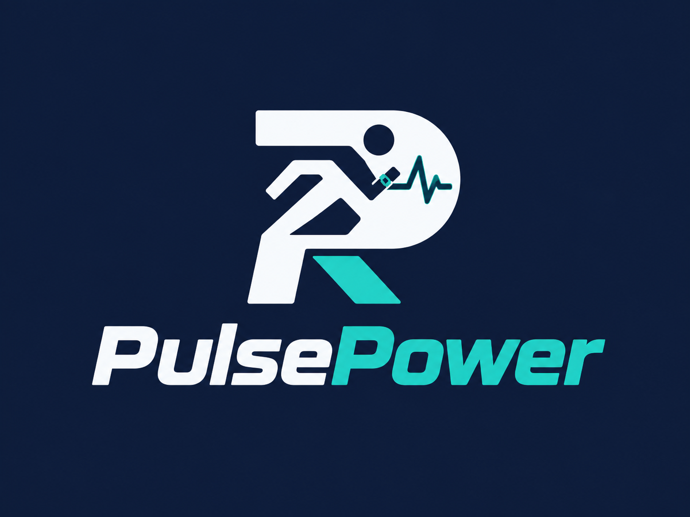
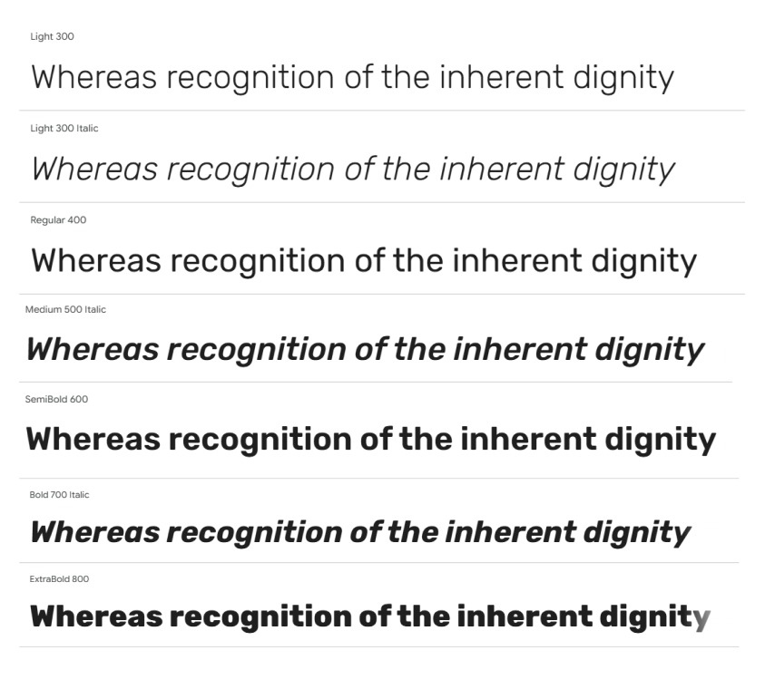
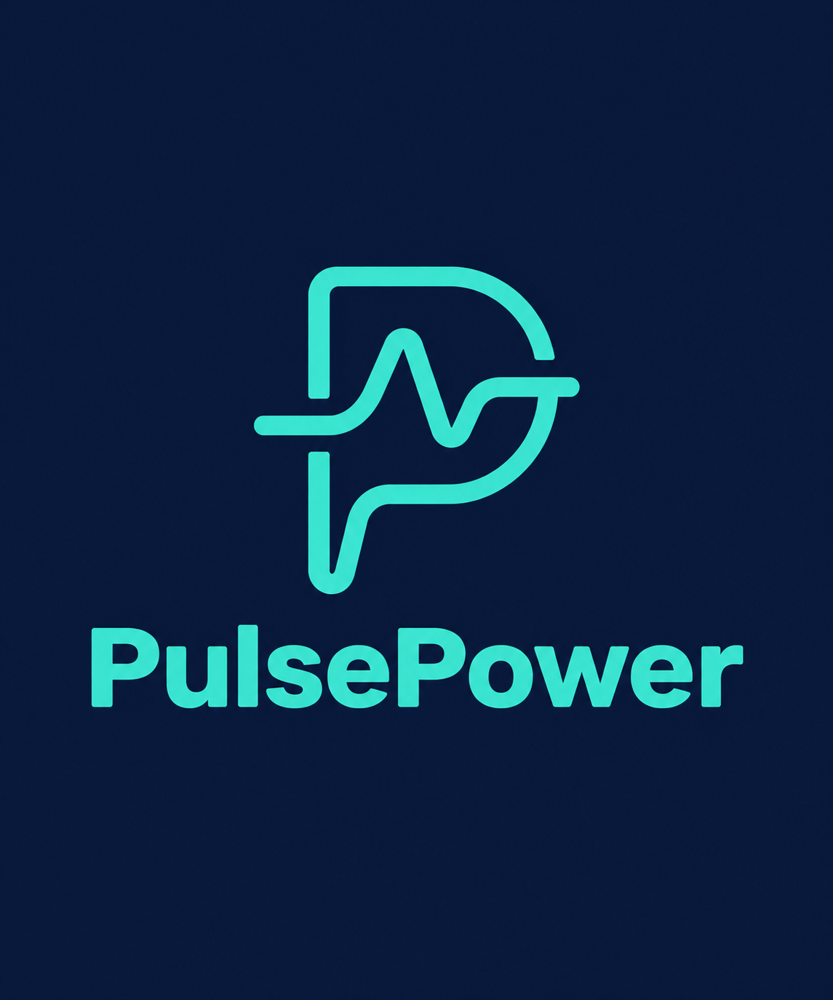
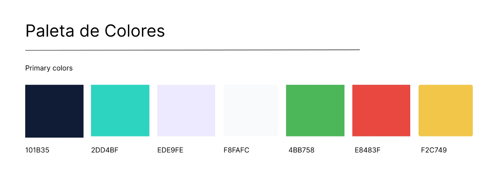

## Capítulo IV: Product Design

### 4.1. Style Guidelines

El diseño visual de PulsePower se orienta a una estética moderna, tecnológica y equilibrada, acorde con su propósito de transformar datos fisiológicos en información comprensible sobre el esfuerzo, el sueño y la recuperación. La interfaz busca transmitir confianza y dinamismo, facilitando la consulta de indicadores sin sobrecargar al usuario.

#### 4.1.1. General Style Guidelines

Estas directrices se aplicarán a la plataforma web y a su Landing Page para mantener una identidad coherente. El diseño considerará las necesidades de ambos segmentos objetivo: personas con rutinas de entrenamiento exigentes y personas interesadas en mejorar su descanso y bienestar cotidiano. Los textos de la interfaz se presentarán en inglés, con etiquetas claras y consistentes.

**Branding**

La identidad de PulsePower conecta dos conceptos centrales: Pulse, relacionado con las señales fisiológicas del cuerpo, y Power, asociado con la energía y la capacidad de actuar a partir de esa información. Esta relación expresa el propósito de la plataforma: ayudar al usuario a comprender su estado y tomar decisiones informadas sobre su rutina.

El logotipo deberá conservar sus proporciones y contar con versiones legibles sobre fondos claros y oscuros. Se evitarán deformaciones, efectos que dificulten su reconocimiento y combinaciones que reduzcan su visibilidad.

La comunicación de marca estará acompañada por el mensaje:

_“Your body speaks every day. Our platform translates it.”_

**Typography**

Se establece **Rubik** como tipografía principal para unificar la identidad visual de **PulsePower**. Sus variantes **Regular, Medium, SemiBold y Bold** permitirán diferenciar títulos, indicadores, descripciones y acciones sin recurrir a múltiples familias tipográficas.

* **Títulos principales (H1/Section Heading):** 5rem (aprox. 50px) en escritorio, 4.5rem (aprox. 45px) en móvil.
* **Subtítulos (H2/Sub-headings):** 3rem (aprox. 30px) en escritorio.
* **Títulos de componentes (H3/H4):** 2rem (aprox. 20px) a 2.5rem (aprox. 25px).
* **Cuerpo del texto (p):** 1.6rem (aprox. 16px) con un interlineado de 1.6.
* **Botones y etiquetas (span):** 1.4rem (aprox. 14px) a 1.8rem (aprox. 18px).

 

**Colors**

La paleta de **PulsePower** combina colores oscuros que aportan estructura con tonos luminosos que destacan acciones y contenidos. Su aplicación busca comunicar energía, claridad y tranquilidad, manteniendo un equilibrio entre rendimiento físico y descanso.

* **Primary (Deep Navy `#101B35`):** títulos, navegación, texto principal y elementos destacados.
* **Secondary (Turquoise `#2DD4BF`):** botones principales, acciones, elementos seleccionados y detalles de marca.
* **Lavender (`#EDE9FE`):** secciones relacionadas con descanso, sueño y recuperación.
* **Background (Cloud White `#F8FAFC`):** fondo general de la plataforma y superficies claras.
* **Success (Green `#4BB758`):** acciones completadas, registros exitosos y estados positivos.
* **Destructive (Red `#E8483F`):** errores, alertas críticas y acciones que requieren atención.
* **Warning (Yellow `#F2C749`):** advertencias, información pendiente y avisos importantes.

**Spacing**

**PulsePower** utilizará una escala de espaciado basada en múltiplos de **4 px** para mantener consistencia entre componentes y facilitar la lectura.

* **Elementos relacionados:** separación de 8 a 12 px entre iconos, etiquetas y descripciones.
* **Campos y componentes:** separación de 16 a 24 px entre controles de formularios y tarjetas.
* **Espaciado interno:** padding de 24 a 32 px en tarjetas de escritorio y de 16 a 24 px en móvil.
* **Secciones principales:** separación vertical de 64 a 96 px en escritorio y de 40 a 56 px en móvil.
* **Márgenes laterales:** mínimo de 16 px en pantallas pequeñas, con contenedores centrados en escritorio.

La información de **recuperación, sueño y esfuerzo** se agrupará en bloques reconocibles. El espacio disponible permitirá distinguir los indicadores principales de las explicaciones y recomendaciones.

**Tono de Comunicación**

La comunicación de **PulsePower** será clara, cercana y respetuosa. Su propósito es ayudar a comprender los registros fisiológicos y acompañar decisiones cotidianas.

* **Tono cercano y profesional:** explicaciones comprensibles para usuarios con distintos niveles de conocimiento.
* **Actitud orientadora:** sugerencias que permitan al usuario evaluar cambios en su rutina, conservando su autonomía.
* **Lenguaje sencillo:** términos como *Recovery*, *Sleep* y *Strain*, acompañados de explicaciones cuando sea necesario.
* **Motivación equilibrada:** reconocer la constancia y valorar tanto la actividad como el descanso, sin generar culpa por interrumpir una racha.
* **Precisión:** distinguir entre registros, estimaciones y recomendaciones, evitando presentar proyecciones como certezas.

#### 4.1.2. Web Style Guidelines

Las directrices de estilo web de **PulsePower** se centran en la claridad de la información, la personalización y la facilidad de uso. Nuestro objetivo es crear una experiencia visual que refleje el propósito de la plataforma: transformar los datos de sueño, esfuerzo y recuperación en información comprensible para acompañar las decisiones diarias de entrenamiento y descanso. La **Landing Page** y la aplicación web mantendrán una identidad coherente, utilizando azul marino, turquesa, lavanda suave y blanco suave como colores principales.

**1) Layout**

* **Sistema de Grid:** Utilizaremos una cuadrícula flexible para organizar el contenido según el espacio disponible. En la **Landing Page**, permitirá distribuir los beneficios, los pasos de uso y los planes de suscripción. En la aplicación web, facilitará la presentación de indicadores de sueño, esfuerzo y recuperación, manteniendo una jerarquía visual clara.

* **Headers y Footers:** El encabezado de la **Landing Page** proporcionará acceso a las secciones principales y a las acciones *Sign In* y *Create Account*. El pie de página reunirá enlaces de contacto, ayuda, privacidad y condiciones de uso. En la aplicación, la navegación permitirá acceder al panel de indicadores, historial, recomendaciones y configuración del perfil.

* **Cards:** Las tarjetas organizarán las funcionalidades, los planes **Basic** y **Pro**, y los indicadores fisiológicos. Utilizarán bordes redondeados, sombras suaves y espacios internos amplios. Cada tarjeta de seguimiento mostrará un título, el indicador correspondiente y su periodo de referencia, facilitando la comprensión de los registros.

**2) Responsive Design**

* **Desktop:** La navegación principal permanecerá visible y el contenido se distribuirá en varias columnas. Los indicadores y gráficos podrán consultarse de forma conjunta para facilitar la comparación entre esfuerzo, sueño y recuperación.

* **Tablet:** La distribución se ajustará preferentemente a dos columnas, conservando la legibilidad de las tarjetas y los formularios. Los controles tendrán suficiente separación para facilitar la interacción táctil.

* **Mobile:** El contenido se organizará en una sola columna y la navegación se agrupará en un menú desplegable. Se priorizará la consulta del resumen diario y las recomendaciones. Los gráficos adaptarán sus etiquetas y dimensiones para que puedan interpretarse sin depender de un desplazamiento horizontal de toda la página.

**3) Interaction Design**

* **Botones:** Las acciones principales utilizarán turquesa (`#2DD4BF`) con texto azul marino (`#101B35`) para destacar dentro de la interfaz. Las acciones secundarias emplearán contornos azul marino o fondos neutros. Se definirán estados visuales al pasar el cursor, seleccionar mediante teclado, presionar y deshabilitar un botón. Las etiquetas estarán en inglés y describirán acciones concretas, como *Connect Your Wearable*, *View Your Progress* y *Choose Pro*.

* **Formularios:** Los formularios de registro, perfil y configuración solicitarán únicamente la información necesaria para cada proceso. Los campos tendrán etiquetas visibles, instrucciones breves y mensajes de error junto al dato que deba corregirse. Las confirmaciones indicarán claramente cuándo la información se haya guardado.

* **Retroalimentación:** La plataforma mostrará estados de carga, confirmaciones de sincronización y avisos cuando falten datos. Los mensajes combinarán texto, iconos y color para explicar lo ocurrido y orientar al usuario sobre el siguiente paso.

* **Recomendaciones y asistente:** Las orientaciones se presentarán mediante mensajes breves, con acceso a explicaciones adicionales. El asistente conversacional utilizará lenguaje cotidiano y distinguirá entre datos registrados, estimaciones y sugerencias.

**4) Images and Icons**

* **Imágenes:** Se utilizarán fotografías e ilustraciones relacionadas con actividad física, descanso, hábitos cotidianos y dispositivos conectados. La selección representará a ambos segmentos objetivo de **PulsePower**. Las imágenes estarán optimizadas para la web y contarán con texto alternativo cuando aporten información.

* **Íconos:** Se empleará un estilo lineal y consistente para representar funciones como sueño, esfuerzo, recuperación, sincronización, reportes y asistencia con IA. Los iconos acompañarán las etiquetas para facilitar su reconocimiento.

* **Coherencia visual:** Las ilustraciones incorporarán los colores de la marca. La lavanda suave (`#EDE9FE`) se utilizará en fondos y detalles relacionados con el descanso, mientras que el turquesa (`#2DD4BF`) destacará la actividad y las acciones principales. El azul marino (`#101B35`) aportará contraste en textos y elementos gráficos, y el blanco suave (`#F8FAFC`) mantendrá la claridad de los fondos.

**5) Repositorio Central**

* **Organización:** Los recursos del proyecto se organizarán en carpetas identificables para imágenes, iconos, tipografías, estilos y componentes. La **Landing Page** mantendrá separados su contenido, presentación y comportamiento interactivo. La aplicación web organizará sus componentes según sus funciones, como monitoreo, recomendaciones, perfil y suscripciones.

* **Estilos compartidos:** Los colores, tamaños tipográficos y espaciados se definirán mediante valores reutilizables. Esto facilitará mantener una apariencia uniforme y aplicar ajustes de diseño de manera consistente.

* **Versionado:** Se utilizarán **Git y GitHub** para registrar cambios y coordinar el trabajo del equipo de **PulsePower**. Las funcionalidades se desarrollarán en ramas independientes y se revisarán antes de integrarlas, manteniendo la trazabilidad de las modificaciones del producto.

### 4.2. Information Architecture

#### 4.2.1. Organization Systems

#### 4.2.2. Labeling Systems

#### 4.2.3. SEO Tags and Meta Tags

#### 4.2.4. Searching Systems
#### 4.2.5. Navigation Systems
### 4.3. Landing Page UI Design
#### 4.3.1. Landing Page Wireframe
#### 4.3.2. Landing Page Mock-up
### 4.4. Web Applications UX/UI Design
#### 4.4.1. Web Applications Wireframes
#### 4.4.2. Web Applications Wireflow Diagrams
#### 4.4.3. Web Applications Mock-ups
#### 4.4.4. Web Applications User Flow Diagrams
### 4.5. Web Applications Prototyping
### 4.6. Domain-Driven Software Architecture
#### 4.6.1. Design-Level EventStorming
#### 4.6.2. Software Architecture Context Diagram
#### 4.6.3. Software Architecture Container Diagrams
#### 4.6.4. Software Architecture Components Diagrams
### 4.7. Software Object-Oriented Design
#### 4.7.1. Class Diagrams
### 4.8. Database Design
#### 4.8.1. Database Diagrams