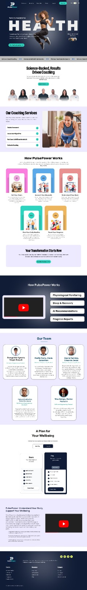

# Capítulo V: Product Implementation, Validation & Deployment
## 5.1. Software Configuration Management
Con el objetivo de garantizar un desarrollo fluido, estandarizado y compatible entre todos los miembros del equipo PulsePower, se ha definido el siguiente entorno de desarrollo para el ecosistema PulsePower
### 5.1.1. Software Development Environment Configuration
Se listan a continuación las herramientas utilizadas a lo largo de todo el ciclo de vida del proyecto, cubriendo desde la gestión hasta el despliegue:

**Project & Requirements Management:**
- Trello: Herramienta SaaS para la gestión ágil del Product Backlog y Sprints. Referencia: trello.com
- UXPressia: Herramienta SaaS para la gestión de requerimientos (Journey Maps, User Personas). Referencia: uxpressia.com
- Product UX/UI Design:
  - Figma: Herramienta SaaS para la elaboración de Wireframes, Mock-ups y Prototipos. Referencia: figma.com
- Herramientas de Desarrollo (IDEs y Editores):
  - WebStorm: IDE para el desarrollo de Frontend & Web App (Extensiones: Angular Language Service, Prettier, ESLint). Descarga: jetbrains.com/webstorm
  - IntelliJ IDEA: IDE optimizado para el desarrollo del Backend con Spring Boot. Descarga: jetbrains.com/idea
- Stack Tecnológico y Entorno de Ejecución:
  - Node.js (LTS v20+): Entorno de ejecución para Angular y la Landing Page. Descarga: nodejs.org
  - Java Development Kit (JDK 17): Entorno base para Spring Boot. Descarga: oracle.com/java
- Herramientas de Pruebas y Documentación:
  - Postman: Testeo y validación de los endpoints del backend. Descarga: postman.com
### 5.1.2. Source Code Management
El código fuente del proyecto se gestionará utilizando Git como sistema de control de versiones y GitHub como plataforma colaborativa, bajo una organización pública que favorece la modularidad y el despliegue independiente de cada componente.

**Estrategia de Ramas (GitFlow)**

Se implementará un flujo de trabajo basado en GitFlow con el objetivo de garantizar la estabilidad y trazabilidad del desarrollo:
- main: Rama principal. Contiene únicamente código estable, probado y desplegado en producción. Cada versión liberada estará debidamente etiquetada.
- develop: Rama de integración continua. Aquí se fusionan todas las nuevas características antes del pase a producción.
- feature/US[ID]-[nombre]: Ramas de desarrollo temporales, creadas a partir de develop para trabajar una User Story específica (ej. feature/US07-user-profile-registration). Una vez finalizadas, se integran nuevamente a develop mediante un Pull Request (PR).
- hotfix/[nombre]: Ramas destinadas a la corrección de errores críticos detectados en producción (main), que requieren una solución inmediata.

**Convenciones de Versionado y Commits**

- Semantic Versioning (SemVer 2.0.0): Los lanzamientos oficiales en la rama main se etiquetarán bajo el formato vMAJOR.MINOR.PATCH (ej. v1.0.0).
- Conventional Commits 1.0.0: Todos los commits seguirán una estructura semántica (tipo(alcance): descripción breve) para generar un historial legible por máquinas y humanos.

- **Tipos permitidos**

- feat: Nueva funcionalidad (ej. feat(auth): add login endpoint)
- fix: Corrección de errores (ej. fix(map): resolve overlap issue)
- docs: Cambios en documentación (ej. docs: update readme)
- style: Cambios de formato que no afectan la lógica del código (espacios, indentación, etc.)

### 5.1.3. Source Code Style Guide & Conventions

Para mantener la legibilidad y calidad del código, todo el equipo aplicará nomenclatura estrictamente en inglés para clases, variables, métodos y bases de datos. Además, se adoptan las siguientes guías de estilo oficiales:
- HTML & CSS: Se seguirán las directrices de la HTML Style Guide and Coding Conventions de W3C y la Google HTML/CSS Style Guide.
- Frontend (Angular / TypeScript): Se respetará la Angular Coding Style Guide. Las clases usarán PascalCase, variables y métodos camelCase, y los archivos kebab-case. Se utilizará Prettier y ESLint para automatizar el formato en cada commit.
- Backend (Spring Boot / Java): Se aplicará la Google Java Style Guide. La arquitectura se dividirá en capas estrictas (Controllers, Services, Repositories, Entities), respetando los seis bounded contexts definidos en el diseño orientado a objetos (Training Management, Sleep Management, Wellness Management, Physiological Analysis & Recommendations, Reporting y Community). Los endpoints RESTful usarán sustantivos en plural (ej. GET /api/v1/training-sessions).
- Requerimientos: Se emplearán las Gherkin Conventions para la redacción estructurada de los criterios de aceptación (Given/When/Then).

### 5.1.4. Software Deployment Configuration

- El despliegue del ecosistema PulsePower combinará métodos de publicación ágil para el Frontend y prácticas de Integración/Despliegue Continuo (CI/CD) para el Backend:
- Landing Page (Sitio Estático): Se desplegará utilizando la infraestructura gratuita de GitHub Pages, configurada para publicar automáticamente cada PR fusionado en main desde el repositorio del Landing Page.
- Frontend (Angular Web App): Se desplegará en la plataforma PaaS Vercel, utilizando su integración nativa con GitHub para publicar automáticamente cada PR fusionado en main.

## 5.2 Landing Page, Services & Applications Implementation

En esta sección se describe el proceso de implementación del producto PulsePower, incluyendo el desarrollo, pruebas, documentación y despliegue de la Landing Page. Para este avance se implementó la primera versión del Landing Page, orientada a presentar la propuesta de valor del sistema: "No puedes rendir más sin recuperarte mejor. Conócete primero."	

### 5.2.1 Sprint 1

En esta sección se describen los principales acuerdos y definiciones realizadas durante el Sprint Planning del Sprint 1, enfocado en la implementación del Landing Page de PulsePower.

#### 5.2.1.1 Sprint Planning 1

**Sprint Planning Background**

| Campo | Detalle |
| :--- | :--- |
| **Sprint #** | Sprint 1 |
| **Date** | 13-09-2025 |
| **Time** | 17:30 |
| **Location** | Reunion Virtual |
| **Prepared By** | Viza Quispe, Marlon Packard |
| **Attendees** | Evangelista Ygnacio, Sergio Joaquin Martin Farro, Alexis Sebastian Carbajal Santivañez, Sebastian Aaron Osorio Ramírez, Eduardo Jesús |
| **Sprint 1 Review Summary** | Durante el Sprint 1 se logró implementar correctamente el Landing Page responsive de PulsePower, incluyendo navegación entre secciones, adaptación móvil y soporte multilenguaje. Además, el equipo consolidó la estructura base del frontend y definió estándares iniciales de trabajo colaborativo utilizando GitFlow y Trello para la gestión de tareas. |
| **Sprint 1 Restrospective Summary** | El equipo identificó como principal fortaleza la capacidad tecnica y la comunicación constante durante el desarrollo del Sprint 1. Sin embargo, se detectaron pequeños retrasos en la delegacion de tareas, por lo que para este sprint se acordó mejorar la coordinación en estas fases y aumentar la frecuencia de revisiones entre integrantes. |

 

**Sprint Goal & User Stories**

| Campo | Detalle |
| :--- | :--- |
| **Sprint 1 Goal** | Our focus is on delivering a fast, static Landing Page (HTML/CSS/JS) with language support to attract clients and validate our value proposition. This will be confirmed when the Landing Page is deployed and fully navigable by users. |
| **Sprint 1 Velocity** | 16 Story Points |
| **Sum of Story Points** | 16 |

#### 5.2.1.2 Aspect Leaders and Collaborators

A continuación se detalla la matriz de liderazgo y colaboración (LACX) para brindar claridad en la comunicación del equipo durante el desarrollo de las tareas de este Sprint.

| Team Member (Last Name, First Name) | GitHub Username | Landing Page UI/UX | Landing Page Structure | Basic Funcs | Special Funcs |
| :--- | :--- | :--- | :--- | :--- | :--- |
| Osorio Ramírez, Eduardo Jesús | @[Iron819] | C | C | L | L |
| Carbajal Santivañez, Sebastian Aaron | @[usuario] | L | C | C | C |
| Martín Farro, Alexis Sebastián | @axismf | C | L | C | C |
| Viza Quispe, Marlon Packard | @[usuario] | C | C | L | C |
| Evangelista Ygnacio, Sergio Joaquin | @[usuario] | C | C | C | L |

*(L = Leader, C = Collaborator)*

#### 5.2.1.3 Sprint Backlog 1

**Sprint #**: Sprint 1

**Sprint #**: Sprint 1

| Story ID | Story Tittle | Task ID | Task Title | Task Description | Estimation (Hours) | Assigned To                          | Status (To-do / In-Process / To-Review / Done) |
| :--- | :--- | :--- | :--- | :--- | :--- |:-------------------------------------| :--- |
| US-00 | Landing Page de Validación | TS00.1 | Setup Static Proj | Inicializar el repositorio del Landing Page con la estructura base HTML5/CSS y configurar el tablero de Trello. | 4 | Evangelista Ygnacio, Sergio Joaquín  | Done |
| US-00 | Landing Page de Validación | TS00.2 | Implement Hero Section | Desarrollar la sección principal (Hero) responsiva con Flexbox/Grid, incluyendo la propuesta de valor de PulsePower. | 6 | Evangelista Ygnacio, Sergio Joaquín  | Done |
| US-00 | Landing Page de Validación | TS00.3 | Maquetar sección "Beneficios" | Crear contenedor y tarjetas informativas sobre los beneficios de la pulsera para deportistas y usuarios de bienestar. | 4 | Martín Farro, Alexis Sebastián       | Done |
| US-00 | Landing Page de Validación | TS00.4 | Grid de funcionalidades | Implementar una cuadrícula responsiva con las funcionalidades principales (indicadores, recomendaciones, reportes). | 4 | Viza Quispe, Marlon Packard          | Done |
| US-00 | Landing Page de Validación | TS00.5 | Selector de idioma | Implementar el mecanismo de cambio de idioma (Español/Inglés) reutilizable en todas las secciones del Landing. | 5 | Osorio Ramírez, Eduardo Jesús        | In Progress |
| US-00 | Landing Page de Validación | TS00.6 | Maquetar sección "Planes" | Desarrollar el layout de la sección de planes de suscripción. | 3 | Carbajal Santivañez, Sebastian Aaron | Done |
| US-00 | Landing Page de Validación | TS00.7 | Header / Navbar | Implementar la barra de navegación superior con enlaces a cada sección y al selector de idioma. | 4 | Martín Farro, Alexis Sebastián       | Done |
| US-00 | Landing Page de Validación | TS00.8 | Maquetar Footer | Añadir información de contacto, redes sociales y datos de la organización SportPlus. | 2 | Viza Quispe, Marlon Packard          | Done |

#### 5.2.1.4 Development Evidence for Sprint Review

Durante el Sprint 1, el equipo avanzó en la implementación del Landing Page, desarrollado en HTML5, CSS3 y JavaScript vanilla, y desplegado en GitHub Pages. Los principales avances incluyeron la estructura base de todas las secciones de la landing (Hero, Funcionalidades, Segmentos, Planes, Testimonios, FAQ, Contacto y Footer), la implementación del diseño responsive con media queries para móvil y tablet, y la habilitación del scroll suave y menú de navegación. A continuación se presentan los commits representativos del repositorio de Landing Page durante este Sprint.  

| Repository | Branch | Commit Id | Commit Message | Commit Message Body | Committed on (Date) |
|---|---|---|---|---|---|
| https://github.com/upc-pre-202620-1asi0729-7737-SportPlus | develop | 4a28dee | Merge pull request #14 from upc-pre-202620-1asi0729-7737-SportPlus/feature/chapter-5 | docs (conclusiones) ; add conclusions and recommendations for pulsepo… | 09/19/2026 |
| https://github.com/upc-pre-202620-1asi0729-7737-SportPlus | main | a36f5a6 | docs(conclusions): fix. | | 09/19/2026 |
| https://github.com/upc-pre-202620-1asi0729-7737-SportPlus | feature/chapter-4 | fcd9333 | docs(cap4): fix images | | 09/19/2026 |
| https://github.com/upc-pre-202620-1asi0729-7737-SportPlus | feature/chapter-5 | dcc4cd1 | docs (conclusiones) ; add conclusions and recommendations for pulsepower project | Document the conclusions and recommendations from the first stage of the PulsePower project, including insights on user needs, hypotheses, design objectives, and future actions. | 09/19/2026 |
| https://github.com/upc-pre-202620-1asi0729-7737-SportPlus | develop | 8093c15 | Merge pull request #13 from upc-pre-202620-1asi0729-7737-SportPlus/feature/chapter-5 | Feature/chapter 5 | 09/19/2026 |
| https://github.com/upc-pre-202620-1asi0729-7737-SportPlus | develop | 2ba74c7 | Merge pull request #12 from upc-pre-202620-1asi0729-7737-SportPlus/feature/chapter-4 | Feature/chapter 4 | 09/19/2026 |
| https://github.com/upc-pre-202620-1asi0729-7737-SportPlus | feature/chapter-2 | c4502a1 | docs(cap2): finish cap2. | | 09/19/2026 |
| https://github.com/upc-pre-202620-1asi0729-7737-SportPlus | feature/chapter-5 | e17abf6 | docs(cap5): add Sprint Backlog 1 | | 09/19/2026 |
| https://github.com/upc-pre-202620-1asi0729-7737-SportPlus | feature/chapter-5 | 4ba4a64 | docs(capt): add Sprint Backlog 1 | | 09/19/2026 |
| https://github.com/upc-pre-202620-1asi0729-7737-SportPlus | feature/chapter-5 | 8bd886a | docs(cap5): add Aspect Leaders and Collaborators | | 09/18/2026 |
| https://github.com/upc-pre-202620-1asi0729-7737-SportPlus | feature/chapter-5 | 94ddff3 | docs(cap5): add Sprint planning 1 | | 09/18/2026 |
| https://github.com/upc-pre-202620-1asi0729-7737-SportPlus | feature/chapter-4 | 76e9c38 | Update chapter4.md | Added related images and more content of the remaining chapter | 09/18/2026 |
| https://github.com/upc-pre-202620-1asi0729-7737-SportPlus | feature/chapter-5 | 84e4aaf | docs(cap5): add Landing Page, Services & Applications Implementation description | | 09/18/2026 |
| https://github.com/upc-pre-202620-1asi0729-7737-SportPlus | feature/chapter-5 | 0a95013 | docs(cap5): add Software Deployment Configuration | | 09/18/2026 |
| https://github.com/upc-pre-202620-1asi0729-7737-SportPlus | feature/chapter-5 | 5c297a2 | docs(cap5): add Source Code Style Guide & Conventions | | 09/18/2026 |
| https://github.com/upc-pre-202620-1asi0729-7737-SportPlus | feature/chapter-5 | 2d2bc6f | docs(cap5): add Source Code Management | | 09/18/2026 |
| https://github.com/upc-pre-202620-1asi0729-7737-SportPlus | feature/chapter-5 | 90ded1e | docs(cap5): add Software Development Environment Configuration | | 09/18/2026 |
| https://github.com/upc-pre-202620-1asi0729-7737-SportPlus | feature/chapter-5 | 6341d2d | docs(cap5): add Software Configuration Management | | 09/18/2026 |
| https://github.com/upc-pre-202620-1asi0729-7737-SportPlus | feature/chapter-4 | e9a5a39 | Add ch4 photos | | 09/18/2026 |
| https://github.com/upc-pre-202620-1asi0729-7737-SportPlus | feature/chapter-4 | 656ebf8 | Update chapter4.md | | 09/18/2026 |
| https://github.com/upc-pre-202620-1asi0729-7737-SportPlus | feature/chapter-2 | a2f83a5 | docs(cap2): add interview data section | | 09/18/2026 |
| https://github.com/upc-pre-202620-1asi0729-7737-SportPlus | feature/chapter-2 | 6577a0c | docs(cap2): add interview data section | | 09/18/2026 |
| https://github.com/upc-pre-202620-1asi0729-7737-SportPlus | feature/chapter-4 | c32f8ce | docs(cap4): refine section on organization and labeling systems; add wireflow diagrams for web applications | | 09/18/2026 |
| https://github.com/upc-pre-202620-1asi0729-7737-SportPlus | feature/chapter-4 | 553d0a7 | docs(cap4): add comprehensive database design section with diagrams and bounded context details for PulsePower | | 09/18/2026 |
| https://github.com/upc-pre-202620-1asi0729-7737-SportPlus | feature/chapter-4 | 18c440f | docs(cap4): add object-oriented design section with class diagrams for PulsePower modules | | 09/18/2026 |
| https://github.com/upc-pre-202620-1asi0729-7737-SportPlus | feature/chapter-4 | 55abe7e | docs(cap4): add detailed description of API architecture and component responsibilities for PulsePower | | 09/18/2026 |
| https://github.com/upc-pre-202620-1asi0729-7737-SportPlus | feature/chapter-4 | 06a56fe | docs(cap4): add detailed descriptions for PulsePower architecture, landing page, web application, API, database, and external integrations | | 09/18/2026 |
| https://github.com/upc-pre-202620-1asi0729-7737-SportPlus | feature/chapter-4 | 9a120e1 | docs(cap4): add context diagram and actor interactions for PulsePower system | | 09/18/2026 |
| https://github.com/upc-pre-202620-1asi0729-7737-SportPlus | feature/chapter-4 | 43dd20e | docs(cap4): add high-fidelity mock-ups for PulsePower web application | | 09/18/2026 |
| https://github.com/upc-pre-202620-1asi0729-7737-SportPlus | feature/chapter-4 | 3f26bcd | docs(cap4): add UX/UI design section with wireframes for PulsePower web application | | 09/18/2026 |
| https://github.com/upc-pre-202620-1asi0729-7737-SportPlus | feature/chapter-2 | 528c645 | docs(cap2): add interviews to interviews data section | | 09/17/2026 |
| https://github.com/upc-pre-202620-1asi0729-7737-SportPlus | feature/chapter-2 | 7d459b1 | docs(cap2): add picture of the second interview in interview data section | | 09/17/2026 |
| https://github.com/upc-pre-202620-1asi0729-7737-SportPlus | feature/chapter-4 | 1d6bafe | docs(cap4):add enhance landing page section with wireframe and mock-up details | | 09/17/2026 |
| https://github.com/upc-pre-202620-1asi0729-7737-SportPlus | feature/chapter-4 | bea3d25 | docs(cap4): enhance content organization with detailed navigation and searching systems | | 09/17/2026 |
| https://github.com/upc-pre-202620-1asi0729-7737-SportPlus | feature/chapter-4 | 2ee696a | docs(cap4): expand labeling systems and SEO guidelines for improved content organization | | 09/17/2026 |
| https://github.com/upc-pre-202620-1asi0729-7737-SportPlus | feature/chapter-4 | 3040143 | docs(cap4): expand information architecture section with detailed content organization and labeling systems | | 09/17/2026 |
| https://github.com/upc-pre-202620-1asi0729-7737-SportPlus | feature/chapter-4 | 2c11526 | docs(cap4): update typography and enhance web style guidelines | | 09/17/2026 |
| https://github.com/upc-pre-202620-1asi0729-7737-SportPlus | feature/chapter-4 | a0b9bd0 | docs(cap4): add typography, color palette, spacing, and communication tone guidelines | | 09/17/2026 |
| https://github.com/upc-pre-202620-1asi0729-7737-SportPlus | feature/chapter-4 | 073746a | docs(cap4): enhance style guidelines and add branding information | | 09/17/2026 |
| https://github.com/upc-pre-202620-1asi0729-7737-SportPlus | develop | 2df89fe | Merge pull request #10 from upc-pre-202620-1asi0729-7737-SportPlus/feature/chapter-3 | Feature/chapter 3 | 09/17/2026 |
| https://github.com/upc-pre-202620-1asi0729-7737-SportPlus | develop | a53bd1f | Merge pull request #9 from upc-pre-202620-1asi0729-7737-SportPlus/feature/chapter-2 | Feature/chapter 2 | 09/17/2026 |
| https://github.com/upc-pre-202620-1asi0729-7737-SportPlus | feature/chapter-2 | 3561a28 | docs(cap2): add description to the pictures in empathy map section | | 09/17/2026 |
| https://github.com/upc-pre-202620-1asi0729-7737-SportPlus | feature/chapter-2 | 235ba32 | docs(cap2): add description to the pictures in user persona section | | 09/17/2026 |
| https://github.com/upc-pre-202620-1asi0729-7737-SportPlus | feature/chapter-2 | f977f91 | docs(cap2): delete some extra lines | | 09/17/2026 |
| https://github.com/upc-pre-202620-1asi0729-7737-SportPlus | feature/chapter-2 | 73b9d4d | docs(cap2): add event storm section | | 09/17/2026 |
| https://github.com/upc-pre-202620-1asi0729-7737-SportPlus | feature/chapter-2 | 6a71ab1 | docs(cap2): add ubiquitous language section | | 09/17/2026 |
| https://github.com/upc-pre-202620-1asi0729-7737-SportPlus | feature/chapter-3 | f10a987 | docs(cap3): add Impact Maps section. | | 09/17/2026 |
| https://github.com/upc-pre-202620-1asi0729-7737-SportPlus | feature/chapter-2 | b502390 | docs(cap2): add user task matrix section and improved the subtitles of segmento | | 09/17/2026 |
| https://github.com/upc-pre-202620-1asi0729-7737-SportPlus | feature/chapter-2 | 9e960b6 | docs(cap2): add user persona section | | 09/17/2026 |
| https://github.com/upc-pre-202620-1asi0729-7737-SportPlus | feature/chapter-2 | 62c2e79 | docs(cap2): fix userpersona to empathymap name in pictures section | | 09/17/2026 |
| https://github.com/upc-pre-202620-1asi0729-7737-SportPlus | feature/chapter-3 | 69a89d4 | docs(cap3): add Product Backlog section. | | 09/17/2026 |
| https://github.com/upc-pre-202620-1asi0729-7737-SportPlus | feature/chapter-2 | 49caac0 | docs(cap2): add journey map fixed section | | 09/17/2026 |
| https://github.com/upc-pre-202620-1asi0729-7737-SportPlus | feature/chapter-2 | 764c5b7 | docs(cap2): journey map image correction | | 09/17/2026 |
| https://github.com/upc-pre-202620-1asi0729-7737-SportPlus | feature/chapter-2 | fd40de2 | docs(cap2): add journey map section | | 09/16/2026 |
| https://github.com/upc-pre-202620-1asi0729-7737-SportPlus | feature/chapter-3 | 7a421b6 | docs(cap3): add user stories section. | | 09/16/2026 |
| https://github.com/upc-pre-202620-1asi0729-7737-SportPlus | feature/chapter-2 | 0cbc9eb | docs(cap2): add empathy map section correction. | | 09/15/2026 |
| https://github.com/upc-pre-202620-1asi0729-7737-SportPlus | feature/chapter-2 | 479476d | docs(cap2): add user person section. | | 09/15/2026 |
| https://github.com/upc-pre-202620-1asi0729-7737-SportPlus | feature/chapter-2 | b2ebfc5 | docs(cap2): add interview analysis section | | 09/15/2026 |
| https://github.com/upc-pre-202620-1asi0729-7737-SportPlus | feature/chapter-2 | 898a69a | docs(cap2): add interview log section. | | 09/15/2026 |
| https://github.com/upc-pre-202620-1asi0729-7737-SportPlus | feature/chapter-2 | 59382cc | docs(cap2): add Interview design section. | | 09/15/2026 |
| https://github.com/upc-pre-202620-1asi0729-7737-SportPlus | feature/chapter-2 | b1f4956 | docs(cap2): add Strategies and tactics against competitors section | | 09/15/2026 |
| https://github.com/upc-pre-202620-1asi0729-7737-SportPlus | feature/chapter-2 | deae66b | docs(cap2): add competitive analysis section. | | 09/15/2026 |
| https://github.com/upc-pre-202620-1asi0729-7737-SportPlus | feature/chapter-2 | 84ef350 | docs(cap2): add competitors section. | | 09/14/2026 |
| https://github.com/upc-pre-202620-1asi0729-7737-SportPlus | develop | e93d30e | Merge pull request #8 from upc-pre-202620-1asi0729-7737-SportPlus/feature/chapter-1 | docs(cap1): add target segments section. | 09/14/2026 |
| https://github.com/upc-pre-202620-1asi0729-7737-SportPlus | feature/chapter-1 | 2ed6f3d | docs(cap1): add target segments section. | | 09/14/2026 |
| https://github.com/upc-pre-202620-1asi0729-7737-SportPlus | develop | 9e4e299 | Merge pull request #7 from upc-pre-202620-1asi0729-7737-SportPlus/feature/chapter-1 | Feature/chapter 1 | 09/14/2026 |
| https://github.com/upc-pre-202620-1asi0729-7737-SportPlus | feature/chapter-1 | acbde9e | docs(cap1): add Lean UX Canvas information. | | 09/14/2026 |
| https://github.com/upc-pre-202620-1asi0729-7737-SportPlus | feature/chapter-1 | d3ec88c | docs(cap1): add Lean UX Hypothesis Statements information. | | 09/14/2026 |
| https://github.com/upc-pre-202620-1asi0729-7737-SportPlus | feature/chapter-1 | bf11a16 | docs(cap1): add lean ux process section. | | 09/14/2026 |
| https://github.com/upc-pre-202620-1asi0729-7737-SportPlus | develop | 41b657e | Merge pull request #6 from upc-pre-202620-1asi0729-7737-SportPlus/feature/chapter-1 | Feature/chapter 1 | 09/14/2026 |
| https://github.com/upc-pre-202620-1asi0729-7737-SportPlus | feature/chapter-1 | 4ff238c | docs(cap1): add team description and Solution profile section. | | 09/14/2026 |
| https://github.com/upc-pre-202620-1asi0729-7737-SportPlus | feature/chapter-1 | 4c42542 | docs(cap1): add startup description. | | 09/14/2026 |
| https://github.com/upc-pre-202620-1asi0729-7737-SportPlus | main | 81ec8d2 | docs: update the readme. | | 09/13/2026 |
| https://github.com/upc-pre-202620-1asi0729-7737-SportPlus | develop | 333f96b | Merge pull request #5 from upc-pre-202620-1asi0729-7737-SportPlus/feature/chapter-4 | docs(cap4): cap4 fix. | 09/13/2026 |
| https://github.com/upc-pre-202620-1asi0729-7737-SportPlus | feature/chapter-4 | 31d3a22 | docs(cap4): cap4 fix. | | 09/13/2026 |
| https://github.com/upc-pre-202620-1asi0729-7737-SportPlus | main | a9631e4 | docs(caratula): add information about the cover. | | 09/13/2026 |
| https://github.com/upc-pre-202620-1asi0729-7737-SportPlus | develop | 367fe80 | Merge pull request #4 from upc-pre-202620-1asi0729-7737-SportPlus/feature/chapter-5 | docs(cap5): fix cap5 format. | 09/13/2026 |
| https://github.com/upc-pre-202620-1asi0729-7737-SportPlus | develop | baed7ac | Merge pull request #3 from upc-pre-202620-1asi0729-7737-SportPlus/feature/chapter-3 | docs(cap3): fix cap3 format. | 09/13/2026 |
| https://github.com/upc-pre-202620-1asi0729-7737-SportPlus | develop | 46b623d | Merge pull request #2 from upc-pre-202620-1asi0729-7737-SportPlus/feature/chapter-2 | docs(cap2): fix cap2 format. | 09/13/2026 |
| https://github.com/upc-pre-202620-1asi0729-7737-SportPlus | feature/chapter-5 | e0e3fcf | docs(cap5): fix cap5 format. | | 09/13/2026 |
| https://github.com/upc-pre-202620-1asi0729-7737-SportPlus | feature/chapter-3 | d815eed | docs(cap3): fix cap3 format. | | 09/13/2026 |
| https://github.com/upc-pre-202620-1asi0729-7737-SportPlus | feature/chapter-2 | b9d514c | docs(cap2): fix cap2 format. | | 09/13/2026 |
| https://github.com/upc-pre-202620-1asi0729-7737-SportPlus | develop | 5f41b98 | Merge pull request #1 from upc-pre-202620-1asi0729-7737-SportPlus/feature/chapter-1 | docs(cap1): add startup description. | 09/13/2026 |
| https://github.com/upc-pre-202620-1asi0729-7737-SportPlus | feature/chapter-1 | 8d85a4b | docs(cap1): add startup description. | | 09/13/2026 |
| https://github.com/upc-pre-202620-1asi0729-7737-SportPlus | main | 2d87c01 | docs: add titles en all chapters. | | 09/13/2026 |
| https://github.com/upc-pre-202620-1asi0729-7737-SportPlus | main | 0b410e1 | docs(conclusions): add conclusions section. | | 09/13/2026 |
| https://github.com/upc-pre-202620-1asi0729-7737-SportPlus | feature/chapter-5 | a6d5f36 | docs(cap5): add structure of cap5. | | 09/13/2026 |
| https://github.com/upc-pre-202620-1asi0729-7737-SportPlus | feature/chapter-4 | 683a6e3 | docs(cap4): add structure of cap4. | | 09/13/2026 |
| https://github.com/upc-pre-202620-1asi0729-7737-SportPlus | feature/chapter-3 | e2c0c44 | docs(cap3): add structure of cap3. | | 09/13/2026 |
| https://github.com/upc-pre-202620-1asi0729-7737-SportPlus | feature/chapter-2 | ad12d58 | docs(cap2): add structure of cap2. | | 09/13/2026 |
| https://github.com/upc-pre-202620-1asi0729-7737-SportPlus | feature/chapter-1 | c5ea8ff | docs(cap1): add structure of cap1. | | 09/13/2026 |
| https://github.com/upc-pre-202620-1asi0729-7737-SportPlus | feature/chapter-1 | b69c31f | docs(cap1): add caratula section. | | 09/13/2026 |
| https://github.com/upc-pre-202620-1asi0729-7737-SportPlus | main | 7faa42a | docs: first commit. | | 09/13/2026 |

### 5.2.1.5. Execution Evidence for Sprint Review.

Durante el Sprint 1, el equipo implementó y desplegó la primera versión pública del Landing Page de SportPlus, accesible en: [https://upc-pre-202620-1asi0729-7737-sportplus.github.io/pulsepower-website/](https://upc-pre-202620-1asi0729-7737-sportplus.github.io/pulsepower-website/)).

La landing page presenta un diseño moderno y responsive enfocado en la salud y el fitness. Incluye secciones clave como el Hero con llamadas a la acción, descripción de servicios de coaching, demostraciones de la aplicación, videos explicativos, presentación del equipo y planes de bienestar. A continuación se presenta la captura de la página implementada.

Esta captura de pantalla muestra el diseño completo de la página web de **PulsePower**, diseñada con un estilo dinámico que intercala secciones de fondo oscuro, blanco y tonos pastel claros. En la parte superior, el *Hero section* destaca la palabra "HEALTH" en gran tamaño junto a una atleta, con el lema *"Science-Backed, Results Driven Coaching"* y botones de registro. Descendiendo, la página expone los servicios (*Our Coaching Services*) con una imagen de entrenamiento y una lista de beneficios.

Una parte central muy visual es la sección *"How PulsePower Works"*, que utiliza coloridas maquetas de dispositivos móviles (en tonos rosa, azul, naranja y turquesa) para explicar el proceso paso a paso. Posteriormente, se integran reproductores de video incrustados para detallar características como monitoreo fisiológico y reportes de progreso. Finalmente, la página incluye una sección de presentación del equipo (*Our Team*) con fotografías y nombres de los integrantes, una demostración de la interfaz móvil de la app bajo el título *"A Plan for Your Wellbeing"*, y concluye con un pie de página (footer) oscuro que contiene enlaces de navegación y redes sociales.

### 5.2.1.6. Services Documentation Evidence for Sprint Review.

Durante el Sprint 1, el alcance de implementación estuvo enfocado exclusivamente en el desarrollo, diseño y despliegue de la primera versión del Landing Page de PulsePower/SportPlus, así como en la estructuración de la documentación técnica y las bases del sistema de diseño a nivel de interfaz de usuario.

En consecuencia, no se ha realizado en este sprint el desarrollo de Web Services ni la implementación de endpoints RESTful, por lo que no existe documentación de servicios mediante OpenAPI/Swagger que reportar en esta entrega. La documentación de servicios será incorporada a partir del Sprint 2, cuando se inicie la implementación del backend, conforme al plan de desarrollo establecido en el Product Backlog.

### 5.2.1.7. Software Deployment Evidence for Sprint Review.

Durante el Sprint 1, el equipo realizó el despliegue de la primera versión pública de la Landing Page utilizando GitHub Pages, servicio gratuito y estático integrado directamente con el repositorio de GitHub.

* **Plataforma de despliegue:** GitHub Pages — [https://pages.github.com](https://upc-pre-202620-1asi0729-7737-sportplus.github.io/pulsepower-website/)
* **URL base del repositorio:** https://github.com/upc-pre-202620-1asi0729-7737-SportPlus

**Proceso de despliegue:**
1. Se utilizó el repositorio central del equipo bajo la organización de la clase.
2. Todo el contenido estático de la landing page (HTML, CSS, JS) fue integrado mediante Pull Requests revisados por los integrantes del equipo, siguiendo el flujo GitFlow.
3. En la sección *Settings → Pages* del repositorio, se seleccionó la rama principal de producción como fuente de publicación.
4. GitHub Pages generó automáticamente la URL pública y publicó el sitio estático para su acceso global.

### 5.2.1.8. Team Collaboration Insights during Sprint.

Durante el Sprint 1, el equipo utilizó GitHub como plataforma central de colaboración y control de versiones para el repositorio `upc-pre-202620-1asi0729-7737-SportPlus`, aplicando el flujo de trabajo GitFlow junto con Conventional Commits para mantener la trazabilidad.

**Flujo de trabajo aplicado:**
* Cada integrante trabajó en ramas individuales creadas desde la rama `develop` o `main`, siguiendo la nomenclatura de funcionalidades o capítulos de documentación (ej. `feature/chapter-1`, `feature/chapter-2`, etc.).
* Los cambios se integraron mediante Pull Requests, requiriendo revisión antes del merge.
* Los mensajes de commit siguieron un estándar estructurado (`feat:`, `fix:`, `docs:`), garantizando la correcta identificación del trabajo realizado, como se evidenció en los aportes de documentación de los capítulos 1 al 5.

Esta captura de pantalla (espacio reservado para su imagen del repositorio de SportPlus) muestra el gráfico de actividad de GitHub del repositorio `upc-pre-202620-1asi0729-7737-SportPlus`. En él se puede observar una alta concentración de trabajo en equipo durante el mes de septiembre, con múltiples contribuciones y commits registrados durante la consolidación del Sprint 1, reflejando el trabajo concurrente de los distintos líderes de aspecto y colaboradores en sus respectivas ramas.