# Capítulo V: Product Implementation, Validation & Deployment
## 5.1. Software Configuration Management
Con el objetivo de garantizar un desarrollo fluido, estandarizado y compatible entre todos los miembros del equipo PulsePower, se ha definido el siguiente entorno de desarrollo para el ecosistema PulsePower
### 5.1.1. Software Development Environment Configuration
Se listan a continuación las herramientas utilizadas a lo largo de todo el ciclo de vida del proyecto, cubriendo desde la gestión hasta el despliegue:

**Project & Requirements Management:**
- Trello: Herramienta SaaS para la gestión ágil del Product Backlog y Sprints. Referencia: trello.com
- UXPressia: Herramienta SaaS para la gestión de requerimientos (Journey Maps, User Personas). Referencia: uxpressia.com
- Product UX/UI Design:
  - Figma: Herramienta SaaS para la elaboración de Wireframes, Mock-ups y Prototipos. Referencia: figma.com
- Herramientas de Desarrollo (IDEs y Editores):
  - WebStorm: IDE para el desarrollo de Frontend & Web App (Extensiones: Angular Language Service, Prettier, ESLint). Descarga: jetbrains.com/webstorm
  - IntelliJ IDEA: IDE optimizado para el desarrollo del Backend con Spring Boot. Descarga: jetbrains.com/idea
- Stack Tecnológico y Entorno de Ejecución:
  - Node.js (LTS v20+): Entorno de ejecución para Angular y la Landing Page. Descarga: nodejs.org
  - Java Development Kit (JDK 17): Entorno base para Spring Boot. Descarga: oracle.com/java
- Herramientas de Pruebas y Documentación:
  - Postman: Testeo y validación de los endpoints del backend. Descarga: postman.com
### 5.1.2. Source Code Management
El código fuente del proyecto se gestionará utilizando Git como sistema de control de versiones y GitHub como plataforma colaborativa, bajo una organización pública que favorece la modularidad y el despliegue independiente de cada componente.

**Estrategia de Ramas (GitFlow)**

Se implementará un flujo de trabajo basado en GitFlow con el objetivo de garantizar la estabilidad y trazabilidad del desarrollo:
- main: Rama principal. Contiene únicamente código estable, probado y desplegado en producción. Cada versión liberada estará debidamente etiquetada.
- develop: Rama de integración continua. Aquí se fusionan todas las nuevas características antes del pase a producción.
- feature/US[ID]-[nombre]: Ramas de desarrollo temporales, creadas a partir de develop para trabajar una User Story específica (ej. feature/US07-user-profile-registration). Una vez finalizadas, se integran nuevamente a develop mediante un Pull Request (PR).
- hotfix/[nombre]: Ramas destinadas a la corrección de errores críticos detectados en producción (main), que requieren una solución inmediata.

**Convenciones de Versionado y Commits**

- Semantic Versioning (SemVer 2.0.0): Los lanzamientos oficiales en la rama main se etiquetarán bajo el formato vMAJOR.MINOR.PATCH (ej. v1.0.0).
- Conventional Commits 1.0.0: Todos los commits seguirán una estructura semántica (tipo(alcance): descripción breve) para generar un historial legible por máquinas y humanos.

- **Tipos permitidos**

- feat: Nueva funcionalidad (ej. feat(auth): add login endpoint)
- fix: Corrección de errores (ej. fix(map): resolve overlap issue)
- docs: Cambios en documentación (ej. docs: update readme)
- style: Cambios de formato que no afectan la lógica del código (espacios, indentación, etc.)

### 5.1.3. Source Code Style Guide & Conventions

Para mantener la legibilidad y calidad del código, todo el equipo aplicará nomenclatura estrictamente en inglés para clases, variables, métodos y bases de datos. Además, se adoptan las siguientes guías de estilo oficiales:
- HTML & CSS: Se seguirán las directrices de la HTML Style Guide and Coding Conventions de W3C y la Google HTML/CSS Style Guide.
- Frontend (Angular / TypeScript): Se respetará la Angular Coding Style Guide. Las clases usarán PascalCase, variables y métodos camelCase, y los archivos kebab-case. Se utilizará Prettier y ESLint para automatizar el formato en cada commit.
- Backend (Spring Boot / Java): Se aplicará la Google Java Style Guide. La arquitectura se dividirá en capas estrictas (Controllers, Services, Repositories, Entities), respetando los siete bounded contexts definidos en el diseño orientado a objetos (Training, Sleep, Wellness, Physiology, Reports, Community e IAM). Los endpoints RESTful usarán sustantivos en plural (ej. GET /api/v1/training-sessions).
- Requerimientos: Se emplearán las Gherkin Conventions para la redacción estructurada de los criterios de aceptación (Given/When/Then).

### 5.1.4. Software Deployment Configuration

- El despliegue del ecosistema PulsePower combinará métodos de publicación ágil para el Frontend y prácticas de Integración/Despliegue Continuo (CI/CD) para el Backend:
- Landing Page (Sitio Estático): Se desplegará utilizando la infraestructura gratuita de GitHub Pages, configurada para publicar automáticamente cada PR fusionado en main desde el repositorio del Landing Page.
- Frontend (Angular Web App): Se desplegará en la plataforma PaaS Vercel, utilizando su integración nativa con GitHub para publicar automáticamente cada PR fusionado en main.

## 5.2 Landing Page, Services & Applications Implementation

En esta sección se describe el proceso de implementación del producto PulsePower, incluyendo el desarrollo, pruebas, documentación y despliegue de la Landing Page. Para este avance se implementó la primera versión del Landing Page, orientada a presentar la propuesta de valor del sistema: "No puedes rendir más sin recuperarte mejor. Conócete primero."

### 5.2.1 Sprint 1

En esta sección se describen los principales acuerdos y definiciones realizadas durante el Sprint Planning del Sprint 1, enfocado en la implementación del Landing Page de PulsePower.

#### 5.2.1.1 Sprint Planning 1

**Sprint Planning Background**

| Campo | Detalle                                                                                                                                                                                                                                                                                                                                                     |
| :--- |:------------------------------------------------------------------------------------------------------------------------------------------------------------------------------------------------------------------------------------------------------------------------------------------------------------------------------------------------------------|
| **Sprint #** | Sprint 1                                                                                                                                                                                                                                                                                                                                                    |
| **Date** | 13-09-2026                                                                                                                                                                                                                                                                                                                                                  |
| **Time** | 17:30                                                                                                                                                                                                                                                                                                                                                       |
| **Location** | Reunión Virtual                                                                                                                                                                                                                                                                                                                                             |
| **Prepared By** | Viza Quispe, Marlon Packard                                                                                                                                                                                                                                                                                                                                 |
| **Attendees** | Evangelista Ygnacio, Sergio Joaquin Martin Farro, Alexis Sebastian Carbajal Santivañez, Sebastian Aaron Osorio Ramírez, Eduardo Jesús                                                                                                                                                                                                              |
| **Sprint 1 Review Summary** | Durante el Sprint 1 se logró implementar correctamente el Landing Page responsive de PulsePower, incluyendo navegación entre secciones, adaptación móvil y soporte multilenguaje. Además, el equipo consolidó la estructura base del frontend y definió estándares iniciales de trabajo colaborativo utilizando GitFlow y Trello para la gestión de tareas. |
| **Sprint 1 Retrospective Summary** | El equipo identificó como principal fortaleza la capacidad técnica y la comunicación constante durante el desarrollo del Sprint 1. Sin embargo, se detectaron pequeños retrasos en la delegación de tareas, por lo que para este sprint se acordó mejorar la coordinación en estas fases y aumentar la frecuencia de revisiones entre integrantes.          |

 

**Sprint Goal & User Stories**

| Campo | Detalle |
| :--- | :--- |
| **Sprint 1 Goal** | Our focus is on delivering a fast, static Landing Page (HTML/CSS/JS) with language support to attract clients and validate our value proposition. This will be confirmed when the Landing Page is deployed and fully navigable by users. |
| **Sprint 1 Velocity** | 16 Story Points |
| **Sum of Story Points** | 16 |

#### 5.2.1.2 Aspect Leaders and Collaborators

A continuación se detalla la matriz de liderazgo y colaboración (LACX) para brindar claridad en la comunicación del equipo durante el desarrollo de las tareas de este Sprint.

| Team Member (Last Name, First Name) | GitHub Username | Landing Page UI/UX | Landing Page Structure | Basic Funcs | Special Funcs |
| :--- |:----------------| :--- | :--- | :--- | :--- |
| Osorio Ramírez, Eduardo Jesús | @Iron819        | C | C | L | L |
| Carbajal Santivañez, Sebastian Aaron | @SC-fnfoc       | L | C | C | C |
| Martín Farro, Alexis Sebastián | @axismf         | C | L | C | C |
| Viza Quispe, Marlon Packard | @V8Z5           | C | C | L | C |
| Evangelista Ygnacio, Sergio Joaquin | @Sergi9017      | C | C | C | L |

*(L = Leader, C = Collaborator)*

#### 5.2.1.3 Sprint Backlog 1

Se detalla el Sprint Backlog 1, con su respectivo tablero en Trello: https://trello.com/invite/b/6aaede0bb47af502ba9eb29d/ATTI6002400c8c79f6ddabb88999b2168b7a7AB82763/pulsepower

**Sprint #**: Sprint 1

El Sprint 1 incluye las seis primeras historias del Product Backlog (sección 3.3), cuya suma coincide con la velocity del Sprint (16 Story Points): US13 (5), US45 (3), US36 (2), US46 (1), TS04 (2) y US14 (3). Cada tarea se vincula con la historia del Product Backlog que atiende.

| Story ID | Story Title | Task ID | Task Title | Task Description | Estimation (Hours) | Assigned To | Status |
|:---|:---|:---|:---|:---|:---|:---|:---|
| TS04 | Configurar repositorio y despliegue de la Landing Page | T01 | Setup Static Proj | Inicializar el repositorio de la Landing Page con la estructura base HTML5/CSS y configurar el tablero de Trello. | 3 | Evangelista Ygnacio, Sergio Joaquín | Done |
| US13 | Conocer la propuesta de valor de PulsePower | T02 | Implement Hero Section | Desarrollar la sección principal (Hero) responsiva con Flexbox/Grid, incluyendo la propuesta de valor de PulsePower. | 5 | Evangelista Ygnacio, Sergio Joaquín | Done |
| US13 | Conocer la propuesta de valor de PulsePower | T03 | Header / Navbar | Implementar la barra de navegación superior con enlaces a cada sección y al selector de idioma. | 4 | Martín Farro, Alexis Sebastián | Done |
| US13 | Conocer la propuesta de valor de PulsePower | T04 | Grid de funcionalidades | Implementar una cuadrícula responsiva con las funcionalidades principales (indicadores, recomendaciones, reportes). | 4 | Viza Quispe, Marlon Packard | Done |
| US13 | Conocer la propuesta de valor de PulsePower | T05 | FAQ y Contacto | Implementar la sección de preguntas frecuentes y el formulario estático de contacto. | 4 | Osorio Ramírez, Eduardo Jesús | Done |
| US14 | Identificar los beneficios para mi segmento | T06 | Maquetar sección "Beneficios" | Crear el contenedor y las tarjetas informativas sobre los beneficios para deportistas y para usuarios enfocados en su bienestar. | 4 | Martín Farro, Alexis Sebastián | Done |
| US14 | Identificar los beneficios para mi segmento | T07 | Segmentos y Testimonios | Maquetar las secciones de segmentos objetivo ("Para quién es") y los testimonios de usuarios. | 4 | Osorio Ramírez, Eduardo Jesús | Done |
| US45 | Consultar la Landing Page en mi idioma | T08 | Selector de idioma | Implementar el mecanismo de cambio de idioma (Español/Inglés) reutilizable en todas las secciones de la Landing Page. | 4 | Viza Quispe, Marlon Packard | Done |
| US36 | Comparar los planes Basic y Pro | T09 | Maquetar sección "Planes" | Desarrollar la sección de planes Basic y Pro con el cambio entre facturación mensual y anual. | 4 | Carbajal Santivañez, Sebastian Aaron | Done |
| US46 | Consultar términos y política de privacidad | T10 | Footer y páginas legales | Añadir el footer con contacto y redes sociales, y enlazar las páginas de términos del servicio y política de privacidad. | 2 | Carbajal Santivañez, Sebastian Aaron | Done |
| TS04 | Configurar repositorio y despliegue de la Landing Page | T11 | Despliegue en GitHub Pages | Configurar la rama main y publicar el sitio estático mediante GitHub Pages. | 2 | Carbajal Santivañez, Sebastian Aaron | Done |

Tablero de Trello:

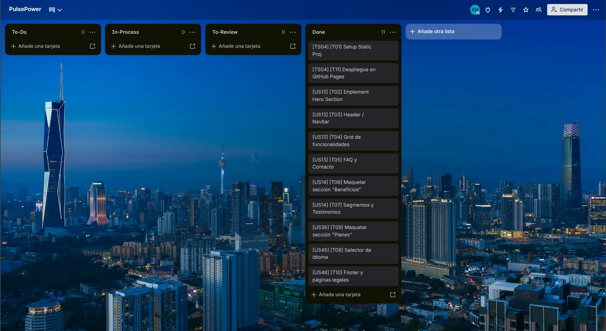

#### 5.2.1.4 Development Evidence for Sprint Review

Durante el Sprint 1, el equipo avanzó en la implementación del Landing Page, desarrollado en HTML5, CSS3 y JavaScript vanilla, y desplegado en GitHub Pages. Los principales avances incluyeron la estructura base de todas las secciones de la landing (Hero, Funcionalidades, Segmentos, Planes, Testimonios, FAQ, Contacto y Footer), la implementación del diseño responsive con media queries para móvil y tablet, y la habilitación del scroll suave y menú de navegación. A continuación se presentan los commits representativos del repositorio de Landing Page durante este Sprint.

| Repository                                                                     | Branch                 | Commit Id | Commit Message                                                                                            | Committed on (Date) |
|:-------------------------------------------------------------------------------|:-----------------------|:----------|:----------------------------------------------------------------------------------------------------------|:--------------------|
| `https://github.com/upc-pre-202620-1asi0729-7737-SportPlus/pulsepower-website` | `feature/app-features` | `82efb03` | `feat(landing): add responsive styles for various sections and navigation`                                | `18/09/2026`        |
| `https://github.com/upc-pre-202620-1asi0729-7737-SportPlus/pulsepower-website` | `feature/app-features` | `53d26c4` | `feat(landing): add styles for legal pages with responsive design.`                                       | `18/09/2026`        |
| `https://github.com/upc-pre-202620-1asi0729-7737-SportPlus/pulsepower-website` | `feature/app-features` | `7b90494` | `feat(landing): add floating language switcher with responsive design.`                                   | `18/09/2026`        |
| `https://github.com/upc-pre-202620-1asi0729-7737-SportPlus/pulsepower-website` | `feature/app-features` | `a06344a` | `feat(landing): add styles for Footer section with responsive layout and social links`                    | `18/09/2026`        |
| `https://github.com/upc-pre-202620-1asi0729-7737-SportPlus/pulsepower-website` | `feature/app-features` | `d792b51` | `feat(landing): add styles for Overview & Secondary Video section with grid layout and responsive design` | `18/09/2026`        |
| `https://github.com/upc-pre-202620-1asi0729-7737-SportPlus/pulsepower-website` | `feature/app-features` | `de5e9f5` | `feat(landing): add styles for Plans & Pricing section with toggle and responsive cards`                  | `18/09/2026`        |
| `https://github.com/upc-pre-202620-1asi0729-7737-SportPlus/pulsepower-website` | `feature/app-features` | `ceb849f` | `feat(team): add styles for Our Team section with responsive cards and hover effects`                     | `18/09/2026`        |
| `https://github.com/upc-pre-202620-1asi0729-7737-SportPlus/pulsepower-website` | `feature/app-features` | `600dd3b` | `feat(video): add styles for interactive video section with tabs and player`                              | `18/09/2026`        |
| `https://github.com/upc-pre-202620-1asi0729-7737-SportPlus/pulsepower-website` | `feature/app-features` | `ec96c5c` | `feat(landing): add styles for mid CTA banner section`                                                    | `18/09/2026`        |
| `https://github.com/upc-pre-202620-1asi0729-7737-SportPlus/pulsepower-website` | `feature/app-features` | `2fffd30` | `feat(landing): add styles for How PulsePower Works section with 5-step arched cards`                     | `18/09/2026`        |
| `https://github.com/upc-pre-202620-1asi0729-7737-SportPlus/pulsepower-website` | `feature/app-features` | `9553c2c` | `feat(landing): add styles for coaching services section and accordion components`                        | `18/09/2026`        |
| `https://github.com/upc-pre-202620-1asi0729-7737-SportPlus/pulsepower-website` | `feature/app-features` | `fa5c120` | `feat(landing): add styles for science-backed coaching section`                                           | `18/09/2026`        |
| `https://github.com/upc-pre-202620-1asi0729-7737-SportPlus/pulsepower-website` | `feature/app-features` | `3a41450` | `feat(landing): add styles for marquee banner and ticker items`                                           | `18/09/2026`        |
| `https://github.com/upc-pre-202620-1asi0729-7737-SportPlus/pulsepower-website` | `feature/app-features` | `c42ccd0` | `feat(landing): add styles for hero section, including layout, watermark, and call-to-action button`      | `18/09/2026`        |
| `https://github.com/upc-pre-202620-1asi0729-7737-SportPlus/pulsepower-website` | `feature/app-features` | `7e8d84c` | `feat(landing): add language toggle switch and auth button styles`                                        | `18/09/2026`        |
| `https://github.com/upc-pre-202620-1asi0729-7737-SportPlus/pulsepower-website` | `feature/app-features` | `b7b5db3` | `feat(landing): add implement fixed header and navigation styles`                                         | `18/09/2026`        |
| `https://github.com/upc-pre-202620-1asi0729-7737-SportPlus/pulsepower-website` | `feature/app-features` | `7dac399` | `feat(landing): add SVG assets for PulsePower landing page and styles`                                    | `18/09/2026`        |
| `https://github.com/upc-pre-202620-1asi0729-7737-SportPlus/pulsepower-website` | `main`                 | `16057ef` | `First Commit.`                                                                                           | `18/09/2026`        |
| `https://github.com/upc-pre-202620-1asi0729-7737-SportPlus/pulsepower-website` | `feature/app-features` | `a745c4b` | `feat(landing): add implement function to apply translations based on selected language`                  | `18/09/2026`        |
| `https://github.com/upc-pre-202620-1asi0729-7737-SportPlus/pulsepower-website` | `feature/app-features` | `b3d8e7a` | `feat(landing): add function to flatten nested translation objects`                                       | `18/09/2026`        |
| `https://github.com/upc-pre-202620-1asi0729-7737-SportPlus/pulsepower-website` | `feature/app-features` | `17b17c3` | `feat(landing): add Interactive Scripts & i18n`                                                           | `18/09/2026`        |
| `https://github.com/upc-pre-202620-1asi0729-7737-SportPlus/pulsepower-website` | `feature/app-features` | `616c78d` | `feat(landing): add Spanish translations for overview and footer sections`                                | `18/09/2026`        |
| `https://github.com/upc-pre-202620-1asi0729-7737-SportPlus/pulsepower-website` | `feature/app-features` | `0122e01` | `feat(landing): add Spanish translations for team and plans sections`                                     | `18/09/2026`        |
| `https://github.com/upc-pre-202620-1asi0729-7737-SportPlus/pulsepower-website` | `feature/app-features` | `34a43ca` | `feat(landing): add Spanish translations for CTA banner and video section`                                | `18/09/2026`        |
| `https://github.com/upc-pre-202620-1asi0729-7737-SportPlus/pulsepower-website` | `feature/app-features` | `020e79f` | `feat(landing): add Spanish translations for coaching services and process steps`                         | `18/09/2026`        |
| `https://github.com/upc-pre-202620-1asi0729-7737-SportPlus/pulsepower-website` | `feature/app-features` | `887f36d` | `feat(landing): add Spanish translations for navigation, hero, marquee, and science sections`             | `18/09/2026`        |
| `https://github.com/upc-pre-202620-1asi0729-7737-SportPlus/pulsepower-website` | `feature/app-features` | `9ba1dfb` | `feat(landing): fix names of i18n.`                                                                       | `18/09/2026`        |
| `https://github.com/upc-pre-202620-1asi0729-7737-SportPlus/pulsepower-website` | `feature/app-features` | `573634c` | `feat(landing): add Spanish translations for overview and footer sections`                                | `18/09/2026`        |
| `https://github.com/upc-pre-202620-1asi0729-7737-SportPlus/pulsepower-website` | `feature/app-features` | `db2765a` | `feat(landing): add Spanish translations for video section, team members, and plans`                      | `18/09/2026`        |
| `https://github.com/upc-pre-202620-1asi0729-7737-SportPlus/pulsepower-website` | `feature/app-features` | `9acf111` | `feat(landing): add Spanish translations for coaching services and process steps`                         | `18/09/2026`        |
| `https://github.com/upc-pre-202620-1asi0729-7737-SportPlus/pulsepower-website` | `feature/app-features` | `82d5e88` | `feat(landing): add Spanish translations for marquee and science sections`                                | `18/09/2026`        |
| `https://github.com/upc-pre-202620-1asi0729-7737-SportPlus/pulsepower-website` | `feature/app-features` | `517b628` | `feat(landing): add English translations for navigation and hero sections`                                | `18/09/2026`        |
| `https://github.com/upc-pre-202620-1asi0729-7737-SportPlus/pulsepower-website` | `feature/app-features` | `2ea4dc7` | `feat(landing): add YouTube video placeholder styles with hover effects`                                  | `18/09/2026`        |
| `https://github.com/upc-pre-202620-1asi0729-7737-SportPlus/pulsepower-website` | `feature/app-features` | `06646a6` | `feat(package): initialize package-lock.json for PulsePower website`                                      | `18/09/2026`        |
| `https://github.com/upc-pre-202620-1asi0729-7737-SportPlus/pulsepower-website` | `feature/app-features` | `3780523` | `feat (landing): add main HTML structure for PulsePower website`                                          | `18/09/2026`        |
| `https://github.com/upc-pre-202620-1asi0729-7737-SportPlus/pulsepower-website` | `feature/app-features` | `419b0c4` | `feat (landing): add tos main`                                                                            | `18/09/2026`        |
| `https://github.com/upc-pre-202620-1asi0729-7737-SportPlus/pulsepower-website` | `feature/app-features` | `9c1bb99` | `feat (landing): add tos header`                                                                          | `18/09/2026`        |
| `https://github.com/upc-pre-202620-1asi0729-7737-SportPlus/pulsepower-website` | `feature/app-features` | `6ac16c0` | `feat (landing): add tos`                                                                                 | `18/09/2026`        |
| `https://github.com/upc-pre-202620-1asi0729-7737-SportPlus/pulsepower-website` | `feature/app-features` | `e664249` | `feat(landing): add toggle functionality for pricing plans with active state management`                  | `18/09/2026`        |
| `https://github.com/upc-pre-202620-1asi0729-7737-SportPlus/pulsepower-website` | `feature/app-features` | `f5f3437` | `feat(landing): add implement toggle functionality for monthly and annual pricing plans`                  | `18/09/2026`        |
| `https://github.com/upc-pre-202620-1asi0729-7737-SportPlus/pulsepower-website` | `feature/app-features` | `d99a19a` | `feat(landing): add video embed functionality with tab navigation and active state management`            | `18/09/2026`        |
| `https://github.com/upc-pre-202620-1asi0729-7737-SportPlus/pulsepower-website` | `feature/app-features` | `ffeac89` | `feat(landing): add accordion functionality for coaching services and initialize first active tab`        | `18/09/2026`        |
| `https://github.com/upc-pre-202620-1asi0729-7737-SportPlus/pulsepower-website` | `feature/app-features` | `4f1390c` | `feat(landing): add scroll event to change header background on scroll`                                   | `18/09/2026`        |
| `https://github.com/upc-pre-202620-1asi0729-7737-SportPlus/pulsepower-website` | `feature/app-features` | `58341b5` | `feat(landing): add floating language switcher and mobile menu toggle functionality`                      | `18/09/2026`        |
| `https://github.com/upc-pre-202620-1asi0729-7737-SportPlus/pulsepower-website` | `feature/app-features` | `3b744cf` | `feat(landing): add language toggle functionality with synchronization and HTML lang update`              | `18/09/2026`        |
| `https://github.com/upc-pre-202620-1asi0729-7737-SportPlus/pulsepower-website` | `feature/app-features` | `3aa73ec` | `feat(landing): add synchronize language toggle with active state and thumb position`                     | `18/09/2026`        |
| `https://github.com/upc-pre-202620-1asi0729-7737-SportPlus/pulsepower-website` | `feature/app-features` | `58ac9ca` | `feat(landing): add functionality to apply translations to placeholders and HTML elements`                | `18/09/2026`        |
| `https://github.com/upc-pre-202620-1asi0729-7737-SportPlus/pulsepower-website` | `main`                 | `696bf54` | `Merge pull request #2 from upc-pre-202620-1asi0729-7737-SportPlus/feature/app-features`                  | `19/09/2026`        |
| `https://github.com/upc-pre-202620-1asi0729-7737-SportPlus/pulsepower-website` | `feature/app-features` | `9d2f6cb` | `feat(landing): fix video player placeholders to use div instead of anchor tags`                          | `19/09/2026`        |
| `https://github.com/upc-pre-202620-1asi0729-7737-SportPlus/pulsepower-website` | `feature/app-features` | `cde0848` | `feat(landing): fix remove hardcoded YouTube links from video player placeholders`                        | `19/09/2026`        |
| `https://github.com/upc-pre-202620-1asi0729-7737-SportPlus/pulsepower-website` | `feature/app-features` | `4ae3299` | `feat(landing): fix enhance hero section and team card layout with new styles`                            | `19/09/2026`        |
| `https://github.com/upc-pre-202620-1asi0729-7737-SportPlus/pulsepower-website` | `feature/app-features` | `5225ad3` | `feat(landing):add update team member details and replace logo images`                                    | `19/09/2026`        |
| `https://github.com/upc-pre-202620-1asi0729-7737-SportPlus/pulsepower-website` | `feature/app-features` | `047c046` | `feat(landing): add privacy policy page for PulsePower website`                                           | `18/09/2026`        |

### 5.2.1.5. Execution Evidence for Sprint Review.

Durante el Sprint 1, el equipo implementó y desplegó la primera versión pública del Landing Page de SportPlus, accesible en: [https://upc-pre-202620-1asi0729-7737-sportplus.github.io/pulsepower-website/](https://upc-pre-202620-1asi0729-7737-sportplus.github.io/pulsepower-website/)).

La landing page presenta un diseño moderno y responsive enfocado en la salud y el fitness. Incluye secciones clave como el Hero con llamadas a la acción, descripción de servicios de coaching, demostraciones de la aplicación, videos explicativos, presentación del equipo y planes de bienestar. A continuación se presenta la captura de la página implementada.

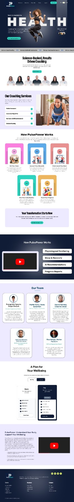

Esta captura de pantalla muestra el diseño completo de la página web de **PulsePower**, diseñada con un estilo dinámico que intercala secciones de fondo oscuro, blanco y tonos pastel claros. En la parte superior, el *Hero section* destaca la palabra "HEALTH" en gran tamaño junto a una atleta, con el lema *"Science-Backed, Results Driven Coaching"* y botones de registro. Descendiendo, la página expone los servicios (*Our Coaching Services*) con una imagen de entrenamiento y una lista de beneficios.

Una parte central muy visual es la sección *"How PulsePower Works"*, que utiliza coloridas maquetas de dispositivos móviles (en tonos rosa, azul, naranja y turquesa) para explicar el proceso paso a paso. Posteriormente, se integran reproductores de video incrustados para detallar características como monitoreo fisiológico y reportes de progreso. Finalmente, la página incluye una sección de presentación del equipo (*Our Team*) con fotografías y nombres de los integrantes, una demostración de la interfaz móvil de la app bajo el título *"A Plan for Your Wellbeing"*, y concluye con un pie de página (footer) oscuro que contiene enlaces de navegación y redes sociales.

### 5.2.1.6. Services Documentation Evidence for Sprint Review.

Durante el Sprint 1, el alcance de implementación estuvo enfocado exclusivamente en el desarrollo, diseño y despliegue de la primera versión del Landing Page de PulsePower/SportPlus, así como en la estructuración de la documentación técnica y las bases del sistema de diseño a nivel de interfaz de usuario.

En consecuencia, no se ha realizado en este sprint el desarrollo de Web Services ni la implementación de endpoints RESTful, por lo que no existe documentación de servicios mediante OpenAPI/Swagger que reportar en esta entrega. La documentación de servicios será incorporada a partir del Sprint 2, cuando se inicie la implementación del backend, conforme al plan de desarrollo establecido en el Product Backlog.

### 5.2.1.7. Software Deployment Evidence for Sprint Review.

Durante el Sprint 1, el equipo realizó el despliegue de la primera versión pública de la Landing Page utilizando GitHub Pages, servicio gratuito y estático integrado directamente con el repositorio de GitHub.

* **Plataforma de despliegue:** GitHub Pages — [https://pages.github.com](https://upc-pre-202620-1asi0729-7737-sportplus.github.io/pulsepower-website/)
* **URL base del repositorio:** https://github.com/upc-pre-202620-1asi0729-7737-SportPlus

**Proceso de despliegue:**
1. Se utilizó el repositorio central del equipo bajo la organización de la clase.
2. Todo el contenido estático de la landing page (HTML, CSS, JS) fue integrado mediante Pull Requests revisados por los integrantes del equipo, siguiendo el flujo GitFlow.
3. En la sección *Settings → Pages* del repositorio, se seleccionó la rama principal de producción como fuente de publicación.
4. GitHub Pages generó automáticamente la URL pública y publicó el sitio estático para su acceso global.

### 5.2.1.8. Team Collaboration Insights during Sprint.

Durante el Sprint 1, el equipo utilizó GitHub como plataforma central de colaboración y control de versiones para el repositorio `upc-pre-202620-1asi0729-7737-SportPlus`, aplicando el flujo de trabajo GitFlow junto con Conventional Commits para mantener la trazabilidad.

**Flujo de trabajo aplicado:**
* En el repositorio del informe, cada integrante trabajó en la rama de su capítulo (`feature/chapter-1` a `feature/chapter-5`), creada desde `develop`. En el repositorio de la Landing Page, el desarrollo se concentró en una rama compartida (`feature/app-features`) integrada a `main` mediante Pull Request; para los siguientes sprints se acordó crear una rama `feature/US[ID]-[nombre]` por historia, según la estrategia definida en la sección 5.1.2.
* Los cambios se integraron mediante Pull Requests, requiriendo revisión antes del merge.
* Los mensajes de commit siguieron un estándar estructurado (`feat:`, `fix:`, `docs:`), garantizando la correcta identificación del trabajo realizado, como se evidenció en los aportes de documentación de los capítulos 1 al 5.

Esta captura de pantalla muestra el gráfico de actividad de GitHub del repositorio `upc-pre-202620-1asi0729-7737-SportPlus`. En él se puede observar una alta concentración de trabajo en equipo durante el mes de septiembre, con múltiples contribuciones y commits registrados durante la consolidación del Sprint 1, reflejando el trabajo concurrente de los distintos líderes de aspecto y colaboradores en sus respectivas ramas.

### 5.2.2 Sprint 2

#### 5.2.2.1 Sprint Planning 2

En esta sección se describen los principales acuerdos y definiciones realizadas durante el Sprint Planning del Sprint 2, enfocado en la implementación de la Web Application de PulsePower.

**Sprint Planning Background**

| Campo | Detalle |
| :--- |:---|
| **Sprint #** | Sprint 2 |
| **Date** | 04-10-2026 |
| **Time** | 17:30 |
| **Location** | Reunión Virtual |
| **Prepared By** | Viza Quispe, Marlon Packard |
| **Attendees** | Osorio Ramírez, Eduardo Jesús Carbajal Santivañez, Sebastian Aaron Martín Farro, Alexis Sebastián Evangelista Ygnacio, Sergio Joaquin |
| **Sprint 2 Review Summary** | Se implementó la primera versión funcional de la Web Application: los siete bounded contexts con sus cuatro capas, navegación por rutas con carga diferida, persistencia local aislada por cuenta e interfaz bilingüe. |
| **Sprint 2 Retrospective Summary** | Mejoró la participación y la comunicación interna. Se acordó que cada integrante lidere un bounded context y que las correcciones de la AV1 se resuelvan dentro del Sprint 2. |

 

**Sprint Goal & User Stories**

| Campo | Detalle |
| :--- | :--- |
| **Sprint 2 Goal** | Our focus is on delivering a navigable Single Page Application where each of the seven bounded contexts is implemented as its own module with domain, application, infrastructure and presentation layers, backed by automated tests. This will be confirmed when `npm run build`, `npm test` and `npm run check:architecture` all pass. |
| **Sprint 2 Velocity** | 81 horas (tareas en Done) |
| **Sum of Estimated Hours** | 100 horas (81 h en Done y 19 h en To-Do) |

#### 5.2.2.2 Aspect Leaders and Collaborators

A continuación se detalla la matriz de liderazgo y colaboración (LACX) para el Sprint 2, organizada por los siete bounded contexts definidos en el Design-Level EventStorming.

| Team Member (Last Name, First Name) | GitHub Username | Training | Sleep | Wellness | Physiology | Reports | Community | IAM |
| :--- |:----------------| :--- | :--- | :--- | :--- | :--- | :--- | :--- |
| Osorio Ramírez, Eduardo Jesús | @Iron819        | C | C | C | L | L | C | C |
| Carbajal Santivañez, Sebastian Aaron | @SC-fnfoc       | L | C | C | C | C | C | C |
| Martín Farro, Alexis Sebastián | @axismf         | C | C | C | C | C | L | C |
| Viza Quispe, Marlon Packard | @V8Z5           | C | L | C | C | C | C | L |
| Evangelista Ygnacio, Sergio Joaquin | @Sergi9017      | C | C | L | C | C | C | C |

*(L = Leader, C = Collaborator)*

#### 5.2.2.3 Sprint Backlog 2

El Sprint 2 continúa con el resto del Product Backlog (sección 3.3) una vez cerradas las seis historias del Sprint 1, y queda pendiente únicamente de las tareas marcadas como To-Do. El tablero del proyecto en Trello: https://trello.com/invite/b/6aaede0bb47af502ba9eb29d/ATTI6002400c8c79f6ddabb88999b2168b7a7AB82763/pulsepower

**Sprint #**: Sprint 2

| Story ID | Story Title | Task ID | Task Title | Task Description | Estimation (Hours) | Assigned To | Status |
|:---|:---|:---|:---|:---|:---|:---|:---|
| US09 | Registrar perfil de Deportista | T12 | Local sign-up (two steps) | Registro local en dos pasos con verificador PBKDF2 con sal y espacio de trabajo aislado por cuenta. | 6 | Viza Quispe, Marlon Packard | Done |
| US19, US20 | Configurar objetivos en el onboarding | T13 | Onboarding goals assistant | Asistente local de dos pasos, reanudable, que guarda los objetivos de entrenamiento y de bienestar. | 5 | Osorio Ramírez, Eduardo Jesús | Done |
| US37 | Cancelar suscripción Pro | T14 | Subscription cancellation | SubscriptionPage con periodo Pro de 30 días, confirmación obligatoria y vigencia hasta el fin del periodo. | 4 | Carbajal Santivañez, Sebastian Aaron | Done |
| US44 | Eliminar cuenta y datos asociados | T15 | Account deletion | Baja local confirmada que borra únicamente el espacio de la cuenta seleccionada. | 4 | Martín Farro, Alexis Sebastián | Done |
| US01, US03, US04, US06, US25 | Nivel de recuperación y recomendaciones | T16 | Recovery page | Nivel de recuperación, variables fisiológicas, recomendaciones, comparación entre dos semanas y proyección ilustrativa. | 8 | Evangelista Ygnacio, Sergio Joaquin | Done |
| US07, US08, US24, US27 | Alertas y prevención | T17 | Guidance alerts | Alertas persistentes sin duplicados diarios, historial de alertas y aviso de batería baja sin repetición. | 6 | Osorio Ramírez, Eduardo Jesús | Done |
| US21 | Vincular pulsera durante el onboarding | T18 | Wearable scenarios | Escenarios demo de pulsera conectada, desconectada, autorización denegada y sincronización pendiente. | 5 | Martín Farro, Alexis Sebastián | Done |
| US28, US29, US30 | Calendario y planificación | T19 | Training planning page | Calendario de sesiones, conflictos de horario, día de descanso activo y sugerencia de reprogramación. | 7 | Carbajal Santivañez, Sebastian Aaron | Done |
| US02, US05 | Resumen y rutina de sueño | T20 | Sleep records | Registro de sueño con validación de solapamientos, rutina y duración semanal y mensual. | 6 | Viza Quispe, Marlon Packard | Done |
| US31, US32 | Estrés y respiración guiada | T21 | Wellness check-ins | Check-ins diarios, hábitos y sesión guiada de respiración de un minuto con estado completado o interrumpido. | 5 | Evangelista Ygnacio, Sergio Joaquin | Done |
| US11, US26, US42, US43 | Reportes y exportación en PDF | T22 | Reports page | PDF de entrenamiento, sueño, bienestar y recuperación simulada; exige una semana de historial por categoría. | 7 | Osorio Ramírez, Eduardo Jesús | Done |
| US12, US34, US35 | Rachas, logros y avance compartido | T23 | Community page | Rachas locales, logro de siete días, publicación por audiencia y revocación de permisos. | 5 | Martín Farro, Alexis Sebastián | Done |
| US38, US39 | Centro de ayuda y soporte | T24 | Help center | HelpPage con búsqueda de artículos y solicitud de soporte con referencia e historial local. | 4 | Carbajal Santivañez, Sebastian Aaron | Done |
| — | Internacionalización de la aplicación | T25 | i18n catalogs (ES/EN) | Catálogos `public/i18n/es.json` y `en.json` consumidos por el servicio de traducción propio (`shared/application/i18n.ts`) y aplicados a toda la interfaz. | 4 | Viza Quispe, Marlon Packard | Done |
| US33, US40, US41 | Notificaciones y desconexión | T26 | Notification preferences | Preferencias e historial local, comprobación de franjas con la app abierta y aplazamiento de entrenamientos fuera de horario. | 5 | Evangelista Ygnacio, Sergio Joaquin | Done |
| US10 | Proteger datos fisiológicos del usuario | T27 | Transport and authorization | API con TLS, autenticación y autorización entre usuarios. | 3 | Martín Farro, Alexis Sebastián | To-Do |
| US22, US23 | Sincronizar con apps de salud externas | T28 | Health platform sync | Importación automática desde Apple Health y Google Fit con resolución de duplicados. | 5 | Osorio Ramírez, Eduardo Jesús | To-Do |
| US15 | Iniciar mi registro desde la Landing Page | T29 | Registration CTA | CTA de registro en la Landing Page que redirige a la Web Application. | 2 | Evangelista Ygnacio, Sergio Joaquin | To-Do |
| TS01, TS02 | Exponer endpoints de recuperación y perfil | T30 | Recovery and profile endpoints | `GET /api/v1/users/{userId}/recovery-assessments/latest` y `POST /api/v1/profiles`. | 6 | Carbajal Santivañez, Sebastian Aaron | To-Do |
| TS03 | Exponer endpoint de alertas activas | T31 | Active alerts endpoint | `GET /api/v1/users/{userId}/guidance-alerts?status=ACTIVE`. | 3 | Viza Quispe, Marlon Packard | To-Do |

**Tablero del Sprint 2 en Trello**. El Product Backlog contiene las User Stories y Technical Stories pendientes, y las listas de cada Sprint registran el avance de sus historias.

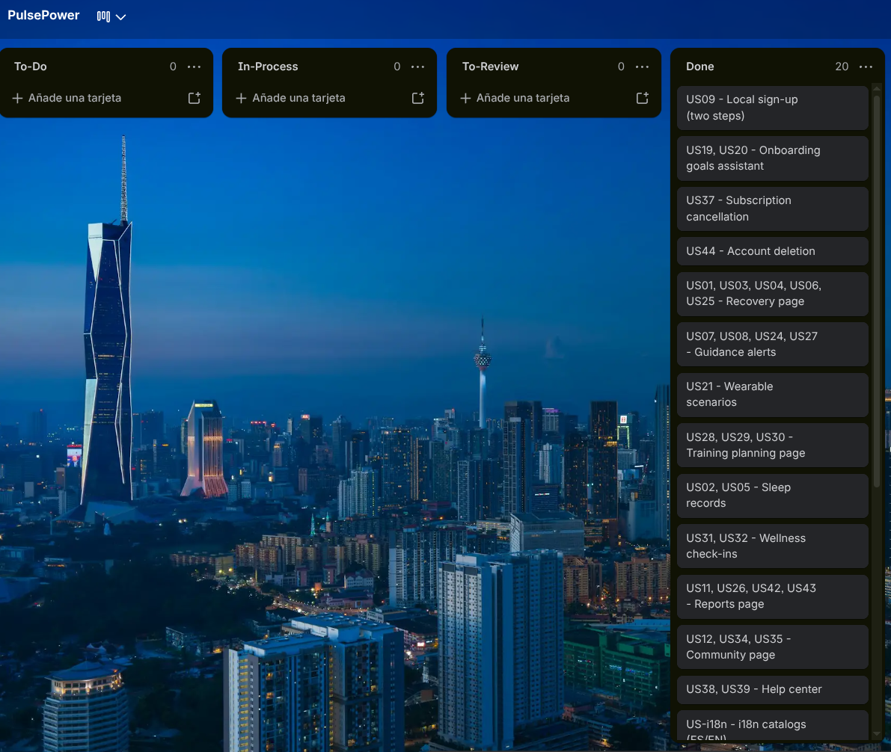

#### 5.2.2.4 Development Evidence for Sprint Review

En el Sprint 2 se implementó la primera versión de la Web Application como *Single Page Application* en Angular 22.2 y TypeScript 6.0, con un servicio de internacionalización propio (`shared/application/i18n.ts`) y Prettier 3.8 para el formateo consistente del código. Marlon Viza preparó la base del proyecto y el equipo lo extendió por bounded context.

El código se organiza en `src/app/modules/`, con un módulo por bounded context — `training`, `sleep`, `wellness`, `physiology`, `reports`, `community` e `iam` — y cada uno divide su código en las capas `domain`, `application`, `infrastructure` y `presentation`, tal como define el diseño del capítulo 4. La carpeta `src/app/shared/` concentra UI, traducciones y utilidades, y **no** constituye un octavo bounded context.

La capa `domain` no depende de Angular ni de HTTP: los componentes consumen servicios de `application` y las implementaciones de persistencia se inyectan desde `src/app/app.config.ts` mediante adaptadores `local-*-repository`. Los modelos persistidos se convierten a través de assemblers, y las cargas concurrentes de un mismo almacén se comparten para evitar resúmenes vacíos. La navegación se resuelve por rutas con carga diferida (`loadChildren`) en `src/app/app.routes.ts`.

En el repositorio se aplicaron las correcciones de la AV1.

Tabla commits

#### 5.2.2.5 Execution Evidence for Sprint Review

**URL de despliegue:** _[PENDIENTE]_

A continuación se presenta el recorrido por la aplicación:

1. Inicio de sesión

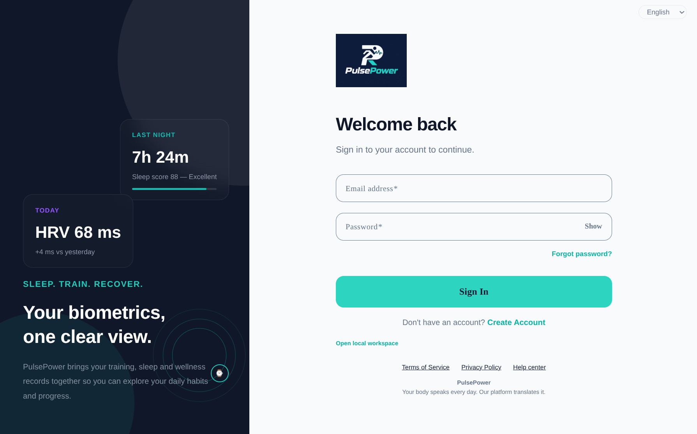

2. Registro en dos pasos

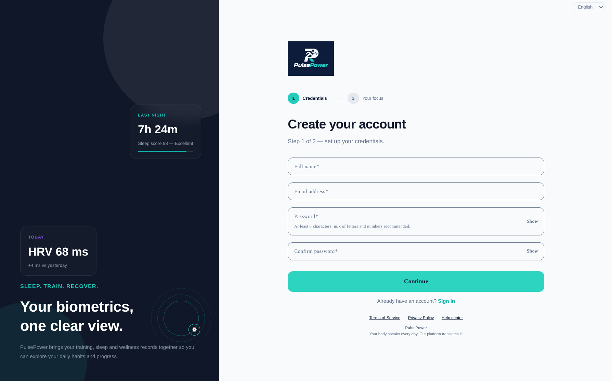

3. Panel principal

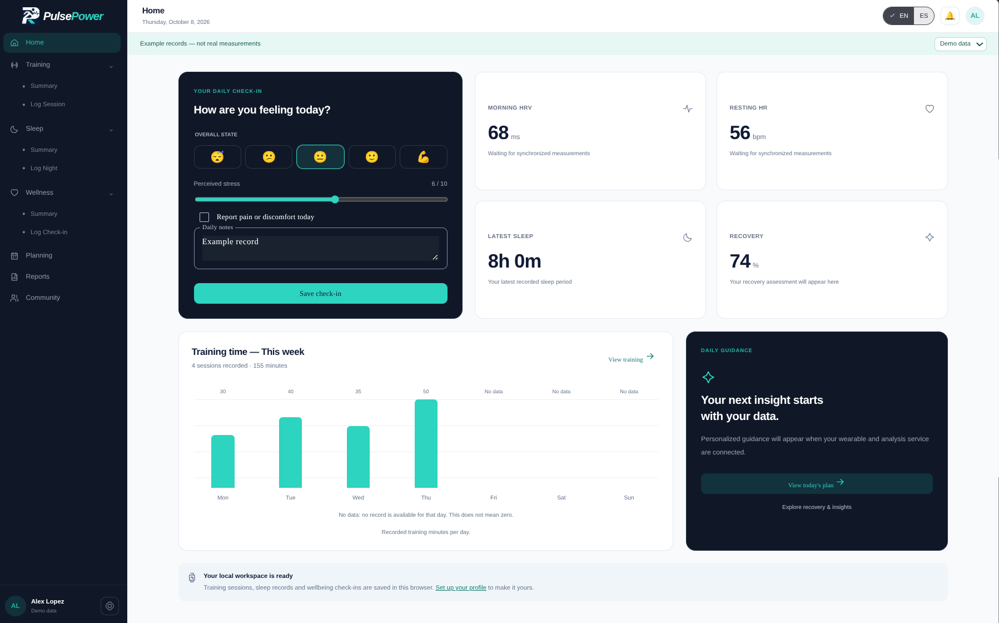

4. Entrenamientos

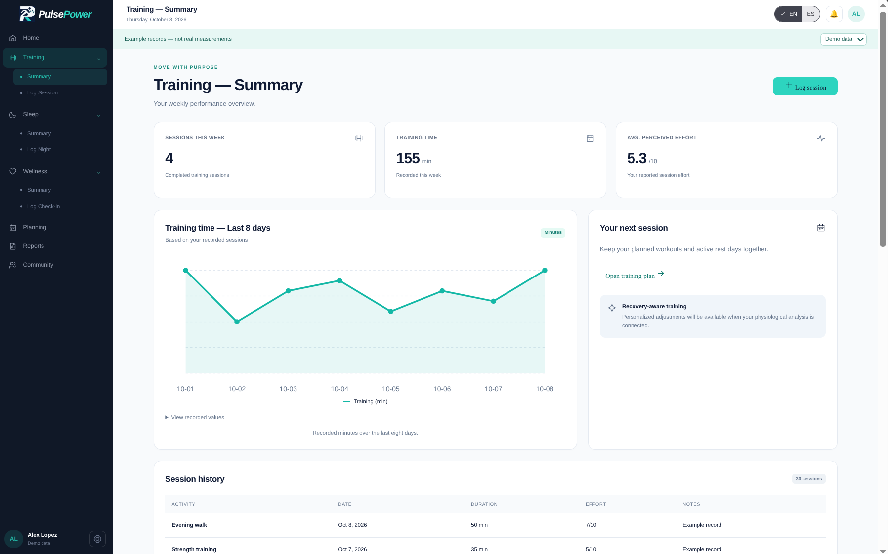

5. Planificación

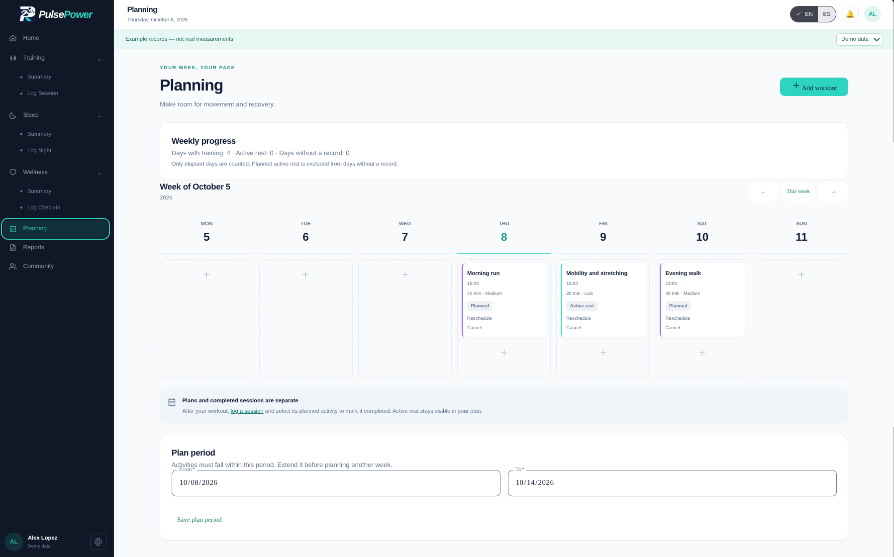

6. Sueño

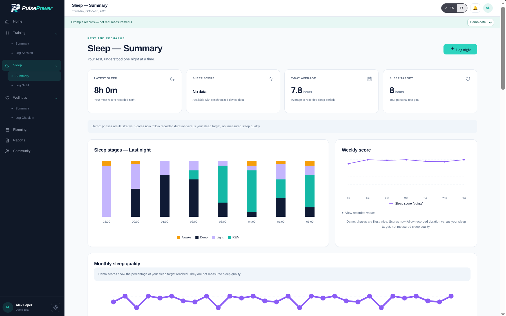

7. Bienestar

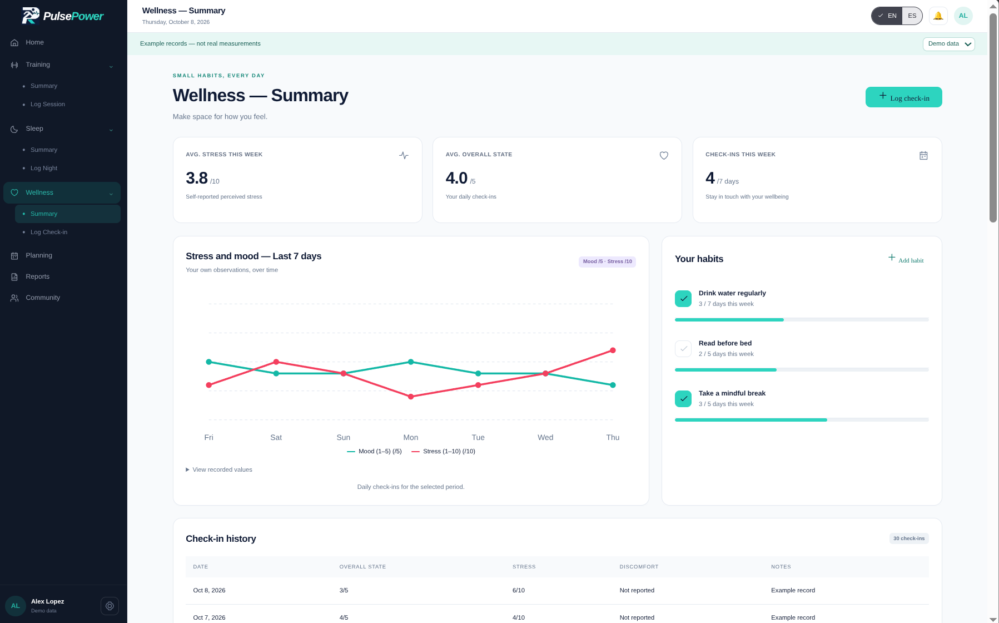

8. Reportes

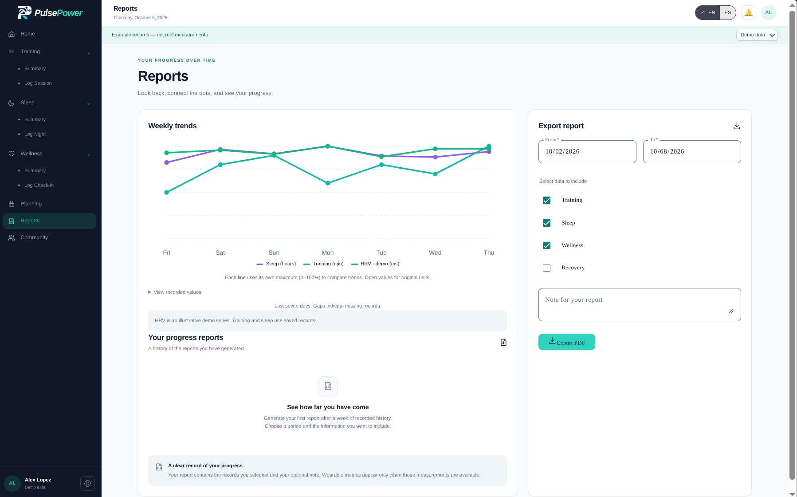

9. Comunidad

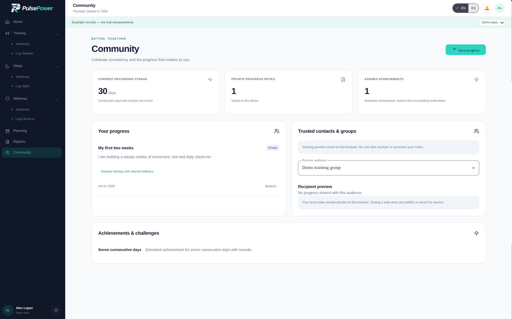

10. Configuración

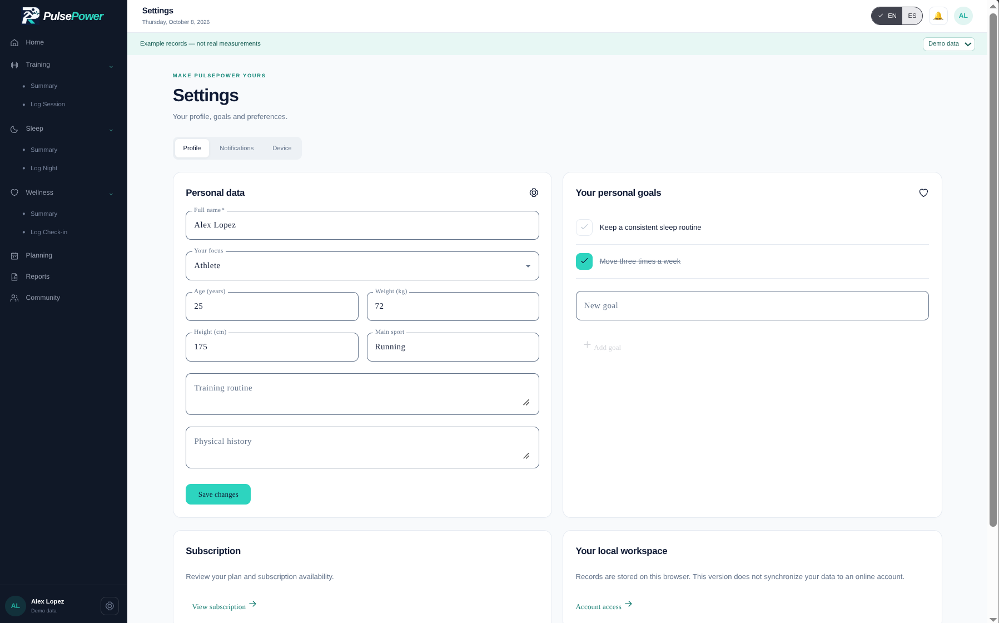

11. Suscripción

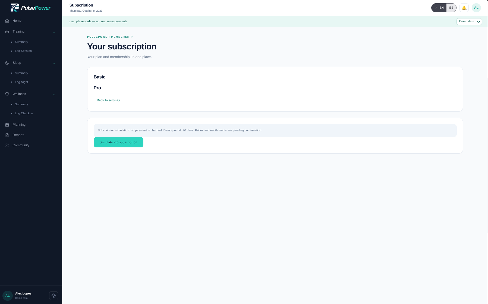

#### 5.2.2.6 Services Documentation Evidence for Sprint Review

Durante este Sprint la Web Application **no expone servicios REST propios**, ya que es una *Single Page Application* de frontend, pero **sí consume un servicio REST**: el endpoint `GET /api/v1/physiological-overview` (resumen fisiológico) de la API desplegada en Render. Las Technical Stories TS01, TS02 y TS03 permanecen en el Product Backlog como trabajo pendiente del backend en Spring Boot y PostgreSQL descrito en la sección 4.6, por lo que aún no existe documentación OpenAPI/Swagger que reportar en esta entrega.

El resto de los datos de la aplicación se gestiona en almacenes locales, cableados en `src/app/app.config.ts`, bajo los prefijos `pulsepower.demo.v1.`, `pulsepower.user.<id>.` y `pulsepower.v1.`, lo que aísla el espacio de trabajo de cada cuenta. Además de la consulta a `GET /api/v1/physiological-overview`, la única llamada HTTP de la aplicación es la carga de los catálogos de idioma `public/i18n/es.json` y `public/i18n/en.json`.

La documentación de servicios mediante OpenAPI/Swagger se incorporará a partir del Sprint 3, junto con la implementación de los endpoints pendientes del backend.

#### 5.2.2.7 Software Deployment Evidence for Sprint Review

Durante el Sprint 2, el equipo realizó el despliegue de la primera versión pública de la Web App utilizando Vercel, mientras que la API que consume la aplicación se encuentra desplegada en Render.

* **Plataforma de despliegue (Web App):** Vercel
* **Plataforma de despliegue (API):** Render
* **URL base del repositorio:** https://github.com/upc-pre-202620-1asi0729-7737-SportPlus/pulsepower-webapp

**Proceso de despliegue:**
1. Se utilizó el repositorio central del equipo bajo la organización de la clase.
2. Todo el contenido fue integrado mediante Pull Requests revisados por los integrantes del equipo, siguiendo el flujo GitFlow.
3. En Vercel se importó el repositorio `pulsepower-webapp` mediante su integración nativa con GitHub y se seleccionó la rama `main` como rama de producción.
4. Vercel reconoció el proyecto como una aplicación Angular, ejecutó su build y generó automáticamente la URL pública; a partir de ese momento publica cada Pull Request fusionado en `main`.
5. La Web App consume la API alojada en Render (`GET /api/v1/physiological-overview`), cuyo despliegue es independiente del de la aplicación.

#### 5.2.2.8 Team Collaboration Insights during Sprint.

El equipo mantuvo un ritmo de trabajo organizado por bounded contexts: cada integrante lideró su contexto y colaboró en los demás, respetando la arquitectura definida en el capítulo 4.

* **Domain-Driven Design verificado por pruebas.** `src/app/app.spec.ts` falla si un bounded context no expone las cuatro capas, si `domain/` importa Angular o HTTP, o si `presentation` o `application` importan `infrastructure`. La separación de capas no es una convención voluntaria: es un contrato ejecutable.
* **Suite automatizada.** Se implementaron 18 archivos de prueba con 38 casos, ejecutados con `npm test` (Vitest), que cubren reglas de dominio, rangos, solapamientos, reportes, geometría de gráficos, catálogos de idiomas, cuentas locales y persistencia aislada.
* **Consistencia de formato.** Prettier se ejecuta con `npm run format:check` sobre `src`, `public/i18n` y los archivos de configuración, evitando discusiones de estilo en la revisión por pares.
* **Internacionalización centralizada.** El soporte español/inglés y el layout compartido se mantienen en `shared`, garantizando coherencia visual entre los siete contextos.
* **Límites declarados.** El equipo dejó explícito en el repositorio qué es funcionalidad local, qué es simulación y qué depende de un servicio externo: la proyección de recuperación no utiliza IA, las fases de sueño no son mediciones de calidad, y los umbrales 40 y 70 son exclusivos del prototipo. Una pantalla visible no demuestra todos sus criterios de aceptación.