# Capítulo V: Product Implementation, Validation & Deployment
## 5.1. Software Configuration Management
Con el objetivo de garantizar un desarrollo fluido, estandarizado y compatible entre todos los miembros del equipo PulsePower, se ha definido el siguiente entorno de desarrollo para el ecosistema PulsePower
### 5.1.1. Software Development Environment Configuration
Se listan a continuación las herramientas utilizadas a lo largo de todo el ciclo de vida del proyecto, cubriendo desde la gestión hasta el despliegue:

**Project & Requirements Management:**
- Trello: Herramienta SaaS para la gestión ágil del Product Backlog y Sprints. Referencia: trello.com
- UXPressia: Herramienta SaaS para la gestión de requerimientos (Journey Maps, User Personas). Referencia: uxpressia.com
- Product UX/UI Design:
  - Figma: Herramienta SaaS para la elaboración de Wireframes, Mock-ups y Prototipos. Referencia: figma.com
- Herramientas de Desarrollo (IDEs y Editores):
  - WebStorm: IDE para el desarrollo de Frontend & Web App (Extensiones: Angular Language Service, Prettier, ESLint). Descarga: jetbrains.com/webstorm
  - IntelliJ IDEA: IDE optimizado para el desarrollo del Backend con Spring Boot. Descarga: jetbrains.com/idea
- Stack Tecnológico y Entorno de Ejecución:
  - Node.js (LTS v20+): Entorno de ejecución para Angular y la Landing Page. Descarga: nodejs.org
  - Java Development Kit (JDK 17): Entorno base para Spring Boot. Descarga: oracle.com/java
- Herramientas de Pruebas y Documentación:
  - Postman: Testeo y validación de los endpoints del backend. Descarga: postman.com
### 5.1.2. Source Code Management
El código fuente del proyecto se gestionará utilizando Git como sistema de control de versiones y GitHub como plataforma colaborativa, bajo una organización pública que favorece la modularidad y el despliegue independiente de cada componente.

**Estrategia de Ramas (GitFlow)**

Se implementará un flujo de trabajo basado en GitFlow con el objetivo de garantizar la estabilidad y trazabilidad del desarrollo:
- main: Rama principal. Contiene únicamente código estable, probado y desplegado en producción. Cada versión liberada estará debidamente etiquetada.
- develop: Rama de integración continua. Aquí se fusionan todas las nuevas características antes del pase a producción.
- feature/US[ID]-[nombre]: Ramas de desarrollo temporales, creadas a partir de develop para trabajar una User Story específica (ej. feature/US07-user-profile-registration). Una vez finalizadas, se integran nuevamente a develop mediante un Pull Request (PR).
- hotfix/[nombre]: Ramas destinadas a la corrección de errores críticos detectados en producción (main), que requieren una solución inmediata.

**Convenciones de Versionado y Commits**

- Semantic Versioning (SemVer 2.0.0): Los lanzamientos oficiales en la rama main se etiquetarán bajo el formato vMAJOR.MINOR.PATCH (ej. v1.0.0).
- Conventional Commits 1.0.0: Todos los commits seguirán una estructura semántica (tipo(alcance): descripción breve) para generar un historial legible por máquinas y humanos.

- **Tipos permitidos**

- feat: Nueva funcionalidad (ej. feat(auth): add login endpoint)
- fix: Corrección de errores (ej. fix(map): resolve overlap issue)
- docs: Cambios en documentación (ej. docs: update readme)
- style: Cambios de formato que no afectan la lógica del código (espacios, indentación, etc.)

### 5.1.3. Source Code Style Guide & Conventions

Para mantener la legibilidad y calidad del código, todo el equipo aplicará nomenclatura estrictamente en inglés para clases, variables, métodos y bases de datos. Además, se adoptan las siguientes guías de estilo oficiales:
- HTML & CSS: Se seguirán las directrices de la HTML Style Guide and Coding Conventions de W3C y la Google HTML/CSS Style Guide.
- Frontend (Angular / TypeScript): Se respetará la Angular Coding Style Guide. Las clases usarán PascalCase, variables y métodos camelCase, y los archivos kebab-case. Se utilizará Prettier y ESLint para automatizar el formato en cada commit.
- Backend (Spring Boot / Java): Se aplicará la Google Java Style Guide. La arquitectura se dividirá en capas estrictas (Controllers, Services, Repositories, Entities), respetando los siete bounded contexts definidos en el diseño orientado a objetos (Training, Sleep, Wellness, Physiology, Reports, Community e IAM). Los endpoints RESTful usarán sustantivos en plural (ej. GET /api/v1/training-sessions).
- Requerimientos: Se emplearán las Gherkin Conventions para la redacción estructurada de los criterios de aceptación (Given/When/Then).

### 5.1.4. Software Deployment Configuration

- El despliegue del ecosistema PulsePower combinará métodos de publicación ágil para el Frontend y prácticas de Integración/Despliegue Continuo (CI/CD) para el Backend:
- Landing Page (Sitio Estático): Se desplegará utilizando la infraestructura gratuita de GitHub Pages, configurada para publicar automáticamente cada PR fusionado en main desde el repositorio del Landing Page.
- Frontend (Angular Web App): Se desplegará en la plataforma PaaS Vercel, utilizando su integración nativa con GitHub para publicar automáticamente cada PR fusionado en main.

> **Resumen de la sección 5.1.** El equipo gestiona el código en GitHub con GitFlow (ramas `main`, `develop` y `feature/*`), Conventional Commits y guías de estilo por lenguaje. La Landing Page se publica en GitHub Pages y la Web Application en Vercel.

## 5.2 Landing Page, Services & Applications Implementation

En esta sección se describe el proceso de implementación del producto PulsePower, incluyendo el desarrollo, pruebas, documentación y despliegue de la Landing Page. Para este avance se implementó la primera versión del Landing Page, orientada a presentar la propuesta de valor del sistema: "No puedes rendir más sin recuperarte mejor. Conócete primero."

### 5.2.1 Sprint 1

En esta sección se describen los principales acuerdos y definiciones realizadas durante el Sprint Planning del Sprint 1, enfocado en la implementación del Landing Page de PulsePower.

#### 5.2.1.1 Sprint Planning 1

**Sprint Planning Background**

| Campo | Detalle                                                                                                                                                                                                                                                                                                                                                     |
| :--- |:------------------------------------------------------------------------------------------------------------------------------------------------------------------------------------------------------------------------------------------------------------------------------------------------------------------------------------------------------------|
| **Sprint #** | Sprint 1                                                                                                                                                                                                                                                                                                                                                    |
| **Date** | 13-09-2026                                                                                                                                                                                                                                                                                                                                                  |
| **Time** | 17:30                                                                                                                                                                                                                                                                                                                                                       |
| **Location** | Reunión Virtual                                                                                                                                                                                                                                                                                                                                             |
| **Prepared By** | Viza Quispe, Marlon Packard                                                                                                                                                                                                                                                                                                                                 |
| **Attendees** | Evangelista Ygnacio, Sergio Joaquin Martín Farro, Alexis Sebastián Carbajal Santivañez, Sebastian Aaron Osorio Ramírez, Eduardo Jesús                                                                                                                                                                                                              |
| **Sprint 1 Review Summary** | Durante el Sprint 1 se logró implementar correctamente el Landing Page responsive de PulsePower, incluyendo navegación entre secciones, adaptación móvil y soporte multilenguaje. Además, el equipo consolidó la estructura base del frontend y definió estándares iniciales de trabajo colaborativo utilizando GitFlow y Trello para la gestión de tareas. |
| **Sprint 1 Retrospective Summary** | El equipo identificó como principal fortaleza la capacidad técnica y la comunicación constante durante el desarrollo del Sprint 1. Sin embargo, se detectaron pequeños retrasos en la delegación de tareas, por lo que para este sprint se acordó mejorar la coordinación en estas fases y aumentar la frecuencia de revisiones entre integrantes.          |

 

**Sprint Goal & User Stories**

| Campo | Detalle |
| :--- | :--- |
| **Sprint 1 Goal** | Our focus is on delivering a fast, static Landing Page (HTML/CSS/JS) with language support to attract clients and validate our value proposition. This will be confirmed when the Landing Page is deployed and fully navigable by users. |
| **Sprint 1 Velocity** | 16 Story Points |
| **Sum of Story Points** | 16 |

#### 5.2.1.2 Aspect Leaders and Collaborators

A continuación se detalla la matriz de liderazgo y colaboración (LACX) para brindar claridad en la comunicación del equipo durante el desarrollo de las tareas de este Sprint.

| Team Member (Last Name, First Name) | GitHub Username | Landing Page UI/UX | Landing Page Structure | Basic Funcs | Special Funcs |
| :--- |:----------------| :--- | :--- | :--- | :--- |
| Osorio Ramírez, Eduardo Jesús | @Iron819        | C | C | L | L |
| Carbajal Santivañez, Sebastian Aaron | @SC-fnfoc       | — | — | — | — |
| Martín Farro, Alexis Sebastián | @axismf         | C | L | C | C |
| Viza Quispe, Marlon Packard | @V8Z5           | L | C | L | C |
| Evangelista Ygnacio, Sergio Joaquin | @Sergi9017      | C | C | C | L |

*(L = Leader, C = Collaborator, — = sin participación en este Sprint)*

#### 5.2.1.3 Sprint Backlog 1

Se detalla el Sprint Backlog 1, con su respectivo tablero en Trello: https://trello.com/invite/b/6aaede0bb47af502ba9eb29d/ATTI6002400c8c79f6ddabb88999b2168b7a7AB82763/pulsepower

**Sprint #**: Sprint 1

El Sprint 1 incluye las seis primeras historias del Product Backlog (sección 3.3), cuya suma coincide con la velocity del Sprint (16 Story Points): US13 (5), US45 (3), US36 (2), US46 (1), TS04 (2) y US14 (3). Cada tarea se vincula con la historia del Product Backlog que atiende.

| Story ID | Story Title | Task ID | Task Title | Task Description | Estimation (Hours) | Assigned To | Status |
|:---|:---|:---|:---|:---|:---|:---|:---|
| TS04 | Configurar repositorio y despliegue de la Landing Page | T01 | Setup Static Proj | Inicializar el repositorio de la Landing Page con la estructura base HTML5/CSS y configurar el tablero de Trello. | 3 | Evangelista Ygnacio, Sergio Joaquin | Done |
| US13 | Conocer la propuesta de valor de PulsePower | T02 | Implement Hero Section | Desarrollar la sección principal (Hero) responsiva con Flexbox/Grid, incluyendo la propuesta de valor de PulsePower. | 5 | Evangelista Ygnacio, Sergio Joaquin | Done |
| US13 | Conocer la propuesta de valor de PulsePower | T03 | Header / Navbar | Implementar la barra de navegación superior con enlaces a cada sección y al selector de idioma. | 4 | Martín Farro, Alexis Sebastián | Done |
| US13 | Conocer la propuesta de valor de PulsePower | T04 | Grid de funcionalidades | Implementar una cuadrícula responsiva con las funcionalidades principales (indicadores, recomendaciones, reportes). | 4 | Viza Quispe, Marlon Packard | Done |
| US13 | Conocer la propuesta de valor de PulsePower | T05 | FAQ y Contacto | Implementar la sección de preguntas frecuentes y el formulario estático de contacto. | 4 | Osorio Ramírez, Eduardo Jesús | Done |
| US14 | Identificar los beneficios para mi segmento | T06 | Maquetar sección "Beneficios" | Crear el contenedor y las tarjetas informativas sobre los beneficios para deportistas y para usuarios enfocados en su bienestar. | 4 | Martín Farro, Alexis Sebastián | Done |
| US14 | Identificar los beneficios para mi segmento | T07 | Segmentos y Testimonios | Maquetar las secciones de segmentos objetivo ("Para quién es") y los testimonios de usuarios. | 4 | Osorio Ramírez, Eduardo Jesús | Done |
| US45 | Consultar la Landing Page en mi idioma | T08 | Selector de idioma | Implementar el mecanismo de cambio de idioma (Español/Inglés) reutilizable en todas las secciones de la Landing Page. | 4 | Viza Quispe, Marlon Packard | Done |
| US36 | Comparar los planes Basic y Pro | T09 | Maquetar sección "Planes" | Desarrollar la sección de planes Basic y Pro con el cambio entre facturación mensual y anual. | 4 | Viza Quispe, Marlon Packard Martín Farro, Alexis Sebastián | Done |
| US46 | Consultar términos y política de privacidad | T10 | Footer y páginas legales | Añadir el footer con contacto y redes sociales, y enlazar las páginas de términos del servicio y política de privacidad. | 2 | Viza Quispe, Marlon Packard Osorio Ramírez, Eduardo Jesús Evangelista Ygnacio, Sergio Joaquin | Done |
| TS04 | Configurar repositorio y despliegue de la Landing Page | T11 | Despliegue en GitHub Pages | Configurar la rama main y publicar el sitio estático mediante GitHub Pages. | 2 | Evangelista Ygnacio, Sergio Joaquin | Done |

Tablero de Trello:

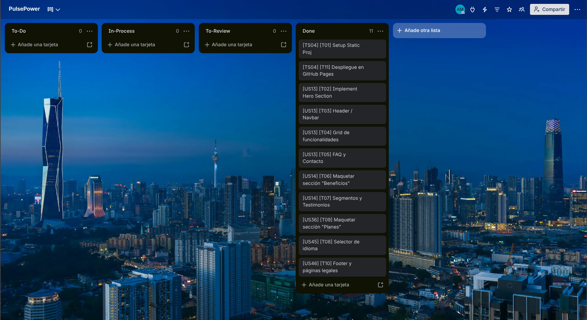

#### 5.2.1.4 Development Evidence for Sprint Review

Durante el Sprint 1, el equipo implementó la Landing Page de PulsePower con HTML5, CSS3 y JavaScript vanilla, y la desplegó en GitHub Pages. Los principales avances fueron la estructura de todas las secciones de la landing (barra de navegación, Hero, propuesta y servicios, How PulsePower Works, videos explicativos, Our Team, Planes, Overview y Footer), el diseño responsive con media queries para móvil y tablet, el selector de idioma español/inglés, el cambio de facturación mensual/anual de los planes y las páginas de Términos de Servicio y Política de Privacidad. A continuación se presentan los 53 commits del repositorio de la Landing Page realizados durante este Sprint.

**Repositorio:** https://github.com/upc-pre-202620-1asi0729-7737-SportPlus/pulsepower-website

| Branch | Commit Id | Autor | Commit Message | Committed on (Date) |
|:-|:-|:-|:-|:-|
| `feature/app-features` | `82efb03` | @Sergi9017 | `feat(landing): add responsive styles for various sections and navigation` | `18/09/2026` |
| `feature/app-features` | `53d26c4` | @Sergi9017 | `feat(landing): add styles for legal pages with responsive design.` | `18/09/2026` |
| `feature/app-features` | `7b90494` | @Sergi9017 | `feat(landing): add floating language switcher with responsive design.` | `18/09/2026` |
| `feature/app-features` | `a06344a` | @V8Z5 | `feat(landing): add styles for Footer section with responsive layout and social links` | `18/09/2026` |
| `feature/app-features` | `d792b51` | @V8Z5 | `feat(landing): add styles for Overview & Secondary Video section with grid layout and responsive design` | `18/09/2026` |
| `feature/app-features` | `de5e9f5` | @V8Z5 | `feat(landing): add styles for Plans & Pricing section with toggle and responsive cards` | `18/09/2026` |
| `feature/app-features` | `ceb849f` | @V8Z5 | `feat(team): add styles for Our Team section with responsive cards and hover effects` | `18/09/2026` |
| `feature/app-features` | `600dd3b` | @V8Z5 | `feat(video): add styles for interactive video section with tabs and player` | `18/09/2026` |
| `feature/app-features` | `ec96c5c` | @V8Z5 | `feat(landing): add styles for mid CTA banner section` | `18/09/2026` |
| `feature/app-features` | `2fffd30` | @V8Z5 | `feat(landing): add styles for How PulsePower Works section with 5-step arched cards` | `18/09/2026` |
| `feature/app-features` | `9553c2c` | @V8Z5 | `feat(landing): add styles for coaching services section and accordion components` | `18/09/2026` |
| `feature/app-features` | `fa5c120` | @V8Z5 | `feat(landing): add styles for science-backed coaching section` | `18/09/2026` |
| `feature/app-features` | `3a41450` | @V8Z5 | `feat(landing): add styles for marquee banner and ticker items` | `18/09/2026` |
| `feature/app-features` | `c42ccd0` | @V8Z5 | `feat(landing): add styles for hero section, including layout, watermark, and call-to-action button` | `18/09/2026` |
| `feature/app-features` | `7e8d84c` | @V8Z5 | `feat(landing): add language toggle switch and auth button styles` | `18/09/2026` |
| `feature/app-features` | `b7b5db3` | @V8Z5 | `feat(landing): add implement fixed header and navigation styles` | `18/09/2026` |
| `feature/app-features` | `7dac399` | @V8Z5 | `feat(landing): add SVG assets for PulsePower landing page and styles` | `18/09/2026` |
| `main` | `16057ef` | @Sergi9017 | `First Commit.` | `18/09/2026` |
| `feature/app-features` | `a745c4b` | @axismf | `feat(landing): add implement function to apply translations based on selected language` | `18/09/2026` |
| `feature/app-features` | `b3d8e7a` | @axismf | `feat(landing): add function to flatten nested translation objects` | `18/09/2026` |
| `feature/app-features` | `17b17c3` | @axismf | `feat(landing): add Interactive Scripts & i18n` | `18/09/2026` |
| `feature/app-features` | `616c78d` | @Sergi9017 | `feat(landing): add Spanish translations for overview and footer sections` | `18/09/2026` |
| `feature/app-features` | `0122e01` | @Sergi9017 | `feat(landing): add Spanish translations for team and plans sections` | `18/09/2026` |
| `feature/app-features` | `34a43ca` | @Sergi9017 | `feat(landing): add Spanish translations for CTA banner and video section` | `18/09/2026` |
| `feature/app-features` | `020e79f` | @Sergi9017 | `feat(landing): add Spanish translations for coaching services and process steps` | `18/09/2026` |
| `feature/app-features` | `887f36d` | @Sergi9017 | `feat(landing): add Spanish translations for navigation, hero, marquee, and science sections` | `18/09/2026` |
| `feature/app-features` | `9ba1dfb` | @Sergi9017 | `feat(landing): fix names of i18n.` | `18/09/2026` |
| `feature/app-features` | `573634c` | @Sergi9017 | `feat(landing): add Spanish translations for overview and footer sections` | `18/09/2026` |
| `feature/app-features` | `db2765a` | @Sergi9017 | `feat(landing): add Spanish translations for video section, team members, and plans` | `18/09/2026` |
| `feature/app-features` | `9acf111` | @Sergi9017 | `feat(landing): add Spanish translations for coaching services and process steps` | `18/09/2026` |
| `feature/app-features` | `82d5e88` | @Sergi9017 | `feat(landing): add Spanish translations for marquee and science sections` | `18/09/2026` |
| `feature/app-features` | `517b628` | @Sergi9017 | `feat(landing): add English translations for navigation and hero sections` | `18/09/2026` |
| `feature/app-features` | `2ea4dc7` | @Sergi9017 | `feat(landing): add YouTube video placeholder styles with hover effects` | `18/09/2026` |
| `feature/app-features` | `06646a6` | @V8Z5 | `feat(package): initialize package-lock.json for PulsePower website` | `18/09/2026` |
| `feature/app-features` | `3780523` | @V8Z5 | `feat (landing): add main HTML structure for PulsePower website` | `18/09/2026` |
| `feature/app-features` | `419b0c4` | @Iron819 | `feat (landing): add tos main` | `18/09/2026` |
| `feature/app-features` | `9c1bb99` | @Iron819 | `feat (landing): add tos header` | `18/09/2026` |
| `feature/app-features` | `6ac16c0` | @Iron819 | `feat (landing): add tos` | `18/09/2026` |
| `feature/app-features` | `e664249` | @axismf | `feat(landing): add toggle functionality for pricing plans with active state management` | `18/09/2026` |
| `feature/app-features` | `f5f3437` | @axismf | `feat(landing): add implement toggle functionality for monthly and annual pricing plans` | `18/09/2026` |
| `feature/app-features` | `d99a19a` | @axismf | `feat(landing): add video embed functionality with tab navigation and active state management` | `18/09/2026` |
| `feature/app-features` | `ffeac89` | @axismf | `feat(landing): add accordion functionality for coaching services and initialize first active tab` | `18/09/2026` |
| `feature/app-features` | `4f1390c` | @axismf | `feat(landing): add scroll event to change header background on scroll` | `18/09/2026` |
| `feature/app-features` | `58341b5` | @axismf | `feat(landing): add floating language switcher and mobile menu toggle functionality` | `18/09/2026` |
| `feature/app-features` | `3b744cf` | @axismf | `feat(landing): add language toggle functionality with synchronization and HTML lang update` | `18/09/2026` |
| `feature/app-features` | `3aa73ec` | @axismf | `feat(landing): add synchronize language toggle with active state and thumb position` | `18/09/2026` |
| `feature/app-features` | `58ac9ca` | @axismf | `feat(landing): add functionality to apply translations to placeholders and HTML elements` | `18/09/2026` |
| `main` | `696bf54` | @Sergi9017 | `Merge pull request #2 from upc-pre-202620-1asi0729-7737-SportPlus/feature/app-features` | `19/09/2026` |
| `feature/app-features` | `9d2f6cb` | @V8Z5 | `feat(landing): fix video player placeholders to use div instead of anchor tags` | `19/09/2026` |
| `feature/app-features` | `cde0848` | @V8Z5 | `feat(landing): fix remove hardcoded YouTube links from video player placeholders` | `19/09/2026` |
| `feature/app-features` | `4ae3299` | @V8Z5 | `feat(landing): fix enhance hero section and team card layout with new styles` | `19/09/2026` |
| `feature/app-features` | `5225ad3` | @V8Z5 | `feat(landing):add update team member details and replace logo images` | `19/09/2026` |
| `feature/app-features` | `047c046` | @V8Z5 | `feat(landing): add privacy policy page for PulsePower website` | `18/09/2026` |

#### 5.2.1.5 Execution Evidence for Sprint Review

Durante el Sprint 1, el equipo implementó y desplegó la primera versión pública de la Landing Page de PulsePower, accesible en: [https://upc-pre-202620-1asi0729-7737-sportplus.github.io/pulsepower-website/](https://upc-pre-202620-1asi0729-7737-sportplus.github.io/pulsepower-website/).

La Landing Page es un sitio estático desarrollado con HTML, CSS y JavaScript. Es responsive y bilingüe: un selector de idioma permite cambiar todo el contenido entre español e inglés. Su objetivo es presentar la propuesta de valor de PulsePower a los dos segmentos objetivo y dirigirlos hacia los planes de suscripción. A continuación se presenta la captura de la página completa implementada.

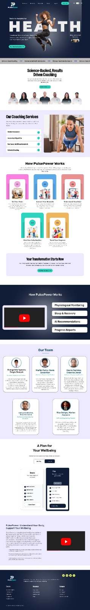

*Captura completa de la Landing Page de PulsePower desplegada en GitHub Pages (versión en inglés).*

La página se organiza en las siguientes secciones, en el orden en que aparecen:

* **Barra de navegación:** logotipo de PulsePower, enlaces a Features, Benefits, About Us, Our Team y Plans, y selector de idioma ES/EN.
* **Hero:** presenta el mensaje principal: PulsePower convierte los datos de sueño, esfuerzo y recuperación del usuario en información clara para planificar su entrenamiento y descanso. Incluye un botón de llamada a la acción y una tarjeta destacada sobre sueño, esfuerzo y recuperación con perspectivas de IA.
* **Propuesta y servicios:** explican cómo PulsePower convierte los datos fisiológicos en orientación y reúne los registros de sueño, esfuerzo y recuperación para respaldar decisiones en la rutina diaria.
* **How PulsePower Works:** describe en cinco pasos el uso del producto: definir objetivos, conectar el wearable, comprender el cuerpo con ayuda del asistente de IA, planificar la rutina diaria y monitorear el progreso.
* **Videos explicativos:** un reproductor con cuatro pestañas (Monitoreo fisiológico, Sueño y recuperación, Recomendaciones de IA e Informes de progreso).
* **Our Team:** tarjetas con la foto, el nombre y una breve descripción de los cinco integrantes del equipo.
* **Planes:** comparación de los planes Basic y Pro con cambio entre facturación mensual y anual.
* **Overview:** resume qué es PulsePower y sus tres pilares: monitoreo integrado, orientación personalizada y seguimiento de hábitos.
* **Footer:** enlaces a servicios, recursos y compañía, junto con los enlaces a los Términos de Servicio y la Política de Privacidad.

#### 5.2.1.6 Services Documentation Evidence for Sprint Review

Durante el Sprint 1, el alcance de implementación estuvo enfocado exclusivamente en el desarrollo, diseño y despliegue de la primera versión del Landing Page de PulsePower, así como en la estructuración de la documentación técnica y las bases del sistema de diseño a nivel de interfaz de usuario.

En consecuencia, no se ha realizado en este sprint el desarrollo de Web Services ni la implementación de endpoints RESTful, por lo que no existe documentación de servicios mediante OpenAPI/Swagger que reportar en esta entrega. La documentación de servicios será incorporada a partir del Sprint 2, cuando se inicie la implementación del backend, conforme al plan de desarrollo establecido en el Product Backlog.

#### 5.2.1.7 Software Deployment Evidence for Sprint Review

Durante el Sprint 1, el equipo realizó el despliegue de la primera versión pública de la Landing Page utilizando GitHub Pages, servicio gratuito y estático integrado directamente con el repositorio de GitHub.

* **Plataforma de despliegue:** GitHub Pages — [https://pages.github.com](https://upc-pre-202620-1asi0729-7737-sportplus.github.io/pulsepower-website/)
* **URL base del repositorio:** https://github.com/upc-pre-202620-1asi0729-7737-SportPlus

**Proceso de despliegue:**
1. Se utilizó el repositorio central del equipo bajo la organización de la clase.
2. Todo el contenido estático de la landing page (HTML, CSS, JS) fue integrado mediante Pull Requests revisados por los integrantes del equipo, siguiendo el flujo GitFlow.
3. En la sección *Settings → Pages* del repositorio, se seleccionó la rama principal de producción como fuente de publicación.
4. GitHub Pages generó automáticamente la URL pública y publicó el sitio estático para su acceso global.

#### 5.2.1.8 Team Collaboration Insights during Sprint

Durante el Sprint 1, el equipo utilizó GitHub como plataforma central de colaboración y control de versiones para el repositorio `upc-pre-202620-1asi0729-7737-SportPlus`, aplicando el flujo de trabajo GitFlow junto con Conventional Commits para mantener la trazabilidad.

**Flujo de trabajo aplicado:**
* En el repositorio del informe, cada integrante trabajó en la rama de su capítulo (`feature/chapter-1` a `feature/chapter-5`), creada desde `develop`. En el repositorio de la Landing Page, el desarrollo se concentró en una rama compartida (`feature/app-features`) integrada a `main` mediante Pull Request; para los siguientes sprints se acordó crear una rama `feature/US[ID]-[nombre]` por historia, según la estrategia definida en la sección 5.1.2.
* Los cambios se integraron mediante Pull Requests, requiriendo revisión antes del merge.
* Los mensajes de commit siguieron un estándar estructurado (`feat:`, `fix:`, `docs:`), garantizando la correcta identificación del trabajo realizado, como se evidenció en los aportes de documentación de los capítulos 1 al 5.

Esta captura de pantalla muestra el gráfico de actividad de GitHub del repositorio `upc-pre-202620-1asi0729-7737-SportPlus`. En él se puede observar una alta concentración de trabajo en equipo durante el mes de septiembre, con múltiples contribuciones y commits registrados durante la consolidación del Sprint 1, reflejando el trabajo concurrente de los distintos líderes de aspecto y colaboradores en sus respectivas ramas.

> **Resumen del Sprint 1.** Se entregó la Landing Page estática, responsive y bilingüe (6 historias, 16 Story Points), desplegada en GitHub Pages. La evidencia está en los 53 commits de la sección 5.2.1.4, la página publicada (5.2.1.5) y su despliegue (5.2.1.7).

### 5.2.2 Sprint 2

#### 5.2.2.1 Sprint Planning 2

En esta sección se describen los principales acuerdos y definiciones realizadas durante el Sprint Planning del Sprint 2, enfocado en la implementación de la Web Application de PulsePower.

**Sprint Planning Background**

| Campo | Detalle |
| :--- |:---|
| **Sprint #** | Sprint 2 |
| **Date** | 04-10-2026 |
| **Time** | 17:30 |
| **Location** | Reunión Virtual |
| **Prepared By** | Viza Quispe, Marlon Packard |
| **Attendees** | Osorio Ramírez, Eduardo Jesús Carbajal Santivañez, Sebastian Aaron Martín Farro, Alexis Sebastián Evangelista Ygnacio, Sergio Joaquin |
| **Sprint 2 Review Summary** | Se completaron 15 de las 20 tareas planificadas (35 historias, 128 de 152 Story Points). Se desplegó en Vercel la primera versión de la Web Application, con los siete bounded contexts organizados en cuatro capas, navegación por rutas con carga diferida, interfaz bilingüe y persistencia local aislada por cuenta. La mayor parte de la información se guarda localmente o corresponde a datos de demostración; solo el resumen fisiológico se consume desde la API simulada desplegada en Render. Quedaron pendientes la protección de datos con TLS y autorización (US10), la sincronización con apps de salud externas (US22, US23), el CTA de registro desde la Landing Page (US15) y los endpoints del backend (TS01, TS02 y TS03), que pasan al siguiente Sprint. |
| **Sprint 2 Retrospective Summary** | La comunicación interna mejoró respecto del Sprint 1 y se acordó resolver las correcciones de la AV1 dentro del Sprint 2. El liderazgo de los siete bounded contexts quedó concentrado en tres integrantes (sección 5.2.2.2); Marlon Viza colaboró en todos los contextos con la base compartida de la aplicación y un integrante no registró aportes. Para el siguiente Sprint se acordó distribuir el liderazgo de forma más equitativa y asignar a cada integrante tareas con entregables verificables. |

 

**Sprint Goal & User Stories**

| Campo | Detalle |
| :--- | :--- |
| **Sprint 2 Goal** | Our focus is on delivering a navigable Single Page Application where each of the seven bounded contexts is implemented as its own module with domain, application, infrastructure and presentation layers, backed by automated tests. This will be confirmed when `npm run build`, `npm test` and `npm run check:architecture` all pass. |
| **Sprint 2 Velocity** | 128 Story Points (historias en Done) |
| **Sum of Story Points** | 152 (128 SP en Done y 24 SP en To-Do) |

#### 5.2.2.2 Aspect Leaders and Collaborators

A continuación se detalla la matriz de liderazgo y colaboración (LACX) para el Sprint 2, organizada por los siete bounded contexts definidos en el Design-Level EventStorming. El líder (L) es responsable de organizar y entregar el bounded context; los colaboradores (C) apoyan en su implementación, pruebas o revisión.

| Integrante | Training | Sleep | Wellness | Physiology | Reports | Community | IAM |
|:-|:-:|:-:|:-:|:-:|:-:|:-:|:-:|
| Osorio Ramírez, Eduardo Jesús | L | C | C | C | L | C | C |
| Carbajal Santivañez, Sebastian Aaron | — | — | — | — | — | — | — |
| Martín Farro, Alexis Sebastián | C | C | C | C | C | L | L |
| Viza Quispe, Marlon Packard | C | C | C | C | C | C | C |
| Evangelista Ygnacio, Sergio Joaquin | C | L | L | L | C | C | C |

*(L = Leader, C = Collaborator, — = sin participación en este Sprint)*

#### 5.2.2.3 Sprint Backlog 2

El Sprint 2 continúa con el resto del Product Backlog (sección 3.3) una vez cerradas las seis historias del Sprint 1, y queda pendiente únicamente de las tareas marcadas como To-Do. El tablero del proyecto en Trello: https://trello.com/invite/b/6aaede0bb47af502ba9eb29d/ATTI6002400c8c79f6ddabb88999b2168b7a7AB82763/pulsepower

El Sprint 2 incluye las 42 historias restantes del Product Backlog (sección 3.3), que suman 152 Story Points. De ellas, 35 historias se completaron y suman 128 Story Points, que constituyen la velocity del Sprint; las 7 restantes (US10, US15, US22, US23, TS01, TS02 y TS03) suman 24 Story Points y permanecen en To-Do. Las horas indicadas en cada tarea son la estimación interna del esfuerzo de desarrollo.

**Sprint #**: Sprint 2

| Story ID | Story Title | Task ID | Task Title | Task Description | Estimation (Hours) | Assigned To | Status |
|:---|:---|:---|:---|:---|:---|:---|:---|
| US09 | Registrar perfil de Deportista | T12 | Local sign-up (two steps) | Registro local en dos pasos con verificador PBKDF2 con sal y espacio de trabajo aislado por cuenta. | 6 | Martín Farro, Alexis Sebastián | Done |
| US19, US20 | Configurar objetivos en el onboarding | T13 | Onboarding goals assistant | Asistente local de dos pasos, reanudable, que guarda los objetivos de entrenamiento y de bienestar. | 5 | Martín Farro, Alexis Sebastián | Done |
| US37 | Cancelar suscripción Pro | T14 | Subscription cancellation | SubscriptionPage con periodo Pro de 30 días, confirmación obligatoria y vigencia hasta el fin del periodo. | 4 | Martín Farro, Alexis Sebastián | Done |
| US44 | Eliminar cuenta y datos asociados | T15 | Account deletion | Baja local confirmada que borra únicamente el espacio de la cuenta seleccionada. | 4 | Martín Farro, Alexis Sebastián | Done |
| US01, US03, US04, US06, US25 | Nivel de recuperación y recomendaciones | T16 | Recovery page | Nivel de recuperación, variables fisiológicas, recomendaciones, comparación entre dos semanas y proyección ilustrativa. | 8 | Evangelista Ygnacio, Sergio Joaquin | Done |
| US07, US08, US24, US27 | Alertas y prevención | T17 | Guidance alerts | Alertas persistentes sin duplicados diarios, historial de alertas y aviso de batería baja sin repetición. | 6 | Evangelista Ygnacio, Sergio Joaquin | Done |
| US21 | Vincular pulsera durante el onboarding | T18 | Wearable scenarios | Escenarios demo de pulsera conectada, desconectada, autorización denegada y sincronización pendiente. | 5 | Evangelista Ygnacio, Sergio Joaquin | Done |
| US28, US29, US30 | Calendario y planificación | T19 | Training planning page | Calendario de sesiones, conflictos de horario, día de descanso activo y sugerencia de reprogramación. | 7 | Osorio Ramírez, Eduardo Jesús | Done |
| US02, US05 | Resumen y rutina de sueño | T20 | Sleep records | Registro de sueño con validación de solapamientos, rutina y duración semanal y mensual. | 6 | Viza Quispe, Marlon Packard | Done |
| US31, US32 | Estrés y respiración guiada | T21 | Wellness check-ins | Check-ins diarios, hábitos y sesión guiada de respiración de un minuto con estado completado o interrumpido. | 5 | Evangelista Ygnacio, Sergio Joaquin | Done |
| US11, US26, US42, US43 | Reportes y exportación en PDF | T22 | Reports page | PDF de entrenamiento, sueño, bienestar y recuperación simulada; exige una semana de historial por categoría. | 7 | Osorio Ramírez, Eduardo Jesús | Done |
| US12, US34, US35 | Rachas, logros y avance compartido | T23 | Community page | Rachas locales, logro de siete días, publicación por audiencia y revocación de permisos. | 5 | Martín Farro, Alexis Sebastián | Done |
| US38, US39 | Centro de ayuda y soporte | T24 | Help center | HelpPage con búsqueda de artículos y solicitud de soporte con referencia e historial local. | 4 | Viza Quispe, Marlon Packard | Done |
| US47 | Usar la aplicación en mi idioma | T25 | i18n catalogs (ES/EN) | Catálogos `public/i18n/es.json` y `en.json` consumidos por el servicio de traducción propio (`shared/application/i18n.ts`) y aplicados a toda la interfaz. | 4 | Viza Quispe, Marlon Packard | Done |
| US33, US40, US41 | Notificaciones y desconexión | T26 | Notification preferences | Preferencias e historial local, comprobación de franjas con la app abierta y aplazamiento de entrenamientos fuera de horario. | 5 | Viza Quispe, Marlon Packard | Done |
| US10 | Proteger datos fisiológicos del usuario | T27 | Transport and authorization | API con TLS, autenticación y autorización entre usuarios. | 3 | Martín Farro, Alexis Sebastián | To-Do |
| US22, US23 | Sincronizar con apps de salud externas | T28 | Health platform sync | Importación automática desde Apple Health y Google Fit con resolución de duplicados. | 5 | Osorio Ramírez, Eduardo Jesús | To-Do |
| US15 | Iniciar mi registro desde la Landing Page | T29 | Registration CTA | CTA de registro en la Landing Page que redirige a la Web Application. | 2 | Evangelista Ygnacio, Sergio Joaquin | To-Do |
| TS01, TS02 | Exponer endpoints de recuperación y perfil | T30 | Recovery and profile endpoints | `GET /api/v1/users/{userId}/recovery-assessments/latest` y `POST /api/v1/profiles`. | 6 | Sin asignar | To-Do |
| TS03 | Exponer endpoint de alertas activas | T31 | Active alerts endpoint | `GET /api/v1/users/{userId}/guidance-alerts?status=ACTIVE`. | 3 | Viza Quispe, Marlon Packard | To-Do |

**Estado verificado de las tareas del Sprint 2**

La columna *Status* del Sprint Backlog indica si la tarea se cerró en Trello. La siguiente tabla precisa el alcance real de cada tarea: **terminado y probado** (funciona y sus reglas están cubiertas por pruebas automatizadas de `npm test`), **demostración** (funciona en la interfaz, pero depende de datos o resultados simulados) o **pendiente** (aún no implementado).

| Tarea | Estado | Evidencia |
|:-|:-|:-|
| T12 Local sign-up | Terminado y probado | `local-registration.spec.ts`: rechaza correos duplicados y no guarda contraseñas |
| T13 Onboarding goals assistant | Terminado y probado | `local-registration.spec.ts`: reanuda el onboarding |
| T15 Account deletion | Terminado y probado | `local-registration.spec.ts`: elimina solo la cuenta seleccionada |
| T19 Training planning page | Terminado y probado | `planned-activity`, `training-plan` y `training-data.spec.ts`: cruces de horario, periodo del plan y esfuerzo válido |
| T20 Sleep records | Terminado y probado | `sleep-data.spec.ts`: rechaza periodos de sueño superpuestos |
| T21 Wellness check-ins | Terminado y probado | `wellness-data` y `breathing-session.spec.ts`: un check-in por día y respiración completa o interrumpida |
| T22 Reports page | Terminado y probado | `report-request` y `chart-series.spec.ts`: periodo válido y días sin datos como vacíos |
| T25 i18n catalogs (ES/EN) | Terminado y probado | `i18n.spec.ts`: mismas claves en ambos idiomas y preferencia guardada |
| T26 Notification preferences | Terminado y probado | `notification-center` y `notification-preferences.spec.ts`: franjas horarias y aplazamiento sin duplicados |
| T24 Help center | Terminado, sin prueba automatizada | Verificado manualmente en la Web Application |
| T14 Subscription cancellation | Demostración | La suscripción Pro es una simulación de 30 días sin cobro |
| T16 Recovery page | Demostración | La recuperación usa una fórmula ilustrativa (`recovery-simulation.spec.ts` prueba su comportamiento, no su validez médica) |
| T17 Guidance alerts | Demostración | Alertas generadas con umbrales de demostración (`demo-physiological-repository.spec.ts`) |
| T18 Wearable scenarios | Demostración | Estados de la pulsera simulados; no hay una pulsera real conectada |
| T23 Community page | Demostración | Compartir es una vista previa; no se envía a ningún contacto |
| T27 Transport and authorization | Pendiente | Requiere el backend |
| T28 Health platform sync | Pendiente | Requiere integración con Apple Health y Google Fit |
| T29 Registration CTA | Pendiente | — |
| T30 Recovery and profile endpoints | Pendiente | Requiere el backend |
| T31 Active alerts endpoint | Pendiente | Requiere el backend |

En resumen: 9 tareas terminadas y probadas, 1 terminada sin prueba automatizada, 5 disponibles como demostración y 5 pendientes.

**Tablero del Sprint 2 en Trello**. El Product Backlog contiene las User Stories y Technical Stories pendientes, y las listas de cada Sprint registran el avance de sus historias.

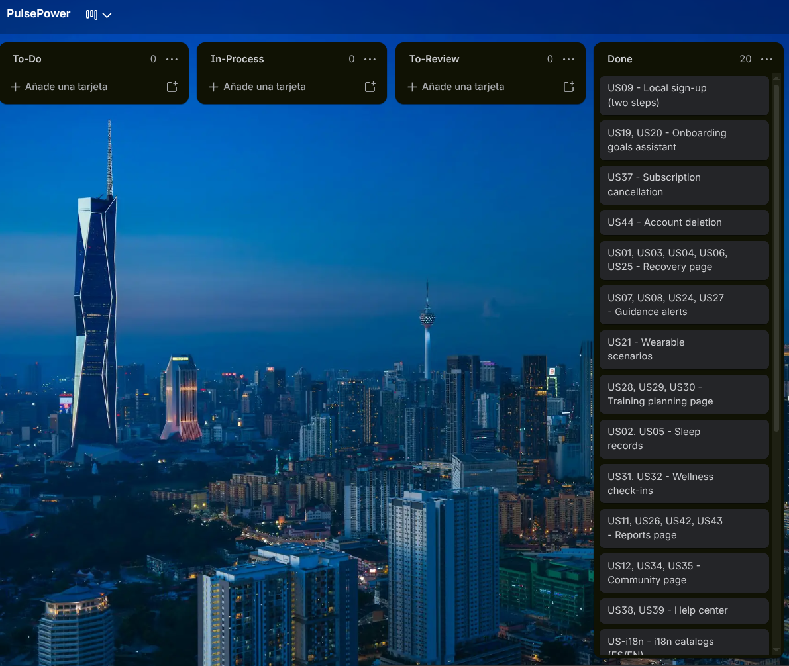

#### 5.2.2.4 Development Evidence for Sprint Review

En el Sprint 2 se implementó la primera versión de la Web Application como *Single Page Application* en Angular 22.2 y TypeScript 6.0, con un servicio de internacionalización propio (`shared/application/i18n.ts`) y Prettier 3.8 para el formateo consistente del código. Marlon Viza preparó la base del proyecto y el equipo lo extendió por bounded context.

El código se organiza en `src/app/modules/`, con un módulo por bounded context — `training`, `sleep`, `wellness`, `physiology`, `reports`, `community` e `iam` — y cada uno divide su código en las capas `domain`, `application`, `infrastructure` y `presentation`, tal como define el diseño del capítulo 4. La carpeta `src/app/shared/` concentra UI, traducciones y utilidades, y **no** constituye un octavo bounded context.

La capa `domain` no depende de Angular ni de HTTP: los componentes consumen servicios de `application` y las implementaciones de persistencia se inyectan desde `src/app/app.config.ts` mediante adaptadores `local-*-repository`. Los modelos persistidos se convierten a través de assemblers, y las cargas concurrentes de un mismo almacén se comparten para evitar resúmenes vacíos. La navegación se resuelve por rutas con carga diferida (`loadChildren`) en `src/app/app.routes.ts`.

Las correcciones de la AV1 aplicadas en el informe se resumen en la sección "Atención de observaciones de la AV1" del Registro de versiones.

**Últimos 10 commits de la Web Application (rama `develop`)**

| # | Commit | Fecha | Autor | Mensaje |
|---|--------|-------|-------|---------|
| 1 | `91ad4e1` | 2026-10-08 18:30 | Iron819 | chore(config): set production API URL to Render |
| 2 | `bc02b19` | 2026-10-08 18:26 | Sergi9017 | feat(physiology): implement unconnected physiological repository for local workspace |
| 3 | `59387a9` | 2026-10-08 18:25 | Sergi9017 | feat(physiology): create recovery page component for simulation interactions |
| 4 | `e266ddf` | 2026-10-08 18:25 | Sergi9017 | feat(physiology): add recovery page for displaying physiological insights and recommendations |
| 5 | `b37c220` | 2026-10-08 18:25 | Sergi9017 | feat(physiology): add PhysiologicalOverviewDto interface for data structure |
| 6 | `7b4f9f7` | 2026-10-08 18:25 | Sergi9017 | feat(physiology): add physiological overview assembler for DTO conversion |
| 7 | `25d150e` | 2026-10-08 18:25 | Sergi9017 | feat(physiology): add routing for recovery page in physiological module |
| 8 | `06378c2` | 2026-10-08 18:25 | Sergi9017 | feat(physiology): implement DemoPhysiologicalRepository for managing simulated physiological data |
| 9 | `16d5842` | 2026-10-08 18:25 | Sergi9017 | test(physiology): add unit tests for simulated guidance alerts in DemoPhysiologicalRepository |
| 10 | `5d79334` | 2026-10-08 18:21 | Sergi9017 | feat(physiology): add WearableConnection interface for managing wearable device connections |
| … | — | — | — | *…91 commits más* |

*Total en `develop`: 101 commits.*

**Commits por integrante**

Commits de cada integrante en el repositorio `pulsepower-webapp` (todas las ramas, sin merges), según la captura de contribuidores de GitHub de la sección 5.2.2.8.

| Integrante | Usuario de GitHub | Commits |
|-|-|-|
| Evangelista Ygnacio, Sergio Joaquin | @Sergi9017 | 64 |
| Viza Quispe, Marlon Packard | @V8Z5 | 20 |
| Martín Farro, Alexis Sebastián | @axismf | 13 |
| Osorio Ramírez, Eduardo Jesús | @Iron819 | 7 |
| Carbajal Santivañez, Sebastian Aaron | @SC-fnfoc | 0 |
| **Total** | | **104** |

#### 5.2.2.5 Execution Evidence for Sprint Review

**URL de despliegue:** https://pulsepower-ten.vercel.app/sign-in

A continuación se presenta el recorrido por la aplicación:

1. Inicio de sesión

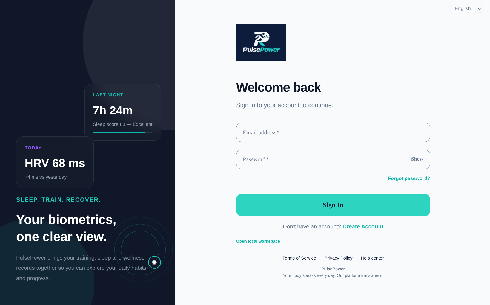

*Pantalla de inicio de sesión con correo y contraseña, enlaces a recuperación de contraseña, registro y espacio de trabajo local, y selector de idioma.*

2. Registro en dos pasos

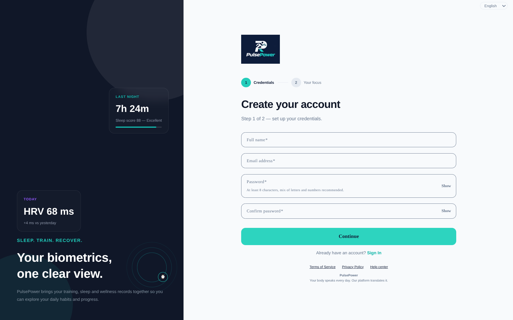

*Primer paso del registro (credenciales); el segundo paso registra el enfoque del usuario (Deportista o Wellness Seeker).*

3. Panel principal

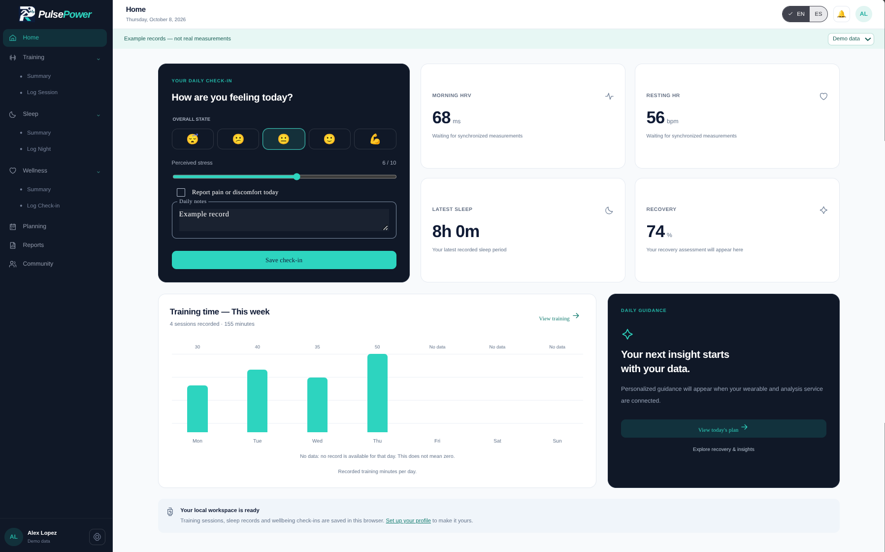

*Panel principal con el check-in diario, HRV y frecuencia cardiaca en reposo, último sueño, nivel de recuperación y tiempo de entrenamiento de la semana. La franja superior indica que los registros mostrados son datos de ejemplo.*

4. Entrenamientos

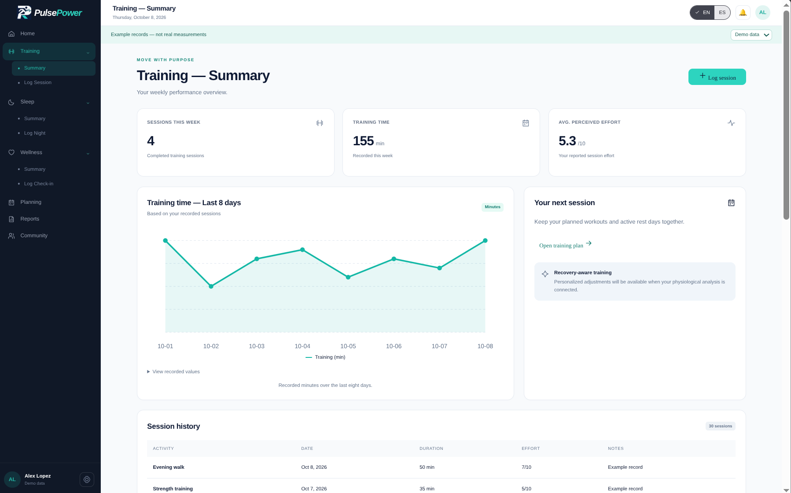

*Resumen de entrenamiento con sesiones, minutos y esfuerzo percibido de la semana, tendencia de los últimos 8 días e historial de sesiones.*

5. Planificación

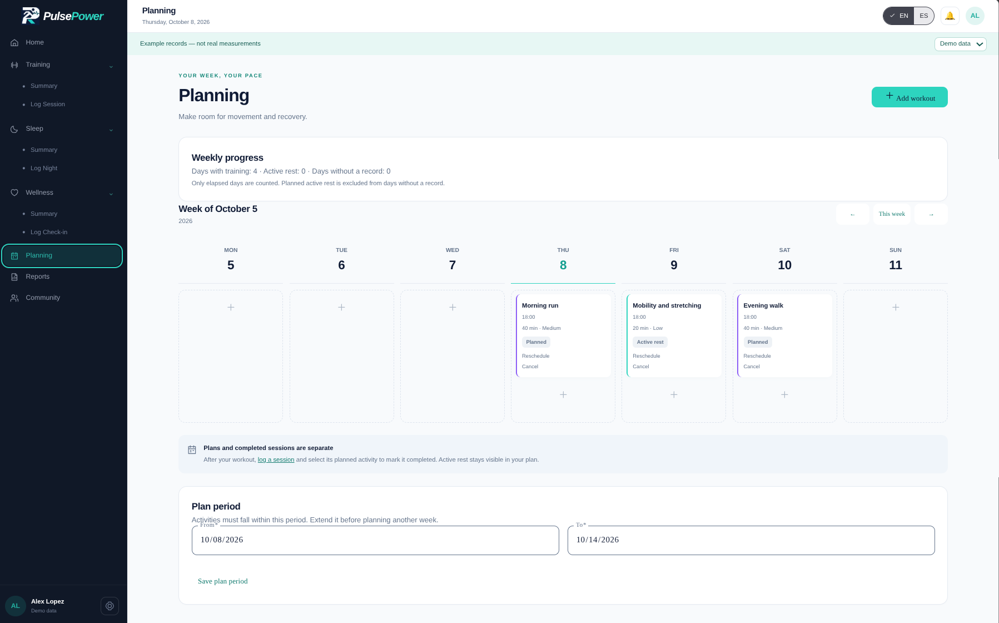

*Calendario semanal de planificación con sesiones planificadas y de descanso activo, opciones de reprogramar o cancelar y periodo del plan.*

6. Sueño

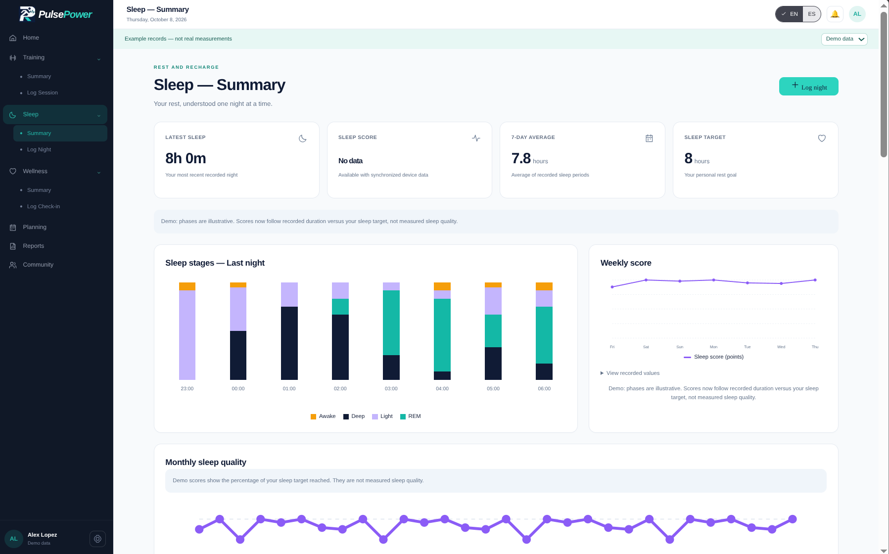

*Resumen de sueño con último registro, promedio de 7 días, meta de horas, fases de sueño ilustrativas y puntuación semanal y mensual (datos de demostración).*

7. Bienestar

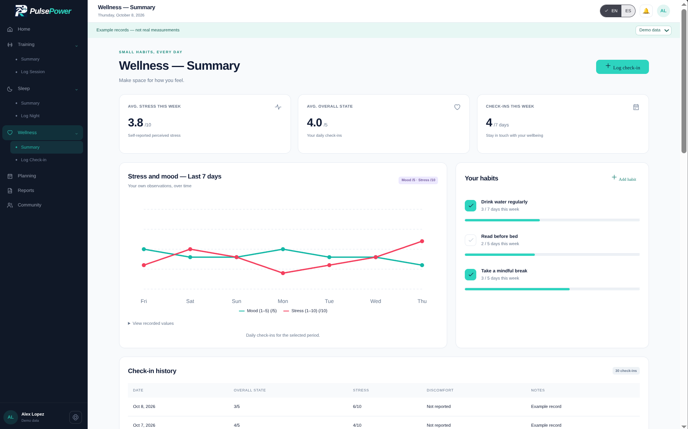

*Resumen de bienestar con estrés y estado promedio, check-ins de la semana, evolución de ánimo y estrés, hábitos e historial de check-ins.*

8. Reportes

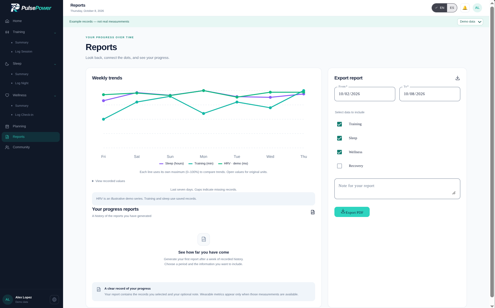

*Reportes con tendencias semanales de sueño, entrenamiento y HRV, y exportación en PDF por periodo y categorías.*

9. Comunidad

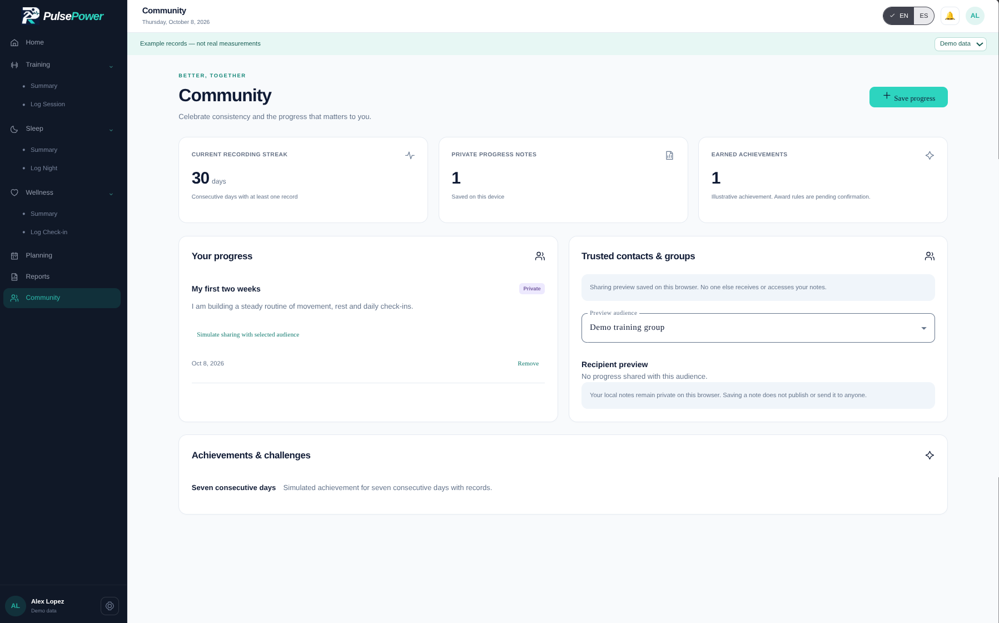

*Comunidad con racha de registros, notas de progreso privadas, logros y vista previa de lo que se compartiría con un contacto o grupo.*

10. Configuración

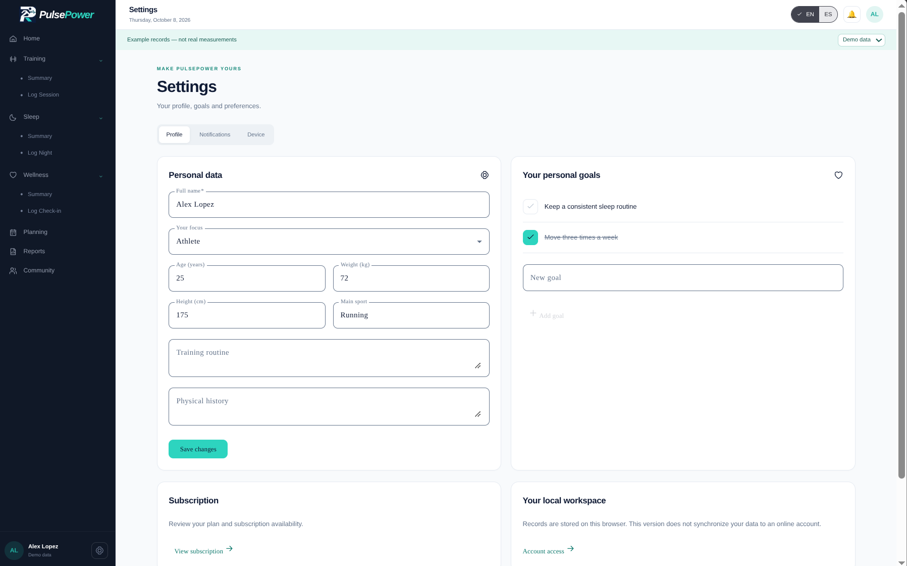

*Configuración del perfil (datos personales, enfoque y medidas), objetivos personales y acceso a la suscripción y al espacio de trabajo local.*

11. Suscripción

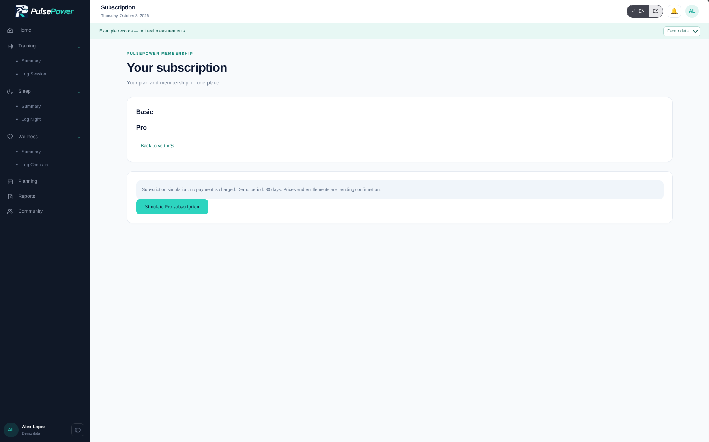

*Pantalla de suscripción con los planes Basic y Pro; la suscripción Pro se simula sin realizar cobros.*

**Origen de los datos por pantalla**

La aplicación funciona con dos espacios de trabajo. El **espacio de demostración** (opción *Open local workspace*, usuario de ejemplo Alex Lopez) se carga con 30 días de registros de ejemplo y muestra el aviso *"Example records — not real measurements"*; todas las capturas anteriores corresponden a este espacio. Una **cuenta personal** creada con el registro empieza sin datos: lo que el usuario registra se guarda en su navegador y los datos de la pulsera se consultan a la API simulada desplegada en Render. La siguiente tabla indica, para cada pantalla, de dónde proviene la información y qué aún no cuenta con un servicio real.

| Pantalla | Registrado por el usuario (local) | Desde la API en Render (cuenta personal) | Simulado o de demostración | Sin servicio real todavía |
|:-|:-|:-|:-|:-|
| Inicio de sesión y registro | Cuenta y contraseña protegida con PBKDF2 en el navegador | — | Espacio de demostración de Alex Lopez | Autenticación en servidor (US10, TS02) |
| Panel principal | Check-in diario, último sueño y entrenamiento de la semana | HRV, frecuencia cardiaca en reposo y nivel de recuperación | En la demostración, HRV, frecuencia cardiaca y recuperación son de ejemplo | Sincronización real con la pulsera |
| Entrenamiento y planificación | Sesiones, esfuerzo percibido y calendario de actividades | — | Registros de ejemplo en la demostración | Sincronización con apps de salud (US22) |
| Sueño | Registros de sueño, rutina y meta de horas | — | Fases del sueño ilustrativas; la puntuación compara la duración con la meta y no mide la calidad del sueño | Sincronización con apps de salud (US23) |
| Bienestar | Check-ins, estrés, hábitos y sesiones de respiración | — | Registros de ejemplo en la demostración | — |
| Recuperación | — | Conexión de la pulsera, métricas, nivel de recuperación, recomendaciones y alertas | Proyección de recuperación calculada en el navegador con una fórmula ilustrativa (horas de sueño frente a 8 h, menos estrés y esfuerzo percibido); no es una predicción médica | Endpoints propios del backend (TS01, TS03) y asistente de IA |
| Reportes | Tendencias y PDF generados en el navegador a partir de los registros | — | Serie de HRV ilustrativa | — |
| Comunidad | Rachas, notas de progreso y logros, guardados solo en el navegador | — | La opción de compartir es una vista previa; no se envía a nadie | Servicio para compartir con contactos y grupos |
| Configuración | Perfil, objetivos, preferencias y notificaciones | — | — | — |
| Suscripción | — | — | Suscripción Pro simulada por 30 días, sin cobro | Pasarela de pagos |

#### 5.2.2.6 Services Documentation Evidence for Sprint Review

Durante este Sprint la Web Application **no expone servicios REST propios**, ya que es una *Single Page Application* de frontend, pero **sí consume un servicio REST**: el endpoint `GET /api/v1/physiological-overview` (resumen fisiológico) de la API desplegada en Render (`https://pulsepower-api.onrender.com/api/v1/physiological-overview`). Las Technical Stories TS01, TS02 y TS03 permanecen en el Product Backlog como trabajo pendiente del backend en Spring Boot y PostgreSQL descrito en la sección 4.6, por lo que aún no existe documentación OpenAPI/Swagger que reportar en esta entrega.

El resto de los datos de la aplicación se gestiona en almacenes locales, cableados en `src/app/app.config.ts`, bajo los prefijos `pulsepower.demo.v1.`, `pulsepower.user.<id>.` y `pulsepower.v1.`, lo que aísla el espacio de trabajo de cada cuenta. Además de la consulta a `GET /api/v1/physiological-overview`, la única llamada HTTP de la aplicación es la carga de los catálogos de idioma `public/i18n/es.json` y `public/i18n/en.json`.

La documentación de servicios mediante OpenAPI/Swagger se incorporará a partir del Sprint 3, junto con la implementación de los endpoints pendientes del backend.

#### 5.2.2.7 Software Deployment Evidence for Sprint Review

Durante el Sprint 2, el equipo realizó el despliegue de la primera versión pública de la Web App utilizando Vercel, mientras que la API que consume la aplicación se encuentra desplegada en Render.

* **Plataforma de despliegue (Web App):** Vercel
* **Plataforma de despliegue (API):** Render
* **URL de la API:** https://pulsepower-api.onrender.com/api/v1/physiological-overview
* **URL base del repositorio:** https://github.com/upc-pre-202620-1asi0729-7737-SportPlus/pulsepower-webapp

**Proceso de despliegue:**
1. Se utilizó el repositorio central del equipo bajo la organización de la clase.
2. Cada integrante integró los módulos de su bounded context en la rama `develop` mediante commits propios con mensajes convencionales (feat, fix, docs).
3. Al cerrar el Sprint 2, la rama `develop` se integró en `main`, que es la rama de producción. En Vercel se importó el repositorio `pulsepower-webapp` mediante su integración nativa con GitHub y se configuró `main` como rama de despliegue.
4. Vercel reconoció el proyecto como una aplicación Angular, ejecutó su build y generó automáticamente la URL pública; a partir de ese momento publica cada cambio integrado en `main`.
5. La Web App consume la API alojada en Render (`GET /api/v1/physiological-overview`), cuyo despliegue es independiente del de la aplicación.

#### 5.2.2.8 Team Collaboration Insights during Sprint.

El equipo mantuvo un ritmo de trabajo organizado por bounded contexts: los integrantes lideraron los bounded contexts según la matriz LACX de la sección 5.2.2.2 y colaboraron en los demás, respetando la arquitectura definida en el capítulo 4.

* **Domain-Driven Design verificado por pruebas.** `src/app/app.spec.ts` falla si un bounded context no expone las cuatro capas, si `domain/` importa Angular o HTTP, o si `presentation` o `application` importan `infrastructure`. La separación de capas no es una convención voluntaria: es un contrato ejecutable.
* **Suite automatizada.** Se implementaron 18 archivos de prueba con 40 casos, ejecutados con `npm test` (Vitest), que cubren reglas de dominio, rangos, solapamientos, reportes, geometría de gráficos, catálogos de idiomas, cuentas locales y persistencia aislada.
* **Consistencia de formato.** Prettier se ejecuta con `npm run format:check` sobre `src`, `public/i18n` y los archivos de configuración, evitando discusiones de estilo en la revisión por pares.
* **Internacionalización centralizada.** El soporte español/inglés y el layout compartido se mantienen en `shared`, garantizando coherencia visual entre los siete contextos.
* **Límites declarados.** El equipo dejó explícito en el repositorio qué es funcionalidad local, qué es simulación y qué depende de un servicio externo: la proyección de recuperación no utiliza IA, las fases de sueño no son mediciones de calidad, y los umbrales 40 y 70 son exclusivos del prototipo. Una pantalla visible no demuestra todos sus criterios de aceptación. 

**Evidencia de aporte por integrante**

La siguiente tabla conecta, para cada integrante, las tareas del Sprint Backlog 2, los commits que las respaldan en el repositorio `pulsepower-webapp` y el resultado que puede comprobarse en la aplicación desplegada.

| Integrante | Tareas del Sprint 2 | Commits representativos | Resultado verificable |
|:-|:-|:-|:-|
| Evangelista Ygnacio, Sergio Joaquin (@Sergi9017, 64 commits) | T16, T17, T18, T20 y T21 (pendiente: T29) | `e266ddf` página de recuperación, `2e8cc96` simulación de recuperación, `34d4c00` alertas de orientación, `5d79334` conexión de la pulsera, `56442d3` página de sueño, `9e13368` página de bienestar, `e43818a` pruebas de la simulación | Páginas de Recuperación, Sueño y Bienestar; alertas y escenarios de la pulsera de demostración; reglas de recuperación cubiertas por pruebas |
| Viza Quispe, Marlon Packard (@V8Z5, 20 commits) | T24, T25 y T26, además de la base de la aplicación (pendiente: T31) | `6736fb0` shell, tema y estilos; `68bc39d` modelos y servicios compartidos; `b90843a` almacenamiento local; `4216077` componentes y páginas compartidas; `bb47b37` catálogos ES/EN | Estructura de la Web Application, centro de ayuda, preferencias de notificación e interfaz bilingüe |
| Martín Farro, Alexis Sebastián (@axismf, 13 commits) | T12, T13, T14, T15 y T23 (pendiente: T27) | `62358c6` módulo IAM, `00dc01e` disponibilidad de identidad, `a54c5d4` suscripción, `cc34f60` módulo Community | Registro e inicio de sesión, onboarding de objetivos, configuración, suscripción simulada, eliminación de cuenta y página de Comunidad |
| Osorio Ramírez, Eduardo Jesús (@Iron819, 7 commits) | T19 y T22, además de la API simulada y su integración (pendiente: T28) | `fb367f5` entrenamiento y planificación, `f049f23` reportes en PDF, `f91600d` API simulada con json-server, `b26d2b0` consumo de la API desde Render, `c92611b` rutas de la aplicación | Planificación de entrenamientos, reportes exportables en PDF y resumen fisiológico obtenido desde la API desplegada en Render |
| Carbajal Santivañez, Sebastian Aaron (@SC-fnfoc, 0 commits) | — | — | No registra aportes en el Sprint 2 |

* Captura de los commits realizados
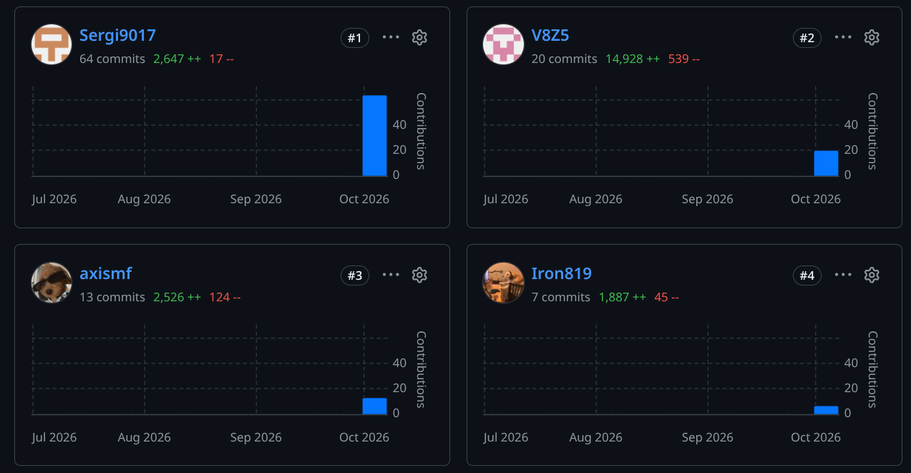

> **Resumen del Sprint 2.** Se completaron 15 de las 20 tareas (128 de 152 Story Points): una Web Application en Angular con los siete bounded contexts, desplegada en Vercel y conectada a una API simulada en Render. Las cinco tareas pendientes dependen del backend, de integraciones externas o de la Landing Page (5.2.2.3). Lo que es real y lo que es simulado se detalla por pantalla en la sección 5.2.2.5, y la evidencia de cada integrante en la sección 5.2.2.8.

### 5.2.3 Sprint 3

En esta sección se detalla la evolución del proyecto durante el Sprint 3, que marca la transición de la API simulada hacia un RESTful API real desarrollado en Java con Spring Boot y persistencia en PostgreSQL. El alcance comprende los servicios web de los siete bounded contexts —IAM, Training, Sleep, Wellness, Community, Physiology y Reports—, la documentación del contrato con OpenAPI/Swagger, el despliegue en la nube de los tres productos y la conexión de la Web Application con la nueva API real.

#### 5.2.3.1 Sprint Planning 3

En esta sección se describen los acuerdos, antecedentes y objetivos establecidos durante la reunión de planificación del Sprint 3.

| Campo | Detalle |
|:---|:---|
| **Sprint #** | Sprint 3 |
| **Date** | 2026-10-27 |
| **Time** | 17:30 |
| **Location** | Reunión virtual |
| **Prepared By** | Martín Farro, Alexis Sebastián |
| **Attendees (Planning Meeting)** | Osorio Ramírez, Eduardo Jesús   Carbajal Santivañez, Sebastian Aaron   Viza Quispe, Marlon Packard   Evangelista Ygnacio, Sergio Joaquin |
| **Sprint 2 Review Summary** | Durante el Sprint 2 se implementó la primera versión de la Web Application en Angular con los siete bounded contexts organizados en cuatro capas. Se completaron 15 de las 20 tareas planificadas (128 de 152 Story Points). La aplicación consumió una API simulada desplegada en Render, por lo que los datos no persistían en una base de datos real. Quedaron pendientes la protección de datos con TLS y autorización (US10), la sincronización con apps de salud externas (US22, US23), el CTA de registro desde la Landing Page (US15) y los endpoints del backend (TS01, TS02 y TS03). |
| **Sprint 2 Retrospective Summary** | El equipo acordó que cada integrante lidere el bounded context del backend que ya lideró en el frontend, que se priorice la implementación del RESTful API real sobre la API simulada y que las correcciones de la TB1 se resuelvan dentro del Sprint 3. Se acordó también distribuir la carga de los bounded contexts más pesados entre dos integrantes. |
| **Sprint Goal** | Our focus is on implementing the PulsePower RESTful API in Java Spring Boot with PostgreSQL persistence for all seven bounded contexts. We believe it delivers persistent and secure data to athletes and wellness seekers, replacing the simulated local data from Sprint 2 with a real backend service. This will be confirmed when the Web Application operates against the deployed RESTful API, a user's data persists in PostgreSQL, the Landing Page links to the Web Application, and the OpenAPI documentation is accessible. |
| **Value Proposition – Visitors** | Acceso directo desde los botones del Landing Page hacia el registro y el inicio de sesión de la Web Application. |
| **Value Proposition – Users** | Datos de entrenamiento, sueño, bienestar, fisiología, comunidad y reportes que se conservan en una base de datos real, en lugar de datos simulados o locales. |
| **Value Proposition – Developers** | Arquitectura en la nube (Vercel, Render con Docker y PostgreSQL) con servicios documentados en OpenAPI/Swagger. |
| **Sprint Completion Criteria** | La Landing Page redirige al registro e inicio de sesión de la Web Application; la Web Application opera contra el RESTful API desplegado; los datos persisten en PostgreSQL; sin errores de CORS en producción; documentación OpenAPI accesible en el entorno de desarrollo. |
| **User Stories incluidas en el Sprint** | US10: Proteger datos fisiológicos del usuario (3 SP)   US15: Iniciar registro desde la Landing Page (2 SP)   TS01: Exponer endpoint de estado de recuperación (3 SP)   TS02: Exponer endpoint de registro de perfil (3 SP)   TS03: Exponer endpoint de alertas activas (3 SP)   + tareas técnicas de implementación del backend (Training, Sleep, Wellness, Community, Physiology, Reports, Shared, despliegue e integración frontend) |
| **Sprint 3 Velocity** | 36 Story Points |
| **Sum of Story Points** | 44 Story Points (36 SP Done + 8 SP Pendientes: US22, US23) |

#### 5.2.3.2 Aspect Leaders and Collaborators

Para el Sprint 3 el liderazgo se mantiene por bounded context en continuidad con el Sprint 2, y se incorporan dos aspectos transversales: el despliegue del backend y la integración del frontend con el RESTful API.

| **Integrante** | **IAM** | **Training** | **Sleep** | **Wellness** | **Community** | **Physiology** | **Reports** | **Despliegue** | **Integración Frontend** |
| :--- | :---: | :---: | :---: | :---: | :---: | :---: | :---: | :---: | :---: |
| Martín Farro, Alexis Sebastián | L | C | C | C | C | C | C | L | C |
| Evangelista Ygnacio, Sergio Joaquin | C | L | L | C | C | C | C | C | C |
| Carbajal Santivañez, Sebastian Aaron | C | C | C | L | L | C | C | C | L |
| Viza Quispe, Marlon Packard | C | C | C | C | C | L | L | C | C |
| Osorio Ramírez, Eduardo Jesús | — | — | — | — | — | — | — | — | — |

*(L = Leader, C = Collaborator, — = sin participación en este Sprint)*

#### 5.2.3.3 Sprint Backlog 3

Las historias del Sprint 3 se descomponen en tareas técnicas. El tablero del proyecto en Trello: https://trello.com/invite/b/6aaede0bb47af502ba9eb29d/ATTI6002400c8c79f6ddabb88999b2168b7a7AB82763/pulsepower

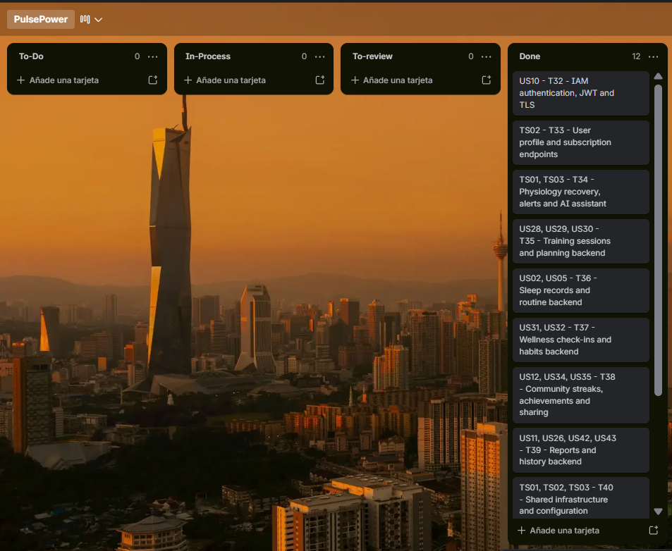

| Story ID | Story Title | Task ID | Task Title | Task Description | Estimation (Hours) | Assigned To | Status |
| :--- | :--- | :--- | :--- | :--- | :---: | :--- | :--- |
| US10 | Proteger datos fisiológicos del usuario | T32 | IAM bounded context – auth, JWT y TLS | Bounded context IAM en Spring Boot: registro (`POST /api/v1/authentication/sign-up`), inicio de sesión (`POST /api/v1/authentication/sign-in`), JWT (HS256) con roles, contraseñas con BCrypt, comunicación exclusiva por HTTPS/TLS. | 8 | Martín Farro, Alexis Sebastián | Done |
| TS02 | Exponer endpoint de registro de perfil | T33 | Endpoints de usuarios y suscripciones | `GET/PUT /api/v1/users/me`, perfil (`PUT /api/v1/users/me/profile`), contraseña (`PUT /api/v1/users/me/password`), eliminación (`DELETE /api/v1/users/me`), objetivos (`POST/PUT/DELETE /api/v1/users/me/goals`), suscripciones (`GET/POST /api/v1/subscriptions/me`, `POST /api/v1/subscriptions/me/cancel`). | 7 | Martín Farro, Alexis Sebastián | Done |
| TS01, TS03 | Exponer endpoints de recuperación y alertas | T34 | Physiology bounded context – recuperación, sincronización y asistente | `GET /api/v1/physiology/overview`, `POST/DELETE /api/v1/physiology/connection`, `POST /api/v1/physiology/sync`, `POST /api/v1/physiology/alerts/{alertId}/review`, `POST /api/v1/assistant/messages` (generación de rutina con IA). | 8 | Viza Quispe, Marlon Packard | Done |
| (técnica) | Training bounded context backend | T35 | Training bounded context – sesiones y plan de entrenamiento | `GET/POST /api/v1/training/sessions`, `DELETE /api/v1/training/sessions/{sessionId}`, `GET /api/v1/training/plan`, `PUT /api/v1/training/plan/period`, `POST /api/v1/training/plan/activities`, `PUT/POST cancel /api/v1/training/plan/activities/{activityId}`. Pruebas de dominio con JUnit 5. | 7 | Evangelista Ygnacio, Sergio Joaquin | Done |
| (técnica) | Sleep bounded context backend | T36 | Sleep bounded context – registros y rutina de sueño | `GET/POST /api/v1/sleep/records`, `PUT/DELETE /api/v1/sleep/records/{recordId}`, `GET/PUT /api/v1/sleep/routine`. Validación de periodos superpuestos en el dominio. Pruebas de dominio con JUnit 5. | 6 | Evangelista Ygnacio, Sergio Joaquin | Done |
| (técnica) | Wellness bounded context backend | T37 | Wellness bounded context – check-ins y hábitos | `GET/POST /api/v1/wellness/check-ins` (un check-in por día), `GET/POST /api/v1/wellness/habits`, `DELETE /api/v1/wellness/habits/{habitId}`, `GET /api/v1/wellness/habits/logs`, `POST /api/v1/wellness/habits/{habitId}/logs`. Pruebas de dominio con JUnit 5. | 7 | Carbajal Santivañez, Sebastian Aaron | Done |
| (técnica) | Community bounded context backend | T38 | Community bounded context – racha, logros y progreso compartido | `GET /api/v1/community/streak`, `GET /api/v1/community/achievements`, `GET/POST /api/v1/community/progress`, `DELETE /api/v1/community/progress/{progressId}`, `POST/DELETE /api/v1/community/progress/{progressId}/shares/{audience}`. Pruebas de dominio con JUnit 5. | 6 | Carbajal Santivañez, Sebastian Aaron | Done |
| (técnica) | Reports bounded context backend | T39 | Reports bounded context – informes y entradas de historial | `GET/POST /api/v1/reports`, `GET /api/v1/reports/entries`, `GET /api/v1/reports/{reportId}/document`. Validación de rango de historial mínimo. | 6 | Viza Quispe, Marlon Packard | Done |
| (técnica) | Shared infrastructure | T40 | Shared – infraestructura transversal, excepciones y configuración | Clases base JPA, estrategia de nombres `snake_case` con tablas pluralizadas, manejador global de excepciones (`@RestControllerAdvice`), perfil `prod` con variables de entorno para PostgreSQL y JWT. | 5 | Martín Farro, Alexis Sebastián | Done |
| US15 | Iniciar registro desde la Landing Page | T41 | CTA Landing Page → Web Application | Botones "Log In" y "Sign Up" de la Landing Page apuntan a las rutas `/sign-in` y `/sign-up` de la Web Application desplegada en Vercel. | 2 | Viza Quispe, Marlon Packard | Done |
| (técnica) | Despliegue del RESTful API | T42 | Dockerización y despliegue del RESTful API | `Dockerfile` multi-stage (JDK 21 → JRE), perfiles Spring Boot (`dev` / `prod`), variables de entorno en Render (`DB_URL`, `DB_USERNAME`, `DB_PASSWORD`, `JWT_SECRET`) y conexión a base de datos PostgreSQL en la nube. | 5 | Martín Farro, Alexis Sebastián | Done |
| (técnica) | Integración con la Web Application | T43 | Conexión de la Web Application con el RESTful API | Reemplazar la URL de la API simulada por la del RESTful API en `environment.ts`; añadir interceptor `authInterceptor` con Bearer token; adaptar los repositorios HTTP de cada bounded context. | 6 | Carbajal Santivañez, Sebastian Aaron   Viza Quispe, Marlon Packard | Done |
| US22, US23 | Sincronizar con apps de salud externas | T44 | Integración con Apple Health y Google Fit | Importación automática de sesiones y ciclos de sueño desde plataformas externas con resolución de duplicados. | 8 | Sin asignar | To-Do |
| | **Total** | **36** | | | **81** | | |

**Estado técnico de las tareas en la versión TF del código.** La siguiente tabla indica qué existe verificado en el código entregado.

| Task ID | Resultado en el código | Ubicación |
| :--- | :--- | :--- |
| T32 | Implementado: registro, inicio de sesión, BCrypt y JWT con roles | `src/main/java/…/iam/` |
| T33 | Implementado: perfil, contraseña, eliminación, objetivos y suscripciones | `src/main/java/…/iam/` |
| T34 | Implementado: overview fisiológico, conexión a pulsera AIoTI, sincronización, revisión de alertas y asistente de IA | `src/main/java/…/physiology/` |
| T35 | Implementado: sesiones de entrenamiento y plan de actividades con pruebas de dominio | `src/main/java/…/training/` |
| T36 | Implementado: registros de sueño con validación de solapamientos y rutina de sueño con pruebas de dominio | `src/main/java/…/sleep/` |
| T37 | Implementado: check-ins diarios y hábitos con sus registros con pruebas de dominio | `src/main/java/…/wellness/` |
| T38 | Implementado: racha, logros, avance compartido y control de audiencia con pruebas de dominio | `src/main/java/…/community/` |
| T39 | Implementado: informes de progreso, entradas de historial y validación de rango mínimo | `src/main/java/…/reports/` |
| T40 | Implementado: estrategia de nombres JPA, manejador de excepciones global, perfil `prod` | `src/main/java/…/shared/` |
| T41 | Implementado: botones "Log In" y "Sign Up" apuntan a la Web Application desplegada | `pulsepower-website/index.html` |
| T42 | Preparado: `Dockerfile`, `application-prod.properties`, variables de entorno configuradas; pendiente la URL pública estable del API en Render | `pulsepower-backend/` raíz |
| T43 | Implementado: `environment.ts` apunta a `https://pulsepower-api.onrender.com/api/v1`; `authInterceptor` adjunta el Bearer token | `pulsepower-webapp/src/environments/`, `shared/infrastructure/api.ts` |
| T44 | Pendiente: requiere integración con Apple Health y Google Fit | — |

#### 5.2.3.4 Development Evidence for Sprint Review

En el Sprint 3 se implementó la primera versión de los Web Services de PulsePower, **PulsePower Backend**, en Java 21 con Spring Boot. El código se organiza en `src/main/java/com/sportplus/pulsepower/` con un directorio por bounded context — `iam`, `training`, `sleep`, `wellness`, `community`, `physiology` y `reports` — y un núcleo compartido (`shared`). Cada contexto se divide en las capas `domain`, `application`, `infrastructure` e `interfaces`, tal como define el diseño del capítulo 4.

Principales decisiones de implementación:

- **Persistencia:** Spring Data JPA con el proveedor Hibernate sobre PostgreSQL; estrategia de nombres `SnakeCaseWithPluralizedTablePhysicalNamingStrategy`; esquema gestionado con `spring.jpa.hibernate.ddl-auto=update` en desarrollo y `validate` en producción.
- **Seguridad:** contraseñas con BCrypt, JWT firmado (HS256) con los claims `sub`, `role` y `email`, autorización con `@PreAuthorize` y verificación de propiedad en cada caso de uso. Comunicación exclusiva por HTTPS/TLS en el entorno desplegado.
- **Reglas de negocio en el servidor:** los registros de sueño rechazan periodos superpuestos; los check-ins admiten solo uno por día; la recuperación se calcula con HRV, frecuencia cardíaca en reposo y registros recientes; las rutinas de entrenamiento se generan con un modelo de IA.
- **Errores:** respuestas `application/problem+json` con un `code` estable, manejadas por un `@RestControllerAdvice` global en `shared`.
- **Integración:** la Web Application reemplaza la URL de json-server por la del RESTful API; los assemblers HTTP de cada bounded context convierten los DTOs de respuesta en modelos de dominio del frontend.
- **Pruebas:** pruebas de dominio con JUnit 5 para los bounded contexts Training, Sleep, Wellness, Community, Physiology y Shared (`mvn test`).

Repositorio del backend: https://github.com/upc-pre-202620-1asi0729-7737-SportPlus/pulsepower-backend

**Commits representativos del Sprint 3 — backend (`feature/iam`, `feature/training-sleep`, `feature/wellness-community`, `feature/shared-physiology-reports`)**

| # | Commit | Fecha | Autor | Mensaje |
|:---:|:---|:---:|:---|:---|
| 1 | `54fe727` | 2026-11-10 | @axismf | feat(iam): implement identity and subscription domain and application services |
| 2 | `e3a86f3` | 2026-11-10 | @axismf | feat(iam): implement persistence, authentication and REST endpoints |
| 3 | `99ecdb2` | 2026-11-10 | @axismf | feat(shared): add cross-cutting infrastructure and exception handling |
| 4 | `8367186` | 2026-11-10 | @axismf | feat(physiology): implement wearable connection and physiological domain |
| 5 | `773de98` | 2026-11-10 | @axismf | test(physiology): add aggregate and recovery calculator unit tests |
| 6 | `9748c5f` | 2026-11-08 | @Sergi9017 | feat(training): implement training plans domain and application services |
| 7 | `d873173` | 2026-11-08 | @Sergi9017 | feat(sleep): implement sleep tracking domain and application services |
| 8 | `e97b526` | 2026-11-08 | @SC-fnfoc | feat(wellness): implement wellness domain and application services |
| 9 | `22b1963` | 2026-11-08 | @SC-fnfoc | feat(community): implement streaks, achievements and shared progress domain and services |
| 10 | `503543a` | 2026-11-09 | Marlon | feat(physiology): add physiological domain and recovery calculator |
| … | — | — | — | *…31 commits más* |

*Total en el backend: 41 commits (incluye feature branches y rama `feature/iam`).*

**Commits por integrante — backend**

| Integrante | Usuario de GitHub | Commits |
| :--- | :--- | :---: |
| Martín Farro, Alexis Sebastián | @axismf | 16 |
| Viza Quispe, Marlon Packard | @V8Z5 | 12 |
| Evangelista Ygnacio, Sergio Joaquin | @Sergi9017 | 6 |
| Carbajal Santivañez, Sebastian Aaron | @SC-fnfoc | 6 |
| Osorio Ramírez, Eduardo Jesús | @Iron819 | 0 |
| **Total** | | **40** |

**Commits representativos del Sprint 3 — webapp (`feature/frontend-backend-integration`)**

| # | Commit | Fecha | Autor | Mensaje |
|:---:|:---|:---:|:---|:---|
| 1 | `48f27bc` | 2026-11-09 | Marlon | feat: connect PulsePower webapp to the backend |
| 2 | `f652fd3` | 2026-11-09 | Marlon | fix: keep the PulsePower web app running locally |
| 3 | `56f04bd` | 2026-11-11 | @SC-fnfoc | feat: reconnect PulsePower webapp to the backend API |

**Commits representativos del Sprint 3 — Landing Page (`main`)**

| # | Commit | Fecha | Autor | Mensaje |
|:---:|:---|:---:|:---|:---|
| 1 | `c6b53f1` | 2026-10-08 | @V8Z5 | fix(navigation): connect login and registration to webapp |
| 2 | `bb1c8f2` | 2026-11-10 | Marlon | feat: embed PulsePower presentation video |
| 3 | `71a6d0e` | 2026-11-10 | Marlon | fix: show PulsePower video thumbnail and play inline |

#### 5.2.3.5 Execution Evidence for Sprint Review

**URL de la Web Application:** https://pulsepower-ten.vercel.app/sign-in

En el Sprint 3 la Web Application opera contra el RESTful API desplegado en Render. Los datos registrados por el usuario (sesiones, sueño, check-ins, hábitos, notas de progreso) persisten en PostgreSQL en lugar de guardarse solo en el navegador. Las pantallas son las mismas que en el Sprint 2 (sección 5.2.2.5); el cambio sustancial es que los datos ahora se leen y escriben desde el servidor.

| Pantalla | Origen de los datos en el Sprint 3 | Cambio respecto del Sprint 2 |
| :--- | :--- | :--- |
| Inicio de sesión y registro | Autenticación real en el servidor con JWT | Reemplaza el almacenamiento local del navegador |
| Panel principal | HRV y recuperación desde `GET /api/v1/physiology/overview` | Mismos datos, pero desde el backend real |
| Entrenamiento y planificación | `GET/POST /api/v1/training/sessions` y `/plan` | Datos guardados en PostgreSQL, no en localStorage |
| Sueño | `GET/POST /api/v1/sleep/records` y `/routine` | Datos guardados en PostgreSQL |
| Bienestar | `GET/POST /api/v1/wellness/check-ins` y `/habits` | Datos guardados en PostgreSQL |
| Recuperación | `GET /api/v1/physiology/overview`; asistente en `POST /api/v1/assistant/messages` | Calculado en el servidor; asistente de IA disponible |
| Reportes | `GET/POST /api/v1/reports` y `/entries` | Generados con historial real del servidor |
| Comunidad | `GET /api/v1/community/streak`, `/achievements`, `/progress` | Racha y logros calculados en el servidor |

*Panel principal de la Web Application operando contra el RESTful API.*

**Video de demostración:** [PENDIENTE: URL]

#### 5.2.3.6 Services Documentation Evidence for Sprint Review

El contrato de los servicios se documenta con OpenAPI (SpringDoc). El API genera el documento y lo expone en las siguientes rutas (disponibles en el perfil `dev`):

- Swagger UI: `http://localhost:8080/swagger-ui.html`
- Documento OpenAPI: `http://localhost:8080/v3/api-docs`

Todos los endpoints usan el prefijo `/api/v1`, JSON en camelCase e identificadores enteros, y requieren `Authorization: Bearer <token>` salvo `sign-up` y `sign-in`.

| Bounded Context | Endpoint | Verbo HTTP | Propósito | Respuesta |
| :--- | :--- | :--- | :--- | :--- |
| IAM | `/api/v1/authentication/sign-up` | POST | Registra una cuenta con rol | 201 · 400 · 409 |
| IAM | `/api/v1/authentication/sign-in` | POST | Valida credenciales y emite JWT | 200 `{token, role}` · 401 |
| IAM | `/api/v1/users/me` | GET | Consulta el perfil del usuario autenticado | 200 · 401 |
| IAM | `/api/v1/users/me/profile` | PUT | Actualiza nombre, teléfono y empresa | 200 · 422 |
| IAM | `/api/v1/users/me/password` | PUT | Cambia la contraseña | 200 · 422 |
| IAM | `/api/v1/users/me` | DELETE | Elimina la cuenta y todos sus datos | 204 · 401 |
| IAM | `/api/v1/users/me/goals` | POST | Crea un objetivo personal | 201 · 422 |
| IAM | `/api/v1/users/me/goals/{goalId}` | PUT, DELETE | Actualiza o elimina un objetivo | 200 · 404 |
| IAM | `/api/v1/subscriptions/plans` | GET | Lista los planes disponibles | 200 |
| IAM | `/api/v1/subscriptions/me` | GET, POST | Consulta o activa la suscripción Pro | 200 · 201 |
| IAM | `/api/v1/subscriptions/me/cancel` | POST | Cancela la suscripción Pro | 200 · 409 |
| Training | `/api/v1/training/sessions` | GET, POST | Lista y registra sesiones de entrenamiento | 200 · 201 · 422 |
| Training | `/api/v1/training/sessions/{sessionId}` | DELETE | Elimina una sesión | 204 · 404 |
| Training | `/api/v1/training/plan` | GET | Consulta el plan activo | 200 |
| Training | `/api/v1/training/plan/period` | PUT | Actualiza el periodo del plan | 200 |
| Training | `/api/v1/training/plan/activities` | POST | Añade una actividad planificada | 201 · 409 |
| Training | `/api/v1/training/plan/activities/{activityId}` | PUT | Actualiza una actividad planificada | 200 · 404 |
| Training | `/api/v1/training/plan/activities/{activityId}/cancel` | POST | Cancela una actividad planificada | 200 · 409 |
| Sleep | `/api/v1/sleep/records` | GET, POST | Lista y registra periodos de sueño | 200 · 201 · 409 |
| Sleep | `/api/v1/sleep/records/{recordId}` | PUT, DELETE | Actualiza o elimina un registro | 200 · 404 |
| Sleep | `/api/v1/sleep/routine` | GET, PUT | Consulta y actualiza la rutina de sueño | 200 |
| Wellness | `/api/v1/wellness/check-ins` | GET, POST | Lista y registra el check-in diario | 200 · 201 · 409 |
| Wellness | `/api/v1/wellness/habits` | GET, POST | Lista y crea hábitos | 200 · 201 |
| Wellness | `/api/v1/wellness/habits/{habitId}` | DELETE | Elimina un hábito | 204 · 404 |
| Wellness | `/api/v1/wellness/habits/logs` | GET | Lista los registros de hábitos | 200 |
| Wellness | `/api/v1/wellness/habits/{habitId}/logs` | POST | Registra el cumplimiento de un hábito | 201 · 409 |
| Community | `/api/v1/community/streak` | GET | Consulta la racha activa del usuario | 200 |
| Community | `/api/v1/community/achievements` | GET | Lista los logros del usuario | 200 |
| Community | `/api/v1/community/progress` | GET, POST | Lista y crea notas de progreso | 200 · 201 |
| Community | `/api/v1/community/progress/{progressId}` | DELETE | Elimina una nota de progreso | 204 · 404 |
| Community | `/api/v1/community/progress/{progressId}/shares` | POST | Comparte una nota con una audiencia | 201 · 409 |
| Community | `/api/v1/community/progress/{progressId}/shares/{audience}` | DELETE | Revoca el acceso de una audiencia | 204 · 404 |
| Physiology | `/api/v1/physiology/overview` | GET | Consulta el resumen fisiológico y de recuperación | 200 · 404 |
| Physiology | `/api/v1/physiology/connection` | POST, DELETE | Vincula o desvincula la pulsera AIoTI | 201 · 204 · 409 |
| Physiology | `/api/v1/physiology/sync` | POST | Fuerza la sincronización con la pulsera | 200 · 409 |
| Physiology | `/api/v1/physiology/alerts/{alertId}/review` | POST | Marca una alerta como revisada | 200 · 404 |
| Physiology | `/api/v1/assistant/messages` | POST | Envía un mensaje al asistente de IA para generación de rutinas | 200 |
| Reports | `/api/v1/reports` | GET, POST | Lista e inicia la generación de un informe | 200 · 201 · 409 |
| Reports | `/api/v1/reports/entries` | GET | Lista las entradas de historial disponibles | 200 |
| Reports | `/api/v1/reports/{reportId}/document` | GET | Descarga el documento del informe | 200 · 404 |

#### 5.2.3.7 Software Deployment Evidence for Sprint Review

| Producto | Plataforma | Configuración incluida | Estado | URL |
| :--- | :--- | :--- | :--- | :--- |
| Landing Page | GitHub Pages | — | Desplegada. CTA "Log In" / "Sign Up" apuntan a la Web Application. | https://upc-pre-202620-1asi0729-7737-sportplus.github.io/pulsepower-website/ |
| Web Application | Vercel | `environment.ts` apunta al API real; `authInterceptor` con Bearer token | Desplegada. | https://pulsepower-ten.vercel.app/sign-in |
| RESTful Web Services | Render (contenedor Docker) | `Dockerfile`, perfiles Spring Boot `dev` / `prod`, variables de entorno configuradas en Render | Desplegado. `GET /actuator/health` → `{"status":"UP"}` | https://pulsepower-api.onrender.com/api/v1 |
| Base de datos | PostgreSQL (Render managed DB) | URL inyectada por variable de entorno `DB_URL`; esquema validado al iniciar el API | Activa. | — (no se publica la cadena de conexión) |

#### 5.2.3.8 Team Collaboration Insights during Sprint

La colaboración del Sprint 3 se evidencia con las estadísticas de GitHub de los repositorios del RESTful API, la Web Application y la Landing Page (**Insights → Contributors** y **Insights → Commits**), filtradas al período del sprint (2026-10-27 a 2026-11-13).

> **Resumen del Sprint 3.** Se completaron 12 de las 13 tareas (36 de 44 Story Points): el RESTful API en Spring Boot con los siete bounded contexts desplegado en Render, la Web Application conectada al backend real y la Landing Page con CTA hacia la Web Application. La tarea pendiente (T44) requiere integración con plataformas de salud externas. La evidencia de cada integrante y los endpoints documentados se detallan en las secciones 5.2.3.4 y 5.2.3.6.

## 5.3. Validation Interviews

### 5.3.1. Diseño de Entrevistas

**Objetivo.** Validar con usuarios de los dos segmentos que los flujos implementados en la Web Application conectada al RESTful API resuelven los problemas identificados en el capítulo II, y detectar problemas de usabilidad o de valor antes del siguiente sprint.

**Participantes.** Al menos tres personas por segmento (Deportistas; Wellness Seekers), distintas de los integrantes del equipo. **Formato:** sesión de 20 a 30 minutos, presencial o por videollamada grabada con consentimiento. El entrevistado usa la versión desplegada de la Web Application con una cuenta de prueba; el entrevistador no guía los clics salvo que la persona quede bloqueada.

**Guion — Segmento 1: Deportistas**

1. Presentación del objetivo y consentimiento para grabar.
2. Datos generales: edad aproximada, deporte que practica, frecuencia de entrenamiento semanal, cómo gestiona su descanso y recuperación hoy.
3. Tarea 1: registrarse e iniciar sesión.
4. Tarea 2: registrar una sesión de entrenamiento de hoy con su esfuerzo percibido.
5. Tarea 3: registrar las horas de sueño de la noche anterior.
6. Tarea 4: consultar el panel de recuperación e interpretar el nivel mostrado.
7. Tarea 5: generar un reporte semanal de entrenamiento.
8. Preguntas: ¿qué tan confiable te parece el nivel de recuperación calculado?, ¿qué información te faltó?, ¿usarías esta app antes de cada entrenamiento?, ¿qué cambiarías?
9. Valoración de 1 a 5 de la facilidad de uso de cada tarea.

**Guion — Segmento 2: Wellness Seekers**

1. Presentación y consentimiento.
2. Datos generales: edad aproximada, rutina de descanso actual, si usa alguna app de salud o pulsera.
3. Tarea 1: registrarse e iniciar sesión.
4. Tarea 2: registrar el sueño de la noche anterior con sus fases aproximadas.
5. Tarea 3: completar el check-in diario de bienestar (estrés y estado de ánimo).
6. Tarea 4: crear un hábito saludable y registrar su cumplimiento del día.
7. Tarea 5: consultar el resumen semanal de bienestar.
8. Preguntas: ¿los indicadores de bienestar son claros para alguien sin conocimiento técnico?, ¿qué te motivaría a registrar tu sueño todos los días?, ¿qué faltaría para confiar en las recomendaciones?
9. Valoración de 1 a 5 de cada tarea.

**Registro.** Por cada entrevista se anotan: tiempo empleado por tarea, errores, comentarios textuales relevantes y las valoraciones numéricas.

### 5.3.2. Registro de Entrevistas

Las entrevistas de validación se realizaron con la versión integrada del Sprint 3. Esta sección se completa con los datos reales de cada sesión.

| N.° | Segmento | Entrevistado | Fecha | Duración | Entrevistador | Enlace a la grabación | Resumen de hallazgos |
| :---: | :--- | :--- | :--- | :--- | :--- | :--- | :--- |
| 1 | Deportista | [PENDIENTE] | [PENDIENTE] | [PENDIENTE] | [PENDIENTE] | [PENDIENTE] | [PENDIENTE] |
| 2 | Deportista | [PENDIENTE] | [PENDIENTE] | [PENDIENTE] | [PENDIENTE] | [PENDIENTE] | [PENDIENTE] |
| 3 | Deportista | [PENDIENTE] | [PENDIENTE] | [PENDIENTE] | [PENDIENTE] | [PENDIENTE] | [PENDIENTE] |
| 4 | Wellness Seeker | [PENDIENTE] | [PENDIENTE] | [PENDIENTE] | [PENDIENTE] | [PENDIENTE] | [PENDIENTE] |
| 5 | Wellness Seeker | [PENDIENTE] | [PENDIENTE] | [PENDIENTE] | [PENDIENTE] | [PENDIENTE] | [PENDIENTE] |
| 6 | Wellness Seeker | [PENDIENTE] | [PENDIENTE] | [PENDIENTE] | [PENDIENTE] | [PENDIENTE] | [PENDIENTE] |

### 5.3.3. Evaluaciones según heurísticas

Se aplicará una evaluación heurística a la Web Application integrada usando las diez heurísticas de usabilidad de Jakob Nielsen. Cada hallazgo se registra con la tarea en que apareció, la heurística incumplida, su severidad (0 = no es problema, 1 = cosmético, 2 = menor, 3 = mayor, 4 = catastrófico) y la recomendación.

**Carrera:** Ingeniería de Software · **Curso:** Desarrollo de Aplicaciones Open Source · **Producto:** PulsePower Web Application · **Evaluador(es):** SportPlus · **Fecha:** 2026-11-13

**Tareas evaluadas:** registro e inicio de sesión; entrenamiento y planificación; sueño; bienestar y hábitos; recuperación fisiológica; reportes; comunidad.

| Heurística | Descripción |
| :--- | :--- |
| H1 | Visibilidad del estado del sistema |
| H2 | Correspondencia entre el sistema y el mundo real |
| H3 | Control y libertad del usuario |
| H4 | Consistencia y estándares |
| H5 | Prevención de errores |
| H6 | Reconocer antes que recordar |
| H7 | Flexibilidad y eficiencia de uso |
| H8 | Diseño estético y minimalista |
| H9 | Ayudar a reconocer, diagnosticar y recuperarse de errores |
| H10 | Ayuda y documentación |

| N.° | Problema | Tarea / pantalla | Heurística | Severidad | Recomendación |
| :---: | :--- | :--- | :---: | :---: | :--- |
| 1 | El panel principal no indica claramente si los datos mostrados provienen del servidor o son datos de ejemplo; el aviso solo aparece en el espacio de demostración. | Panel principal (cuenta personal) | H1, H4 | 2 | Mostrar un indicador de origen de datos ("datos en tiempo real" / "datos de ejemplo") visible en todas las vistas. |
| 2 | El formulario de registro no explica los requisitos de la contraseña hasta que el usuario falla en el intento. | Registro | H5, H9 | 2 | Mostrar los requisitos de la contraseña debajo del campo antes de que el usuario escriba. |
| 3 | El botón de cancelación de suscripción Pro no tiene confirmación de la acción irreversible. | Suscripción | H3, H5 | 3 | Añadir un diálogo de confirmación con el efecto de la cancelación y la fecha de fin del periodo activo. |
| 4 | Los términos "HRV" y "frecuencia cardíaca en reposo" se muestran sin definición en la pantalla de recuperación. | Recuperación | H2, H6 | 2 | Añadir tooltips o un enlace a un glosario breve junto a cada indicador técnico. |
| 5 | No hay retroalimentación visible cuando la sincronización con la pulsera está en curso o falla. | Recuperación (sincronización) | H1, H9 | 3 | Mostrar un indicador de progreso durante la sincronización y un mensaje de error específico si falla. |

## 5.4. Video About-the-Product

**Estado:** [PENDIENTE: grabar y publicar la primera versión; pegar aquí la URL y la duración].

**Objetivo:** mostrar en 3 a 5 minutos el problema, la propuesta de valor y el funcionamiento real de PulsePower con la Web Application conectada al RESTful API.

| Escena | Duración aprox. | Contenido | Pantalla / recurso |
| :---: | :---: | :--- | :--- |
| 1 | 0:00–0:30 | El problema: deportistas y wellness seekers que no saben interpretar sus datos fisiológicos ni descansar correctamente | Landing Page |
| 2 | 0:30–1:00 | La propuesta: registro unificado de entrenamiento, sueño y bienestar con recomendaciones personalizadas | Landing Page (beneficios) |
| 3 | 1:00–2:15 | Deportista: registro, sesión de entrenamiento, registro de sueño, panel de recuperación con nivel calculado | Web Application desplegada |
| 4 | 2:15–3:15 | Wellness Seeker: check-in diario, hábitos, resumen semanal de bienestar, reporte exportado | Web Application desplegada |
| 5 | 3:15–3:45 | Respaldo técnico: datos guardados en PostgreSQL y servicios documentados en Swagger | Swagger UI del API (perfil dev) |
| 6 | 3:45–4:15 | Cierre: próximos pasos (sincronización con apps de salud externas) y llamado a la acción | Landing Page |

**Checklist antes de publicar:** audio claro; sin contraseñas, tokens ni cadenas de conexión en pantalla; servicio de Render "despierto" antes de grabar; subtítulos o texto en pantalla para los indicadores técnicos; URL agregada en esta sección y en el Anexo A.

## 5.5. Video About-the-Team

**Estado:** [PENDIENTE: grabar y publicar la primera versión; pegar aquí la URL y la duración].

**Objetivo:** mostrar en 3 a 5 minutos cómo trabajó el equipo SportPlus durante el proyecto.

| Escena | Contenido | Responsable |
| :---: | :--- | :--- |
| 1 | Presentación del equipo y de la startup SportPlus | Todos |
| 2 | Cada integrante (30–40 s): rol, bounded context liderado y principal aporte en el Sprint 3 | Cada integrante |
| 3 | Organización: Trello, GitFlow, Conventional Commits y reuniones de planificación y revisión | Todos |
| 4 | Evidencia de colaboración: GitHub Insights de los repositorios del backend y la webapp | Todos |
| 5 | Aprendizajes y dificultades superadas (arquitectura hexagonal, integración, despliegue) | Todos |
| 6 | Cierre y siguientes pasos | Todos |

**Checklist:** todos los integrantes aparecen; la información coincide con 5.2.3.2 y con el Student Outcome; URL agregada en esta sección y en el Anexo A.